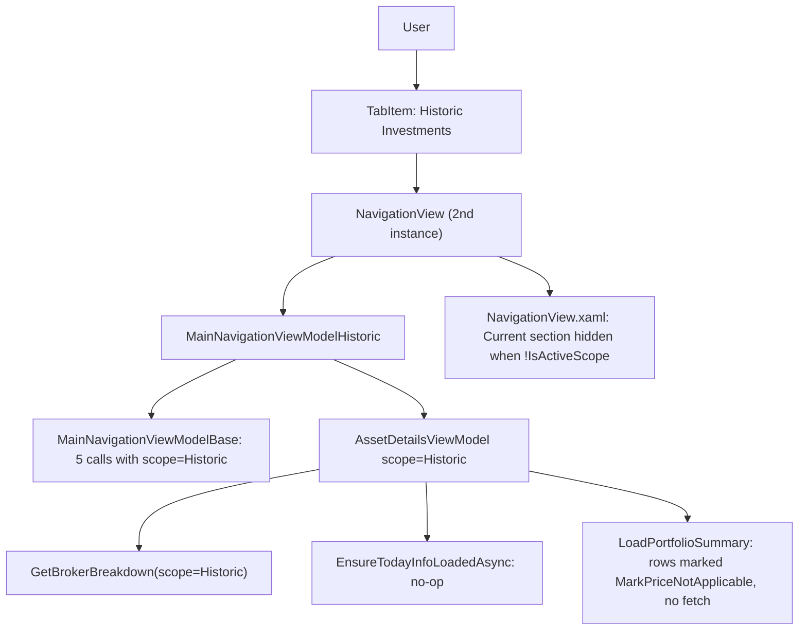

# WPF — Historic Investments Tab

## 1. Technical Overview

**What:** Add a second `TabItem` "Historic Investments" to `MainWindow.xaml`, hosting a second `NavigationView` instance bound to a new `InvestmentScope.Historic`-scoped navigation view model. The same tree/summary/transactions/credits/charts UI shell already built for Active Investments (F10) is reused unmodified; only the pieces that must never fetch or display a current-value/XIRR figure for a closed position are made scope-aware.

**Why:** F10 hardcoded `InvestmentScope.Active` at 6 in-process service call sites (5 inside the shared `MainNavigationViewModelBase<T>`, 1 inside `AssetDetailsViewModel`) as an explicit-scope decision. Reusing that same infrastructure for Historic first requires those hardcoded literals to become parameterized, then requires a second concrete view model that supplies `InvestmentScope.Historic`. Separately, `AssetDetailsViewModel` today unconditionally fetches and displays a current-value/XIRR figure (`EnsureTodayInfoLoadedAsync`, `FetchRowPricesAsync`) — the PRD explicitly requires that Historic never fetches a live price or computes XIRR, since a closed position's current value is always zero (Section 1) and F06's realized-totals service deliberately carries no current-price/XIRR field (F06 Out of Scope).

**Scope:**

Included:
- New `MainNavigationViewModelHistoric` class (sibling to F10's `MainNavigationViewModel`), supplying `InvestmentScope.Historic` to a newly scope-parameterized `MainNavigationViewModelBase<T>` constructor
- `MainNavigationViewModelBase<T>`'s 5 previously-hardcoded `InvestmentScope.Active` call sites become a constructor-supplied `_scope` field (default `Active`, so F10's existing `MainNavigationViewModel` needs no changes)
- `AssetDetailsViewModel` gains its own scope awareness: the 6th hardcoded call site (`GetBrokerBreakdown`) uses the same constructor-supplied scope; `EnsureTodayInfoLoadedAsync`/`RefreshTodayInfoAsync` become no-ops for Historic; the per-row current-price fetch (`FetchRowPricesAsync`, used by the Portfolio summary asset grid) is skipped for Historic, with rows immediately marked as having no price data instead of spinning on "Loading..."
- `NavigationView.xaml`'s Summary tab "Current" section (header, Refresh button, Current Value, As Of — the 6 elements not already gated by `HasAveragePrice`) gains a Visibility binding so it never renders for Historic; the already-`HasAveragePrice`-gated fields (Total Current Value, Total Current + Credits, XIRR, XIRR w/ Credits) auto-hide for any Historic asset without new bindings, since a historic asset's `Quantity` is always `0` and `HasAveragePrice` is `averagePrice > 0 && quantity > 0`
- The Portfolio summary asset grid (Current Value/Current Price/Profit %/Profit+Credits %/XIRR columns) is reused as-is for Historic — no column removal or new grid template — with those 5 columns rendering `—` per row (per interview decision)
- New `MainWindow.xaml` `TabItem` "Historic Investments", positioned second (directly after "Active Investments"), wired in `MainWindow.xaml.cs` and registered in `App.xaml.cs`'s DI container

Excluded (deferred or already covered):
- Any change to F05/F06/F07's Application-layer services — already shipped and scope-parameterized; F11 only changes how `Financial.App` calls them
- `Financial.Web` — already covered by F09; this spec touches only `Financial.App` and its test project
- Scoping `ITransactionService`/`ICreditService`/`ITransactionQueryService`/`ICreditQueryService` by Active/Historic — these have no scope parameter at all (F05 explicitly left them unscoped, and F09's Web implementation accepted the same limitation for parity); Transactions/Credits editing is reused unmodified per the PRD's own capability text, identified purely by broker/portfolio name
- A trimmed, Historic-specific per-asset grid template omitting the 5 price-dependent columns — per interview decision, the existing grid is reused with `—` placeholders instead

## 2. Architecture Impact

**Affected components:**
- `Financial.App/ViewModels/MainNavigationViewModelBase.cs` — constructor gains a scope parameter; 5 call sites use it instead of a literal
- `Financial.App/ViewModels/MainNavigationViewModelHistoric.cs` — new, mirrors `MainNavigationViewModel.cs`
- `Financial.App/ViewModels/AssetDetailsViewModel.cs` — constructor gains a scope parameter; `GetBrokerBreakdown` call site, `RefreshTodayInfoAsync`, and `LoadPortfolioSummary`'s price-fetch branch become scope-aware; new `IsActiveScope` computed property
- `Financial.App/ViewModels/PortfolioAssetSummaryRowViewModel.cs` — new `MarkPriceNotApplicable()` method, shares a refactored private helper with `MarkPriceFailed()`
- `Financial.App/Components/NavigationView.xaml` — new Visibility binding on the Summary tab's "Current" section
- `Financial.App/MainWindow.xaml` / `MainWindow.xaml.cs` — second `TabItem` + wiring
- `Financial.App/App.xaml.cs` — DI registration for `MainNavigationViewModelHistoric`

## 3. Technical Decisions

| Decision | Chosen Approach | Alternative Considered | Trade-off |
|----------|----------------|----------------------|-----------|
| Base-class scope parameterization | Add an `InvestmentScope scope = InvestmentScope.Active` constructor parameter to `MainNavigationViewModelBase<T>`, stored as a private field, replacing the 5 hardcoded `InvestmentScope.Active` literals F10 introduced | A `protected virtual InvestmentScope Scope` property overridden per subclass | Constructor parameter matches every other scope-aware member in this codebase (`INavigationService`, `ISummaryService`, `IPortfolioAssetSummaryService`, `IBrokerBreakdownService` all take `scope` as a parameter, never a virtual property); the default keeps F10's `MainNavigationViewModel` untouched since its `: base(...)` call doesn't need to name the new trailing optional argument |
| New Historic view model shape | New sibling class `MainNavigationViewModelHistoric : MainNavigationViewModelBase<AssetDetailsViewModel>`, structurally identical to `MainNavigationViewModel`, passing `InvestmentScope.Historic` to both the base constructor and its own inline `AssetDetailsViewModel` construction | Thread a runtime scope parameter into the single existing `MainNavigationViewModel` class and register two named DI instances | Matches F10 spec's own stated intent ("F11 will host its own historic-scoped view model rather than renaming this one") and the Application layer's established parallel-class convention (`ActivePortfolioAssetSummaryService`/`HistoricPortfolioAssetSummaryService`, `ActiveBrokerBreakdownService`/`HistoricBrokerBreakdownService`); avoids named/keyed DI registration, a pattern this codebase's plain `IServiceCollection` usage doesn't have |
| Per-row price-dependent grid columns for Historic | Reuse the existing ~15-column `PortfolioSummaryTemplate` DataGrid unmodified; skip `FetchRowPricesAsync` for Historic and immediately mark each row as having no price data so the 5 price-dependent columns render `—` | Fork a trimmed Historic-only grid template omitting those columns | Confirmed via interview — zero new WPF column-visibility plumbing (WPF's `DataGridColumn` isn't a `FrameworkElement` and has no established per-instance visibility binding pattern in this codebase), at the cost of `—` placeholders in 5 columns for every historic row |
| Suppressing current-value/XIRR fetch | `AssetDetailsViewModel` stores its own `InvestmentScope`; `RefreshTodayInfoAsync` returns immediately for Historic (making `EnsureTodayInfoLoadedAsync`/the Refresh command a no-op); `LoadPortfolioSummary` skips `FetchRowPricesAsync` for Historic, calling a new `MarkPriceNotApplicable()` on each row instead | Leave the fetch calls in place and only hide the resulting UI | The PRD requires no live price fetch or XIRR calculation for Historic (F06 Out of Scope) — this is a correctness requirement, not just a display preference, so the underlying calls must not fire, not merely be hidden |
| `MarkPriceNotApplicable()` vs. reusing `MarkPriceFailed()` | New method, sharing a refactored private helper with `MarkPriceFailed()` for the property-changed notifications; unlike `MarkPriceFailed()`, it does **not** set `PriceFetchFailed = true` | Just call the existing `MarkPriceFailed()` for Historic rows too | `MarkPriceFailed()`'s name and its `PriceFetchFailed` flag describe an error condition; a Historic row's price was deliberately never requested, not failed — a distinct, accurately-named method avoids a misleading call site while the display fallback (`—`) ends up identical, since every `Display*` getter already treats "not loading and no value" the same as "failed" |
| "Current" section visibility (Summary tab) | New `AssetDetailsViewModel.IsActiveScope` computed bool (`scope == InvestmentScope.Active`), bound via the existing `BoolToVisibilityConverter` on the 6 XAML elements not already covered by `HasAveragePrice` | Compute `HasAveragePrice` itself as `scope == Active && ...` to piggyback on the existing bindings for everything | The header/Refresh-button/Current-Value/As-Of row isn't currently gated by `HasAveragePrice` at all (only rows 9–11 are) — a dedicated property is needed regardless; reusing it uniformly (rather than only extending `HasAveragePrice`) keeps the "why is this hidden" reasoning in one clearly-named place |
| Historic tab position | Second `TabItem` in `MainWindow.xaml`, directly after "Active Investments" and before the two utility tabs | Last position (after "Read Assets current values") | Matches the PRD's Objectives framing of Active/Historic as the app's two primary investment views, keeping both together ahead of the unrelated utility tabs; not specified by the PRD, so this is a low-stakes default rather than an interview question |

## 4. Component Overview

**Presentation (WPF):**

| File Path | New/Modified | Purpose | Key Responsibilities |
|-----------|--------------|---------|---------------------|
| `Financial.App/ViewModels/MainNavigationViewModelBase.cs` | Modified | Scope-parameterized base | Constructor gains `InvestmentScope scope = InvestmentScope.Active`, stored as `_scope`; `LoadNavigationTreeAsync`'s `GetNavigationTree`, `LoadAssetDetails`'s `GetAssetDetails`, `LoadPortfolioCredits`'s `GetPortfolioSummary`/`GetPortfolioAssetsSummary`, and `LoadBrokerCredits`'s `GetBrokerSummary` all use `_scope` instead of the literal `InvestmentScope.Active` |
| `Financial.App/ViewModels/MainNavigationViewModelHistoric.cs` | New | Historic-scoped navigation view model | Mirrors `MainNavigationViewModel.cs`'s constructor/DI shape exactly, passing `InvestmentScope.Historic` to `base(...)` and to its inline `AssetDetailsViewModel` construction |
| `Financial.App/ViewModels/AssetDetailsViewModel.cs` | Modified | Scope-aware asset details | Constructor gains `InvestmentScope scope = InvestmentScope.Active`, stored as `_scope`; `LoadBrokerBreakdown` passes `_scope` instead of the literal `InvestmentScope.Active`; `RefreshTodayInfoAsync` returns `Task.CompletedTask` immediately when `_scope == InvestmentScope.Historic`; `LoadPortfolioSummary` calls `MarkPriceNotApplicable()` on each row and skips `FetchRowPricesAsync` when `_scope == InvestmentScope.Historic`; new `public bool IsActiveScope => _scope == InvestmentScope.Active;` |
| `Financial.App/ViewModels/PortfolioAssetSummaryRowViewModel.cs` | Modified | Explicit "no price data" state | New `public void MarkPriceNotApplicable()`, sharing a refactored private helper (`RaisePriceUnavailableNotifications()` or similar) with `MarkPriceFailed()` for the common property-changed raises; unlike `MarkPriceFailed()`, does not set `PriceFetchFailed` |
| `Financial.App/Components/NavigationView.xaml` | Modified | Hide "Current" section for Historic | The Summary tab's "Current" header, Refresh button, Current Value, and As Of elements (6 total) gain `Visibility="{Binding AssetDetails.IsActiveScope, Converter={StaticResource BoolToVisibilityConverter}}"` |
| `Financial.App/MainWindow.xaml` | Modified | Second tab | New `TabItem Header="Historic Investments"` (position 2), hosting a second `<local:NavigationView DataContext="{Binding ElementName=root, Path=NavigationViewModelHistoric}"/>` |
| `Financial.App/MainWindow.xaml.cs` | Modified | Wire the second view model | Constructor gains `MainNavigationViewModelHistoric navigationViewModelHistoric`; exposes `NavigationViewModelHistoric` property; `Loaded` handler also awaits its `LoadNavigationTreeAsync()` |
| `Financial.App/App.xaml.cs` | Modified | DI registration | `services.AddTransient<MainNavigationViewModelHistoric>();` |

**Tests:**

| File Path | New/Modified | Purpose | Key Responsibilities |
|-----------|--------------|---------|---------------------|
| `Tests/Financial.Presentation.Tests/ViewModels/MainNavigationViewModelBaseTests.cs` | Modified | Historic-scope call-site coverage | `TestableNavigationViewModel` gains an optional `InvestmentScope scope` constructor parameter, threaded to `base(...)`; new tests parallel F10's Active-scope tests, asserting `InvestmentScope.Historic` reaches `GetNavigationTree`/`GetAssetDetails`/`GetPortfolioSummary`/`GetPortfolioAssetsSummary`/`GetBrokerSummary` when constructed with `scope: InvestmentScope.Historic` |
| `Tests/Financial.Presentation.Tests/ViewModels/AssetDetailsViewModelBrokerSummaryTests.cs` | Modified | `GetBrokerBreakdown` scope coverage | `BuildViewModel` gains an optional `scope` parameter; new test asserts `InvestmentScope.Historic` reaches `GetBrokerBreakdown` when the view model is constructed with that scope |
| `Tests/Financial.Presentation.Tests/ViewModels/AssetDetailsViewModelXirrTests.cs` | Modified | Current-value fetch suppression | `BuildViewModel` gains an optional `scope` parameter; new test asserts `EnsureTodayInfoLoadedAsync` leaves `TodayCurrentValue`/`Xirr` unset (no price-service call) when constructed with `scope: InvestmentScope.Historic` |
| `Tests/Financial.Presentation.Tests/ViewModels/PortfolioAssetSummaryRowViewModelTests.cs` | Modified | `MarkPriceNotApplicable` coverage | New tests paralleling the existing `MarkPriceFailed` tests: `DisplayCurrentValue`/`DisplayCurrentPrice`/`DisplayProfitPercent`/`DisplayXirr` all return `—` after `MarkPriceNotApplicable()`, and `PriceFetchFailed` stays `false` (unlike `MarkPriceFailed()`) |
| `Tests/Financial.Presentation.Tests/ViewModels/AssetDetailsViewModelPortfolioSummaryTests.cs` | Modified | Row price-fetch suppression | New test asserting that a Historic-scoped view model's `LoadPortfolioSummary` leaves rows non-loading with no price-service interaction, instead of the Active-scoped fetch path |

## 5. API Contracts

Not applicable — no HTTP calls, no new endpoints. `Financial.App` consumes `Financial.Application`'s already-scoped services in-process; this feature only changes which `InvestmentScope` value reaches those already-existing, already-scoped method signatures (all shipped by F05/F06/F07).

## 6. Data Model

Not applicable — no `data.json` or schema changes. This feature only adds a second, Historic-scoped read path through already-shipped Application-layer services and changes which WPF-side view-model instance/UI state is used to render the result.

## 7. Testing Strategy

| Test File | Test Type | Target | Coverage Goal |
|-----------|-----------|--------|---------------|
| `Tests/Financial.Presentation.Tests/ViewModels/MainNavigationViewModelBaseTests.cs` | Unit | `MainNavigationViewModelBase` | `InvestmentScope.Historic` is passed explicitly to all 5 base-class call sites when the view model is constructed with that scope |
| `Tests/Financial.Presentation.Tests/ViewModels/AssetDetailsViewModelBrokerSummaryTests.cs` | Unit | `AssetDetailsViewModel.LoadBrokerBreakdown` | `InvestmentScope.Historic` reaches `GetBrokerBreakdown` |
| `Tests/Financial.Presentation.Tests/ViewModels/AssetDetailsViewModelXirrTests.cs` | Unit | `AssetDetailsViewModel.EnsureTodayInfoLoadedAsync` | No-op (no price-service call, no `TodayCurrentValue`/`Xirr` change) for Historic scope |
| `Tests/Financial.Presentation.Tests/ViewModels/PortfolioAssetSummaryRowViewModelTests.cs` | Unit | `PortfolioAssetSummaryRowViewModel.MarkPriceNotApplicable` | Display fields fall back to `—`; `PriceFetchFailed` stays `false` |
| `Tests/Financial.Presentation.Tests/ViewModels/AssetDetailsViewModelPortfolioSummaryTests.cs` | Unit | `AssetDetailsViewModel.LoadPortfolioSummary` | Historic scope skips the price-fetch loop entirely |

**Test functions:**

`MainNavigationViewModelBaseTests.cs`
| Test Function | Description | Assertions |
|---------------|-------------|------------|
| `LoadNavigationTreeAsync_HistoricScope_RequestsHistoricScope` (new) | View model constructed with `scope: InvestmentScope.Historic` | `StubNavigationService.LastTreeScope` equals `InvestmentScope.Historic` |
| `SelectingAssetNode_HistoricScope_RequestsHistoricScopeAssetDetails` (new) | Same, asset node selected | `StubNavigationService.LastAssetDetailsScope` equals `InvestmentScope.Historic` |
| `SelectingPortfolioNode_HistoricScope_RequestsHistoricScopeSummaryAndAssetItems` (new) | Same, portfolio node selected | `StubSummaryService.LastScopeForPortfolio`/`StubPortfolioAssetSummaryService.LastScope` both equal `InvestmentScope.Historic` |
| `SelectingBrokerNode_HistoricScope_RequestsHistoricScopeSummary` (new) | Same, broker node selected | `StubSummaryService.LastScopeForBroker` equals `InvestmentScope.Historic` |

`AssetDetailsViewModelBrokerSummaryTests.cs`
| Test Function | Description | Assertions |
|---------------|-------------|------------|
| `LoadBrokerBreakdown_HistoricScope_RequestsHistoricScope` (new) | View model constructed with `scope: InvestmentScope.Historic` | `StubBrokerBreakdownService.LastScope` equals `InvestmentScope.Historic` |

`AssetDetailsViewModelXirrTests.cs`
| Test Function | Description | Assertions |
|---------------|-------------|------------|
| `EnsureTodayInfoLoadedAsync_HistoricScope_DoesNotFetchPriceOrChangeState` (new) | Historic-scoped view model, asset loaded, `EnsureTodayInfoLoadedAsync` called | `TodayCurrentValue` stays `0`, `TodayCurrentValueAsOf` stays empty, `Xirr` stays `null` |

`PortfolioAssetSummaryRowViewModelTests.cs`
| Test Function | Description | Assertions |
|---------------|-------------|------------|
| `DisplayCurrentValue_AfterMarkPriceNotApplicable_ReturnsDash` (new) | Row marked not-applicable | `DisplayCurrentValue` equals `—` |
| `DisplayXirr_AfterMarkPriceNotApplicable_ReturnsDash` (new) | Row marked not-applicable | `DisplayXirr` equals `—` |
| `MarkPriceNotApplicable_DoesNotSetPriceFetchFailed` (new) | Row marked not-applicable | `PriceFetchFailed` is `false` |
| `MarkPriceNotApplicable_RaisesPropertyChangedForDisplayProperties` (new) | Row marked not-applicable | Same property-changed set as `MarkPriceFailed`, minus `PriceFetchFailed` |

`AssetDetailsViewModelPortfolioSummaryTests.cs`
| Test Function | Description | Assertions |
|---------------|-------------|------------|
| `LoadPortfolioSummary_HistoricScope_DoesNotFetchRowPrices` (new) | Historic-scoped view model, `LoadPortfolioSummary` called with asset items | Every row's `IsLoadingPrice` is `false` immediately (synchronously) with no price-service interaction, instead of remaining `true` pending an async fetch |

**Acceptance tests (PRD Section 9, F11):**
| PRD Acceptance Criterion | Covered By |
|---|---|
| A new "Historic Investments" tab shows a tree, summary, transactions, credits, and charts scoped to historic data only | Manual verification of `MainWindow.xaml`'s second tab (no automated WPF UI harness for tab presence, consistent with F10's precedent) + `MainNavigationViewModelBaseTests.cs` Historic-scope tests confirming only `InvestmentScope.Historic` is requested by that view model |
| The summary view shows realized totals, not current-value/XIRR fields | `AssetDetailsViewModelXirrTests.cs` (no-op fetch) + `PortfolioAssetSummaryRowViewModelTests.cs` (`MarkPriceNotApplicable` display fallback) + manual verification of the new `IsActiveScope` visibility binding in `NavigationView.xaml` |
| A transaction or credit can be added, edited, and deleted for a historic asset through the same UI flow as an active asset | No new test — `TransactionActions`/`CreditActions` are reused unmodified from F10/pre-existing coverage (Transactions/Credits are unscoped per F05, confirmed in Scope) |

**Cross-Feature Integration tests (PRD Section 9):**
| Criterion | Covered By |
|---|---|
| Realized totals from F06 render correctly in both the Web (F09) and WPF (F11) Historic Investments summary views | `AssetDetailsViewModelBrokerSummaryTests.cs`/`MainNavigationViewModelBaseTests.cs` Historic-scope tests (F06's data reaching F11 with the correct scope) — F09's half already covered by its own spec |
| Breakdown data from F07 renders correctly in both the Web (F09) and WPF (F11) Historic Investments charts views | `LoadBrokerBreakdown_HistoricScope_RequestsHistoricScope` (F07's data reaching F11 with the correct scope) — F09's half already covered by its own spec; chart rendering itself is unchanged since `BrokerBreakdownChartBuilder` is scope-agnostic (confirmed in Scope) |
