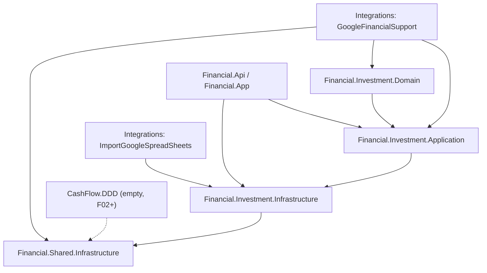

# F01. Investments Projects Rename & Domain Folder Restructuring

## 1. Technical Overview

**What:** Rename the three unnamed core projects (`Financial.Domain`, `Financial.Application`, `Financial.Infrastructure`) to `Financial.Investment.Domain`, `Financial.Investment.Application`, and `Financial.Investment.Infrastructure`, group them under a new `Investment.DDD` solution folder, create an empty `CashFlow.DDD` solution folder for P11's later features, and extract the domain-agnostic JSON/Google-Drive storage engine into a new `Financial.Shared.Infrastructure` project under a `Shared.DDD` solution folder.

**Why:** Every subsequent P11 feature (F02 onward) needs a `CashFlow.DDD` folder and a storage engine neither domain owns. Today the storage engine (`IJsonStorage`, `LocalJsonStorage`, `GoogleDriveJsonStorage`, `IRemoteFileClient`, `IRemoteFileClientFactory`) is entangled inside `Financial.Infrastructure`, so `Financial.CashFlow.Infrastructure` would otherwise have to either duplicate it or take a cross-domain dependency on `Financial.Investment.Infrastructure` — both forbidden by this project's Clean Architecture rules. This feature is purely structural: no business logic, API surface, or persisted data shape changes.

**Scope:**
- Included: renaming/moving the 3 core projects and their ~250 consuming files' namespaces/usings; extracting the storage engine into `Financial.Shared.Infrastructure`; renaming the 3 matching test projects and creating `Financial.Shared.Infrastructure.Tests`; updating `Financial.slnx`, the 3 Integrations projects' namespaces/project references, and the `Dockerfile`.
- Excluded: any change to `data.json`'s shape, any Investments business logic, any new CashFlow code (that starts at F02), WPF/Web UI changes.

## 2. Architecture Impact

**Affected components:**
- `Financial.Domain/` → renamed to `Financial.Investment.Domain/`
- `Financial.Application/` → renamed to `Financial.Investment.Application/`
- `Financial.Infrastructure/` → renamed to `Financial.Investment.Infrastructure/`, storage engine removed
- `Financial.Shared.Infrastructure/` — new project holding the storage engine
- `Financial.Api/`, `Financial.App/` — namespace/using updates only
- `Integrations/GoogleFinancialSupport/`, `Integrations/ImportGoogleSpreadSheets/`, `Integrations/WebPageParser/` — project reference + `RootNamespace`/`AssemblyName` updates
- `Tests/Financial.Domain.Tests/` → `Tests/Financial.Investment.Domain.Tests/`
- `Tests/Financial.Application.Tests/` → `Tests/Financial.Investment.Application.Tests/`
- `Tests/Financial.Infrastructure.Tests/` → `Tests/Financial.Investment.Infrastructure.Tests/`
- `Tests/Financial.Shared.Infrastructure.Tests/` — new test project
- `Financial.slnx`, `Dockerfile`

## 3. Technical Decisions

| Decision | Chosen Approach | Alternative Considered | Trade-off |
|----------|-----------------|-------------------------|-----------|
| Location of `IJsonStorage` | Move into `Financial.Shared.Infrastructure.Persistence`, alongside its implementations. The PRD's capability text assumed it already lived in `Financial.Infrastructure/Persistence`; in the current codebase it actually lives in `Financial.Application.Interfaces` (per the prior DIP-gap fix in PR #188), with only `JSONRepository` (an Infrastructure class) consuming it. | Leave the interface declaration in `Financial.Investment.Application` and have `Financial.Shared.Infrastructure` depend back on it | Leaving it in Application would force `Financial.CashFlow.Infrastructure` to reference `Financial.Investment.Application` to reuse the storage engine — exactly the cross-domain dependency F01 exists to avoid. Since `IJsonStorage` has zero Investments-specific members (`ReadAsync`/`WriteAsync` on a raw string), it is a shared Infrastructure-layer concern, not an Application-owned abstraction — `Financial.Investment.Application` no longer needs to know it exists. |
| Test project renaming | Rename `Financial.Domain.Tests`, `Financial.Application.Tests`, `Financial.Infrastructure.Tests` to their `Financial.Investment.*.Tests` equivalents, and create `Financial.Shared.Infrastructure.Tests` | Keep test project names unchanged, only update internal namespaces | The PRD's AC only requires "the full existing test suite passes unmodified in behavior", not a specific project name, but leaving test projects named after non-existent production projects (`Financial.Domain.Tests` testing `Financial.Investment.Domain`) would be a naming inconsistency this PRD's own objective (explicit domain identity) argues against. |
| Integrations projects' `RootNamespace`/`AssemblyName` | Rename `Financial.Infrastructure.Integrations.*` to `Financial.Investment.Infrastructure.Integrations.*` for `GoogleFinancialSupport`, `ImportGoogleSpreadSheets`, `WebPageParser` | Leave unchanged since the PRD's AC list doesn't name them explicitly | These 3 projects exist solely to serve the Investments domain (spreadsheet import, Google Sheets/Drive support) and already borrow the "Financial.Infrastructure" prefix as a branding convention; leaving them on the pre-rename prefix after the core project moves to `Financial.Investment.Infrastructure` would immediately read as stale. |
| Physical folder/csproj renaming | Rename the file-system folder and `.csproj` file for all 3 renamed projects and the 3 renamed test projects to match their new project names exactly (matches AC line: "csproj file names and file-system folder names ... are updated to match") | Rename only the `<AssemblyName>`/`<RootNamespace>` and leave folder names as `Financial.Domain/` etc. | Explicitly required by F01's acceptance criteria; also avoids folder/project-name drift for the lifetime of the repo. |
| New `Financial.Shared.Infrastructure` project location | Repo root, sibling to the other top-level project folders (`Financial.Shared.Infrastructure/`) | Nest it inside `Financial.Investment.Infrastructure/` | Matches the existing flat top-level layout (every project is a repo-root folder); nesting would misrepresent it as Investments-owned. |

## 4. Component Overview

**Backend — renamed projects (bulk namespace/using update, no logic change):**

| File Path | New/Modified | Purpose | Key Responsibilities |
|-----------|--------------|---------|-----------------------|
| `Financial.Investment.Domain/*.cs` (was `Financial.Domain/`) | Modified (moved) | Investments domain entities/value objects | Namespace `Financial.Domain` → `Financial.Investment.Domain` across every file |
| `Financial.Investment.Application/*.cs` (was `Financial.Application/`) | Modified (moved) | Investments use cases, DTOs, interfaces | Namespace `Financial.Application` → `Financial.Investment.Application`; `IJsonStorage.cs` removed (moves to Shared) |
| `Financial.Investment.Infrastructure/*.cs` (was `Financial.Infrastructure/`, minus storage engine) | Modified (moved) | Investments repositories, pricing/finance services | Namespace `Financial.Infrastructure` → `Financial.Investment.Infrastructure`; references `Financial.Shared.Infrastructure` for storage |

**Backend — new Shared.Infrastructure project:**

| File Path | New/Modified | Purpose | Key Responsibilities |
|-----------|--------------|---------|-----------------------|
| `Financial.Shared.Infrastructure/Financial.Shared.Infrastructure.csproj` | New | Project file | No package refs beyond what `LocalJsonStorage`/`GoogleDriveJsonStorage` already need |
| `Financial.Shared.Infrastructure/Persistence/IJsonStorage.cs` | New (moved from `Financial.Application/Interfaces/IJsonStorage.cs`) | Storage abstraction | `ReadAsync`/`WriteAsync` contract, zero domain knowledge |
| `Financial.Shared.Infrastructure/Persistence/LocalJsonStorage.cs` | New (moved) | Local disk implementation | Unchanged behavior, namespace only |
| `Financial.Shared.Infrastructure/Persistence/GoogleDriveJsonStorage.cs` | New (moved) | Google Drive implementation | Unchanged behavior, namespace only |
| `Financial.Shared.Infrastructure/Persistence/IRemoteFileClient.cs` | New (moved) | Remote file client abstraction | Unchanged |
| `Financial.Shared.Infrastructure/Persistence/IRemoteFileClientFactory.cs` | New (moved) | Remote file client factory abstraction | Unchanged |

**Backend — consumers requiring reference/namespace updates only:**

| File Path | New/Modified | Purpose | Key Responsibilities |
|-----------|--------------|---------|-----------------------|
| `Financial.Api/**/*.cs`, `Financial.Api/Financial.Api.csproj` | Modified | Web API host | `using`/`ProjectReference` updates to the 3 renamed projects |
| `Financial.App/**/*.cs`, `Financial.App/Financial.App.csproj` | Modified | WPF host | Same |
| `Integrations/GoogleFinancialSupport/*.cs`, `.csproj` | Modified | Google Sheets/Drive support for Investments | `RootNamespace`/`AssemblyName` → `Financial.Investment.Infrastructure.Integrations.GoogleFinancialSupport`; `ProjectReference`s repointed to `Financial.Investment.Domain`/`.Application`/`.Infrastructure` + `Financial.Shared.Infrastructure` |
| `Integrations/ImportGoogleSpreadSheets/*.cs`, `.csproj` | Modified | Historical spreadsheet import console tool | `RootNamespace`/`AssemblyName` → `Financial.Investment.Infrastructure.Integrations.ImportGoogleSpreadSheets`; `ProjectReference` repointed |
| `Integrations/WebPageParser/*.cs`, `.csproj` | Modified | Web scraping helper | `RootNamespace`/`AssemblyName` → `Financial.Investment.Infrastructure.Integrations.WebPageParser` |
| `Dockerfile` | Modified | Multi-stage build | `COPY` paths repointed to `Financial.Investment.*` and new `Financial.Shared.Infrastructure` |
| `Financial.slnx` | Modified | Solution structure | `/DDD/` folder replaced by `/Investment.DDD/` (3 renamed projects), empty `/CashFlow.DDD/`, `/Shared.DDD/` (`Financial.Shared.Infrastructure`) |

**Backend — test projects:**

| File Path | New/Modified | Purpose | Key Responsibilities |
|-----------|--------------|---------|-----------------------|
| `Tests/Financial.Investment.Domain.Tests/` (was `Financial.Domain.Tests/`) | Modified (moved) | Domain unit tests | Namespace + `ProjectReference` updates only |
| `Tests/Financial.Investment.Application.Tests/` (was `Financial.Application.Tests/`) | Modified (moved) | Application unit tests | Same |
| `Tests/Financial.Investment.Infrastructure.Tests/` (was `Financial.Infrastructure.Tests/`) | Modified (moved), 2 files removed | Infrastructure unit tests | Namespace + `ProjectReference` updates; `Persistence/LocalJsonStorageTests.cs` and `Persistence/GoogleDriveJsonStorageTests.cs` move out |
| `Tests/Financial.Shared.Infrastructure.Tests/Financial.Shared.Infrastructure.Tests.csproj` | New | Test project for the extracted engine | References only `Financial.Shared.Infrastructure` |
| `Tests/Financial.Shared.Infrastructure.Tests/Persistence/LocalJsonStorageTests.cs` | New (moved) | Local storage tests | Unchanged assertions, new namespace |
| `Tests/Financial.Shared.Infrastructure.Tests/Persistence/GoogleDriveJsonStorageTests.cs` | New (moved) | Google Drive storage tests | Unchanged assertions, new namespace |
| `Tests/Financial.Api.Tests/`, `Tests/Financial.Presentation.Tests/` | Modified | Existing API/Presentation test suites | No content change — they reference `Financial.Api`/`Financial.App` only, which transitively pick up the rename |

## 5. API Contracts

N/A — this feature makes no HTTP endpoint, request, or response changes. `Financial.Api`'s controllers are untouched beyond `using` updates.

## 6. Data Model

N/A — no change to `data.json`'s schema, location, or serialization format. `IInvestmentsSerializer`/`InvestmentsTypeInfoResolver` remain in `Financial.Investment.Infrastructure` unchanged.

## 7. Testing Strategy

| Test File | Test Type | Target | Coverage Goal |
|-----------|-----------|--------|----------------|
| `Tests/Financial.Investment.Domain.Tests/**` (existing, moved) | Unit | `Financial.Investment.Domain` | Same as pre-rename baseline |
| `Tests/Financial.Investment.Application.Tests/**` (existing, moved) | Unit | `Financial.Investment.Application` | Same as pre-rename baseline |
| `Tests/Financial.Investment.Infrastructure.Tests/**` (existing, moved, minus 2 files) | Unit | `Financial.Investment.Infrastructure` | Same as pre-rename baseline |
| `Tests/Financial.Shared.Infrastructure.Tests/Persistence/LocalJsonStorageTests.cs` (moved) | Unit | `LocalJsonStorage` | Same assertions as pre-move |
| `Tests/Financial.Shared.Infrastructure.Tests/Persistence/GoogleDriveJsonStorageTests.cs` (moved) | Unit | `GoogleDriveJsonStorage` | Same assertions as pre-move |
| `Tests/Financial.Api.Tests/**`, `Tests/Financial.Presentation.Tests/**` (existing) | Integration | `Financial.Api`, `Financial.App` | Must pass unmodified — proves the rename didn't change runtime behavior |

**Acceptance tests (from PRD Section 9, F01):**
- Building the solution finds zero references to `Financial.Domain`, `Financial.Application`, `Financial.Infrastructure` namespaces anywhere.
- `Financial.slnx` shows `Investment.DDD` (3 renamed projects), empty `CashFlow.DDD`, and `Shared.DDD` (`Financial.Shared.Infrastructure`).
- `IJsonStorage`, `LocalJsonStorage`, `GoogleDriveJsonStorage`, `IRemoteFileClient`, `IRemoteFileClientFactory` compile inside `Financial.Shared.Infrastructure` with zero reference to any Investments type.
- `Financial.Investment.Infrastructure.csproj` has a `ProjectReference` to `Financial.Shared.Infrastructure.csproj` and contains no local copy of the storage engine files.
- Full existing test suite (`dotnet test` across all Tests projects) passes with the same pass/fail outcome as before the rename.
- `Financial.Api`, `Financial.Web` (served by `Financial.Api`), and `Financial.App` build and run with no behavior change (manual smoke: load the app, confirm existing Investments tabs render data as before).

**Cross-Feature Integration tests (from PRD Section 9):**
- "The `Financial.Investment.Infrastructure` project created by F01 builds and runs correctly referencing `Financial.Shared.Infrastructure`, and F02's `Financial.CashFlow.Infrastructure` references the same shared project without duplication" — the second half is verified when F02 lands; F01's slice is that `Financial.Investment.Infrastructure` builds cleanly against `Financial.Shared.Infrastructure` with `CashFlow.DDD` present and empty.
