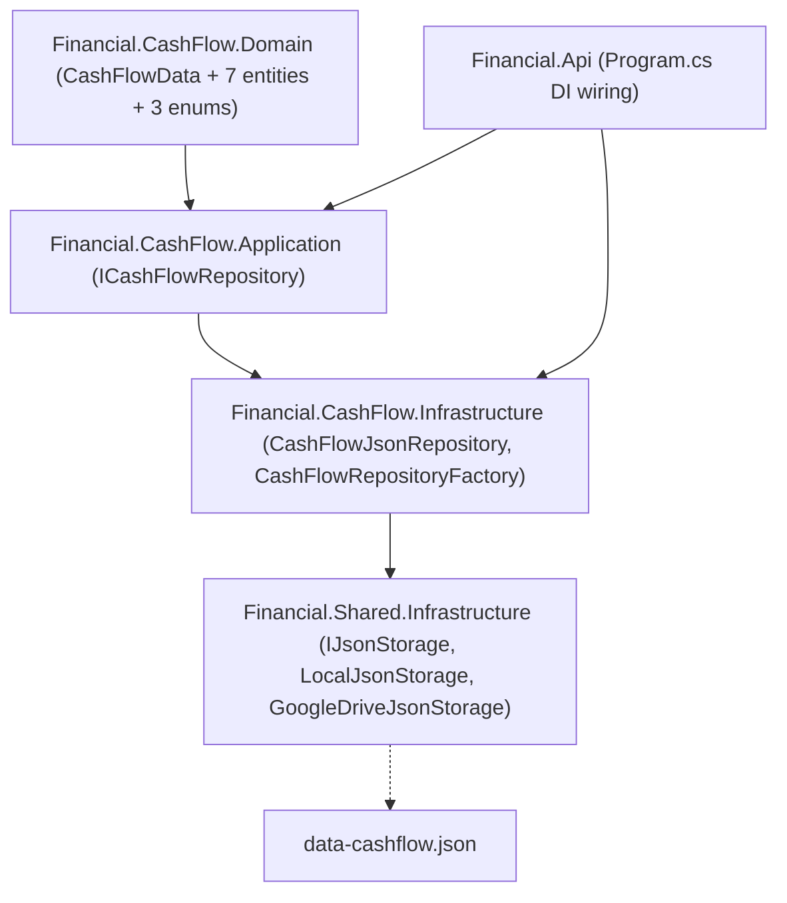

# F02. CashFlow Domain Model & Storage

## 1. Technical Overview

**What:** Scaffold `Financial.CashFlow.Domain`, `Financial.CashFlow.Application`, and `Financial.CashFlow.Infrastructure` projects inside the `DDD/CashFlow` solution folder, layered identically to Investments. Add a new `data-cashflow.json` file persisted through the same repository-abstraction pattern (LocalJson/GoogleDrive, selectable via config), a root aggregate holding 7 empty collections, and the 3 hardcoded enums (`Category`, `PaymentSource`, `CreditCard`) every later CashFlow feature depends on.

**Why:** F03–F10 all consume the storage abstraction and enums this feature provides; none of them can start until CashFlow has its own project set, its own data file, and a place to persist records without touching Investments' `data.json` or `Financial.Investment.*` projects.

**Scope:**
- Included: 3 new projects + 1 new test project; root `CashFlowData` aggregate with 7 empty collections (expenses, reserve ledger, card statements, recurring bill templates, recurring bill instances, mae ledger, investment snapshots); 3 enums; a `CashFlowRepository`/`ICashFlowRepository` pair mirroring Investments' `JSONRepository`/`IRepository`; DI wiring in `Financial.Api`; `data-cashflow.json` first-run auto-creation.
- Excluded: any real entity fields beyond a placeholder `Id` (F03–F08 each add their own entity's real fields when implemented); any HTTP endpoint or UI (PRD: "No direct UI; this is the storage/repository foundation every other CashFlow feature reads and writes through"); the historical import itself (F10).

## 2. Architecture Impact

**Affected components:**
- `Financial.CashFlow.Domain/` — new project: `CashFlowData` root aggregate, 7 placeholder entities, 3 enums
- `Financial.CashFlow.Application/` — new project: `ICashFlowRepository` interface
- `Financial.CashFlow.Infrastructure/` — new project: `CashFlowJsonRepository`, `CashFlowRepositoryFactory`, `CashFlowSerializerAdapter`, `CashFlowTypeInfoResolver`, `CashFlowRepositoryConfigurationKeys`, `CashFlowRepositorySettingsOptions`, `CashFlowRepositorySelectionOptions`, DI extension — references `Financial.Shared.Infrastructure` for `IJsonStorage`/`LocalJsonStorage`/`GoogleDriveJsonStorage`/`IRemoteFileClientFactory`
- `Tests/Financial.CashFlow.Domain.Tests/`, `Tests/Financial.CashFlow.Application.Tests/`, `Tests/Financial.CashFlow.Infrastructure.Tests/` — new test projects
- `Financial.Api/Program.cs`, `Financial.Api/appsettings.json` — DI registration + config keys for the new repository
- `Financial.slnx` — `DDD/CashFlow` solution folder gets the 3 new projects; new `/Tests/` entries



## 3. Technical Decisions

| Decision | Chosen Approach | Alternative Considered | Trade-off |
|----------|-----------------|-------------------------|-----------|
| Domain entity style | Mirror Investments exactly: private constructors, `Create()`/`AddXxx` factory methods, a `CashFlowTypeInfoResolver` (reflection-based, same shape as `InvestmentsTypeInfoResolver`) to serialize private-setter properties | Simple `init`-only properties, no custom resolver | Consistency across both domains was chosen over the lower-code alternative; the `CashFlowTypeInfoResolver` only needs to manage the 8 CashFlow types (root + 7 entities), same complexity class as Investments' resolver managing 6 types |
| Entity field scope | Every one of the 7 collection item types (`Expense`, `ReserveMovement`, `CardStatement`, `RecurringBillTemplate`, `RecurringBillInstance`, `MaeLedgerEntry`, `InvestmentSnapshot`) gets only a placeholder `Guid Id` for this feature | Define the full field set now, using F03–F08's own PRD Capabilities text | The PRD's own Consumes/Provides split assigns entity-field ownership to F03–F08, not F02; pre-building fields F02 doesn't own risks diverging from what each feature's own interview/spec later decides |
| `Category` enum membership | Exactly the current 14 (`Ariana`, `Carro`, `Casa`, `Estudo`, `Extras`, `Familia`, `Gleison`, `Mercado`, `Samuel`, `Saude`, `Viagem`, `Dizimo`, `Investimento`, `Reserva`) — no additional historical-only members | Add historical-only categories found in `Despesas.xlsx` | Direct analysis of all 115 in-scope sheets (Fev2017–Jul2026) found exactly these 14 values plus one single-occurrence typo (`"Casas"` in `Out2017`, clearly a typo of `"Casa"`, not a distinct category). The PRD's own F10 error-handling ("a row with an unrecognized category... is imported with its raw label preserved and flagged in the error report") is the intended safety net for that one row — no 15th enum member needed. |
| Repository interface shape | One `ICashFlowRepository` (mirroring the single `IRepository` Investments uses), exposing a read accessor + `AddXxx` method per collection, plus one shared `SaveChangesAsync()` | 6 separate repository interfaces (one per PRD "Provides" bullet) | All 7 collections live in one JSON file behind one root aggregate — saving is always a whole-file rewrite regardless of how many interfaces front it, so one cohesive interface avoids fragmenting a single persistence transaction into 6 near-empty interfaces. F03–F08 can still each depend on only the slice of `ICashFlowRepository` they need. |
| First-run file creation | `CashFlowJsonRepository`'s load path catches `FileNotFoundException` specifically and falls back to `CashFlowData.Create()` (all 7 collections empty) rather than propagating | Reuse `InvestmentsLoader.LoadSync` unchanged (throws `FileNotFoundException` today) | The PRD explicitly requires different first-run behavior for CashFlow ("If `data-cashflow.json` is missing on first run, it is created with all six collections empty rather than the app failing to start") than Investments' current behavior, which requires the file to pre-exist. Any other exception (e.g. malformed JSON) still propagates unchanged, matching "surfaces a load failure the same way the existing Investments `data.json` load failure is surfaced today." |
| Config keys | New `CashFlowRepositoryConfigurationKeys` (`CashFlow:Repository:Provider`, `CashFlow:DataJsonFile`, `CashFlow:GoogleDrive:CredentialsPath`, `CashFlow:GoogleDrive:FilePath`) in `Financial.CashFlow.Infrastructure`, distinct from Investments' `Repository:Provider`/`DataJsonFile` keys in `Financial.Shared.Infrastructure.Configuration.RepositoryConfigurationKeys` | Reuse the same shared config keys for both domains | Investments and CashFlow are two independently configurable data files (potentially different providers/paths); reusing the same config keys would make them mutually exclusive instead of independent, contradicting "Two separate data files, one per domain" from the CashFlow context doc |
| Enum layer placement | `Category`, `PaymentSource`, `CreditCard` live in `Financial.CashFlow.Domain/Enums/` | Place them in `Financial.CashFlow.Application/Enums/` (matching `InvestmentScope`'s location) | These 3 enums are intrinsic properties of the `Expense`/`CardStatement` domain entities themselves (which category, which payment source, which card), the same category of enum as Investments' Domain-layer `PositionType`/`DividendType`, not an Application-level query-scoping concern like `InvestmentScope` |

## 4. Component Overview

**Backend — Financial.CashFlow.Domain:**

| File Path | New/Modified | Purpose | Key Responsibilities |
|-----------|--------------|---------|-----------------------|
| `Financial.CashFlow.Domain/Financial.CashFlow.Domain.csproj` | New | Project file | No package references beyond the SDK defaults, same as `Financial.Investment.Domain` |
| `Financial.CashFlow.Domain/Entities/CashFlowData.cs` | New | Root aggregate | Private constructor + `Create()`; 7 private lists + `IReadOnlyCollection` getters; `AddExpense`/`AddReserveMovement`/`AddCardStatement`/`AddRecurringBillTemplate`/`AddRecurringBillInstance`/`AddMaeLedgerEntry`/`AddInvestmentSnapshot` |
| `Financial.CashFlow.Domain/Entities/Expense.cs` | New | Placeholder expense entity | `Guid Id { get; }`; private constructor + `Create()` |
| `Financial.CashFlow.Domain/Entities/ReserveMovement.cs` | New | Placeholder reserve ledger entry | Same shape as `Expense` |
| `Financial.CashFlow.Domain/Entities/CardStatement.cs` | New | Placeholder card statement | Same shape |
| `Financial.CashFlow.Domain/Entities/RecurringBillTemplate.cs` | New | Placeholder bill template | Same shape |
| `Financial.CashFlow.Domain/Entities/RecurringBillInstance.cs` | New | Placeholder bill instance | Same shape |
| `Financial.CashFlow.Domain/Entities/MaeLedgerEntry.cs` | New | Placeholder mae ledger entry | Same shape |
| `Financial.CashFlow.Domain/Entities/InvestmentSnapshot.cs` | New | Placeholder investment snapshot | Same shape |
| `Financial.CashFlow.Domain/Enums/Category.cs` | New | Expense category | 14 members: `Ariana`, `Carro`, `Casa`, `Estudo`, `Extras`, `Familia`, `Gleison`, `Mercado`, `Samuel`, `Saude`, `Viagem`, `Dizimo`, `Investimento`, `Reserva` |
| `Financial.CashFlow.Domain/Enums/PaymentSource.cs` | New | Payment source tag | 3 members: `Barclays`, `Trading212`, `Chase` |
| `Financial.CashFlow.Domain/Enums/CreditCard.cs` | New | Credit card tag | 5 members: `BarclaysPlatinumVisa8003`, `BarclaysPlatinumVisa6007`, `ChaseMaster4023`, `BaAmex`, `PaypalCredit` |

**Backend — Financial.CashFlow.Application:**

| File Path | New/Modified | Purpose | Key Responsibilities |
|-----------|--------------|---------|-----------------------|
| `Financial.CashFlow.Application/Financial.CashFlow.Application.csproj` | New | Project file | References `Financial.CashFlow.Domain`, same package set as `Financial.Investment.Application` |
| `Financial.CashFlow.Application/Interfaces/ICashFlowRepository.cs` | New | Repository abstraction | Read accessors + `AddXxx` for all 7 collections; `Task SaveChangesAsync()` |

**Backend — Financial.CashFlow.Infrastructure:**

| File Path | New/Modified | Purpose | Key Responsibilities |
|-----------|--------------|---------|-----------------------|
| `Financial.CashFlow.Infrastructure/Financial.CashFlow.Infrastructure.csproj` | New | Project file | References `Financial.CashFlow.Application`, `Financial.CashFlow.Domain`, `Financial.Shared.Infrastructure` |
| `Financial.CashFlow.Infrastructure/Persistence/CashFlowSerializerAdapter.cs` | New | JSON serialization | Mirrors `InvestmentsSerializerAdapter`: `JsonStringEnumConverter`, `WriteIndented`, `TypeInfoResolver = new CashFlowTypeInfoResolver()` |
| `Financial.CashFlow.Infrastructure/Persistence/CashFlowTypeInfoResolver.cs` | New | Private-setter JSON support | Mirrors `InvestmentsTypeInfoResolver`: enables private constructors + wires property setters for `CashFlowData` and the 7 entities |
| `Financial.CashFlow.Infrastructure/Persistence/ICashFlowSerializer.cs` | New | Serializer abstraction | `string Serialize(CashFlowData data)`, `CashFlowData Deserialize(string json)` |
| `Financial.CashFlow.Infrastructure/Persistence/CashFlowLoader.cs` | New | First-run-safe loader | `LoadSync(IJsonStorage, ICashFlowSerializer)`; catches `FileNotFoundException` → returns `CashFlowData.Create()`; any other exception propagates |
| `Financial.CashFlow.Infrastructure/Repositories/CashFlowJsonRepository.cs` | New | `ICashFlowRepository` implementation | Holds one in-memory `CashFlowData`; `SaveChangesAsync` re-serializes the whole object via `IJsonStorage.WriteAsync` |
| `Financial.CashFlow.Infrastructure/Repositories/CashFlowRepositoryFactory.cs` | New | Repository construction | Mirrors `RepositoryFactory`: builds `IJsonStorage` from `CashFlowRepositorySelectionOptions.Provider` (Local/GoogleDrive), then `CashFlowLoader.LoadSync` + `new CashFlowJsonRepository(...)` |
| `Financial.CashFlow.Infrastructure/Repositories/CashFlowRepositoryProvider.cs` | New | Provider enum | Mirrors `RepositoryProvider`: `LocalJson`, `GoogleDriveJson` |
| `Financial.CashFlow.Infrastructure/Repositories/CashFlowRepositorySelectionOptions.cs` | New | Factory input | Mirrors `RepositorySelectionOptions`: `Provider`, `LocalDataPath`, `GoogleDriveCredentialsPath`, `GoogleDriveFilePath` |
| `Financial.CashFlow.Infrastructure/Configuration/CashFlowRepositoryConfigurationKeys.cs` | New | Config key constants | `CashFlow:Repository:Provider`, `CashFlow:DataJsonFile`, `CashFlow:GoogleDrive:CredentialsPath`, `CashFlow:GoogleDrive:FilePath` |
| `Financial.CashFlow.Infrastructure/Configuration/CashFlowRepositorySettingsOptions.cs` | New | Bound options class | Mirrors `RepositorySettingsOptions`: `Provider`, `DataJsonFile`, `GoogleDriveCredentialsPath`, `GoogleDriveFilePath` |
| `Financial.CashFlow.Infrastructure/DependencyInjection/CashFlowInfrastructureServiceCollectionExtensions.cs` | New | DI wiring | `AddFinancialCashFlowInfrastructure(IServiceCollection, IConfiguration)`, mirrors `InfrastructureServiceCollectionExtensions.AddFinancialInfrastructure` |

**Backend — Presentation wiring:**

| File Path | New/Modified | Purpose | Key Responsibilities |
|-----------|--------------|---------|-----------------------|
| `Financial.Api/Program.cs` | Modified | DI composition root | Calls `services.AddFinancialCashFlowInfrastructure(builder.Configuration)` alongside the existing Investments call |
| `Financial.Api/appsettings.json` | Modified | Config defaults | Adds a `CashFlow` config section (`Repository:Provider = "LocalJson"`, empty `DataJsonFile`/`GoogleDrive` keys, matching the existing top-level `Repository`/`GoogleDrive` shape) |
| `Financial.slnx` | Modified | Solution structure | `DDD/CashFlow` gains the 3 new projects; `/Tests/` gains the 3 new test projects |

**Backend — test projects:**

| File Path | New/Modified | Purpose | Key Responsibilities |
|-----------|--------------|---------|-----------------------|
| `Tests/Financial.CashFlow.Domain.Tests/` | New | Domain unit tests | `CashFlowData` add/read behavior per collection |
| `Tests/Financial.CashFlow.Application.Tests/` | New | Application unit tests | Placeholder — no logic to test yet beyond the interface shape compiling; may stay empty until F03+ add real methods |
| `Tests/Financial.CashFlow.Infrastructure.Tests/` | New | Infrastructure unit/integration tests | `CashFlowSerializerAdapter` round-trip; `CashFlowLoader` first-run/malformed-file behavior; `CashFlowJsonRepository` save/reload; `CashFlowRepositoryFactory` provider selection |

## 5. API Contracts

N/A — per the PRD's own Experience note, F02 has no direct UI or HTTP endpoint; it is the storage foundation every later CashFlow feature (F03–F08) builds its own endpoints on top of.

## 6. Data Model

**`data-cashflow.json` root shape:**

```json
{
  "expenses": [],
  "reserveMovements": [],
  "cardStatements": [],
  "recurringBillTemplates": [],
  "recurringBillInstances": [],
  "maeLedgerEntries": [],
  "investmentSnapshots": []
}
```

Each array item for this feature is only `{ "id": "<guid>" }` — F03 (`Expense`), F04 (`CardStatement`), F05 (`ReserveMovement`), F06 (`RecurringBillTemplate`/`RecurringBillInstance`), F07 (`MaeLedgerEntry`), and F08 (`InvestmentSnapshot`) each add their own real fields to their entity when implemented, without changing the collection names or root shape established here.

**Cross-feature notes:**
- No SQL/relational schema — this project persists via a single JSON file, matching Investments' `data.json` pattern (`Financial.Shared.Infrastructure`'s `IJsonStorage`/`LocalJsonStorage`/`GoogleDriveJsonStorage`).
- `Category`/`PaymentSource`/`CreditCard` serialize as strings (`JsonStringEnumConverter`, matching `InvestmentsSerializerAdapter`'s convention) once F03/F04 add them to `Expense`/`CardStatement` — no enum values are written to `data-cashflow.json` by this feature itself, since no entity has these fields yet.

## 7. Testing Strategy

| Test File | Test Type | Target | Coverage Goal |
|-----------|-----------|--------|----------------|
| `Tests/Financial.CashFlow.Domain.Tests/Entities/CashFlowDataTests.cs` | Unit | `CashFlowData` | `Create()` starts with all 7 collections empty; each `AddXxx` method adds exactly one item to its own collection without affecting the others |
| `Tests/Financial.CashFlow.Infrastructure.Tests/Persistence/CashFlowSerializerAdapterTests.cs` | Unit | `CashFlowSerializerAdapter` | Serializing then deserializing a `CashFlowData` with one item in each of the 7 collections round-trips every item's `Id` |
| `Tests/Financial.CashFlow.Infrastructure.Tests/Persistence/CashFlowLoaderTests.cs` | Unit | `CashFlowLoader` | Missing file → returns an empty `CashFlowData` (no exception); malformed JSON → propagates the parse exception; valid file → deserializes correctly |
| `Tests/Financial.CashFlow.Infrastructure.Tests/Repositories/CashFlowJsonRepositoryTests.cs` | Unit | `CashFlowJsonRepository` | `SaveChangesAsync` writes the current in-memory state via `IJsonStorage`; a write failure propagates rather than being swallowed |
| `Tests/Financial.CashFlow.Infrastructure.Tests/Repositories/CashFlowRepositoryFactoryTests.cs` | Unit | `CashFlowRepositoryFactory` | `LocalJson` provider builds a `LocalJsonStorage` from `CashFlowRepositorySelectionOptions.LocalDataPath`; `GoogleDriveJson` without a registered `IRemoteFileClientFactory` throws, matching `RepositoryFactory`'s existing behavior |
| `Tests/Financial.CashFlow.Infrastructure.Tests/DependencyInjection/CashFlowInfrastructureServiceCollectionExtensionsTests.cs` | Unit | DI wiring | `AddFinancialCashFlowInfrastructure` resolves an `ICashFlowRepository` from a built `IServiceProvider` |

**Acceptance tests (from PRD Section 9, F02):**
- `data-cashflow.json` round-trips with all six top-level collections — `CashFlowSerializerAdapterTests` (7 physical collections cover the 6 named groups, since "recurring bill templates/instances" is one named group holding 2 physical lists)
- A missing `data-cashflow.json` on first run is created with all six collections empty rather than failing to start — `CashFlowLoaderTests`
- `Financial.CashFlow.Infrastructure` references `Financial.Shared.Infrastructure` for its storage engine rather than duplicating it — verified via `Financial.CashFlow.Infrastructure.csproj`'s `ProjectReference` and by `CashFlowRepositoryFactory` constructing `LocalJsonStorage`/`GoogleDriveJsonStorage` directly from `Financial.Shared.Infrastructure.Persistence`
- A category retired from current use still displays correctly on a historical record but is not offered when creating a new entry — not testable until F03 (expense creation) and F10 (historical import) exist; F02 only guarantees the `Category` enum itself is defined and serializes as a string

**Cross-Feature Integration tests (from PRD Section 9, deferred):**
- "The `Financial.Investment.Infrastructure` project created by F01 builds and runs correctly referencing `Financial.Shared.Infrastructure`, and F02's `Financial.CashFlow.Infrastructure` references the same shared project without duplication" — F02's half is covered by `CashFlowRepositoryFactoryTests` proving `Financial.CashFlow.Infrastructure` builds `LocalJsonStorage`/`GoogleDriveJsonStorage` from `Financial.Shared.Infrastructure` directly; F01's half was already verified when F01 shipped
