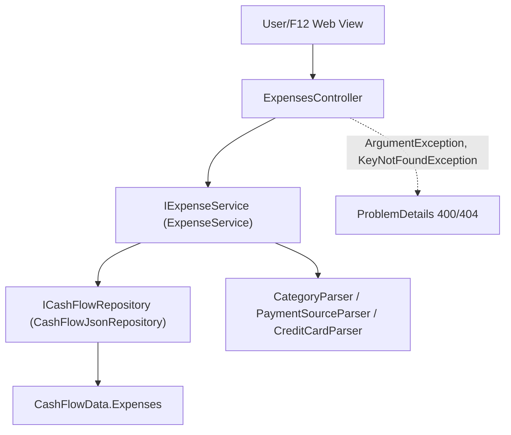

# F03. Monthly Expense Tracking

## 1. Technical Overview

**What:** Flesh out the `Expense` domain entity (currently a placeholder from F02 with only an `Id`) with its real fields, add create/edit/delete/query capability through a new `IExpenseService`, expose it through a new `ExpensesController`, and add monthly per-category totals — all consumed later by F04, F09, F10, and F12.

**Why:** F03 is the first CashFlow feature with real business logic. Every later CashFlow feature that touches expenses (card tagging in F04, yearly reporting in F09, historical import in F10, the Web Monthly View in F12) needs `Expense`'s real shape and a working create/edit/delete/query surface to build on.

**Scope:**
- Included: `Expense` entity's real fields; `ICashFlowRepository` extended with `DeleteExpense`; `IExpenseService`/`ExpenseService` (create, update, delete, list-by-month, category-totals-by-month); `Financial.CashFlow.Application`'s first DI extension; `ExpensesController` with CRUD + monthly-totals endpoints; validation with descriptive error messages.
- Excluded: card-tag statement-paid reconciliation (F04); yearly aggregation across months (F09); the historical spreadsheet import (F10); the Web Monthly View UI itself (F12) — F03 only builds the API surface F12 will call.

## 2. Architecture Impact

**Affected components:**
- `Financial.CashFlow.Domain/Entities/Expense.cs` — gains real fields (was a placeholder)
- `Financial.CashFlow.Application/Interfaces/ICashFlowRepository.cs` — gains `DeleteExpense`
- `Financial.CashFlow.Infrastructure/Repositories/CashFlowJsonRepository.cs` — implements `DeleteExpense`
- `Financial.CashFlow.Domain/Entities/CashFlowData.cs` — gains `RemoveExpense`
- `Financial.CashFlow.Application/DTOs/` — new: `ExpenseDTO`, `ExpenseCreateDTO`, `ExpenseUpdateDTO`, `CategoryTotalDTO`
- `Financial.CashFlow.Application/Interfaces/IExpenseService.cs`, `Financial.CashFlow.Application/Services/ExpenseService.cs` — new
- `Financial.CashFlow.Application/Validation/` — new: `CategoryParser`, `PaymentSourceParser`, `CreditCardParser`
- `Financial.CashFlow.Application/DependencyInjection/CashFlowApplicationServiceCollectionExtensions.cs` — new (first DI extension for this project)
- `Financial.Api/Controllers/ExpensesController.cs` — new
- `Financial.Api/Program.cs` — calls the new `AddFinancialCashFlowApplication()`



## 3. Technical Decisions

| Decision | Chosen Approach | Alternative Considered | Trade-off |
|----------|-----------------|-------------------------|-----------|
| Validation/not-found signaling | `ExpenseService` throws `ArgumentException` (validation) / `KeyNotFoundException` (not found) with descriptive messages; `ExpensesController` catches both and returns `Results.Problem` with the message as `Detail` (400/404 respectively) | Mirror Investments' `TransactionService` exactly: return `null`, controller returns a bare `BadRequest()`/`NotFound()` with no message | F03's PRD explicitly requires "a specific validation message" and a "not-found message" — Investments' own feature never had that requirement, so its silent-null convention doesn't fit here. The Web frontend's API client already parses ASP.NET `ProblemDetails` bodies for error messages, so this is a natural fit, not a new mechanism. |
| Card tag / payment source relationship | `PaymentSource` (required) and the optional `CardTag` are validated independently, with no cross-field combination rule enforced in F03 | Enforce a specific card ↔ payment-source pairing now | F04's own PRD references "a valid payment-source/card combination consistent with F03's validation" without ever defining what makes a combination valid, and F03's own Capabilities/Error Handling never state one either. Inventing an unstated rule risks contradicting whatever F04 actually needs; F04 can add a real constraint when it's implemented and has more information. |
| Where validation lives | `ExpenseService` validates before constructing/mutating an `Expense` (zero value, missing/invalid category, invalid payment source, description over 200 characters); `Expense`'s constructor/factory does no validation itself | Validate inside `Expense.Create`/`UpdateDetails` | Matches the established Investments convention exactly: `Transaction.Create` performs no validation at all; `TransactionService` is where invalid input is caught before the domain object is even built. |
| Description length enforcement | `ExpenseService` rejects (throws) a description over 200 characters | Treat "up to 200 characters" as descriptive-only, not enforced | The PRD states the 200-character limit as a defined property of the field, not merely a UI hint; enforcing it keeps `data-cashflow.json` from ever holding a value the product doesn't consider valid. |
| Repository extension shape | Add only `DeleteExpense(Guid id)` to `ICashFlowRepository`. No separate "UpdateExpense" method — `GetExpenses()` already exposes the live, tracked `Expense` instances from `CashFlowData`'s internal list, so `ExpenseService.UpdateExpenseAsync` finds the existing instance and calls its own `UpdateDetails(...)` method directly; the mutation is visible through the same collection without any extra repository plumbing | Add a full `UpdateExpense(Expense)` method mirroring `AddExpense` | Since `IReadOnlyCollection<Expense>` wraps the same underlying list `CashFlowData` owns, mutating a tracked entity in place is sufficient and avoids a redundant repository method that would just re-find-and-replace the same object. |
| Application service interface shape | One `IExpenseService` covering create/update/delete/list-by-month/category-totals-by-month | Split into `IExpenseService` (mutations) and `IExpenseQueryService` (reads), mirroring `TransactionService`'s two-interface split | Investments split interfaces because `NavigationService`'s read model spans many query shapes across a broker/portfolio/asset hierarchy; `Expense` is a flat entity with two simple query shapes, not enough surface to justify a second interface. |
| Delete endpoint shape | `DELETE /expenses/{id}` — id via route, no request body | Mirror Investments' `[FromBody] TransactionDeleteDTO` (broker/portfolio/asset context needed to locate the entity) | `Expense` has no parent hierarchy to specify — a route-scoped id is both sufficient and more RESTful for a flat entity. |

## 4. Component Overview

**Backend:**

| File Path | New/Modified | Purpose | Key Responsibilities |
|-----------|--------------|---------|-----------------------|
| `Financial.CashFlow.Domain/Entities/Expense.cs` | Modified | Real expense entity | `Id`, `Date` (`DateOnly`), `Description` (`string`), `Value` (`decimal`), `Category`, `PaymentSource`, `CardTag` (`CreditCard?`); private setters; `Create(date, description, value, category, paymentSource, cardTag)` factory (auto-generates `Id`); `UpdateDetails(...)` instance method for in-place edits |
| `Financial.CashFlow.Domain/Entities/CashFlowData.cs` | Modified | Root aggregate | Adds `RemoveExpense(Guid id)`, removing the matching item from the private list (no-op-safe: caller checks existence first via the service) |
| `Financial.CashFlow.Application/Interfaces/ICashFlowRepository.cs` | Modified | Repository abstraction | Adds `void DeleteExpense(Guid id)` |
| `Financial.CashFlow.Infrastructure/Repositories/CashFlowJsonRepository.cs` | Modified | Repository implementation | Implements `DeleteExpense` by delegating to `CashFlowData.RemoveExpense` |
| `Financial.CashFlow.Application/DTOs/ExpenseDTO.cs` | New | Read model | `Id`, `Date`, `Description`, `Value`, `Category` (string), `PaymentSource` (string), `CardTag` (string?) |
| `Financial.CashFlow.Application/DTOs/ExpenseCreateDTO.cs` | New | Create request | `Date`, `required string Description`, `Value`, `required string Category`, `required string PaymentSource`, `CardTag` (string?) — no `Id` |
| `Financial.CashFlow.Application/DTOs/ExpenseUpdateDTO.cs` | New | Update request | Same fields as Create (no `Id` — the route supplies it) |
| `Financial.CashFlow.Application/DTOs/CategoryTotalDTO.cs` | New | Monthly totals read model | `Category` (string), `TotalValue` (decimal) |
| `Financial.CashFlow.Application/Interfaces/IExpenseService.cs` | New | Service abstraction | `AddExpenseAsync`, `UpdateExpenseAsync`, `DeleteExpenseAsync`, `GetExpensesByMonth(year, month)`, `GetCategoryTotalsByMonth(year, month)` |
| `Financial.CashFlow.Application/Services/ExpenseService.cs` | New | Business logic | Validates input (throws `ArgumentException`/`KeyNotFoundException` with messages), constructs/mutates `Expense`, calls `ICashFlowRepository.SaveChangesAsync()` on the success path, groups by `(Category)` for the current month for totals |
| `Financial.CashFlow.Application/Validation/CategoryParser.cs`, `PaymentSourceParser.cs`, `CreditCardParser.cs` | New | Enum string parsing | Thin wrappers over the existing `EnumParser`-style pattern (a local equivalent, since `Financial.Investment.Application`'s `EnumParser` is `internal` and not shared across domains) |
| `Financial.CashFlow.Application/DependencyInjection/CashFlowApplicationServiceCollectionExtensions.cs` | New | DI wiring | `AddFinancialCashFlowApplication()` registering `IExpenseService` |
| `Financial.Api/Controllers/ExpensesController.cs` | New | HTTP surface | `POST /expenses`, `PUT /expenses/{id}`, `DELETE /expenses/{id}`, `GET /expenses/month/{year}/{month}`, `GET /expenses/month/{year}/{month}/category-totals`; catches `ArgumentException`/`KeyNotFoundException` and returns `Results.Problem` |
| `Financial.Api/Program.cs` | Modified | DI composition root | Adds `builder.Services.AddFinancialCashFlowApplication();` alongside the existing CashFlow infrastructure registration |

## 5. API Contracts

**Endpoint: Add Expense**
- **Method:** POST
- **Path:** `/api/v1/financial/expenses`

**Request:**

| Field | Type | Required | Validation | Description |
|-------|------|----------|------------|--------------|
| `date` | `string` (date) | Yes | valid date | Expense date |
| `description` | `string` | Yes | 1–200 characters | Free-text description |
| `value` | `decimal` | Yes | non-zero (negative allowed — Reserva return/transfer-out) | Expense amount in GBP |
| `category` | `string` | Yes | one of the 14 `Category` enum names | Expense category |
| `paymentSource` | `string` | Yes | one of `Barclays`/`Trading212`/`Chase` | Payment source tag |
| `cardTag` | `string` \| `null` | No | one of the 5 `CreditCard` enum names, if provided | Optional credit-card tag |

**Request Example:**
```json
{
  "date": "2026-07-15",
  "description": "Weekly groceries",
  "value": 54.32,
  "category": "Mercado",
  "paymentSource": "Barclays",
  "cardTag": null
}
```

**Response (Success - 200):**

| Field | Type | Description |
|-------|------|--------------|
| `id` | `guid` | Generated expense id |
| `date` | `string` | Expense date |
| `description` | `string` | Description |
| `value` | `decimal` | Amount |
| `category` | `string` | Category name |
| `paymentSource` | `string` | Payment source name |
| `cardTag` | `string \| null` | Card tag name, if any |

**Error Codes:**

| Code | HTTP Status | Description |
|------|-------------|--------------|
| — | 400 | Value is zero, description exceeds 200 characters, or category/paymentSource/cardTag is not a recognized name (message in `ProblemDetails.detail`) |

**Endpoint: Update Expense**
- **Method:** PUT
- **Path:** `/api/v1/financial/expenses/{id}`
- Same request/response shape as Create; 404 (`ProblemDetails`) if `id` doesn't match an existing expense.

**Endpoint: Delete Expense**
- **Method:** DELETE
- **Path:** `/api/v1/financial/expenses/{id}`
- **Response (Success - 200):** empty body. **Error:** 404 if `id` doesn't match an existing expense.

**Endpoint: List Expenses for a Month**
- **Method:** GET
- **Path:** `/api/v1/financial/expenses/month/{year}/{month}`
- **Response (Success - 200):** `ExpenseDTO[]`, all expenses whose `Date` falls in `year`/`month`.

**Endpoint: Category Totals for a Month**
- **Method:** GET
- **Path:** `/api/v1/financial/expenses/month/{year}/{month}/category-totals`
- **Response (Success - 200):** `CategoryTotalDTO[]`, one entry per category that has at least one expense that month, `TotalValue` = sum of that category's expense values for the month.

## 6. Data Model

**`data-cashflow.json` — `expenses` array item shape (was `{ "id": "<guid>" }` from F02):**

```json
{
  "id": "3fa85f64-5717-4562-b3fc-2c963f66afa6",
  "date": "2026-07-15",
  "description": "Weekly groceries",
  "value": 54.32,
  "category": "Mercado",
  "paymentSource": "Barclays",
  "cardTag": null
}
```

No SQL schema — persisted via the existing JSON repository pattern (`CashFlowSerializerAdapter`/`CashFlowTypeInfoResolver` from F02), which already knows how to serialize `Expense`'s private-setter properties; no resolver changes needed since the type was already in `ManagedTypes`.

## 7. Testing Strategy

| Test File | Test Type | Target | Coverage Goal |
|-----------|-----------|--------|----------------|
| `Tests/Financial.CashFlow.Domain.Tests/Entities/ExpenseTests.cs` | Unit | `Expense` | `Create` assigns all fields and a new `Id`; `UpdateDetails` mutates every field in place without changing `Id` |
| `Tests/Financial.CashFlow.Domain.Tests/Entities/CashFlowDataTests.cs` | Unit (extend existing) | `CashFlowData.RemoveExpense` | Removes only the matching id; leaves other expenses and other collections untouched |
| `Tests/Financial.CashFlow.Application.Tests/Services/ExpenseServiceTests.cs` | Unit | `ExpenseService` | Add: valid input saves and calls `SaveChangesAsync` once; zero value throws `ArgumentException`; invalid category/paymentSource/cardTag throws `ArgumentException`; description over 200 chars throws `ArgumentException`. Update: existing id updates in place; missing id throws `KeyNotFoundException`. Delete: existing id removes and saves; missing id throws `KeyNotFoundException`. Query: `GetExpensesByMonth`/`GetCategoryTotalsByMonth` filter and group correctly, including a negative-value (Reserva transfer-out) expense counted correctly in its category total |
| `Tests/Financial.CashFlow.Application.Tests/Validation/CategoryParserTests.cs` (+ `PaymentSourceParserTests`, `CreditCardParserTests`) | Unit | Enum parsers | Valid name parses; blank/unknown name fails |
| `Tests/Financial.Api.Tests/ExpenseEndpointsTests.cs` | Integration | `ExpensesController` | Full add/update/delete/list/category-totals round trip over HTTP against the running test API; zero value → 400 with a `ProblemDetails` body containing a message; delete of an unknown id → 404 |

**Acceptance tests (from PRD Section 9, F03):**
- An expense with a valid date, description, value, category, and payment source saves and appears in that month's category total — `ExpenseServiceTests` (add + category totals) and `ExpenseEndpointsTests` (HTTP round trip)
- Saving an expense with a zero value or missing category is rejected with a validation message — `ExpenseServiceTests`/`ExpenseEndpointsTests` (`ProblemDetails.detail` populated)
- Editing or deleting an existing expense updates that month's category totals accordingly — `ExpenseServiceTests` (update/delete then re-check `GetCategoryTotalsByMonth`)

**Cross-Feature Integration tests (from PRD Section 9, deferred):**
- "Expense data written through F02's storage abstraction (F01/F02) is correctly read back by F03 as categorized expense records" — covered directly: `ExpenseServiceTests` and `ExpenseEndpointsTests` both exercise the full write-then-read path through `ICashFlowRepository`/`CashFlowJsonRepository`
- "A card tag on an F03 expense correctly feeds F04's per-card outstanding total and combined adjustment figure" — not testable until F04 exists; F03 only guarantees `CardTag` is stored and round-trips correctly
- "F09's yearly expense-category totals correctly reflect the underlying monthly expense totals (F03)" — not testable until F09 exists
- "F10's historical import correctly populates every one of F02's six storage collections, matching the shapes defined by F03..." — not testable until F10 exists
- "F12's Web Monthly View correctly displays expense data from F03..." — not testable until F12 exists; F03 only guarantees the HTTP endpoints F12 will call
