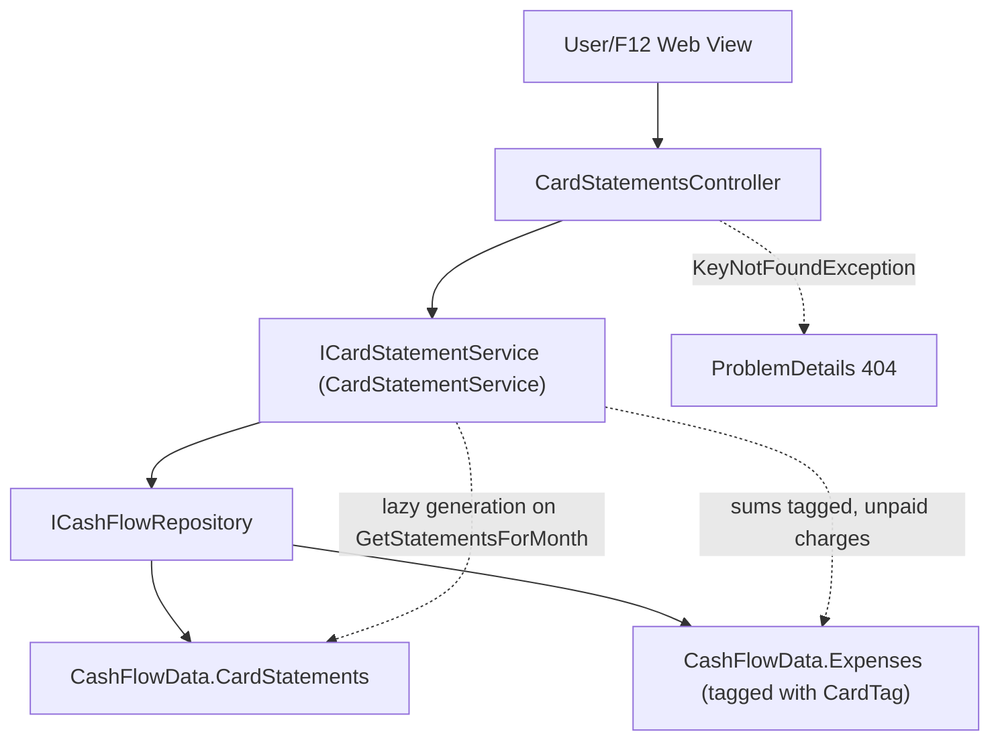

# F04. Credit Card Charge Tracking & Statement Reconciliation

## 1. Technical Overview

**What:** Flesh out F02's placeholder `CardStatement` entity with its real fields, and add a per-card, per-month outstanding-total calculation (derived from F03's already-tagged `Expense` records) plus a "mark statement paid" action that zeroes that card's outstanding total for the month.

**Why:** This replaces the spreadsheet's coincidental Ajuste cell with an explicit per-card paid/unpaid state: a card-tagged expense already counts toward its category total the moment it's entered (F03), but its charge shouldn't reduce the bank balance until the statement is actually paid — this feature is what tracks that gap.

**Scope:**
- Included: real `CardStatement` fields; idempotent lazy generation of a month's 5 card statements; an outstanding-total calculation derived from tagged `Expense` records; a "mark statement paid" action that is a no-op (not an error) when already paid, with rollback on save failure.
- Excluded: any UI (F12); the historical import itself (F10); the combined adjustment figure as a dedicated endpoint — it is the simple sum of the 5 returned per-card outstanding totals, which the consuming Web view (F12) computes client-side, matching F03's precedent of not pre-aggregating what the client can trivially sum itself.

## 2. Architecture Impact

**Affected components:**
- `Financial.CashFlow.Domain/Entities/CardStatement.cs` — gains real fields (was a placeholder), plus a `MarkPaid()` instance method
- `Financial.CashFlow.Application/DTOs/CardStatementDTO.cs` — new
- `Financial.CashFlow.Application/Interfaces/ICardStatementService.cs`, `Financial.CashFlow.Application/Services/CardStatementService.cs` — new
- `Financial.Api/Controllers/CardStatementsController.cs` — new



## 3. Technical Decisions

| Decision | Chosen Approach | Alternative Considered | Trade-off |
|----------|-----------------|-------------------------|-----------|
| Outstanding-total storage | Never stored directly — computed on read as `sum(Expense.Value where CardTag == card && Date in that year/month)`, or `0` if the statement is `IsPaid` | Store a running `OutstandingTotal` field on `CardStatement`, updated whenever a tagged expense is added/edited/deleted | F03's `Expense` is already the single source of truth for a card-tagged charge's value; storing a second, denormalized total risks drifting out of sync every time an expense is added, edited, or deleted with a card tag (F03 has no hook back into F04). Deriving it on read is always correct and this is a low-volume personal app, so the extra summation cost is negligible. |
| "Mark paid" semantics | `CardStatement` only ever tracks `IsPaid` (a boolean latch); marking an already-paid statement paid again is a pure no-op — no exception, no state change, same 200 response | Track a `PaidOutstandingTotalAtTimeOfPayment` snapshot | The PRD only requires the outstanding total to zero out and the no-op behavior on repeat calls — no requirement to remember what was paid retroactively, and inventing that field would contradict the "no over-engineering" standard for a personal app. |
| Combined adjustment figure | Not a dedicated endpoint — `GET .../{year}/{month}` returns the 5 per-card rows; the client sums `OutstandingTotal` across them for the "adjustment figure" | A `GET .../{year}/{month}/adjustment-total` endpoint returning the pre-summed figure | Matches F06/F08's precedent of returning a flat list and pushing any further aggregation to the consuming Web view (F12) — one join, one summation rule, defined once, avoids a second code path that could drift from the first. |
| Card catalog representation | Statements are generated per the existing 5-member `CreditCard` enum (from F03) — no new enum | Introduce a separate card catalog for F04 | F03 already defines the canonical 5-card list; reusing it keeps exactly one source of truth for "which cards exist" across both features. |

## 4. Component Overview

**Backend:**

| File Path | New/Modified | Purpose | Key Responsibilities |
|-----------|--------------|---------|-----------------------|
| `Financial.CashFlow.Domain/Entities/CardStatement.cs` | Modified | Real statement entity | `Id`, `Card` (`CreditCard`), `Year`/`Month` (`int`), `IsPaid` (`bool`, defaults `false`); `Create(...)` factory; `MarkPaid()` instance method (idempotent — no-op if already `true`) |
| `Financial.CashFlow.Application/DTOs/CardStatementDTO.cs` | New | Read model (joined with computed outstanding total) | `Id`, `Card` (string), `Year`, `Month`, `IsPaid`, `OutstandingTotal` (decimal) |
| `Financial.CashFlow.Application/Interfaces/ICardStatementService.cs`, `Financial.CashFlow.Application/Services/CardStatementService.cs` | New | Business logic | `GetStatementsForMonthAsync` (idempotent lazy generation of the 5 cards' statements + outstanding-total computation from tagged expenses), `MarkStatementPaidAsync` (idempotent, rolls back `IsPaid` on save failure) |
| `Financial.Api/Controllers/CardStatementsController.cs` | New | HTTP surface | `GET /card-statements/{year}/{month}`, `POST /card-statements/{id}/mark-paid`; catches `KeyNotFoundException` (404) |

## 5. API Contracts

**Endpoint: Get a Month's Card Statements**
- **Method:** GET
- **Path:** `/api/v1/financial/card-statements/{year}/{month}`
- Ensures a statement exists for all 5 cards for that month (creating any missing ones with `IsPaid = false`) before responding.
- **Response (Success - 200):** `CardStatementDTO[]`, always exactly 5 rows. `OutstandingTotal` is `0` for any card whose statement `IsPaid` is `true`, regardless of tagged expenses.

**Endpoint: Mark a Statement Paid**
- **Method:** POST
- **Path:** `/api/v1/financial/card-statements/{id}/mark-paid`
- **Response (Success - 200):** `CardStatementDTO` for the now-paid statement (`OutstandingTotal = 0`). Calling this again on an already-paid statement returns the same 200 response unchanged — a no-op, not an error.

**Error Codes:** `404` — no statement with that `id`.

## 6. Data Model

**`data-cashflow.json` — `cardStatements` item shape (was `{ "id": "<guid>" }` from F02):**

```json
{
  "id": "3fa85f64-5717-4562-b3fc-2c963f66afa6",
  "card": "BarclaysPlatinumVisa8003",
  "year": 2026,
  "month": 7,
  "isPaid": false
}
```

No SQL schema — persisted via the existing `CashFlowSerializerAdapter`/`CashFlowTypeInfoResolver` from F02 (the type is already listed in its managed types). `OutstandingTotal` is never persisted — it is derived at read time from `Expense` records tagged with that card for that month.

## 7. Testing Strategy

| Test File | Test Type | Target | Coverage Goal |
|-----------|-----------|--------|----------------|
| `Tests/Financial.CashFlow.Domain.Tests/Entities/CardStatementTests.cs` | Unit | `CardStatement` | `Create` assigns all fields, a new id, and defaults `IsPaid` to `false`; `MarkPaid` sets `IsPaid` to `true`; calling `MarkPaid` twice leaves it `true` without error |
| `Tests/Financial.CashFlow.Application.Tests/Services/CardStatementServiceTests.cs` | Unit | `CardStatementService` | `GetStatementsForMonthAsync`: first call generates exactly 5 statements (one per `CreditCard`), each `IsPaid = false`; `OutstandingTotal` correctly sums that month's tagged expenses per card and excludes expenses from other months/cards; a paid statement's `OutstandingTotal` is `0` even with tagged expenses present; a second call for the same month does not create duplicate statements. `MarkStatementPaidAsync`: sets `IsPaid` and zeroes `OutstandingTotal`; calling it again on an already-paid statement is a no-op that still returns 200 without throwing; a save failure leaves `IsPaid` unchanged (rollback); unknown id throws `KeyNotFoundException` |
| `Tests/Financial.Api.Tests/CardStatementsEndpointsTests.cs` | Integration | `CardStatementsController` | Full get-month (generates 5, reflecting a tagged expense's value) → mark-paid round trip over HTTP; marking an already-paid statement paid again still returns 200; marking an unknown id returns 404 |

**Acceptance tests (from PRD Section 9, F04):**
- An expense tagged to a card counts toward its category total immediately but does not reduce the bank balance until the statement is marked paid — `CardStatementServiceTests` (outstanding total reflects the tagged expense while unpaid; F03's `GetCategoryTotalsByMonth` already counts the expense regardless of card-paid state, since that path is untouched by this feature)
- Marking a card's statement paid zeroes its outstanding total and reduces the combined adjustment figure by the same amount — `CardStatementServiceTests`/`CardStatementsEndpointsTests` (the "adjustment figure" is the client-computed sum across the 5 returned rows, so a single card's total dropping to 0 is the complete, directly-testable backend behavior)
- Marking a statement paid when the outstanding total is already zero is a no-op with a confirmation message, not an error — `CardStatementServiceTests`/`CardStatementsEndpointsTests` (repeat `MarkStatementPaidAsync`/`POST .../mark-paid` calls both return success)

**Cross-Feature Integration tests (from PRD Section 9, deferred):**
- "F10's historical import correctly populates every one of F02's six storage collections, matching the shapes defined by F03, F04, ..." — not testable until F10 exists
- "F12 ... correctly display data from F03, F04, ... nested inside F11's CashFlow selection" — not testable until F12 exists; F04 only guarantees the HTTP endpoints F12 will call
