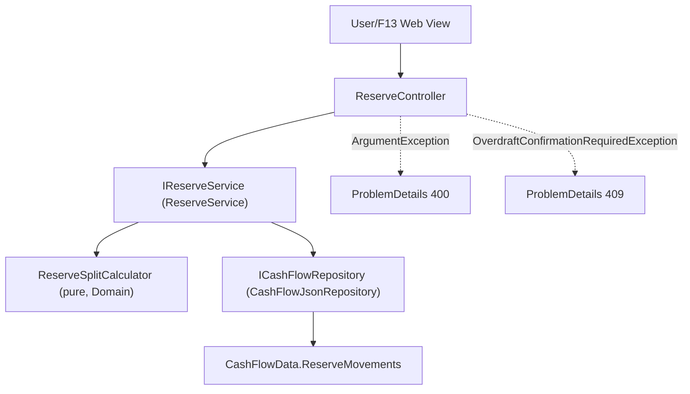

# F05. Reserva Reserve Pool & Automated Split

## 1. Technical Overview

**What:** Add a 5-bucket reserve ledger (Dizimo, Investimento, house-treats, Ariana, Gleison) to the CashFlow domain, with an automated month-end income split (10% tithe, then thirds/sixths of the remainder) and manual withdrawals, each posted as an atomic set of ledger movements.

**Why:** This automates the exact math the user currently does by hand every month across four income fields, replacing error-prone manual arithmetic (the source spreadsheet previously had the split documented incorrectly as 33%/33%/16.5%/16.5%, which doesn't sum to 100%) with a single computed, atomically-posted split.

**Scope:**
- Included: `ReserveBucket` enum (5 members); real `ReserveMovement` fields; a pure `ReserveSplitCalculator` domain rule; `IReserveService`/`ReserveService` covering the income split and manual withdrawals, with atomic rollback on partial save failure; bucket balances and full movement history; an overdraft-confirmation flow for withdrawals.
- Excluded: any UI (F13 — Web Reserva View); persisting the raw income-entry fields themselves (only the resulting bucket movements persist — see Decisions); historical import (F10).

## 2. Architecture Impact

**Affected components:**
- `Financial.CashFlow.Domain/Enums/ReserveBucket.cs` — new
- `Financial.CashFlow.Domain/Entities/ReserveMovement.cs` — gains real fields (was a placeholder)
- `Financial.CashFlow.Domain/Rules/ReserveSplitCalculator.cs` — new, pure calculation
- `Financial.CashFlow.Application/Interfaces/ICashFlowRepository.cs` — gains `DeleteReserveMovement`
- `Financial.CashFlow.Infrastructure/Repositories/CashFlowJsonRepository.cs` — implements `DeleteReserveMovement`
- `Financial.CashFlow.Domain/Entities/CashFlowData.cs` — gains `RemoveReserveMovement`
- `Financial.CashFlow.Application/DTOs/` — new: `IncomeSplitRequestDTO`, `IncomeSplitResultDTO`, `WithdrawalRequestDTO`, `ReserveMovementDTO`, `ReserveBucketBalanceDTO`
- `Financial.CashFlow.Application/Exceptions/OverdraftConfirmationRequiredException.cs` — new
- `Financial.CashFlow.Application/Validation/ReserveBucketParser.cs` — new
- `Financial.CashFlow.Application/Interfaces/IReserveService.cs`, `Financial.CashFlow.Application/Services/ReserveService.cs` — new
- `Financial.Api/Controllers/ReserveController.cs` — new



## 3. Technical Decisions

| Decision | Chosen Approach | Alternative Considered | Trade-off |
|----------|-----------------|-------------------------|-----------|
| Overdraft confirmation mechanism | `WithdrawalRequestDTO` carries an optional `Confirmed` flag (default `false`). If the withdrawal would take the bucket negative and `Confirmed` is `false`, `ReserveService` throws `OverdraftConfirmationRequiredException`, mapped by the controller to `409 Conflict` with a message naming the bucket and its current balance. Resubmitting with `Confirmed = true` saves it. | No server-side gate; leave the confirmation entirely to F13's client-side UI | F13 (the Web Reserva View) doesn't exist yet, so the PRD's "flagged for confirmation" requirement needs to be enforceable now, not deferred to a future feature that may forget to implement it. A clean two-call pattern (409 then resubmit) is exactly what a confirm dialog needs. |
| Income-entry persistence | Only the 5 resulting `ReserveMovement` records persist; the raw income-entry fields (Gleison/Ariana gross and net, Lottery, Dividendo/Juros) are never stored as their own record | Add an 8th `data-cashflow.json` collection for income-entry history | F02's schema has no such collection, and the PRD's "Provides" for F05 only names bucket balances and movement history as outputs — never raw income-entry history. Gross salary values aren't used in any calculation either (only net feeds Dizimo/Limpo), so persisting them would add a collection nothing consumes. |
| Split calculation location | A pure static `ReserveSplitCalculator` in `Financial.CashFlow.Domain/Rules/`, taking net salaries + Lottery + Dividendo/Juros and returning the 5 bucket amounts | Compute inline inside `ReserveService` | Matches the existing precedent exactly: `Financial.Investment.Domain/Rules/ProfitCalculator.cs` and `XirrCalculator.cs` are pure Domain-layer calculators, not Application-layer inline math. |
| Rounding | Each of the 4 Limpo-split amounts (thirds/sixths) is rounded independently to 2 decimal places (`MidpointRounding.AwayFromZero`); no penny-reconciliation against the unrounded Limpo total | Distribute a rounding remainder to one bucket so the 4 splits sum exactly to Limpo | The PRD doesn't require penny-exact reconciliation, and this is a personal app tracking a monthly split, not an accounting ledger requiring cent-perfect balancing; independent rounding is far simpler and the discrepancy (at most a fraction of a penny) is immaterial. |
| Atomic rollback on partial save failure | `ReserveService` adds all 5 movements to the repository, then calls `SaveChangesAsync()` once; if it throws, the service calls the new `DeleteReserveMovement` for each of the 5 movement ids it just added (restoring the in-memory state) before rethrowing | Leave the in-memory repository in whatever partially-added state existed at the failure point | The PRD explicitly requires "no bucket ends up partially updated" on a partial save failure. Since `CashFlowJsonRepository` mutates its in-memory list immediately on `Add` (before the disk write), an explicit compensating rollback is needed to satisfy this — the same gap exists implicitly in F02/F03's simpler single-entity adds, but F05's PRD calls it out explicitly enough to require handling it correctly here. |
| Withdrawal amount sign | `WithdrawalRequestDTO.Amount` is a positive magnitude; `ReserveService` negates it internally before creating the `ReserveMovement`, matching "a withdrawal from any bucket is recorded as a negative movement" | Require the caller to pass an already-negative amount | A positive-magnitude request field reads more naturally as "how much to withdraw" from an API caller's perspective; the sign convention is an internal ledger detail. |
| Bucket naming | `ReserveBucket.HouseTreats` (not `Viagem`) | Name the enum member after the spreadsheet's literal column label | The PRD explicitly calls out that "Viagem" is a legacy/inaccurate label for what's actually a general house/treats bucket, and prefers the accurate name — matching how F02 already resolved a similar historical-label question for `Category`. |

## 4. Component Overview

**Backend:**

| File Path | New/Modified | Purpose | Key Responsibilities |
|-----------|--------------|---------|-----------------------|
| `Financial.CashFlow.Domain/Enums/ReserveBucket.cs` | New | Bucket identifier | 5 members: `Dizimo`, `Investimento`, `HouseTreats`, `Ariana`, `Gleison` |
| `Financial.CashFlow.Domain/Entities/ReserveMovement.cs` | Modified | Real ledger entry | `Id`, `Bucket` (`ReserveBucket`), `Amount` (`decimal`, sign = deposit/withdrawal), `Date` (`DateOnly`), `Description` (`string`); private setters; `Create(...)` factory |
| `Financial.CashFlow.Domain/Entities/CashFlowData.cs` | Modified | Root aggregate | Adds `RemoveReserveMovement(Guid id)` |
| `Financial.CashFlow.Domain/Rules/ReserveSplitCalculator.cs` | New | Pure split math | `Calculate(gleisonNet, arianaNet, lottery, dividendoJuros)` → `(Dizimo, Investimento, HouseTreats, Ariana, Gleison)` amounts, each rounded to 2 decimal places |
| `Financial.CashFlow.Application/Interfaces/ICashFlowRepository.cs` | Modified | Repository abstraction | Adds `void DeleteReserveMovement(Guid id)` |
| `Financial.CashFlow.Infrastructure/Repositories/CashFlowJsonRepository.cs` | Modified | Repository implementation | Implements `DeleteReserveMovement` via `CashFlowData.RemoveReserveMovement` |
| `Financial.CashFlow.Application/DTOs/IncomeSplitRequestDTO.cs` | New | Income split input | `Date`, `GleisonSalaryGross`, `GleisonSalaryNet`, `ArianaSalaryGross`, `ArianaSalaryNet`, `Lottery`, `DividendoJuros` (all `decimal`) |
| `Financial.CashFlow.Application/DTOs/IncomeSplitResultDTO.cs` | New | Income split output | The 5 computed/posted amounts (`Dizimo`, `Investimento`, `HouseTreats`, `Ariana`, `Gleison`) for immediate display |
| `Financial.CashFlow.Application/DTOs/WithdrawalRequestDTO.cs` | New | Withdrawal input | `Bucket` (string), `Amount` (positive `decimal`), `Date`, `Description`, `Confirmed` (bool, default false) |
| `Financial.CashFlow.Application/DTOs/ReserveMovementDTO.cs` | New | Movement read model | `Id`, `Bucket` (string), `Amount`, `Date`, `Description` |
| `Financial.CashFlow.Application/DTOs/ReserveBucketBalanceDTO.cs` | New | Balance read model | `Bucket` (string), `Balance` (decimal) |
| `Financial.CashFlow.Application/Exceptions/OverdraftConfirmationRequiredException.cs` | New | 409 signal | Carries the bucket name and current balance for the controller's error message |
| `Financial.CashFlow.Application/Validation/ReserveBucketParser.cs` | New | Enum string parsing | Same `TryParse` pattern as `CategoryParser`/`PaymentSourceParser` |
| `Financial.CashFlow.Application/Interfaces/IReserveService.cs`, `Financial.CashFlow.Application/Services/ReserveService.cs` | New | Business logic | `PostIncomeSplitAsync`, `PostWithdrawalAsync`, `GetBucketBalances` (always exactly 5 rows), `GetMovementHistory` |
| `Financial.Api/Controllers/ReserveController.cs` | New | HTTP surface | `POST /reserve/income-split`, `POST /reserve/withdrawals`, `GET /reserve/balances`, `GET /reserve/movements`; catches `ArgumentException` (400) and `OverdraftConfirmationRequiredException` (409) |

## 5. API Contracts

**Endpoint: Post Monthly Income Split**
- **Method:** POST
- **Path:** `/api/v1/financial/reserve/income-split`

**Request:**

| Field | Type | Required | Validation | Description |
|-------|------|----------|------------|--------------|
| `date` | `string` (date) | Yes | valid date | Date to post the movements under |
| `gleisonSalaryGross` | `decimal` | Yes | >= 0 | Gleison's gross salary (display/record only — not used in the split math) |
| `gleisonSalaryNet` | `decimal` | Yes | >= 0 | Gleison's net-of-tax salary |
| `arianaSalaryGross` | `decimal` | Yes | >= 0 | Ariana's gross salary (display/record only) |
| `arianaSalaryNet` | `decimal` | Yes | >= 0 | Ariana's net-of-tax salary |
| `lottery` | `decimal` | Yes | >= 0 | Gross Lottery income |
| `dividendoJuros` | `decimal` | Yes | >= 0 | Gross Dividendo/Juros income |

**Request Example:**
```json
{
  "date": "2026-07-01",
  "gleisonSalaryGross": 4500.00,
  "gleisonSalaryNet": 3600.00,
  "arianaSalaryGross": 3200.00,
  "arianaSalaryNet": 2600.00,
  "lottery": 50.00,
  "dividendoJuros": 120.00
}
```

**Response (Success - 200):**

| Field | Type | Description |
|-------|------|--------------|
| `dizimo` | `decimal` | 10% of (net Gleison + net Ariana + Lottery + Dividendo/Juros), posted to the Dizimo bucket |
| `investimento` | `decimal` | 1/3 of Limpo, posted to Investimento |
| `houseTreats` | `decimal` | 1/3 of Limpo, posted to house-treats |
| `ariana` | `decimal` | 1/6 of Limpo, posted to Ariana |
| `gleison` | `decimal` | 1/6 of Limpo, posted to Gleison |

**Error Codes:**

| Code | HTTP Status | Description |
|------|-------------|--------------|
| — | 400 | Any of the 6 income values is negative (message names the field) |

**Endpoint: Post Withdrawal**
- **Method:** POST
- **Path:** `/api/v1/financial/reserve/withdrawals`

**Request:**

| Field | Type | Required | Validation | Description |
|-------|------|----------|------------|--------------|
| `bucket` | `string` | Yes | one of the 5 `ReserveBucket` names | Bucket to withdraw from |
| `amount` | `decimal` | Yes | > 0 | Withdrawal amount (positive magnitude) |
| `date` | `string` (date) | Yes | valid date | Withdrawal date |
| `description` | `string` | Yes | non-blank | Reason for the withdrawal |
| `confirmed` | `bool` | No | default `false` | Set `true` to proceed despite an overdraft warning |

**Response (Success - 200):** `ReserveMovementDTO` for the created (negative-amount) movement.

**Error Codes:**

| Code | HTTP Status | Description |
|------|-------------|--------------|
| — | 400 | Unrecognized bucket name, amount <= 0, or blank description |
| — | 409 | Withdrawal exceeds the bucket's current balance and `confirmed` is `false`; message names the bucket and its balance |

**Endpoint: Get Bucket Balances**
- **Method:** GET
- **Path:** `/api/v1/financial/reserve/balances`
- **Response (Success - 200):** `ReserveBucketBalanceDTO[]`, always exactly 5 entries (one per bucket, `Balance` = sum of that bucket's movement amounts, defaulting to 0 with no movements).

**Endpoint: Get Movement History**
- **Method:** GET
- **Path:** `/api/v1/financial/reserve/movements`
- **Response (Success - 200):** `ReserveMovementDTO[]`, all movements across all 5 buckets, ordered by date.

## 6. Data Model

**`data-cashflow.json` — `reserveMovements` array item shape (was `{ "id": "<guid>" }` from F02):**

```json
{
  "id": "3fa85f64-5717-4562-b3fc-2c963f66afa6",
  "bucket": "Investimento",
  "amount": 866.67,
  "date": "2026-07-01",
  "description": "Monthly income split"
}
```

A manual withdrawal produces the same shape with a negative `amount` and a caller-provided `description`. No SQL schema — persisted via the existing `CashFlowSerializerAdapter`/`CashFlowTypeInfoResolver` from F02 (already includes `ReserveMovement` in its managed types).

## 7. Testing Strategy

| Test File | Test Type | Target | Coverage Goal |
|-----------|-----------|--------|----------------|
| `Tests/Financial.CashFlow.Domain.Tests/Rules/ReserveSplitCalculatorTests.cs` | Unit | `ReserveSplitCalculator` | Dizimo = exactly 10% of (net Gleison + net Ariana + Lottery + Dividendo/Juros); Limpo splits into exact thirds/sixths; Lottery/Dividendo/Juros affect only Dizimo, never the thirds/sixths split; all-zero inputs produce all-zero outputs |
| `Tests/Financial.CashFlow.Domain.Tests/Entities/ReserveMovementTests.cs` | Unit | `ReserveMovement` | `Create` assigns all fields and a new id |
| `Tests/Financial.CashFlow.Domain.Tests/Entities/CashFlowDataTests.cs` (extend) | Unit | `CashFlowData.RemoveReserveMovement` | Removes only the matching id |
| `Tests/Financial.CashFlow.Application.Tests/Services/ReserveServiceTests.cs` | Unit | `ReserveService` | Income split: valid input posts exactly 5 movements and returns the correct amounts; a negative field throws `ArgumentException` before any movement is added; a `SaveChangesAsync` failure rolls back all 5 movements (repository ends with none added). Withdrawal: valid amount within balance posts a negative movement; amount exceeding balance with `confirmed=false` throws `OverdraftConfirmationRequiredException` without saving; the same request with `confirmed=true` saves; amount <= 0 or unrecognized bucket throws `ArgumentException`. Queries: `GetBucketBalances` always returns exactly 5 rows, correctly summed; `GetMovementHistory` returns all movements ordered by date |
| `Tests/Financial.CashFlow.Application.Tests/Validation/ReserveBucketParserTests.cs` | Unit | `ReserveBucketParser` | Valid name parses; unknown/blank fails |
| `Tests/Financial.Api.Tests/ReserveEndpointsTests.cs` | Integration | `ReserveController` | Full income-split and withdrawal round trip over HTTP; negative income field → 400 with message; unconfirmed overdraft → 409 with message; confirmed overdraft → 200; balances always return 5 entries |

**Acceptance tests (from PRD Section 9, F05):**
- Entering Salario Gleison, Salario Ariana (net-of-tax), Lottery, and Dividendo/Juros computes Dizimo as exactly 10% of (combined net-of-tax salary + gross Lottery + gross Dividendo/Juros) — `ReserveSplitCalculatorTests`
- The Limpo pool splits into exactly 1/3 Investimento, 1/3 house-treats, 1/6 Ariana, 1/6 Gleison — Lottery and Dividendo/Juros contribute only to Dizimo — `ReserveSplitCalculatorTests`
- A negative value for any of the four income fields is rejected before any bucket is touched — `ReserveServiceTests`/`ReserveEndpointsTests`
- A manual withdrawal from a single bucket updates only that bucket's running balance — `ReserveServiceTests` (balance re-check after withdrawal)

**Cross-Feature Integration tests (from PRD Section 9, deferred):**
- "Reserve bucket movements posted by F05 persist and reload correctly through F02's storage abstraction" — covered directly: `ReserveServiceTests` and `ReserveEndpointsTests` both exercise the full write-then-read path through `ICashFlowRepository`/`CashFlowJsonRepository`
- "F10's historical import correctly populates every one of F02's six storage collections, matching the shapes defined by F03, F04, F05..." — not testable until F10 exists
- "F13... correctly display data from F05... nested inside F11's CashFlow selection" — not testable until F13 exists; F05 only guarantees the HTTP endpoints F13 will call
