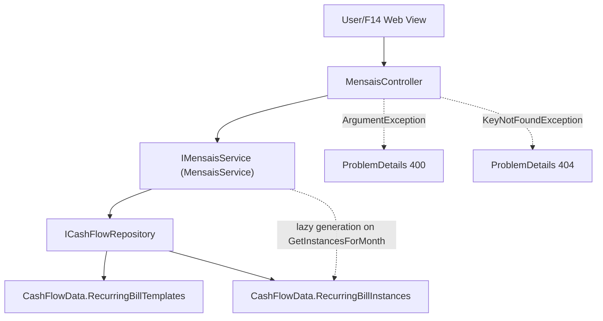

# F06. Mensais Recurring Bills

## 1. Technical Overview

**What:** Flesh out F02's placeholder `RecurringBillTemplate`/`RecurringBillInstance` entities with their real fields, add lazy (on-view) monthly instance generation, and independent per-instance status/value editing that never touches the underlying template or other months.

**Why:** This replaces the spreadsheet's manual "copy last month's Mensais row forward" workflow with generation that happens automatically the first time a given month is viewed, and gives each month's bill instance (status, value) its own independent lifecycle from the template that spawned it.

**Scope:**
- Included: `Area` (Brasil/UK) and `BillStatus` (Unset/Scheduled/Paid) enums; real template/instance fields; a basic template-creation capability (see Decisions); idempotent lazy generation of a month's instances; independent instance status/value updates.
- Excluded: template editing/deactivation UI (not described anywhere in the PRD — F14's Web Mensais View only shows/edits monthly instances); the historical import itself (F10, which will bulk-create templates the same way F06's creation capability does); any UI (F14).

## 2. Architecture Impact

**Affected components:**
- `Financial.CashFlow.Domain/Enums/Area.cs`, `Financial.CashFlow.Domain/Enums/BillStatus.cs` — new
- `Financial.CashFlow.Domain/Entities/RecurringBillTemplate.cs` — gains real fields (was a placeholder)
- `Financial.CashFlow.Domain/Entities/RecurringBillInstance.cs` — gains real fields (was a placeholder), plus an `Update(status, value)` instance method
- `Financial.CashFlow.Application/DTOs/` — new: `RecurringBillTemplateDTO`, `CreateRecurringBillTemplateDTO`, `RecurringBillInstanceDTO`, `UpdateRecurringBillInstanceDTO`
- `Financial.CashFlow.Application/Validation/AreaParser.cs`, `BillStatusParser.cs` — new
- `Financial.CashFlow.Application/Interfaces/IMensaisService.cs`, `Financial.CashFlow.Application/Services/MensaisService.cs` — new
- `Financial.Api/Controllers/MensaisController.cs` — new



## 3. Technical Decisions

| Decision | Chosen Approach | Alternative Considered | Trade-off |
|----------|-----------------|-------------------------|-----------|
| Template creation | F06 includes a basic `CreateTemplateAsync` (create-only, no update/deactivate) | No template creation in F06 at all; leave it entirely to F10 | Neither F06 nor any earlier feature has a way to create a `RecurringBillTemplate`, and F10 (the PRD's only stated template source) depends on F06 — without this, F06 would be untestable end-to-end and undemoable until F10 ships. F10 will create templates through the same repository path when it lands. |
| Instance generation trigger | Lazy: `GetInstancesForMonth(year, month)` first ensures an instance exists for every active template for that month (idempotent — skips templates that already have one), then returns the full list | A separate explicit `POST .../generate` endpoint the caller must invoke first | No background job scheduler exists in this app, and one isn't warranted for a personal, single-user tool. A single GET that "just works" the first time a month is viewed matches this PRD's "no over-engineering" standard and is exactly what F14 needs. |
| Instance/template field ownership | `RecurringBillInstance` stores only `TemplateId`, `Year`, `Month`, `Value`, `Status` — display fields (`DueDay`, `Description`, `Area`, `Note`, `NitNumber`, `MinimumWageValue`) are looked up from the template at read time and combined into `RecurringBillInstanceDTO` | Denormalize all template fields onto every instance at generation time | Avoids redundant copies that could drift from the template for fields the PRD never describes as instance-editable (only `Status` and `Value` are ever called out as changeable per-instance); a read-time join keeps the template as the single source of truth for everything else. |
| Grouping by area | `GetInstancesForMonth` returns a flat list; grouping into "Brasil" and "UK" sections is a client-side concern for F14 | Return a pre-grouped response shape (e.g. `{ brasil: [...], uk: [...] }`) | Matches F03's precedent (`GetExpensesByMonth` returns a flat list, not pre-grouped by category) — keeps the API shape simple and pushes presentation grouping to the Web layer that actually needs it. |
| Validation scope | Only structurally-necessary checks: `DueDay` in 1-31, non-blank `Description`, a parseable `Area`/`BillStatus` | Add business rules like "value must be positive" | F06 has no Error Handling section in the PRD at all (unlike F03/F05); inventing unstated constraints risks contradicting a real rule a later feature or historical import might need (e.g. a corrected negative bill entry). |

## 4. Component Overview

**Backend:**

| File Path | New/Modified | Purpose | Key Responsibilities |
|-----------|--------------|---------|-----------------------|
| `Financial.CashFlow.Domain/Enums/Area.cs` | New | Bill area | 2 members: `Brasil`, `UK` |
| `Financial.CashFlow.Domain/Enums/BillStatus.cs` | New | Instance status | 3 members: `Unset`, `Scheduled`, `Paid` |
| `Financial.CashFlow.Domain/Entities/RecurringBillTemplate.cs` | Modified | Real template entity | `Id`, `DueDay` (`int`), `Description` (`string`), `Value` (`decimal`), `Area` (`Area`), `Note` (`string`), `NitNumber` (`string?`), `MinimumWageValue` (`decimal?`), `IsActive` (`bool`, defaults `true`); `Create(...)` factory |
| `Financial.CashFlow.Domain/Entities/RecurringBillInstance.cs` | Modified | Real instance entity | `Id`, `TemplateId` (`Guid`), `Year`/`Month` (`int`), `Value` (`decimal`), `Status` (`BillStatus`); `Create(...)` factory (`Status` defaults to `Unset`); `Update(status, value)` instance method |
| `Financial.CashFlow.Application/DTOs/RecurringBillTemplateDTO.cs` | New | Template read model | All template fields |
| `Financial.CashFlow.Application/DTOs/CreateRecurringBillTemplateDTO.cs` | New | Template create request | `DueDay`, `Description`, `Value`, `Area` (string), `Note`, `NitNumber?`, `MinimumWageValue?` |
| `Financial.CashFlow.Application/DTOs/RecurringBillInstanceDTO.cs` | New | Instance read model (joined) | `Id`, `TemplateId`, `Year`, `Month`, `DueDay`, `Description`, `Area` (string), `Note`, `NitNumber?`, `MinimumWageValue?`, `Value`, `Status` (string) |
| `Financial.CashFlow.Application/DTOs/UpdateRecurringBillInstanceDTO.cs` | New | Instance update request | `Status` (string), `Value` (decimal) |
| `Financial.CashFlow.Application/Validation/AreaParser.cs`, `BillStatusParser.cs` | New | Enum string parsing | Same `TryParse` pattern as `CategoryParser`/`ReserveBucketParser` |
| `Financial.CashFlow.Application/Interfaces/IMensaisService.cs`, `Financial.CashFlow.Application/Services/MensaisService.cs` | New | Business logic | `CreateTemplateAsync`, `GetTemplates`, `GetInstancesForMonth` (idempotent lazy generation + join), `UpdateInstanceAsync` |
| `Financial.Api/Controllers/MensaisController.cs` | New | HTTP surface | `POST /mensais/templates`, `GET /mensais/templates`, `GET /mensais/{year}/{month}`, `PUT /mensais/instances/{id}`; catches `ArgumentException` (400) and `KeyNotFoundException` (404) |

## 5. API Contracts

**Endpoint: Create Recurring Bill Template**
- **Method:** POST
- **Path:** `/api/v1/financial/mensais/templates`

**Request:**

| Field | Type | Required | Validation | Description |
|-------|------|----------|------------|--------------|
| `dueDay` | `int` | Yes | 1-31 | Day of month the bill is due |
| `description` | `string` | Yes | non-blank | Bill description |
| `value` | `decimal` | Yes | — | Bill amount |
| `area` | `string` | Yes | `Brasil` or `UK` | Which area this bill belongs to |
| `note` | `string` | No | — | Free-text note |
| `nitNumber` | `string` \| `null` | No | — | Brasil-only NIT number (e.g. the INSS row) |
| `minimumWageValue` | `decimal` \| `null` | No | — | Brasil-only minimum-wage reference value |

**Response (Success - 200):** `RecurringBillTemplateDTO` (all request fields plus `id` and `isActive: true`).

**Error Codes:** `400` — `dueDay` outside 1-31, blank `description`, or unrecognized `area` (message in `ProblemDetails.detail`).

**Endpoint: List Templates**
- **Method:** GET
- **Path:** `/api/v1/financial/mensais/templates`
- **Response (Success - 200):** `RecurringBillTemplateDTO[]`, all templates (active and inactive).

**Endpoint: Get a Month's Bill Instances**
- **Method:** GET
- **Path:** `/api/v1/financial/mensais/{year}/{month}`
- Ensures an instance exists for every active template for that month (creating any missing ones, `Status = Unset`, `Value` copied from the template) before responding.
- **Response (Success - 200):** `RecurringBillInstanceDTO[]`, joined with each instance's template for display fields.

**Endpoint: Update a Bill Instance**
- **Method:** PUT
- **Path:** `/api/v1/financial/mensais/instances/{id}`

**Request:**

| Field | Type | Required | Validation | Description |
|-------|------|----------|------------|--------------|
| `status` | `string` | Yes | `Unset`, `Scheduled`, or `Paid` | New status |
| `value` | `decimal` | Yes | — | New value for this instance only |

**Response (Success - 200):** `RecurringBillInstanceDTO` for the updated instance.

**Error Codes:** `400` — unrecognized `status`. `404` — no instance with that `id`.

## 6. Data Model

**`data-cashflow.json` — `recurringBillTemplates` item shape (was `{ "id": "<guid>" }` from F02):**

```json
{
  "id": "3fa85f64-5717-4562-b3fc-2c963f66afa6",
  "dueDay": 10,
  "description": "INSS",
  "value": 850.00,
  "area": "Brasil",
  "note": "Direct debit",
  "nitNumber": "12345678901",
  "minimumWageValue": 1412.00,
  "isActive": true
}
```

**`recurringBillInstances` item shape:**

```json
{
  "id": "7c9e6679-7425-40de-944b-e07fc1f90ae7",
  "templateId": "3fa85f64-5717-4562-b3fc-2c963f66afa6",
  "year": 2026,
  "month": 7,
  "value": 850.00,
  "status": "Unset"
}
```

No SQL schema — persisted via the existing `CashFlowSerializerAdapter`/`CashFlowTypeInfoResolver` from F02 (both types already listed in its managed types).

## 7. Testing Strategy

| Test File | Test Type | Target | Coverage Goal |
|-----------|-----------|--------|----------------|
| `Tests/Financial.CashFlow.Domain.Tests/Entities/RecurringBillTemplateTests.cs` | Unit | `RecurringBillTemplate` | `Create` assigns all fields, a new id, and `IsActive = true` by default |
| `Tests/Financial.CashFlow.Domain.Tests/Entities/RecurringBillInstanceTests.cs` | Unit | `RecurringBillInstance` | `Create` defaults `Status` to `Unset`; `Update` mutates status/value without changing `Id`/`TemplateId`/`Year`/`Month` |
| `Tests/Financial.CashFlow.Application.Tests/Services/MensaisServiceTests.cs` | Unit | `MensaisService` | `CreateTemplateAsync`: valid input saves; invalid `dueDay`/blank description/invalid area throws. `GetInstancesForMonth`: first call generates exactly one instance per active template with `Status=Unset` and `Value` copied from the template; a second call for the same month does not create duplicates; inactive templates are skipped. `UpdateInstanceAsync`: updates status/value without touching the template or other months' instances; unknown id throws `KeyNotFoundException`; invalid status throws `ArgumentException` |
| `Tests/Financial.CashFlow.Application.Tests/Validation/AreaParserTests.cs`, `BillStatusParserTests.cs` | Unit | Enum parsers | Valid name parses; unknown/blank fails |
| `Tests/Financial.Api.Tests/MensaisEndpointsTests.cs` | Integration | `MensaisController` | Full create-template → get-month (generates) → update-instance round trip over HTTP; invalid due day → 400; update of an unknown instance id → 404 |

**Acceptance tests (from PRD Section 9, F06):**
- Every active recurring bill template generates exactly one instance per calendar month, defaulting to unset status — `MensaisServiceTests`
- Updating one month's instance status or value does not change the underlying template or any other month's instance — `MensaisServiceTests`
- Brasil-area rows can carry an optional NIT number and minimum-wage value; UK-area rows do not require them — `MensaisServiceTests`/`MensaisEndpointsTests` (a UK template created without either field succeeds)

**Cross-Feature Integration tests (from PRD Section 9, deferred):**
- "Recurring bill instances generated by F06... persist and reload correctly through F02's storage abstraction" — covered directly: `MensaisServiceTests` and `MensaisEndpointsTests` both exercise the full write-then-read path through `ICashFlowRepository`/`CashFlowJsonRepository`
- "F10's historical import correctly populates every one of F02's six storage collections, matching the shapes defined by ... F06..." — not testable until F10 exists
- "F14... correctly display data from F06... nested inside F11's CashFlow selection" — not testable until F14 exists; F06 only guarantees the HTTP endpoints F14 will call
