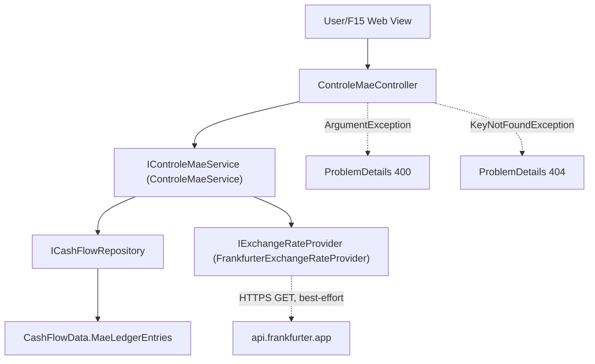

# F07. Controle Mae Ledger

## 1. Technical Overview

**What:** Flesh out F02's placeholder `MaeLedgerEntry` entity with its real fields, add a historical BRL/GBP exchange-rate lookup that auto-computes the converted value on entry creation, and a manual-override path for correcting either currency value after the fact.

**Why:** This replaces the family cash-flow sheet's manual currency lookup with an automatic historical-rate fetch, while still allowing the same manual correction the spreadsheet relies on when a fetched rate doesn't match the user's own records.

**Scope:**
- Included: `Currency` enum (BRL/GBP); real `MaeLedgerEntry` fields; an `IExchangeRateProvider` abstraction with a Frankfurter-API-backed implementation; entry creation with automatic conversion (soft-degrading to a null converted value on lookup failure); a manual-override update for correcting either currency value; future-date rejection.
- Excluded: any UI (F15); the historical import itself (F10); retrying a failed automatic conversion (the PRD's only stated recovery path is the manual-override edit).

## 2. Architecture Impact

**Affected components:**
- `Financial.CashFlow.Domain/Enums/Currency.cs` — new
- `Financial.CashFlow.Domain/Entities/MaeLedgerEntry.cs` — gains real fields (was a placeholder), plus an `UpdateValues(brlValue, gbpValue)` instance method
- `Financial.CashFlow.Application/Interfaces/IExchangeRateProvider.cs` — new
- `Financial.CashFlow.Application/DTOs/` — new: `MaeLedgerEntryDTO`, `CreateMaeLedgerEntryDTO`, `UpdateMaeLedgerEntryValuesDTO`
- `Financial.CashFlow.Application/Validation/CurrencyParser.cs` — new
- `Financial.CashFlow.Application/Interfaces/IControleMaeService.cs`, `Financial.CashFlow.Application/Services/ControleMaeService.cs` — new
- `Financial.CashFlow.Infrastructure/Services/FrankfurterExchangeRateProvider.cs` — new
- `Financial.Api/Controllers/ControleMaeController.cs` — new



## 3. Technical Decisions

| Decision | Chosen Approach | Alternative Considered | Trade-off |
|----------|-----------------|-------------------------|-----------|
| Exchange-rate API | Frankfurter API (`api.frankfurter.app`), called via a typed `HttpClient` | ExchangeRate-API (needs an API key/config); Banco Central do Brasil PTAX (BRL-centric, would need a second hop for GBP) | Frankfurter is free, keyless, and returns historical daily rates directly for any currency pair — no credential management needed for a personal single-user app, matching the project's "no over-engineering" standard. User confirmed via interview. |
| Lookup-failure behavior | `IExchangeRateProvider.GetHistoricalRateAsync` returns `decimal?` — `null` on any failure (network error, no data for that date, non-2xx response); the service catches nothing further and simply stores `null` for the unconverted currency | Throw and let the controller translate to an error response | The PRD explicitly requires the entry to still save with only the entered currency populated on lookup failure — this is a soft degrade, not an error condition, so no exception should be involved in the happy/expected failure path. User confirmed via interview. |
| Manual-override representation | The unconverted currency value is simply `null` until a manual `UpdateValuesAsync` call fills it in; no extra `NeedsManualConversion` flag | Add an explicit boolean flag alongside the nullable value | A null value already means "needs manual entry" without adding an unrequested field — F15 can check for `null` directly. User confirmed via interview. |
| Manual-override scope | `UpdateValuesAsync(id, brlValue, gbpValue)` overwrites only the two currency values; `Date`, `Description`, and `Note` stay fixed after creation | Allow editing every field | The PRD's Capabilities text describes only "a user can directly edit either currency value after the automatic conversion" — no other field is ever described as editable, matching F06's precedent of a narrowly-scoped update. |
| Source-currency tracking | `MaeLedgerEntry` stores the `Currency` the user originally entered (`SourceCurrency`) alongside both `BrlValue`/`GbpValue`, so the service knows which value was authoritative if a future feature needs to re-derive or audit the entry | Don't track which currency was entered | Cheap to store, matches the PRD's "a value in one currency ... as entered by the user" language, and costs nothing extra in the JSON shape. |

## 4. Component Overview

**Backend:**

| File Path | New/Modified | Purpose | Key Responsibilities |
|-----------|--------------|---------|-----------------------|
| `Financial.CashFlow.Domain/Enums/Currency.cs` | New | Ledger currency | 2 members: `BRL`, `GBP` |
| `Financial.CashFlow.Domain/Entities/MaeLedgerEntry.cs` | Modified | Real ledger entity | `Id`, `Date` (`DateOnly`), `Description` (`string`), `Note` (`string`), `SourceCurrency` (`Currency`), `BrlValue` (`decimal?`), `GbpValue` (`decimal?`); `Create(...)` factory; `UpdateValues(decimal? brlValue, decimal? gbpValue)` instance method |
| `Financial.CashFlow.Application/Interfaces/IExchangeRateProvider.cs` | New | FX lookup abstraction | `Task<decimal?> GetHistoricalRateAsync(DateOnly date, Currency from, Currency to)` — returns `null` on any failure |
| `Financial.CashFlow.Infrastructure/Services/FrankfurterExchangeRateProvider.cs` | New | Frankfurter-backed implementation | Calls `GET https://api.frankfurter.app/{yyyy-MM-dd}?from={from}&to={to}`, parses the single rate, catches all HTTP/deserialization failures and returns `null` |
| `Financial.CashFlow.Application/DTOs/MaeLedgerEntryDTO.cs` | New | Read model | `Id`, `Date`, `Description`, `Note`, `SourceCurrency` (string), `BrlValue` (`decimal?`), `GbpValue` (`decimal?`) |
| `Financial.CashFlow.Application/DTOs/CreateMaeLedgerEntryDTO.cs` | New | Create request | `Date`, `Description`, `Note`, `SourceCurrency` (string), `SourceValue` (`decimal`) |
| `Financial.CashFlow.Application/DTOs/UpdateMaeLedgerEntryValuesDTO.cs` | New | Manual-override request | `BrlValue` (`decimal?`), `GbpValue` (`decimal?`) |
| `Financial.CashFlow.Application/Validation/CurrencyParser.cs` | New | Enum string parsing | Same `TryParse` pattern as `AreaParser`/`CategoryParser` |
| `Financial.CashFlow.Application/Interfaces/IControleMaeService.cs`, `Financial.CashFlow.Application/Services/ControleMaeService.cs` | New | Business logic | `CreateEntryAsync` (validates, rejects future dates, fetches rate, computes converted value, soft-degrades on failure), `GetEntriesByMonth(year, month)`, `UpdateEntryValuesAsync` |
| `Financial.Api/Controllers/ControleMaeController.cs` | New | HTTP surface | `POST /controle-mae/entries`, `GET /controle-mae/entries/month/{year}/{month}`, `PUT /controle-mae/entries/{id}/values`; catches `ArgumentException` (400) and `KeyNotFoundException` (404) |

## 5. API Contracts

**Endpoint: Create Mae Ledger Entry**
- **Method:** POST
- **Path:** `/api/v1/financial/controle-mae/entries`

**Request:**

| Field | Type | Required | Validation | Description |
|-------|------|----------|------------|--------------|
| `date` | `DateOnly` | Yes | not in the future | Expense date, used for the historical rate lookup |
| `description` | `string` | Yes | non-blank | Entry description |
| `note` | `string` | No | — | Free-text annotation |
| `sourceCurrency` | `string` | Yes | `BRL` or `GBP` | Currency the value was entered in |
| `sourceValue` | `decimal` | Yes | non-zero | Value in `sourceCurrency` |

**Response (Success - 200):** `MaeLedgerEntryDTO`. `BrlValue`/`GbpValue`: the entered currency is always populated; the other is populated if the historical rate lookup succeeded, otherwise `null`.

**Error Codes:** `400` — blank description, unrecognized `sourceCurrency`, zero `sourceValue`, or a future `date` (message in `ProblemDetails.detail`).

**Endpoint: List Entries for a Month**
- **Method:** GET
- **Path:** `/api/v1/financial/controle-mae/entries/month/{year}/{month}`
- **Response (Success - 200):** `MaeLedgerEntryDTO[]`, all entries whose `Date` falls in that year/month.

**Endpoint: Update Entry Values (manual override)**
- **Method:** PUT
- **Path:** `/api/v1/financial/controle-mae/entries/{id}/values`

**Request:**

| Field | Type | Required | Validation | Description |
|-------|------|----------|------------|--------------|
| `brlValue` | `decimal?` | No | — | New BRL value (`null` leaves it unset) |
| `gbpValue` | `decimal?` | No | — | New GBP value (`null` leaves it unset) |

**Response (Success - 200):** `MaeLedgerEntryDTO` for the updated entry.

**Error Codes:** `404` — no entry with that `id`.

## 6. Data Model

**`data-cashflow.json` — `maeLedgerEntries` item shape (was `{ "id": "<guid>" }` from F02):**

```json
{
  "id": "3fa85f64-5717-4562-b3fc-2c963f66afa6",
  "date": "2026-07-15",
  "description": "School supplies",
  "note": "Bought at the start of term",
  "sourceCurrency": "BRL",
  "brlValue": 350.00,
  "gbpValue": 51.23
}
```

**Example where the automatic lookup failed (soft-degrade):**

```json
{
  "id": "7c9e6679-7425-40de-944b-e07fc1f90ae7",
  "date": "2026-07-16",
  "description": "Medical appointment",
  "note": "",
  "sourceCurrency": "GBP",
  "brlValue": null,
  "gbpValue": 40.00
}
```

No SQL schema — persisted via the existing `CashFlowSerializerAdapter`/`CashFlowTypeInfoResolver` from F02 (the type is already listed in its managed types).

## 7. Testing Strategy

| Test File | Test Type | Target | Coverage Goal |
|-----------|-----------|--------|----------------|
| `Tests/Financial.CashFlow.Domain.Tests/Entities/MaeLedgerEntryTests.cs` | Unit | `MaeLedgerEntry` | `Create` assigns all fields and a new id; `UpdateValues` mutates `BrlValue`/`GbpValue` without changing `Id`/`Date`/`Description`/`Note`/`SourceCurrency` |
| `Tests/Financial.CashFlow.Application.Tests/Services/ControleMaeServiceTests.cs` | Unit | `ControleMaeService` | `CreateEntryAsync`: valid request with a successful rate lookup populates both currencies and saves; a failed lookup (provider returns `null`) still saves with only the entered currency populated; a future date throws before any repository/provider call; blank description, unrecognized currency, or zero value throws. `GetEntriesByMonth`: filters by year/month. `UpdateEntryValuesAsync`: updates only the two currency values, leaving `Date`/`Description`/`Note` untouched; unknown id throws `KeyNotFoundException` |
| `Tests/Financial.CashFlow.Application.Tests/Validation/CurrencyParserTests.cs` | Unit | `CurrencyParser` | Valid name parses; unknown/blank fails |
| `Tests/Financial.CashFlow.Infrastructure.Tests/Services/FrankfurterExchangeRateProviderTests.cs` | Unit | `FrankfurterExchangeRateProvider` | Successful response parses the rate; a non-2xx response, malformed JSON, or thrown `HttpRequestException` all result in `null` rather than propagating |
| `Tests/Financial.Api.Tests/ControleMaeEndpointsTests.cs` | Integration | `ControleMaeController` | Full create-entry (with a stubbed `IExchangeRateProvider`) → get-month → update-values round trip over HTTP; invalid currency and future-date → 400; update of an unknown entry id → 404 |

**Acceptance tests (from PRD Section 9, F07):**
- Entering a value in one currency and a valid past date auto-populates the converted value in the other currency using that date's historical exchange rate — `ControleMaeServiceTests`/`ControleMaeEndpointsTests`
- An entry with a future date is rejected — `ControleMaeServiceTests`/`ControleMaeEndpointsTests`
- If the FX lookup is unavailable, the entry still saves with the entered currency populated and prompts for manual entry of the converted value — `ControleMaeServiceTests` (a `null`-returning stub provider), `FrankfurterExchangeRateProviderTests` (the provider itself never throws on lookup failure)

**Cross-Feature Integration tests (from PRD Section 9, deferred):**
- "Mae ledger entries from F07 ... persist and reload correctly through F02's storage abstraction" — covered directly: `ControleMaeServiceTests` and `ControleMaeEndpointsTests` both exercise the full write-then-read path through `ICashFlowRepository`/`CashFlowJsonRepository`
- "F10's historical import correctly populates every one of F02's six storage collections, matching the shapes defined by ... F07..." — not testable until F10 exists
- "F15 ... correctly display data from F07 ... nested inside F11's CashFlow selection" — not testable until F15 exists; F07 only guarantees the HTTP endpoints F15 will call
