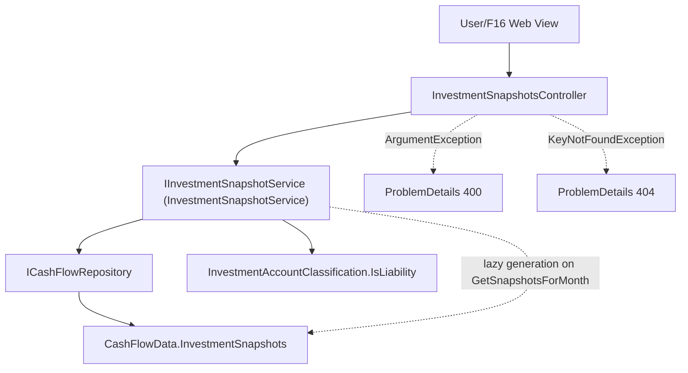

# F08. Monthly Investment Snapshot

## 1. Technical Overview

**What:** Flesh out F02's placeholder `InvestmentSnapshot` entity with its real fields, introduce the fixed 11-account catalog as an enum (matching the `Category`/`ReserveBucket` precedent from F03/F05), and add idempotent lazy generation of a month's 11 snapshot rows plus independent per-account value editing.

**Why:** This replaces the spreadsheet's manual monthly balance entry across 11 fixed accounts with a generation-on-view flow, keeping each month's snapshot independent from every other month's, and keeps a liability account's value stored as a positive magnitude per the PRD's explicit rule.

**Scope:**
- Included: `InvestmentAccount` enum (11 fixed members); an `InvestmentAccountClassification` rule identifying which accounts are liabilities; real `InvestmentSnapshot` fields; idempotent lazy generation of a month's 11 snapshots (defaulting new ones to a zero value); independent per-snapshot value editing.
- Excluded: any UI (F16); the historical import itself (F10); month-over-month diffing (F09, which consumes this feature's snapshots).

## 2. Architecture Impact

**Affected components:**
- `Financial.CashFlow.Domain/Enums/InvestmentAccount.cs` — new, 11 fixed members
- `Financial.CashFlow.Domain/Rules/InvestmentAccountClassification.cs` — new, `IsLiability(InvestmentAccount)` lookup
- `Financial.CashFlow.Domain/Entities/InvestmentSnapshot.cs` — gains real fields (was a placeholder), plus an `Update(value)` instance method
- `Financial.CashFlow.Application/DTOs/` — new: `InvestmentSnapshotDTO`, `UpdateInvestmentSnapshotValueDTO`
- `Financial.CashFlow.Application/Validation/InvestmentAccountParser.cs` — new
- `Financial.CashFlow.Application/Interfaces/IInvestmentSnapshotService.cs`, `Financial.CashFlow.Application/Services/InvestmentSnapshotService.cs` — new
- `Financial.Api/Controllers/InvestmentSnapshotsController.cs` — new



## 3. Technical Decisions

| Decision | Chosen Approach | Alternative Considered | Trade-off |
|----------|-----------------|-------------------------|-----------|
| Account catalog representation | An 11-member `InvestmentAccount` enum, with liability-ness looked up via a separate static `InvestmentAccountClassification.IsLiability(...)` rule (mirrors the existing `GlobalAssetClassMapping`-in-`Rules` convention from the Investments domain) | A data-driven account table the user could edit | The PRD calls this list "canonical" and gives an exact count (11) with named accounts — a fixed enum matches the established precedent of `Category` (F03) and `ReserveBucket` (F05) for other closed, PRD-enumerated catalogs, and needs no create/edit UI for something that never changes. |
| Snapshot generation trigger | Lazy: `GetSnapshotsForMonth(year, month)` first ensures all 11 accounts have a snapshot for that month (idempotent — creates any missing ones with `Value = 0`), then returns the full list | A separate explicit "initialize month" endpoint | Matches F06's precedent exactly (no background scheduler, no over-engineering) — a single GET that "just works" the first time a month is viewed. |
| Value sign convention | `Value` is always stored as a non-negative magnitude for every account (liability or not); `IsLiability` (from the account's static classification) is what tells the reader "this magnitude is owed, not held" | Store liabilities as negative numbers | The PRD explicitly states a liability's value is "stored and displayed as a positive magnitude ... not inferred from a sign convention" — validating `Value >= 0` for every account keeps this invariant true uniformly, since no account in the canonical list is ever described as permissibly negative. |
| Update addressing | `UpdateSnapshotValueAsync(id, value)` addressed by the snapshot's own `Id`, matching `RecurringBillInstance`'s update-by-id pattern from F06 | Address by `(year, month, account)` composite key | Consistent with every other CashFlow entity's update pattern (`Expense`, `ReserveMovement`, `RecurringBillInstance`) — the id is already returned in the read DTO from the generation call, so the client never needs to construct a composite key. |

## 4. Component Overview

**Backend:**

| File Path | New/Modified | Purpose | Key Responsibilities |
|-----------|--------------|---------|-----------------------|
| `Financial.CashFlow.Domain/Enums/InvestmentAccount.cs` | New | Account catalog | 11 members: `BlueRewardsSaver`, `PlatinumVisa8003`, `PlatinumVisa6007`, `ChaseMaster4023`, `BaAmex`, `PaypalCredit`, `ChipCashIsaGleison`, `ChaseSave`, `ChipCashIsaAriana`, `Trading212Invested`, `ReservasPessoais` |
| `Financial.CashFlow.Domain/Rules/InvestmentAccountClassification.cs` | New | Liability lookup | `IsLiability(InvestmentAccount)` — `true` for `PlatinumVisa8003`, `PlatinumVisa6007`, `ChaseMaster4023`, `BaAmex`, `PaypalCredit`; `false` for the other 6 |
| `Financial.CashFlow.Domain/Entities/InvestmentSnapshot.cs` | Modified | Real snapshot entity | `Id`, `Account` (`InvestmentAccount`), `Year`/`Month` (`int`), `Value` (`decimal`); `Create(...)` factory; `Update(decimal value)` instance method |
| `Financial.CashFlow.Application/DTOs/InvestmentSnapshotDTO.cs` | New | Read model (joined with classification) | `Id`, `Account` (string), `IsLiability` (bool), `Year`, `Month`, `Value` |
| `Financial.CashFlow.Application/DTOs/UpdateInvestmentSnapshotValueDTO.cs` | New | Update request | `Value` (decimal) |
| `Financial.CashFlow.Application/Validation/InvestmentAccountParser.cs` | New | Enum string parsing | Same `TryParse` pattern as `CategoryParser`/`ReserveBucketParser` |
| `Financial.CashFlow.Application/Interfaces/IInvestmentSnapshotService.cs`, `Financial.CashFlow.Application/Services/InvestmentSnapshotService.cs` | New | Business logic | `GetSnapshotsForMonth` (idempotent lazy generation + classification join), `UpdateSnapshotValueAsync` |
| `Financial.Api/Controllers/InvestmentSnapshotsController.cs` | New | HTTP surface | `GET /investment-snapshots/{year}/{month}`, `PUT /investment-snapshots/{id}`; catches `ArgumentException` (400) and `KeyNotFoundException` (404) |

## 5. API Contracts

**Endpoint: Get a Month's Investment Snapshots**
- **Method:** GET
- **Path:** `/api/v1/financial/investment-snapshots/{year}/{month}`
- Ensures a snapshot exists for all 11 canonical accounts for that month (creating any missing ones with `Value = 0`) before responding.
- **Response (Success - 200):** `InvestmentSnapshotDTO[]`, always exactly 11 rows.

**Endpoint: Update a Snapshot's Value**
- **Method:** PUT
- **Path:** `/api/v1/financial/investment-snapshots/{id}`

**Request:**

| Field | Type | Required | Validation | Description |
|-------|------|----------|------------|--------------|
| `value` | `decimal` | Yes | `>= 0` | New value for this account/month only, stored as a positive magnitude |

**Response (Success - 200):** `InvestmentSnapshotDTO` for the updated snapshot.

**Error Codes:** `400` — negative `value` (message in `ProblemDetails.detail`). `404` — no snapshot with that `id`.

## 6. Data Model

**`data-cashflow.json` — `investmentSnapshots` item shape (was `{ "id": "<guid>" }` from F02):**

```json
{
  "id": "3fa85f64-5717-4562-b3fc-2c963f66afa6",
  "account": "PlatinumVisa8003",
  "year": 2026,
  "month": 7,
  "value": 1250.00
}
```

No SQL schema — persisted via the existing `CashFlowSerializerAdapter`/`CashFlowTypeInfoResolver` from F02 (the type is already listed in its managed types). `IsLiability` is never persisted — it is derived at read time from `InvestmentAccountClassification`.

## 7. Testing Strategy

| Test File | Test Type | Target | Coverage Goal |
|-----------|-----------|--------|----------------|
| `Tests/Financial.CashFlow.Domain.Tests/Entities/InvestmentSnapshotTests.cs` | Unit | `InvestmentSnapshot` | `Create` assigns all fields and a new id; `Update` mutates `Value` without changing `Id`/`Account`/`Year`/`Month` |
| `Tests/Financial.CashFlow.Domain.Tests/Rules/InvestmentAccountClassificationTests.cs` | Unit | `InvestmentAccountClassification` | The 5 liability accounts return `true`; the other 6 return `false` |
| `Tests/Financial.CashFlow.Application.Tests/Services/InvestmentSnapshotServiceTests.cs` | Unit | `InvestmentSnapshotService` | `GetSnapshotsForMonth`: first call generates exactly 11 snapshots (one per `InvestmentAccount`), each defaulting to `Value = 0`, with the correct `IsLiability` per account; a second call for the same month does not create duplicates. `UpdateSnapshotValueAsync`: updates only the targeted snapshot's value, leaving other months/accounts untouched; a negative value throws `ArgumentException`; unknown id throws `KeyNotFoundException` |
| `Tests/Financial.CashFlow.Application.Tests/Validation/InvestmentAccountParserTests.cs` | Unit | `InvestmentAccountParser` | Valid name parses; unknown/blank fails |
| `Tests/Financial.Api.Tests/InvestmentSnapshotsEndpointsTests.cs` | Integration | `InvestmentSnapshotsController` | Full get-month (generates 11) → update-value round trip over HTTP; negative value → 400; update of an unknown snapshot id → 404 |

**Acceptance tests (from PRD Section 9, F08):**
- All 11 canonical accounts can each have exactly one value entered per month — `InvestmentSnapshotServiceTests`
- Editing one month's snapshot value for an account does not change any other month's value for that account — `InvestmentSnapshotServiceTests`
- A liability account's value is stored and displayed as a positive magnitude — `InvestmentSnapshotServiceTests`/`InvestmentAccountClassificationTests`

**Cross-Feature Integration tests (from PRD Section 9, deferred):**
- "...investment snapshots from F08 all persist and reload correctly through F02's storage abstraction" — covered directly: `InvestmentSnapshotServiceTests` and `InvestmentSnapshotsEndpointsTests` both exercise the full write-then-read path through `ICashFlowRepository`/`CashFlowJsonRepository`
- "F10's historical import correctly populates every one of F02's six storage collections, matching the shapes defined by ... F08" — not testable until F10 exists
- "F16 ... correctly display data from F08 ... nested inside F11's CashFlow selection" — not testable until F16 exists; F08 only guarantees the HTTP endpoints F16 will call
