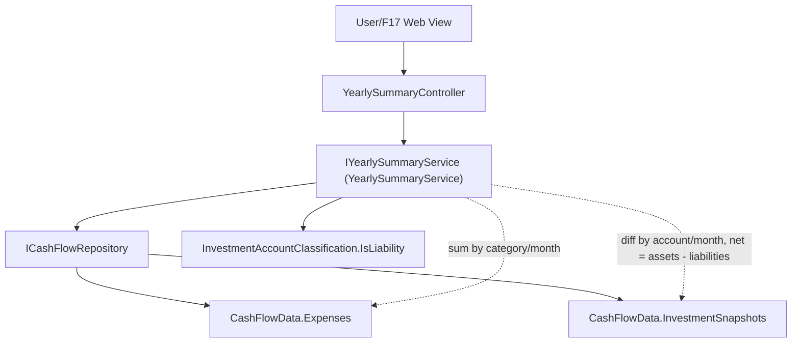

# F09. Yearly Summary & Month-over-Month Reporting

## 1. Technical Overview

**What:** A read-only reporting feature that computes, for a selected year, (1) each expense category's 12 monthly totals plus a yearly total (from F03's `Expense` records), and (2) each of F08's 11 investment accounts' month-over-month value changes, plus a combined net-position row with its own diffs and a full-year net change.

**Why:** This replaces the spreadsheet's Resumo/Year sheet's hand-maintained formulas with computed, always-up-to-date aggregates, so no manual formula entry or maintenance is required when a new month is added.

**Scope:**
- Included: yearly per-category expense totals; per-account and combined-net-position month-over-month investment diffs; a full-year net change for the combined net position.
- Excluded: any UI (F17); the historical import itself (F10); month-over-month comparison for expense categories (the PRD explicitly limits MoM diffing to investment accounts, matching the current spreadsheet's diff block).

## 2. Architecture Impact

**Affected components:**
- `Financial.CashFlow.Application/DTOs/` — new: `CategoryYearlyTotalDTO`, `InvestmentAccountYearlyDiffDTO`, `NetPositionYearlyDiffDTO`, `InvestmentDiffsYearlyDTO`
- `Financial.CashFlow.Application/Interfaces/IYearlySummaryService.cs`, `Financial.CashFlow.Application/Services/YearlySummaryService.cs` — new
- `Financial.Api/Controllers/YearlySummaryController.cs` — new

No Domain-layer changes — this feature is a pure read/aggregation over F03's `Expense` and F08's `InvestmentSnapshot` records already persisted through F02's storage abstraction.



## 3. Technical Decisions

| Decision | Chosen Approach | Alternative Considered | Trade-off |
|----------|-----------------|-------------------------|-----------|
| Combined net-position math | `netPosition(month) = sum(non-liability account values) - sum(liability account values)`, using F08's existing `InvestmentAccountClassification.IsLiability` | Sum all 11 account magnitudes as-is with no subtraction | F08 deliberately stores every account's value as an unsigned positive magnitude, with liability-ness carried separately rather than via sign. A "net position" (net worth) is meaningless without subtracting what's owed, so the combined total must apply the same classification F08 already defined. User confirmed via interview. |
| Data access | `YearlySummaryService` reads directly from `ICashFlowRepository` (not through `IExpenseService`/`IInvestmentSnapshotService`) | Compose over the existing per-month services, calling `GetSnapshotsForMonthAsync` for each of the 12 months | Calling F08's `GetSnapshotsForMonthAsync` for every month of a year would trigger lazy generation as a side effect of merely viewing a report — writing 132 snapshot rows (11 accounts × 12 months) just because a user opened a yearly summary. Reading the repository directly keeps this feature purely read-only: a month with no snapshot for an account simply contributes `0`, with no write. |
| Category coverage | Always returns all `Category` enum members (14), including any with a `0` yearly total | Omit categories with no expenses that year | Matches the spreadsheet's own Resumo/Year sheet, which lists every category row (including all-zero ones like a season with no `Estudo` or `Saude` spending) rather than hiding them — and mirrors F06/F08's precedent of always returning the full canonical set. |
| Account coverage | Always returns all 11 `InvestmentAccount` enum members, even if a given month has no snapshot recorded (contributes `0` to that month) | Omit accounts with incomplete monthly data | Same rationale as category coverage — a fixed, complete list every time, matching F08's "always exactly 11" precedent. |
| Diff indexing | `MonthlyDiffs` has 11 elements per account (Feb−Jan through Dec−Nov); no cross-year Dec(previous year)→Jan diff is computed | Compute a 12th diff carrying over from the prior year's December | The PRD explicitly scopes month-over-month diffing to "every consecutive month pair in the year" — a within-year concept — and calls out the full-year change (Dec − Jan) as its own separate figure, not a 12th MoM diff. |

## 4. Component Overview

**Backend:**

| File Path | New/Modified | Purpose | Key Responsibilities |
|-----------|--------------|---------|-----------------------|
| `Financial.CashFlow.Application/DTOs/CategoryYearlyTotalDTO.cs` | New | Per-category yearly read model | `Category` (string), `MonthlyTotals` (`decimal[12]`, index 0 = January), `YearlyTotal` (decimal) |
| `Financial.CashFlow.Application/DTOs/InvestmentAccountYearlyDiffDTO.cs` | New | Per-account yearly read model | `Account` (string), `IsLiability` (bool), `MonthlyValues` (`decimal[12]`), `MonthlyDiffs` (`decimal[11]`, index 0 = Feb−Jan) |
| `Financial.CashFlow.Application/DTOs/NetPositionYearlyDiffDTO.cs` | New | Combined net-position read model | `MonthlyValues` (`decimal[12]`), `MonthlyDiffs` (`decimal[11]`), `FullYearNetChange` (decimal = December − January) |
| `Financial.CashFlow.Application/DTOs/InvestmentDiffsYearlyDTO.cs` | New | Wrapper read model | `Accounts` (`InvestmentAccountYearlyDiffDTO[]`, 11 entries), `NetPosition` (`NetPositionYearlyDiffDTO`) |
| `Financial.CashFlow.Application/Interfaces/IYearlySummaryService.cs`, `Financial.CashFlow.Application/Services/YearlySummaryService.cs` | New | Business logic | `GetCategoryTotalsForYear(year)`, `GetInvestmentDiffsForYear(year)` |
| `Financial.Api/Controllers/YearlySummaryController.cs` | New | HTTP surface | `GET /yearly-summary/{year}/expense-categories`, `GET /yearly-summary/{year}/investment-diffs` |

## 5. API Contracts

**Endpoint: Get Yearly Expense-Category Totals**
- **Method:** GET
- **Path:** `/api/v1/financial/yearly-summary/{year}/expense-categories`
- **Response (Success - 200):** `CategoryYearlyTotalDTO[]`, always 14 rows (one per `Category`).

**Endpoint: Get Yearly Investment Diffs**
- **Method:** GET
- **Path:** `/api/v1/financial/yearly-summary/{year}/investment-diffs`
- **Response (Success - 200):** `InvestmentDiffsYearlyDTO` — `Accounts` always has 11 rows (one per `InvestmentAccount`), plus the single `NetPosition` row.

## 6. Data Model

No new persisted data — this feature computes its response entirely from F03's existing `expenses` collection and F08's existing `investmentSnapshots` collection in `data-cashflow.json`. No schema changes.

**Example response for `GET .../2026/expense-categories` (abbreviated to 2 of 14 rows):**

```json
[
  { "category": "Mercado", "monthlyTotals": [806.71, 461.52, 910.75, 674.4, 570.88, 550.52, 585.78, 0, 0, 0, 0, 0], "yearlyTotal": 4560.56 },
  { "category": "Estudo", "monthlyTotals": [0, 0, 0, 0, 0, 0, 0, 0, 0, 0, 0, 0], "yearlyTotal": 0 }
]
```

**Example response for `GET .../2026/investment-diffs` (abbreviated to 1 of 11 accounts):**

```json
{
  "accounts": [
    {
      "account": "PlatinumVisa8003",
      "isLiability": true,
      "monthlyValues": [433.78, 268.03, 539.56, 4061.69, 267.16, 266.68, 35.0, 0, 0, 0, 0, 0],
      "monthlyDiffs": [-165.75, 271.53, 3522.13, -3794.53, -0.48, -231.68, -35.0, 0, 0, 0, 0]
    }
  ],
  "netPosition": {
    "monthlyValues": [87318.95, 89918.59, 90950.62, 88660.05, 90224.05, 90518.57, 110348.19, 0, 0, 0, 0, 0],
    "monthlyDiffs": [2599.64, 1032.03, -2290.57, 1564.0, 294.52, 19829.62, -110348.19, 0, 0, 0, 0],
    "fullYearNetChange": -87318.95
  }
}
```

## 7. Testing Strategy

| Test File | Test Type | Target | Coverage Goal |
|-----------|-----------|--------|----------------|
| `Tests/Financial.CashFlow.Application.Tests/Services/YearlySummaryServiceTests.cs` | Unit | `YearlySummaryService` | `GetCategoryTotalsForYear`: returns all 14 categories; a category's yearly total equals the sum of its 12 monthly totals; expenses from other years are excluded; a category with no expenses that year returns all-zero months and a `0` yearly total. `GetInvestmentDiffsForYear`: returns all 11 accounts; each `MonthlyDiffs[i]` equals `MonthlyValues[i+1] - MonthlyValues[i]`; a month with no snapshot for an account contributes `0`; the net-position row's values equal non-liability sum minus liability sum per month; the net-position's `FullYearNetChange` equals December's net position minus January's |
| `Tests/Financial.Api.Tests/YearlySummaryEndpointsTests.cs` | Integration | `YearlySummaryController` | Full round trip over HTTP for both endpoints against seeded expenses/snapshots, confirming the computed totals/diffs match the unit-level expectations |

**Acceptance tests (from PRD Section 9, F09):**
- A year's total per expense category equals the sum of that category's 12 monthly totals — `YearlySummaryServiceTests`
- A month-over-month diff for a given investment account equals thisMonth minus prevMonth for every consecutive month pair in the year — `YearlySummaryServiceTests`
- The combined net position across all 11 investment accounts has its own month-over-month diff row, plus a full-year net change (December total minus January total) — `YearlySummaryServiceTests`

**Cross-Feature Integration tests (from PRD Section 9, F09 as consumer):**
- "F09's yearly expense-category totals correctly reflect the underlying monthly expense totals (F03), and its month-over-month investment-account diffs correctly reflect F08's monthly snapshots" — covered directly: `YearlySummaryServiceTests` seeds real `Expense`/`InvestmentSnapshot` records (F03/F08's own entities) through the shared repository and asserts the computed aggregates match
