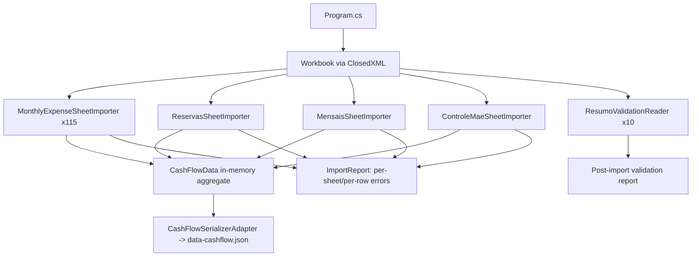

# F10. Historical Spreadsheet Import

## 1. Technical Overview

**What:** A standalone, one-time console tool that reads the local `Despesas.xlsx` workbook and populates a freshly-emptied `data-cashflow.json` with 9 years of history (February 2017 - 2026, 115 monthly tabs) across every legacy layout, plus the Reservas, Mensais, and Controle mae sheets, producing a per-sheet/per-row error report and a Resumo/Year validation report rather than aborting on any single unparseable sheet or row.

**Why:** This is the one-time migration that lets 9 years of hand-maintained, format-drifting spreadsheet history become queryable inside the app, so the spreadsheet can be fully retired as source of truth.

**Scope:**
- Included: monthly expense-tab parsing (11-18 columns, tolerant of the header-label swap between eras); the E-column payment-source tag; Reserva-category expenses; the Reservas sheet's per-bucket ledger; the Mensais sheet's Brasil/UK templates plus the current month's instance; the Controle mae ledger (tolerating pre-2019 single-currency rows); Resumo/Year totals read for post-import validation against F09's computed output; a per-sheet/per-row error report.
- Excluded: per-transaction credit-card attribution for historical months (the source data has none — see Technical Decisions; Jul2026/Ago2026 are the exception, see below); recurring/scheduled sync (this is a single manual run); any UI.

## 2. Architecture Impact

**Affected components:**
- `Integrations/CashFlowSpreadsheetImport/` — new console project: `Financial.CashFlow.Infrastructure.Integrations.CashFlowSpreadsheetImport`
  - `Program.cs` — entry point: opens the workbook, builds a fresh `CashFlowData`, runs each importer, writes `data-cashflow.json`, prints the error/validation report
  - `SheetImporters/MonthlyExpenseSheetImporter.cs` — parses one `MonYYYY` tab into `Expense` entities
  - `SheetImporters/ReservasSheetImporter.cs` — parses the single continuous Reservas sheet into `ReserveMovement` entities
  - `SheetImporters/MensaisSheetImporter.cs` — parses the single continuous Mensais sheet into `RecurringBillTemplate` + one current-month `RecurringBillInstance` per template
  - `SheetImporters/ControleMaeSheetImporter.cs` — parses the single continuous Controle mae sheet into `MaeLedgerEntry` entities
  - `SheetImporters/ResumoValidationReader.cs` — reads each `Resumo{Year}` sheet's totals/diff blocks for post-import comparison against F09's computed output
  - `Parsing/ColumnResolver.cs` — locates the category/description columns per sheet by value-cardinality (reusing F02's proven technique), tolerant of the "Quem"/"Motivo" header-label swap between eras
  - `Parsing/RawLabelFallback.cs` — wraps an unresolved category/payment-source/card label so it's preserved and reported rather than dropped
  - `Reporting/ImportReport.cs` — accumulates per-sheet success/skip/error entries and prints the final summary
- No changes to `Financial.CashFlow.Domain`/`.Application` — the importer writes through `Financial.CashFlow.Infrastructure`'s existing repository and Domain factories directly (see Technical Decisions)

## 3. Technical Decisions

| Decision | Chosen Approach | Alternative Considered | Trade-off |
|----------|-----------------|-------------------------|-----------|
| Excel library | `ClosedXML` (new NuGet dependency, MIT license) | `DocumentFormat.OpenXml` (more verbose, lower-level); `EPPlus` (commercial licensing concerns beyond noncommercial use) | ClosedXML's cell-by-cell API (`ws.Cell(row, col).Value`) matches this importer's column-position-tolerant reading style with the least code, and MIT licensing has no restriction for this personal project. |
| Write mechanism | Direct writes to Domain entities via `ICashFlowRepository`/`CashFlowJsonRepository`, bypassing Application-layer services entirely | Call `ExpenseService.AddExpenseAsync`, `ReserveService.PostIncomeSplitAsync`, `ControleMaeService.CreateEntryAsync`, etc. per row | Matches the existing `ImportGoogleSpreadSheets` precedent (writes through Infrastructure, not live Application services). Required anyway: `PostIncomeSplitAsync` always posts a rigid 5-bucket split that doesn't match a Reservas row recording a single-bucket withdrawal, and `ControleMaeService.CreateEntryAsync` always triggers a live FX lookup — wrong for historical data that must preserve its own recorded rate. User confirmed via interview. |
| Controle mae — unparseable date | Skip the row; record it (with its raw description text) in the error report | Default to the 1st of an inferred month/year | No fabricated date ever enters the ledger; the user can review the flagged rows and re-enter them manually with the correct date. User confirmed via interview. |
| Controle mae — historical currency values | Preserve the sheet's own recorded BRL/GBP values directly on `MaeLedgerEntry.Create(...)`; never call the live Frankfurter lookup during import | Recompute via F07's live rate lookup for every row's date | Keeps the exact historical rate that was actually used at the time (which can differ from today's Frankfurter data for that date) and avoids 100+ live network calls during a one-time bulk import. User confirmed via interview. |
| Reservas sheet row → movement mapping | For each row, create one `ReserveMovement` per populated bucket column (`Dz`→`Dizimo`, `Investimento`→`Investimento`, `Viagem`→`HouseTreats`, `Ariana`→`Ariana`, `Gleison`→`Gleison`), using that row's date/description — regardless of whether the row is an income-split deposit (all 5 columns populated, proportioned per F05's tithe-then-thirds/sixths math) or a single-bucket withdrawal (one column populated, often negative) | Detect "is this an income split?" and special-case it into a synthetic `PostIncomeSplitAsync`-shaped write | Reading whatever bucket cells are actually populated per row and writing exactly that reconstructs every bucket's correct running balance either way, with no need to reverse-engineer which historical rows were "splits" vs "withdrawals" — confirmed against the real sheet: rows with all 5 columns populated do sum to the exact F05 split math, and rows with one populated column are always a single-bucket movement. |
| Mensais historical fidelity | Create one `RecurringBillTemplate` per Brasil/UK row (carrying NIT/minimum-wage where a Brasil row has them) plus exactly one `RecurringBillInstance` — for the month stamped once at the top of the sheet — carrying that row's actual status/value. No instances are fabricated for the other 114 months. | Backfill instances for every historical month using each template's current value/status | The Mensais sheet is a live current-state snapshot, not a historical ledger — the month is stamped once at the top, not per row, so there is no historical per-month status data to import. F06's existing lazy generation already creates an honest `Unset` instance the first time any other month is viewed. User confirmed via interview. |
| Credit-card per-transaction attribution | Not imported for historical months — no `Expense.CardTag` is set, and no `CardStatement` rows are pre-populated; F04's existing lazy generation creates all 5 as unpaid/zero the first time any imported month's card view is opened. Jul2026 and Ago2026 are the exception: those tabs group card charges into fixed-row sections (`MonthlyExpenseSheetImporter.CardSectionStartRows` — Barclays Platinum Visa 8003 from row 129, Barclays Platinum Visa 6007 from row 142, Chase Master 4023 from row 205, BaAmex from row 226 to the end of the sheet), so rows in those two sheets are tagged by row position whenever column E has no explicit "T"/"C" tag (which still wins when present) | Approximate an attribution using the monthly J-K "Ajuste" aggregate figure; or apply the fixed-row rule to every month regardless of layout | The source spreadsheet never recorded which of the 5 cards a given expense used at the transaction level for historical months — only a monthly aggregate adjustment figure exists there, which cannot be decomposed without fabrication, so those stay honestly empty (matching the Mensais decision's "no fabricated history" principle). Jul2026/Ago2026 are genuinely laid out differently in the source (confirmed by the user), so the fixed-row rule is scoped to exactly those two sheets rather than assumed for all current/future months — extend `MonthsWithFixedCardSections` once later months are confirmed to follow the same layout. |
| Category/payment-source column identification | Reuse F02's proven technique: identify the category vs. description column by which one has fewer distinct values matching a known `Category` name, rather than trusting the "Quem"/"Motivo" header text (which swaps meaning between the 2017 and 2019+ eras) | Hardcode column positions per era | Already validated during F02 against the real workbook; the header-label swap is a confirmed data-quality quirk in the source, not something a fixed column mapping can solve safely across all 115 tabs. |
| Re-runnability | The importer always starts from a brand-new, empty `CashFlowData.Create()` and overwrites `data-cashflow.json` wholesale — it never loads and appends to an existing file | Merge/upsert against existing data | Matches the PRD's explicit "re-runnable from scratch" requirement exactly, and avoids any duplicate-detection logic a merge would otherwise need. |
| Resumo/Year validation | After the full import, compute F09's yearly category totals and investment-account diffs from the freshly-imported data and compare them against each `Resumo{Year}` sheet's own totals/diff blocks, printing any mismatches as warnings in the final report — this never blocks or fails the import | Treat any mismatch as a hard error | The PRD's Error Handling section only requires per-sheet/per-row errors to not abort the run; Resumo validation is explicitly for confidence-checking the importer's own correctness, not a gate on historical data being imported. |

## 4. Component Overview

**Backend (new console project):**

| File Path | New/Modified | Purpose | Key Responsibilities |
|-----------|--------------|---------|-----------------------|
| `Integrations/CashFlowSpreadsheetImport/CashFlowSpreadsheetImport.csproj` | New | Console project | .NET 10 console app; references `Financial.CashFlow.Domain`, `Financial.CashFlow.Infrastructure`, `Financial.Shared.Infrastructure`, `ClosedXML` |
| `Integrations/CashFlowSpreadsheetImport/Program.cs` | New | Entry point | Resolves the workbook path (arg or default), builds a fresh `CashFlowData`, invokes every sheet importer, serializes via the existing `CashFlowSerializerAdapter`/`LocalJsonStorage`, prints the final `ImportReport` |
| `Integrations/CashFlowSpreadsheetImport/SheetImporters/MonthlyExpenseSheetImporter.cs` | New | Monthly tab parser | For each of the 115 `MonYYYY` tabs: resolves category/description columns via `ColumnResolver`, reads the E-column payment-source tag, creates one `Expense` per row (including `Category.Reserva` rows, which count toward category totals like any other expense) |
| `Integrations/CashFlowSpreadsheetImport/SheetImporters/ReservasSheetImporter.cs` | New | Reserve ledger parser | Reads the single continuous Reservas sheet; creates one `ReserveMovement` per populated bucket column per row |
| `Integrations/CashFlowSpreadsheetImport/SheetImporters/MensaisSheetImporter.cs` | New | Recurring-bill parser | Reads the Brasil/UK section labels and the month stamped at the top; creates templates and the single current-month instance per template |
| `Integrations/CashFlowSpreadsheetImport/SheetImporters/ControleMaeSheetImporter.cs` | New | Family ledger parser | Extracts a date from each row's free-text description (skipping + reporting when none can be confidently found); creates `MaeLedgerEntry` with the sheet's own BRL/GBP values preserved as-is |
| `Integrations/CashFlowSpreadsheetImport/SheetImporters/ResumoValidationReader.cs` | New | Validation-only reader | Reads each `Resumo{Year}` sheet's category-totals and investment-account rows/diff blocks; does not write any CashFlow data itself |
| `Integrations/CashFlowSpreadsheetImport/Parsing/ColumnResolver.cs` | New | Column identification | Given a sheet's header row and sample data rows, determines which column holds the category (matches known `Category` names) vs. the free-text description, tolerant of the header-label swap |
| `Integrations/CashFlowSpreadsheetImport/Parsing/RawLabelFallback.cs` | New | Unresolved-label wrapper | Represents a category/payment-source/card label that didn't match any known enum value, preserving the raw text for both the imported record and the error report |
| `Integrations/CashFlowSpreadsheetImport/Reporting/ImportReport.cs` | New | Report accumulator | Collects per-sheet status (imported/skipped-with-error) and per-row flagged issues; prints a final console summary and the full detail to a text file alongside `data-cashflow.json` |

## 5. API Contracts

Not applicable — this is a standalone console tool with no HTTP surface, matching F10's Experience ("a manual, one-time run... not a recurring sync").

## 6. Data Model

No new persisted schema — every entity written by this importer already exists (`Expense`, `ReserveMovement`, `RecurringBillTemplate`/`RecurringBillInstance`, `MaeLedgerEntry` from F03/F05/F06/F07). `InvestmentSnapshot` (F08) is populated for the 11 canonical accounts from each `Resumo{Year}` sheet's monthly columns (rows 29-39) during the same run, since that is the sheet the project's own context notes confirm as the canonical source for the account list and values — not a separate importer file, but a straightforward addition inside `ResumoValidationReader`'s read pass (it both validates and, for `InvestmentSnapshot` specifically, is the only source of that data, so it also writes).

**Output:** a fully populated `data-cashflow.json`, structurally identical to the shape already produced incrementally by F03/F05/F06/F07/F08's own services — this importer's writes go through the same `CashFlowData` aggregate and `CashFlowSerializerAdapter`/`CashFlowTypeInfoResolver` already exercised by every other CashFlow feature's tests.

## 7. Testing Strategy

| Test File | Test Type | Target | Coverage Goal |
|-----------|-----------|--------|----------------|
| `Tests/Financial.CashFlow.Infrastructure.Integrations.CashFlowSpreadsheetImport.Tests/ColumnResolverTests.cs` | Unit | `ColumnResolver` | Correctly identifies the category column regardless of "Quem"/"Motivo" header order, using synthetic rows shaped like both the 2017 and 2019+ eras |
| `.../MonthlyExpenseSheetImporterTests.cs` | Unit | `MonthlyExpenseSheetImporter` | Parses a synthetic 11-column (2017-shaped) and a synthetic 17-column (2026-shaped) sheet into the expected `Expense` set, including the E-column payment-source tag and an unrecognized category falling back to `RawLabelFallback` and being reported, not dropped |
| `.../ReservasSheetImporterTests.cs` | Unit | `ReservasSheetImporter` | A row with all 5 bucket columns populated produces 5 `ReserveMovement`s; a row with a single populated column produces exactly 1; a row's description/date are preserved on every resulting movement |
| `.../MensaisSheetImporterTests.cs` | Unit | `MensaisSheetImporter` | Produces one template per Brasil/UK row (with NIT/minimum-wage carried through where present) and exactly one instance per template, for the month stamped at the top of the sheet only |
| `.../ControleMaeSheetImporterTests.cs` | Unit | `ControleMaeSheetImporter` | A row with an extractable date and both currencies imports with those exact values (no FX call made); a row with no extractable date is skipped and appears in the report, not silently dropped |
| `.../ImportReportTests.cs` | Unit | `ImportReport` | Accumulates per-sheet and per-row entries and renders a summary listing every sheet's outcome, with none omitted |
| `.../ProgramIntegrationTests.cs` (or a manual run, see Phase 5) | Integration | Full pipeline | Running the importer against the real local `Despesas.xlsx` produces a `data-cashflow.json` that round-trips through the existing `CashFlowSerializerAdapter`, and re-running it produces byte-for-byte-equivalent collection counts |

**Acceptance tests (from PRD Section 9, F10):**
- Every one of the 115 monthly tabs is either successfully imported or reported with a specific per-sheet error, with none silently skipped — `ImportReportTests` + a manual full run against the real workbook (Phase 5)
- No tab from `Julho 2014` through `Janeiro 2017` is read or imported — `Program.cs`'s sheet-selection logic only enumerates names matching the `MonYYYY` (Feb 2017-2026) pattern; verified by asserting the full-run's imported sheet list excludes every full-Portuguese-name tab
- A row with an unrecognized category or payment-source tag is imported with its raw label preserved and flagged in the error report — `MonthlyExpenseSheetImporterTests`, `RawLabelFallback`
- Re-running the import against a freshly emptied `data-cashflow.json` produces the same result as the first run — manual full run against the real workbook, executed twice, diffing the two output files (Phase 5)

**Cross-Feature Integration tests (from PRD Section 9, F10 as consumer):**
- "F10's historical import correctly populates every one of F02's six storage collections, matching the shapes defined by F03, F04, F05, F06, F07, and F08" — covered by the per-importer unit tests above (each writes the exact entity type F03/F05/F06/F07/F08 define) plus the full manual run's round-trip through `CashFlowSerializerAdapter`
