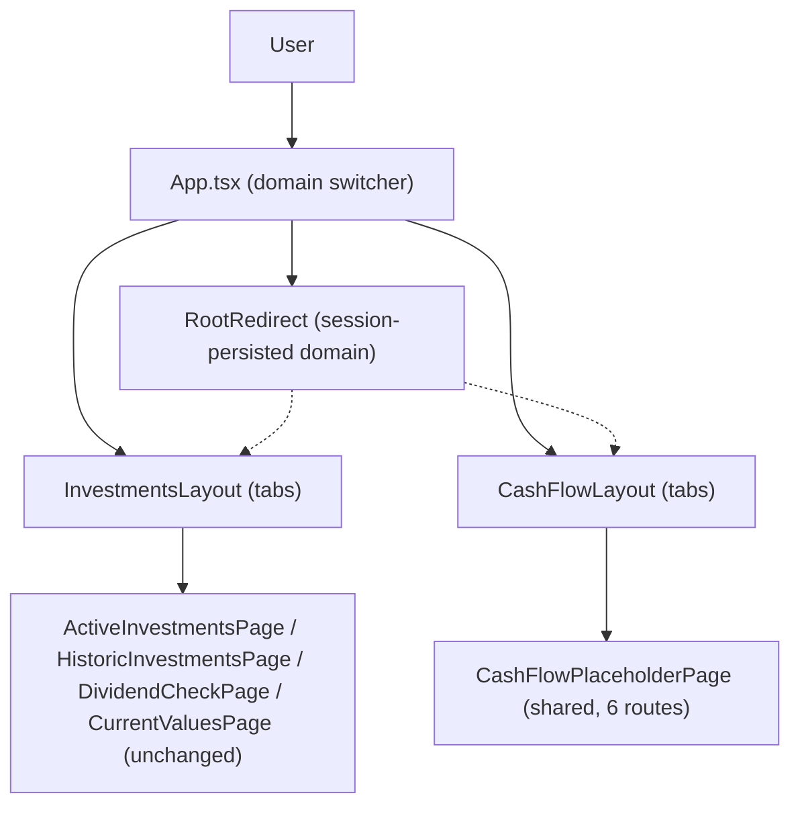

# F11. Web — App Shell: Investments/CashFlow Domain Switcher

## 1. Technical Overview

**What:** Restructure the Financial.Web app shell to add a top-level Investments/CashFlow domain switcher above the existing tab navigation, nest the 4 existing Investments routes under `/investments/*` (unchanged behavior), and stand up 6 placeholder `/cashflow/*` routes (Monthly, Reserva, Mensais, Controle Mae, Investment Snapshots, Yearly Summary) ready for F12–F17 to fill in.

**Why:** Every subsequent Web feature in this PRD (F12–F17) needs a place to render nested inside a "CashFlow" selection, and the existing Investments tabs need to keep working exactly as they do today once nested inside an "Investments" selection. This is a routing/shell restructure — no new API calls, no business logic.

**Scope:**
- Included: two-tier navigation (domain switcher + per-domain tabs), route restructuring for the 4 existing Investments pages, 6 new placeholder CashFlow routes sharing one placeholder component, sessionStorage-backed "last selected domain" persistence, root-path redirect logic.
- Excluded: any real CashFlow tab content (Monthly/Reserva/Mensais/Controle Mae/Investment Snapshots/Yearly Summary — built by F12–F17), any change to Investments pages' internal behavior, any backend/API change, WPF app changes (CashFlow ships Web-only per PRD).

## 2. Architecture Impact

**Affected components:**
- `src/App.tsx` — becomes the top-level shell: renders only the domain switcher (Investments/CashFlow) + `<Outlet/>`; the existing tab-row nav moves out
- `src/main.tsx` — route tree restructured into nested `/investments/*` and `/cashflow/*` subtrees
- `src/components/layout/InvestmentsLayout.tsx` — new; renders the 4 existing Investments tab links + `<Outlet/>`
- `src/components/layout/CashFlowLayout.tsx` — new; renders the 6 CashFlow tab links + `<Outlet/>`
- `src/pages/cashflow/CashFlowPlaceholderPage.tsx` — new; single reusable "coming soon" page, parameterized by title
- `src/pages/RootRedirect.tsx` — new; reads the persisted domain and redirects `/` accordingly
- `src/utils/domainStorage.ts` — new; sessionStorage read/write helpers for the selected domain
- `src/App.css` — updated for the two-tier nav; new co-located CSS for the 2 layout components and the placeholder page
- Existing `pages/ActiveInvestmentsPage.tsx`, `HistoricInvestmentsPage.tsx`, `DividendCheckPage.tsx`, `CurrentValuesPage.tsx` — unchanged internally, only reachable via a new URL

## 3. Technical Decisions

| Decision | Chosen Approach | Alternative Considered | Trade-off |
|----------|-----------------|-------------------------|-----------|
| URL structure | Nest existing Investments routes under `/investments/*` (e.g. `/active-investments` → `/investments/active-investments`), CashFlow under `/cashflow/*` | Keep Investments paths exactly as-is, add only `/cashflow/*` | Nesting makes the domain switcher structurally reflected in the URL for both domains symmetrically (matches "one of two symmetric bounded contexts" framing from F01); accepted cost is that the 4 existing Investments URLs change (no bookmarks/external links exist yet since this is a personal, unreleased app) |
| Last-selected-domain persistence | `sessionStorage` key storing `"investments"` \| `"cashflow"`, written whenever the current path is under `/investments` or `/cashflow`; `/` redirects to the stored domain's first tab, defaulting to Investments when unset | No persistence — rely on nested routing alone | Nested routing alone only prevents domain-reset when switching tabs *within* a domain; it doesn't cover reloading the app or revisiting `/` after using CashFlow, which is what "remembered for the session" describes as a distinct capability. `sessionStorage` (not `localStorage`) matches "for the session" — cleared when the tab closes. |
| CashFlow placeholder content | One shared `CashFlowPlaceholderPage` component taking a `title` prop, referenced directly as each of the 6 routes' `element` | 6 separate stub page files (one per future feature) | Six routes pointing at the same component means F12–F17 each swap out one `element` for their real page component later — no nav/routing file needs restructuring when those land. Matches the "no over-engineering" project standard. |
| Nav layout | Two-tier: `App.tsx` renders only the 2-option domain switcher; each domain's own tab row moves into its layout component (`InvestmentsLayout`/`CashFlowLayout`) | Single nav row with domain links visually grouped alongside tab links | Matches the PRD's Experience text ("picks Investments or CashFlow... only sees that domain's own tabs") — domain-switching and tab-switching read as two distinct, separately-scoped actions, and the CSS/test precedent already separates "top nav" from "in-page tabs" (`DetailPanel`'s `.detail-tabs`). |
| Domain-tracking mechanism | A `useEffect` in `App.tsx` (via `useLocation`) writes the current domain to `sessionStorage` on every route change under `/investments` or `/cashflow` | Only write on domain-switcher click | Writing on every navigation (not just switcher clicks) also correctly persists the domain when a user deep-links directly into a CashFlow or Investments sub-route, not only when they use the switcher. |

## 4. Component Overview

**Frontend:**

| File Path | New/Modified | Purpose | Key Responsibilities |
|-----------|--------------|---------|-----------------------|
| `src/App.tsx` | Modified | Top-level shell | Renders the 2-option domain switcher (`NavLink` to `/investments`, `/cashflow`); persists current domain to sessionStorage on route change via `useLocation`/`useEffect`; renders `<Outlet/>` |
| `src/App.css` | Modified | Shell styling | New `.app__domain-switcher` / `.app__domain-link` classes (BEM-ish, matching existing `.app__nav` convention); existing `.app__nav` styles move to the layout components' CSS |
| `src/main.tsx` | Modified | Route tree | Nests the 4 Investments routes under `path="investments"` + `InvestmentsLayout`, adds 6 CashFlow routes under `path="cashflow"` + `CashFlowLayout`, adds `index` route rendering `RootRedirect`, keeps the `*` "Page not found" catch-all |
| `src/components/layout/InvestmentsLayout.tsx` | New | Investments tab nav | Renders the 4 existing tab `NavLink`s (Active Investments, Historic Investments, Shares Dividend Check, Read Assets Current Values) + `<Outlet/>`; visually/structurally identical to today's `App.tsx` nav row |
| `src/components/layout/InvestmentsLayout.css` | New | Tab styling | Reuses the existing `.app__nav` class names/rules moved from `App.css` |
| `src/components/layout/CashFlowLayout.tsx` | New | CashFlow tab nav | Renders the 6 CashFlow tab `NavLink`s (Monthly, Reserva, Mensais, Controle Mae, Investment Snapshots, Yearly Summary) + `<Outlet/>` |
| `src/components/layout/CashFlowLayout.css` | New | Tab styling | Same visual pattern as `InvestmentsLayout.css` |
| `src/pages/cashflow/CashFlowPlaceholderPage.tsx` | New | Shared CashFlow placeholder | Accepts a `title: string` prop; renders a heading with the title and a "coming soon" message |
| `src/pages/cashflow/CashFlowPlaceholderPage.css` | New | Placeholder styling | Minimal centered placeholder styling |
| `src/pages/RootRedirect.tsx` | New | Root path redirect | Reads the persisted domain via `domainStorage`, renders `<Navigate to="/investments/active-investments" replace/>` or `<Navigate to="/cashflow/monthly" replace/>` (default: investments) |
| `src/utils/domainStorage.ts` | New | sessionStorage helper | `getStoredDomain(): 'investments' \| 'cashflow' \| null` and `setStoredDomain(domain)`; single sessionStorage key constant, defensive try/catch around `sessionStorage` access (private browsing can throw) |

**No Backend/Database changes** — this feature is Web-frontend-only.

## 5. API Contracts

N/A — no new or modified HTTP endpoints; the existing Investments pages' API calls are unaffected.

## 6. Data Model

N/A — no persisted data changes. `sessionStorage` is browser-local UI state, not part of any data model.

## 7. Testing Strategy

| Test File | Test Type | Target | Coverage Goal |
|-----------|-----------|--------|----------------|
| `src/App.test.tsx` (existing, updated) | Unit/Integration | `App.tsx` domain switcher | Renders exactly 2 domain options; clicking each switches to that domain's default route; active domain link gets the `active` class |
| `src/components/layout/__tests__/InvestmentsLayout.test.tsx` | Unit/Integration | `InvestmentsLayout` | Renders the 4 existing tab links; clicking a tab renders its page via `Outlet`; existing Investments behavior unchanged when reached through the new nested path |
| `src/components/layout/__tests__/CashFlowLayout.test.tsx` | Unit/Integration | `CashFlowLayout` | Renders exactly the 6 CashFlow tab links in order (Monthly, Reserva, Mensais, Controle Mae, Investment Snapshots, Yearly Summary) |
| `src/pages/cashflow/__tests__/CashFlowPlaceholderPage.test.tsx` | Unit | `CashFlowPlaceholderPage` | Renders the given `title` prop and a "coming soon" message |
| `src/pages/__tests__/RootRedirect.test.tsx` | Unit | `RootRedirect` | Redirects to `/investments/active-investments` when no stored domain; redirects to `/cashflow/monthly` when `"cashflow"` is stored |
| `src/utils/domainStorage.test.ts` | Unit | `domainStorage` | Round-trips `get`/`setStoredDomain`; returns `null` when unset; does not throw when `sessionStorage` is unavailable |

**Acceptance tests (from PRD Section 9, F11):**
- The top-level switcher shows exactly 2 options: Investments and CashFlow (`App.test.tsx`)
- Selecting Investments shows only the existing Investments tabs, unchanged in behavior (`InvestmentsLayout.test.tsx`, existing `pages/__tests__/*` continue to pass unmodified against their page components)
- Selecting CashFlow shows only the 6 CashFlow tabs (Monthly, Reserva, Mensais, Controle Mae, Investment Snapshots, Yearly Summary) (`CashFlowLayout.test.tsx`)

**Cross-Feature Integration tests (from PRD Section 9, deferred):**
- "F12's Web Monthly View... its Investments-domain content is correctly scoped by F11's domain switcher" — not testable until F12 exists; F11 only guarantees the `/cashflow/monthly` route and layout scoping are in place for F12 to build into.
- "F13, F14, F15, and F16 each correctly display data from F05, F06, F07, and F08 respectively, all nested inside F11's CashFlow selection" — not testable until those features exist; F11 only guarantees the 6 CashFlow routes exist nested under `CashFlowLayout`.
