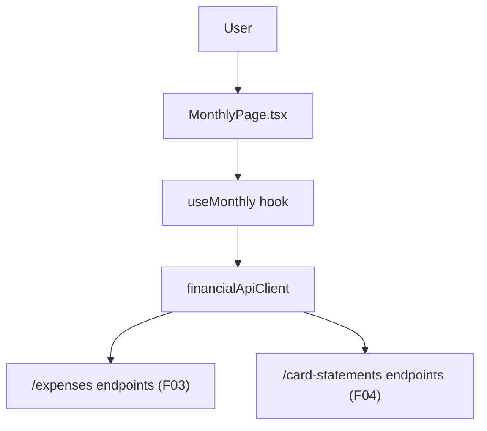

## 1. Technical Overview

**What:** A new "Monthly" view in the CashFlow web app (`/cashflow/monthly`, currently a placeholder) that shows a selected month's expense list, per-category totals, and all 5 credit cards' outstanding totals and combined adjustment figure together, mirroring the single monthly tab the source spreadsheet already presents. Supports creating, editing, and deleting an expense, and marking a card statement paid, all from this one view.

**Why:** F03 (Expense CRUD) and F04 (per-card outstanding totals / adjustment figure) are already fully implemented and tested in the backend, but have no web surface yet. This feature is a Presentation-layer-only addition: it wires the existing `/expenses` and `/card-statements` API endpoints into the React web app using the exact client/hook/page pattern already established by F13-F16 (Reserva, Mensais, Controle Mae, Investment Snapshots).

**Scope:**
- Included: month-scoped expense list (chronological), a per-category totals summary, a per-card outstanding-totals summary with a combined adjustment figure, inline expense create/edit/delete, and a "mark statement paid" action per card.
- Excluded: any backend change (F03/F04 already provide everything needed), CSV/bulk import, expense search/filtering beyond the selected month, category/payment-source management (both are fixed enums already defined in Domain).

## 2. Architecture Impact

**Affected components:**
- `Financial.Web/src/api/types.ts` — add DTO types for `Expense`, `CategoryTotal`, `CardStatement`, and their create/update request shapes
- `Financial.Web/src/api/financialApiClient.ts` — add 7 client methods wrapping the existing `/expenses` and `/card-statements` endpoints
- `Financial.Web/src/hooks/useMonthly.ts` (new) — month-scoped state, fetch-on-mount, create/edit/delete expense, mark-paid actions
- `Financial.Web/src/pages/MonthlyPage.tsx` + `.css` (new) — replaces the `CashFlowPlaceholderPage title="Monthly"` placeholder route
- `Financial.Web/src/main.tsx` — swap the placeholder route for `<MonthlyPage />`

No Domain, Application, or Infrastructure changes — F03's `ExpensesController`/`IExpenseService` and F04's `CardStatementsController`/`ICardStatementService` already expose everything this view needs.

## 3. Technical Decisions

| Decision | Chosen Approach | Alternative Considered | Trade-off |
|----------|-----------------|-------------------------|-----------|
| Expense list layout | A per-category totals table at the top, a per-card outstanding-totals table with the combined adjustment figure, then a flat chronological expense list below (each row editable/deletable inline) plus an inline "add expense" form | Nest the expense list itself inside per-category collapsible sections | The source spreadsheet's own monthly tab (per the PRD's Experience text, "as in today's single monthly tab") shows category totals as a compact summary block separate from the raw transaction list, not the list itself split into per-category sections. Matches existing precedent from F14's Brasil/UK grouped *tables* — here the "grouping" the PRD asks for is the totals summary, not the list. |
| Combined adjustment figure | Computed client-side as the sum of all 5 `CardStatementDTO.OutstandingTotal` values returned by `GET /card-statements/{year}/{month}` | Add a new backend endpoint/field for a pre-computed adjustment total | The PRD's own Provides text states plainly "the sum across all 5 cards forms the month's adjustment figure" — `MarkStatementPaidAsync` already zeroes a paid card's `OutstandingTotal`, so a client-side sum is always correct with no new backend surface needed. |
| Optional card tag on create/edit | The create and edit expense forms include an optional "Card" select (blank = none, or one of the 5 `CreditCard` enum values) alongside the required Category/PaymentSource selects | Omit card tagging from the UI entirely, relying on some other mechanism to set `CardTag` | `Expense.CardTag` is how a charge feeds F04's per-card outstanding total at all going forward (per PRD's cross-feature AC, "A card tag on an F03 expense correctly feeds F04's per-card outstanding total") — without it in this UI there would be no way to ever tag a new expense to a card through the app. |
| Delete confirmation | Use `window.confirm('Delete this expense?')` before calling `DELETE /expenses/{id}` | A custom confirmation modal component | Matches the exact pattern already used by `useTransactions.ts`'s `deleteTransaction` — no new UI primitive needed for a single, low-frequency destructive action in a personal single-user app. |

## 4. Component Overview

**Frontend:**

| File Path | New/Modified | Purpose | Key Responsibilities |
|-----------|--------------|---------|-----------------------|
| `Financial.Web/src/api/types.ts` | Modified | DTO types | Add `ExpenseDto`, `CreateExpenseDto`, `UpdateExpenseDto`, `CategoryTotalDto`, `CardStatementDto` matching the backend DTOs field-for-field |
| `Financial.Web/src/api/financialApiClient.ts` | Modified | API client | Add `getExpensesByMonth`, `getCategoryTotalsByMonth`, `createExpense`, `updateExpense`, `deleteExpense`, `getCardStatementsByMonth`, `markCardStatementPaid` |
| `Financial.Web/src/hooks/useMonthly.ts` | New | State management | Month selection (default current month), fetch expenses/category-totals/card-statements on mount and after every mutation, inline create-expense form state, inline edit-expense-by-id state, delete-with-confirm, mark-paid-by-id |
| `Financial.Web/src/pages/MonthlyPage.tsx` | New | Presentational page | Month picker, category-totals table, card-statements table with combined adjustment figure and per-card "Mark Paid" buttons, expense list table with inline add row and per-row edit/delete |
| `Financial.Web/src/pages/MonthlyPage.css` | New | Page styling | Follows the existing `*Page.css` + shared `data-table.css` conventions used by F13-F16 |
| `Financial.Web/src/main.tsx` | Modified | Routing | Replace `<Route path="monthly" element={<CashFlowPlaceholderPage title="Monthly" />} />` with `<MonthlyPage />` |

## 5. API Contracts

All 7 endpoints below already exist and are already tested (F03/F04); this feature only adds a typed web client wrapper around them, with no backend modification.

**Endpoint: Get Expenses by Month**
- **Method:** GET
- **Path:** `/expenses/month/{year}/{month}`
- **Response (200):** `ExpenseDto[]` — `{ id, date, description, value, category, paymentSource, cardTag }`

**Endpoint: Get Category Totals by Month**
- **Method:** GET
- **Path:** `/expenses/month/{year}/{month}/category-totals`
- **Response (200):** `CategoryTotalDto[]` — `{ category, totalValue }`

**Endpoint: Create Expense**
- **Method:** POST
- **Path:** `/expenses`
- **Request:** `{ date, description, value, category, paymentSource, cardTag? }`
- **Response (200):** `ExpenseDto`
- **Errors:** 400 (validation failure, e.g. unrecognized category/paymentSource/cardTag name)

**Endpoint: Update Expense**
- **Method:** PUT
- **Path:** `/expenses/{id}`
- **Request:** `{ date, description, value, category, paymentSource, cardTag? }`
- **Response (200):** `ExpenseDto`
- **Errors:** 400 (validation), 404 (expense not found)

**Endpoint: Delete Expense**
- **Method:** DELETE
- **Path:** `/expenses/{id}`
- **Response (200):** empty body
- **Errors:** 404 (expense not found)

**Endpoint: Get Card Statements for Month**
- **Method:** GET
- **Path:** `/card-statements/{year}/{month}`
- **Response (200):** `CardStatementDto[]` — `{ id, card, year, month, isPaid, outstandingTotal }`

**Endpoint: Mark Card Statement Paid**
- **Method:** POST
- **Path:** `/card-statements/{id}/mark-paid`
- **Response (200):** `CardStatementDto` (with `isPaid: true`, `outstandingTotal: 0`)
- **Errors:** 404 (statement not found)

## 6. Data Model

No new persisted schema. This feature reads and writes exclusively through F03's `Expense` entity and F04's `CardStatement`/lazy-instance mechanism, both already defined and tested.

## 7. Testing Strategy

| Test File | Test Type | Target | Coverage Goal |
|-----------|-----------|--------|----------------|
| `Financial.Web/src/hooks/useMonthly.test.ts` | Unit | `useMonthly` | Fetches expenses/category-totals/card-statements on mount and after month change; create/edit/delete expense re-fetch on success and surface errors on failure; mark-paid re-fetches card statements; delete requires confirmation |
| `Financial.Web/src/pages/__tests__/MonthlyPage.test.tsx` | Unit (RTL) | `MonthlyPage` | Renders loading/error/loaded states; renders category totals, card statements with combined adjustment figure, and the expense list; submitting the add-expense form and editing/deleting a row call the corresponding hook actions; clicking "Mark Paid" calls the mark-paid action |

**Acceptance tests (from PRD Section 9, F12):**
- "The view shows the selected month's categorized expenses and all 5 cards' outstanding totals and combined adjustment figure together" — `MonthlyPage.test.tsx` asserting all three sections render from a single month fetch
- "An expense can be created, edited, and deleted from this view" — `useMonthly.test.ts` + `MonthlyPage.test.tsx` covering all three actions
- "A card statement can be marked paid from this view" — `useMonthly.test.ts` + `MonthlyPage.test.tsx` covering the mark-paid action

**Cross-Feature Integration tests (from PRD Section 9, F12 as consumer):**
- "F12's Web Monthly View correctly displays expense data from F03 and card data from F04, and its Investments-domain content is correctly scoped by F11's domain switcher" — covered by `MonthlyPage.test.tsx` (F03/F04 data rendering) plus the pre-existing `CashFlowLayout`/`App` routing tests (F11 scoping, unchanged by this feature)
