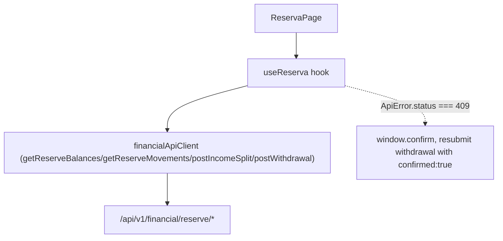

# F13. Web — Reserva View

## 1. Technical Overview

**What:** Replace F11's `/cashflow/reserva` placeholder with a real page that shows F05's 5 reserve bucket balances and full movement history, lets the user post a month's income to trigger the automated split, and lets the user record a manual bucket withdrawal (including the overdraft-confirmation flow).

**Why:** This is the first real CashFlow screen — it turns F05's backend-only Reserva pool into something the user actually interacts with, replacing the spreadsheet's manual Reserva bucket bookkeeping.

**Scope:**
- Included: bucket balances table (5 rows); movement history table; an income-split form (date + 6 numeric fields: Gleison/Ariana salary gross+net, Lottery, Dividendo/Juros); a withdrawal form (bucket, amount, date, description) with the overdraft-confirmation round trip; a reusable typed `ApiError` (carries HTTP status) so the client can distinguish "needs confirmation" (409) from a real validation error (400).
- Excluded: any other CashFlow view (F14/F15/F16); charts/visualizations (the PRD's Experience text describes tables, not charts, for this view — unlike the Investments-domain Credits/Transactions tabs).

## 2. Architecture Impact

**Affected components:**
- `Financial.Web/src/api/apiError.ts` — new: `ApiError` class carrying `status` alongside the message
- `Financial.Web/src/api/financialApiClient.ts` — modified: `request()` throws `ApiError` instead of a plain `Error`; new methods `getReserveBalances`, `getReserveMovements`, `postIncomeSplit`, `postWithdrawal`
- `Financial.Web/src/api/types.ts` — new: `ReserveBucketBalanceDto`, `ReserveMovementDto`, `IncomeSplitRequestDto`, `IncomeSplitResultDto`, `WithdrawalRequestDto`
- `Financial.Web/src/hooks/useReserva.ts` — new: page business logic
- `Financial.Web/src/pages/ReservaPage.tsx` — new: replaces `CashFlowPlaceholderPage` on the `/cashflow/reserva` route
- `Financial.Web/src/main.tsx` — modified: route swap

## 3. Technical Decisions

| Decision | Chosen Approach | Alternative Considered | Trade-off |
|----------|-----------------|-------------------------|-----------|
| 409 (overdraft) handling | Introduce a typed `ApiError` (message + HTTP `status`) thrown by the shared `request()` helper; `useReserva` checks `err.status === 409` to trigger a `window.confirm`-then-resubmit flow | Give `postWithdrawal` its own one-off fetch call outside the shared helper | The shared `request()` currently discards the status code entirely, so there's no way to special-case a single endpoint without it. A typed error is a small, reusable change any future endpoint can rely on for the same pattern, rather than duplicating fetch/parsing logic. User confirmed via interview. |
| Confirmation UX | Reuse the existing `window.confirm(...)` pattern already used by `useCredits`' delete action | A custom confirmation modal component | No confirmation-modal component exists yet in this codebase; introducing one for a single feature would be over-engineering for a personal app, and `window.confirm` is already the established pattern for "are you sure" actions here. |
| Refresh strategy after a successful action | Re-fetch both balances and movement history after a successful income split or withdrawal | Optimistically merge the returned result into local state | The PRD's Experience text ("immediately see the resulting split reflected in each bucket") is satisfied either way, but re-fetching guarantees the displayed balances always match the server's authoritative state (e.g. if a rollback happened server-side that the client wouldn't otherwise know about) — simpler and safer than hand-rolling a local merge for 5 buckets across 2 tables. |
| Component granularity | A single `ReservaPage` component (balances table + movement history table + both forms), backed by one `useReserva` hook | Split into separate `Tab`-style subcomponents like the Investments domain | The Investments domain's `Tab` components exist because multiple tabs render inside one shared `DetailPanel` for a selected tree node; CashFlow views are each a standalone routed page with no such shared container, so one page component per view matches F11's routing structure directly. |

## 4. Component Overview

**Frontend:**

| File Path | New/Modified | Purpose | Key Responsibilities |
|-----------|--------------|---------|-----------------------|
| `Financial.Web/src/api/apiError.ts` | New | Typed API error | `ApiError extends Error` with a `status: number` field |
| `Financial.Web/src/api/financialApiClient.ts` | Modified | HTTP client | `request()` throws `ApiError`; add `getReserveBalances()`, `getReserveMovements()`, `postIncomeSplit(request)`, `postWithdrawal(request)` |
| `Financial.Web/src/api/types.ts` | Modified | DTO types | `ReserveBucketBalanceDto { bucket, balance }`, `ReserveMovementDto { id, bucket, amount, date, description }`, `IncomeSplitRequestDto { date, gleisonSalaryGross, gleisonSalaryNet, arianaSalaryGross, arianaSalaryNet, lottery, dividendoJuros }`, `IncomeSplitResultDto { dizimo, investimento, houseTreats, ariana, gleison }`, `WithdrawalRequestDto { bucket, amount, date, description, confirmed }` |
| `Financial.Web/src/hooks/useReserva.ts` | New | Page business logic | Fetches balances + movements on mount; income-split form state/submit; withdrawal form state/submit with the 409-confirm-resubmit round trip; loading/error state matching `useCredits`' reducer pattern |
| `Financial.Web/src/pages/ReservaPage.tsx`, `ReservaPage.css` | New | Presentational page | Renders `LoadingState`/`ErrorState`, the 5-row balances table, the movement history table, and both forms, wired to `useReserva` |
| `Financial.Web/src/main.tsx` | Modified | Routing | `/cashflow/reserva` renders `ReservaPage` instead of `CashFlowPlaceholderPage` |

## 5. API Contracts

Consumes F05's existing endpoints unchanged (see F05's own spec for full request/response detail):

- `GET /api/v1/financial/reserve/balances` → `ReserveBucketBalanceDto[]` (always 5 rows)
- `GET /api/v1/financial/reserve/movements` → `ReserveMovementDto[]`
- `POST /api/v1/financial/reserve/income-split` (body: `IncomeSplitRequestDto`) → `IncomeSplitResultDto`; `400` on any negative income field
- `POST /api/v1/financial/reserve/withdrawals` (body: `WithdrawalRequestDto`) → `ReserveMovementDto`; `400` on a non-positive amount or unrecognized bucket; `409` when the withdrawal exceeds the bucket's balance and `confirmed` is `false`

No new backend endpoints — this feature is Web-only.

## 6. Data Model

No backend/persisted data model changes — this is a Web-only feature consuming F05's existing `data-cashflow.json`-backed endpoints.

## 7. Testing Strategy

| Test File | Test Type | Target | Coverage Goal |
|-----------|-----------|--------|----------------|
| `Financial.Web/src/api/financialApiClient.test.ts` | Unit | `financialApiClient` | New Reserva methods call the correct paths/methods/bodies; a non-2xx response throws `ApiError` with the correct `status` and message |
| `Financial.Web/src/hooks/useReserva.test.ts` | Unit | `useReserva` | Loads balances + movements on mount; income-split submit calls the endpoint and re-fetches on success, surfaces the backend's message on `400`; withdrawal submit re-fetches on success; a `409` response triggers the confirm-and-resubmit flow (mocking `window.confirm`), and declining the confirm does not resubmit |
| `Financial.Web/src/pages/ReservaPage.test.tsx` | Component | `ReservaPage` | Renders `LoadingState` while loading, `ErrorState` with retry on failure, the 5 balance rows and movement rows once loaded, and both forms are present and submittable |

**Acceptance tests (from PRD Section 9, F13):**
- The view shows all 5 bucket balances and their movement history — `ReservaPage.test.tsx`
- Entering a month's income fields immediately reflects the resulting split in each bucket's displayed balance — `useReserva.test.ts` (re-fetch-after-submit assertion), `ReservaPage.test.tsx`
