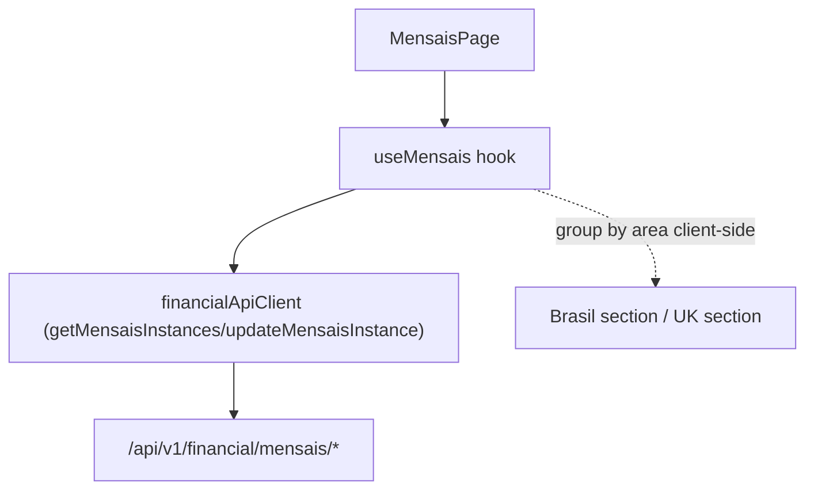

# F14. Web — Mensais View

## 1. Technical Overview

**What:** Replace F11's `/cashflow/mensais` placeholder with a real page that lets the user pick a month, shows that month's auto-generated recurring bill instances (F06) split into two grouped sections (Brasil/UK), and lets the user update a single instance's status or value inline.

**Why:** This turns F06's backend-only Mensais generation into the actual monthly workflow the user needs — see this month's bills as scheduled/paid, update them as bills clear.

**Scope:**
- Included: month picker (defaults to the current month); two grouped tables (Brasil/UK) built by client-side grouping of F06's flat instance list, matching F06's own spec decision that grouping is a Web-layer concern; inline per-row status/value editing.
- Excluded: template creation/management (no UI anywhere in the PRD for this — F06's template creation exists only to unblock testing ahead of F10); any other CashFlow view (F13/F15/F16).

## 2. Architecture Impact

**Affected components:**
- `Financial.Web/src/api/types.ts` — new: `RecurringBillInstanceDto`, `UpdateRecurringBillInstanceDto`
- `Financial.Web/src/api/financialApiClient.ts` — modified: new methods `getMensaisInstances(year, month)`, `updateMensaisInstance(id, request)`
- `Financial.Web/src/hooks/useMensais.ts` — new: page business logic
- `Financial.Web/src/pages/MensaisPage.tsx`, `MensaisPage.css` — new: replaces `CashFlowPlaceholderPage` on `/cashflow/mensais`
- `Financial.Web/src/main.tsx` — modified: route swap

## 3. Technical Decisions

| Decision | Chosen Approach | Alternative Considered | Trade-off |
|----------|-----------------|-------------------------|-----------|
| Month selection | A native `<input type="month">` bound to hook state, defaulting to the current calendar month on first load | A custom month-picker component | F13 introduced no month concept (Reserva has no per-month data); this is the first CashFlow view needing one. The native control needs no new dependency and matches this app's "no over-engineering" standard for a personal single-user tool. |
| Grouping | `useMensais` groups the flat `RecurringBillInstanceDto[]` returned by `GET .../mensais/{year}/{month}` into Brasil/UK client-side | Ask the backend to return pre-grouped data | Matches F06's own spec decision exactly: "grouping into Brasil/UK sections is a client-side concern for F14." No backend change needed. |
| Inline edit pattern | A single `editingId` (one row editable at a time), with per-row Edit/Save/Cancel — same shape as `useCredits`' existing inline-form pattern | Every row independently editable simultaneously | Matches the one established inline-edit precedent in this codebase (`CreditsTab`/`useCredits`) rather than inventing a new multi-row-editable-at-once pattern for a personal app with a handful of bills per month. |
| Refresh strategy after a successful update | Re-fetch the month's instances after a successful update | Locally patch the edited row in state | Matches F13's precedent (re-fetch keeps displayed state provably in sync with the server) and this list is small (a handful of bills per month), so the extra round trip is negligible. |

## 4. Component Overview

**Frontend:**

| File Path | New/Modified | Purpose | Key Responsibilities |
|-----------|--------------|---------|-----------------------|
| `Financial.Web/src/api/types.ts` | Modified | DTO types | `RecurringBillInstanceDto { id, templateId, year, month, dueDay, description, area, note, nitNumber, minimumWageValue, value, status }`, `UpdateRecurringBillInstanceDto { status, value }` |
| `Financial.Web/src/api/financialApiClient.ts` | Modified | HTTP client | `getMensaisInstances(year, month)`, `updateMensaisInstance(id, request)` |
| `Financial.Web/src/hooks/useMensais.ts` | New | Page business logic | Month/year state (defaults to current month); fetches instances on month change; groups into Brasil/UK; per-row edit state (`editingId`, `editStatus`, `editValue`); submit/re-fetch; loading/error state matching `useReserva`'s reducer pattern |
| `Financial.Web/src/pages/MensaisPage.tsx`, `MensaisPage.css` | New | Presentational page | Month picker, `LoadingState`/`ErrorState`, two grouped tables (Brasil/UK) each showing due day/description/value/status, inline edit controls per row |
| `Financial.Web/src/main.tsx` | Modified | Routing | `/cashflow/mensais` renders `MensaisPage` instead of `CashFlowPlaceholderPage` |

## 5. API Contracts

Consumes F06's existing endpoints unchanged (see F06's own spec for full detail):

- `GET /api/v1/financial/mensais/{year}/{month}` → `RecurringBillInstanceDto[]` (generates on first call for that month)
- `PUT /api/v1/financial/mensais/instances/{id}` (body: `UpdateRecurringBillInstanceDto`) → `RecurringBillInstanceDto`; `400` on an unrecognized status, `404` on an unknown id

No new backend endpoints — this feature is Web-only.

## 6. Data Model

No backend/persisted data model changes — this is a Web-only feature consuming F06's existing `data-cashflow.json`-backed endpoints.

## 7. Testing Strategy

| Test File | Test Type | Target | Coverage Goal |
|-----------|-----------|--------|----------------|
| `Financial.Web/src/api/financialApiClient.test.ts` | Unit | `financialApiClient` | New Mensais methods call the correct paths/methods/bodies |
| `Financial.Web/src/hooks/useMensais.test.ts` | Unit | `useMensais` | Fetches instances for the default (current) month on mount; changing the month re-fetches for the new year/month; groups instances into Brasil/UK correctly; submitting an edit calls the update endpoint and re-fetches on success; a backend error is surfaced without crashing |
| `Financial.Web/src/pages/MensaisPage.test.tsx` | Component | `MensaisPage` | Renders `LoadingState`/`ErrorState`; renders Brasil and UK as two separate sections once loaded; editing a row's status/value and saving updates the displayed row |

**Acceptance tests (from PRD Section 9, F14):**
- The view shows Brasil and UK bills as two separate grouped sections for the selected month — `MensaisPage.test.tsx`
- A bill instance's status or value can be updated from this view without affecting other months — `useMensais.test.ts` (re-fetch-after-update assertion scoped to the selected month only), `MensaisPage.test.tsx`
