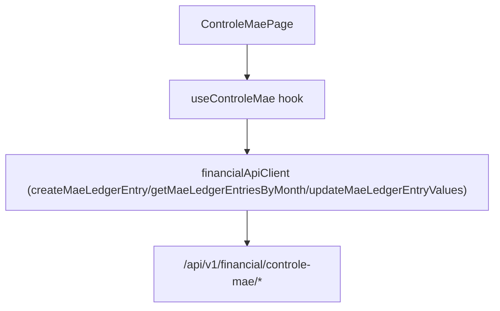

# F15. Web — Controle Mae View

## 1. Technical Overview

**What:** Replace F11's `/cashflow/controle-mae` placeholder with a real page that shows a selected month's mae ledger entries (F07) with both BRL and GBP values, lets the user create a new entry (entering one currency and getting the other auto-converted), and lets the user manually adjust either currency value on an existing entry.

**Why:** This turns F07's backend-only historical-rate lookup and ledger into the actual monthly family cash-flow workflow — enter an expense once, see both currencies, correct a fetched rate when it's wrong.

**Scope:**
- Included: month picker (defaults to the current month, reusing F14's pattern); chronological entry list showing both currencies, description, and note; a create-entry form (date, description, note, source currency, source value); inline editing of an existing entry's BRL/GBP values only, matching F07's own update scope.
- Excluded: editing an entry's date/description/note (F07's backend only supports a values-only update — see F07's own spec decision); any other CashFlow view (F13/F14/F16).

## 2. Architecture Impact

**Affected components:**
- `Financial.Web/src/api/types.ts` — new: `MaeLedgerEntryDto`, `CreateMaeLedgerEntryDto`, `UpdateMaeLedgerEntryValuesDto`
- `Financial.Web/src/api/financialApiClient.ts` — modified: new methods `createMaeLedgerEntry`, `getMaeLedgerEntriesByMonth`, `updateMaeLedgerEntryValues`
- `Financial.Web/src/hooks/useControleMae.ts` — new: page business logic
- `Financial.Web/src/pages/ControleMaePage.tsx`, `ControleMaePage.css` — new: replaces `CashFlowPlaceholderPage` on `/cashflow/controle-mae`
- `Financial.Web/src/main.tsx` — modified: route swap

## 3. Technical Decisions

| Decision | Chosen Approach | Alternative Considered | Trade-off |
|----------|-----------------|-------------------------|-----------|
| Month selection | Reuse F14's `<input type="month">` pattern, defaulting to the current month | A new/different picker | Consistent with the one precedent this app already has for a per-month CashFlow view; no reason to diverge. |
| Editable fields on an existing entry | Only `brlValue`/`gbpValue` are editable inline, matching F07's `UpdateEntryValuesAsync` exactly | Allow editing date/description/note too | F07's backend only ever supports a values-only update (its own spec explicitly scoped this to mirror the PRD's "manual override" capability) — there is no endpoint to edit anything else, so the UI can't offer it. |
| Create-entry currency input | A single "source value" field paired with a source-currency selector (BRL/GBP), matching F07's `CreateMaeLedgerEntryDTO` exactly; both currency values then display once the response returns (the other populated by the fetched rate, or blank if the lookup failed) | Two separate value inputs shown up front | Matches the PRD's Experience text exactly: "a user enters one currency value and a date, sees both currency values populate automatically" — a single entry field is what triggers the conversion; a second up-front field would misrepresent the one-value-in flow. |
| Refresh strategy after create/update | Re-fetch the month's entries after a successful create or update | Locally patch state | Same precedent as F13/F14 — keeps displayed data provably in sync with the server, and this list is small enough that the extra round trip is negligible. |

## 4. Component Overview

**Frontend:**

| File Path | New/Modified | Purpose | Key Responsibilities |
|-----------|--------------|---------|-----------------------|
| `Financial.Web/src/api/types.ts` | Modified | DTO types | `MaeLedgerEntryDto { id, date, description, note, sourceCurrency, brlValue, gbpValue }` (`brlValue`/`gbpValue` nullable), `CreateMaeLedgerEntryDto { date, description, note, sourceCurrency, sourceValue }`, `UpdateMaeLedgerEntryValuesDto { brlValue, gbpValue }` (both nullable) |
| `Financial.Web/src/api/financialApiClient.ts` | Modified | HTTP client | `createMaeLedgerEntry(request)`, `getMaeLedgerEntriesByMonth(year, month)`, `updateMaeLedgerEntryValues(id, request)` |
| `Financial.Web/src/hooks/useControleMae.ts` | New | Page business logic | Month state (defaults to current month); fetches entries on month change; create-form state/submit; per-row inline edit state (`editingId`, `editBrlValue`, `editGbpValue`) and submit; re-fetch on success; loading/error state matching `useMensais`'s reducer pattern |
| `Financial.Web/src/pages/ControleMaePage.tsx`, `ControleMaePage.css` | New | Presentational page | Month picker, `LoadingState`/`ErrorState`, create-entry form, chronological entry table with inline BRL/GBP edit per row |
| `Financial.Web/src/main.tsx` | Modified | Routing | `/cashflow/controle-mae` renders `ControleMaePage` instead of `CashFlowPlaceholderPage` |

## 5. API Contracts

Consumes F07's existing endpoints unchanged (see F07's own spec for full detail):

- `POST /api/v1/financial/controle-mae/entries` (body: `CreateMaeLedgerEntryDto`) → `MaeLedgerEntryDto`; `400` on blank description, unrecognized currency, zero value, or a future date
- `GET /api/v1/financial/controle-mae/entries/month/{year}/{month}` → `MaeLedgerEntryDto[]`
- `PUT /api/v1/financial/controle-mae/entries/{id}/values` (body: `UpdateMaeLedgerEntryValuesDto`) → `MaeLedgerEntryDto`; `404` on an unknown id

No new backend endpoints — this feature is Web-only.

## 6. Data Model

No backend/persisted data model changes — this is a Web-only feature consuming F07's existing `data-cashflow.json`-backed endpoints.

## 7. Testing Strategy

| Test File | Test Type | Target | Coverage Goal |
|-----------|-----------|--------|----------------|
| `Financial.Web/src/api/financialApiClient.test.ts` | Unit | `financialApiClient` | New Controle Mae methods call the correct paths/methods/bodies |
| `Financial.Web/src/hooks/useControleMae.test.ts` | Unit | `useControleMae` | Fetches entries for the default (current) month on mount; changing the month re-fetches; create-entry submit calls the endpoint and re-fetches on success, surfacing a backend validation error (e.g. future date) without crashing; edit-values submit calls the endpoint and re-fetches on success |
| `Financial.Web/src/pages/ControleMaePage.test.tsx` | Component | `ControleMaePage` | Renders `LoadingState`/`ErrorState`; renders both BRL and GBP values per entry once loaded; the create form is present and submittable; editing an entry's values and saving updates the displayed row |

**Acceptance tests (from PRD Section 9, F15):**
- The view shows both BRL and GBP values for every ledger entry — `ControleMaePage.test.tsx`
- A new entry can be created with automatic FX conversion, and either currency value can be manually adjusted before saving — `useControleMae.test.ts` (create + re-fetch, then edit-values + re-fetch), `ControleMaePage.test.tsx`
