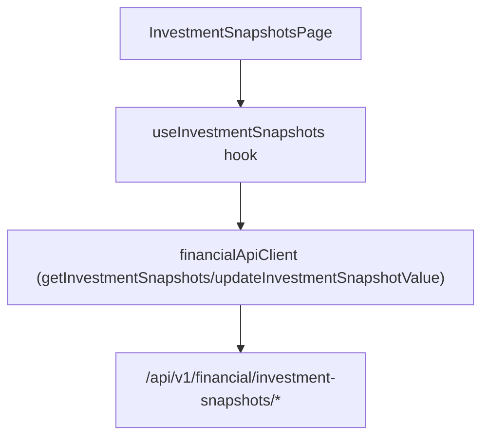

# F16. Web — Investment Snapshots View

## 1. Technical Overview

**What:** Replace F11's `/cashflow/investment-snapshots` placeholder with a real page that lets the user pick a month, shows that month's auto-generated 11-account snapshot (F08), and lets the user update a single account's value inline.

**Why:** This turns F08's backend-only monthly snapshot generation into the actual first-of-month workflow — enter each account's balance once a month, independent of the Financial.Investments domain.

**Scope:**
- Included: month picker (reusing F14's pattern, defaults to the current month); a flat table of all 11 accounts (always exactly 11, per F08) showing account name, liability indicator, and value; inline per-row value editing.
- Excluded: status/date fields (F08 has none — value is the only per-instance field); any other CashFlow view (F13/F14/F15).

## 2. Architecture Impact

**Affected components:**
- `Financial.Web/src/api/types.ts` — new: `InvestmentSnapshotDto`, `UpdateInvestmentSnapshotValueDto`
- `Financial.Web/src/api/financialApiClient.ts` — modified: new methods `getInvestmentSnapshots(year, month)`, `updateInvestmentSnapshotValue(id, request)`
- `Financial.Web/src/hooks/useInvestmentSnapshots.ts` — new: page business logic
- `Financial.Web/src/pages/InvestmentSnapshotsPage.tsx`, `InvestmentSnapshotsPage.css` — new: replaces `CashFlowPlaceholderPage` on `/cashflow/investment-snapshots`
- `Financial.Web/src/main.tsx` — modified: route swap

## 3. Technical Decisions

| Decision | Chosen Approach | Alternative Considered | Trade-off |
|----------|-----------------|-------------------------|-----------|
| Month selection | Reuse F14's `<input type="month">` pattern, defaulting to the current month | A new/different picker | Consistent with the established per-month CashFlow view precedent; no reason to diverge. |
| Layout | A single flat table of all 11 accounts (no grouping) | Group by liability/asset | F08's own spec never groups accounts — it always returns a flat 11-row list — and the PRD's Experience text describes "sees all 11 accounts" with no grouping mentioned, unlike F06's explicit Brasil/UK split. |
| Liability indicator | A `(liability)` suffix appended to the account name when `isLiability` is true, matching the historical spreadsheet's own labeling convention (e.g. "Platinum Visa 8003 (liability)") | A separate boolean column/badge | Cheapest way to surface the classification already returned by the API without adding a whole extra column for a single boolean, and matches the exact wording the PRD itself uses when listing the canonical account list. |
| Refresh strategy after a successful edit | Re-fetch the month's 11 snapshots after a successful update | Locally patch the edited row | Same precedent as F13/F14/F15 — keeps displayed state provably in sync with the server. |

## 4. Component Overview

**Frontend:**

| File Path | New/Modified | Purpose | Key Responsibilities |
|-----------|--------------|---------|-----------------------|
| `Financial.Web/src/api/types.ts` | Modified | DTO types | `InvestmentSnapshotDto { id, account, isLiability, year, month, value }`, `UpdateInvestmentSnapshotValueDto { value }` |
| `Financial.Web/src/api/financialApiClient.ts` | Modified | HTTP client | `getInvestmentSnapshots(year, month)`, `updateInvestmentSnapshotValue(id, request)` |
| `Financial.Web/src/hooks/useInvestmentSnapshots.ts` | New | Page business logic | Month state (defaults to current month); fetches the month's 11 snapshots on month change; per-row inline edit state (`editingId`, `editValue`); submit/re-fetch; loading/error state matching `useMensais`'s reducer pattern |
| `Financial.Web/src/pages/InvestmentSnapshotsPage.tsx`, `InvestmentSnapshotsPage.css` | New | Presentational page | Month picker, `LoadingState`/`ErrorState`, a single table of all 11 accounts with inline value edit per row |
| `Financial.Web/src/main.tsx` | Modified | Routing | `/cashflow/investment-snapshots` renders `InvestmentSnapshotsPage` instead of `CashFlowPlaceholderPage` |

## 5. API Contracts

Consumes F08's existing endpoints unchanged (see F08's own spec for full detail):

- `GET /api/v1/financial/investment-snapshots/{year}/{month}` → `InvestmentSnapshotDto[]` (always exactly 11 rows, generated on first call for that month)
- `PUT /api/v1/financial/investment-snapshots/{id}` (body: `UpdateInvestmentSnapshotValueDto`) → `InvestmentSnapshotDto`; `400` on a negative value, `404` on an unknown id

No new backend endpoints — this feature is Web-only.

## 6. Data Model

No backend/persisted data model changes — this is a Web-only feature consuming F08's existing `data-cashflow.json`-backed endpoints.

## 7. Testing Strategy

| Test File | Test Type | Target | Coverage Goal |
|-----------|-----------|--------|----------------|
| `Financial.Web/src/api/financialApiClient.test.ts` | Unit | `financialApiClient` | New Investment Snapshots methods call the correct paths/methods/bodies |
| `Financial.Web/src/hooks/useInvestmentSnapshots.test.ts` | Unit | `useInvestmentSnapshots` | Fetches the current month's 11 snapshots on mount; changing the month re-fetches for the new year/month; edit-and-submit calls the update endpoint and re-fetches on success; a backend error is surfaced without crashing |
| `Financial.Web/src/pages/InvestmentSnapshotsPage.test.tsx` | Component | `InvestmentSnapshotsPage` | Renders `LoadingState`/`ErrorState`; renders all 11 accounts with their values once loaded; editing a row's value and saving updates the displayed row |

**Acceptance tests (from PRD Section 9, F16):**
- The view shows all 11 tracked accounts for the selected month with their current values — `InvestmentSnapshotsPage.test.tsx`
- Editing one account's value for a month does not affect other months or other accounts — `useInvestmentSnapshots.test.ts` (re-fetch-after-update assertion scoped to the selected month; other rows' values unchanged), `InvestmentSnapshotsPage.test.tsx`
