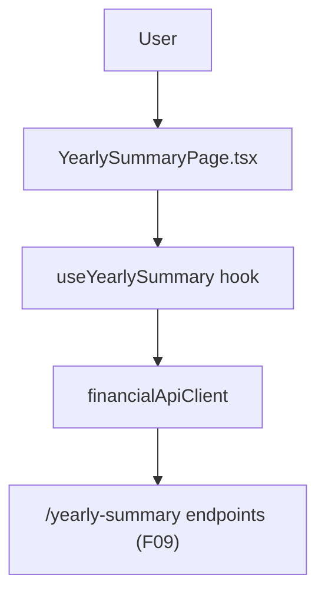

## 1. Technical Overview

**What:** A new "Yearly Summary" view in the CashFlow web app (`/cashflow/yearly-summary`, currently a placeholder) that shows a year selector plus two read-only tables: a monthly-totals-per-expense-category table with a yearly total column, and a month-over-month diff table per investment account plus the combined net position — mirroring the Resumo/Year sheet's structure.

**Why:** F09 (yearly expense-category totals and month-over-month investment-account diffs) is already fully implemented and tested in the backend, but has no web surface yet. This is the last remaining feature of the CashFlow web wave (F10, F12, F17) — like F12, it is a Presentation-layer-only addition wiring an already-existing, already-tested backend service into the React web app using the same client/hook/page pattern established by F13-F16 and F12.

**Scope:**
- Included: a year selector (defaulting to the current year), a category-totals table (rows = categories, columns = Jan-Dec + a yearly total column), an investment-diffs table (rows = 11 accounts, columns = Jan value + 11 month-over-month diffs) plus a combined net-position row with its own diffs and full-year net change.
- Excluded: any backend change (F09 already provides everything needed), editing any value from this view (F09's own data is written by F03/F08, not from this read-only summary), year range validation beyond what the browser's native number input offers.

## 2. Architecture Impact

**Affected components:**
- `Financial.Web/src/api/types.ts` — add DTO types for `CategoryYearlyTotal`, `InvestmentAccountYearlyDiff`, `NetPositionYearlyDiff`, `InvestmentDiffsYearly`
- `Financial.Web/src/api/financialApiClient.ts` — add 2 client methods wrapping the existing `/yearly-summary` endpoints
- `Financial.Web/src/hooks/useYearlySummary.ts` (new) — year selection state (default current year), fetch-on-mount and on year change
- `Financial.Web/src/pages/YearlySummaryPage.tsx` + `.css` (new) — replaces the `CashFlowPlaceholderPage title="Yearly Summary"` placeholder route
- `Financial.Web/src/main.tsx` — swap the placeholder route for `<YearlySummaryPage />`

No Domain, Application, or Infrastructure changes — F09's `YearlySummaryController`/`IYearlySummaryService` already expose everything this view needs.

## 3. Technical Decisions

| Decision | Chosen Approach | Alternative Considered | Trade-off |
|----------|-----------------|-------------------------|-----------|
| Year selector control | A native `<input type="number">` (no min/max clamp beyond browser defaults) | A `<select>` populated from a hardcoded year range | F17 is the first CashFlow view to select by year rather than by month, and unlike the 11-account/14-category lists elsewhere, there is no fixed, enumerable set of valid years (F10 historical import already covers 2017-2026, but new years are added every January) — a free-entry number input avoids hardcoding a range that goes stale. |
| Read-only presentation | Both tables render fetched values directly with no inline edit affordances | Allow editing a cell that writes back through F03/F08 | The PRD's Capabilities/Experience text describes only "sees...data" with no create/edit/delete verbs (unlike F12), and the underlying values are already owned and edited by F03 (expenses) and F08 (investment snapshots) elsewhere in the app — this view is a report, not another entry point for the same data. |
| Net position row placement | Rendered as the last row of the investment-diffs table, visually distinguished (bold) rather than a separate table | A third, separate table just for the net position | `InvestmentDiffsYearlyDTO` already bundles `NetPosition` alongside `Accounts` as one cohesive read model, and the PRD's Experience text describes it as part of "the same view" showing account diffs, not a separate section. |

## 4. Component Overview

**Frontend:**

| File Path | New/Modified | Purpose | Key Responsibilities |
|-----------|--------------|---------|-----------------------|
| `Financial.Web/src/api/types.ts` | Modified | DTO types | Add `CategoryYearlyTotalDto`, `InvestmentAccountYearlyDiffDto`, `NetPositionYearlyDiffDto`, `InvestmentDiffsYearlyDto` matching the backend DTOs field-for-field |
| `Financial.Web/src/api/financialApiClient.ts` | Modified | API client | Add `getCategoryTotalsForYear` and `getInvestmentDiffsForYear` |
| `Financial.Web/src/hooks/useYearlySummary.ts` | New | State management | Year selection (default current year), fetch both endpoints together on mount and on year change, loading/error state |
| `Financial.Web/src/pages/YearlySummaryPage.tsx` | New | Presentational page | Year picker, category-totals table (Jan-Dec + yearly total per category), investment-diffs table (Jan value + 11 monthly diffs per account, plus the net-position row with its full-year net change) |
| `Financial.Web/src/pages/YearlySummaryPage.css` | New | Page styling | Follows the existing `*Page.css` + shared `data-table.css` conventions |
| `Financial.Web/src/main.tsx` | Modified | Routing | Replace `<Route path="yearly-summary" element={<CashFlowPlaceholderPage title="Yearly Summary" />} />` with `<YearlySummaryPage />` |

## 5. API Contracts

Both endpoints below already exist and are already tested (F09); this feature only adds a typed web client wrapper around them, with no backend modification.

**Endpoint: Get Expense Category Totals for Year**
- **Method:** GET
- **Path:** `/yearly-summary/{year}/expense-categories`
- **Response (200):** `CategoryYearlyTotalDto[]` — `{ category, monthlyTotals: number[12], yearlyTotal }` (`monthlyTotals[0]` = January)

**Endpoint: Get Investment Diffs for Year**
- **Method:** GET
- **Path:** `/yearly-summary/{year}/investment-diffs`
- **Response (200):** `InvestmentDiffsYearlyDto` — `{ accounts: [{ account, isLiability, monthlyValues: number[12], monthlyDiffs: number[11] }], netPosition: { monthlyValues: number[12], monthlyDiffs: number[11], fullYearNetChange } }` (`monthlyDiffs[0]` = February minus January)

## 6. Data Model

No new persisted schema. This feature only reads through F09's already-tested `YearlySummaryService`, itself computed from F03's expenses and F08's investment snapshots.

## 7. Testing Strategy

| Test File | Test Type | Target | Coverage Goal |
|-----------|-----------|--------|----------------|
| `Financial.Web/src/hooks/useYearlySummary.test.ts` | Unit | `useYearlySummary` | Fetches both endpoints on mount for the current year; re-fetches on year change; surfaces a fetch error |
| `Financial.Web/src/pages/__tests__/YearlySummaryPage.test.tsx` | Unit (RTL) | `YearlySummaryPage` | Renders loading/error states; renders the category-totals table with a yearly total column; renders the investment-diffs table with 11 monthly diff columns per account plus the net-position row and its full-year net change |

**Acceptance tests (from PRD Section 9, F17):**
- "Selecting a year shows a monthly-totals-per-expense-category table with a yearly total column" — `YearlySummaryPage.test.tsx`
- "The same view shows a month-over-month diff table per investment account, plus the combined net position, for the selected year" — `YearlySummaryPage.test.tsx`

**Cross-Feature Integration tests (from PRD Section 9, F17 as consumer):**
- "F17's Web Yearly Summary View correctly displays the totals and diffs computed by F09" — covered by `YearlySummaryPage.test.tsx` rendering data shaped exactly like F09's own DTOs, plus a manual smoke run against the real API confirming real F09-computed figures render correctly
