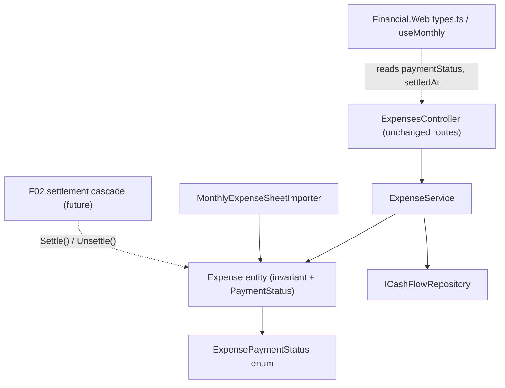

# F01. Expense Payment State Model

## 1. Technical Overview

**What:** Make `Expense.PaymentSource` nullable, add a nullable `SettledAt` date, and introduce a computed `ExpensePaymentStatus` (`ImmediatePayment` / `CreditCardCharge` / `CreditCardSettled`) derived entirely from `PaymentSource` and `CardTag` — never stored. The three valid `PaymentSource`/`CardTag`/`SettledAt` shapes become a domain invariant enforced by the `Expense` entity itself, and two new domain transitions — `Settle(paymentSource, settledAt)` and `Unsettle()` — become the only way to produce or clear the `CreditCardSettled` shape (F02's statement cascade will call them).

**Why:** Today `PaymentSource` is required even on card-tagged expenses, so a card charge reduces a bank total the moment it is entered. Making the bank tag nullable and constraining the valid combinations makes an expense's bank-balance impact computable and unambiguous. The status is derived on read rather than persisted, mirroring the codebase's existing "derive, don't store" convention (`CardStatement` outstanding total).

**Scope:**
- Included: `Expense` entity changes (nullable `PaymentSource`, new `SettledAt`, invariant, `PaymentStatus` computed property, `Settle`/`Unsettle`); new `ExpensePaymentStatus` enum; `ExpenseService` validation relaxation; DTO shape changes (`PaymentSource` nullable, `SettledAt` + `PaymentStatus` exposed on reads); web API contract types updated to match; a minimal `MonthlyExpenseSheetImporter` accommodation so the solution stays green (card-tagged rows pass a null `PaymentSource`).
- Excluded: the settlement cascade and mark/unmark-paid endpoints (F02); the one-time data backfill (F03) — until it runs, legacy records may violate the invariant, which is tolerated on read (see Decision 6); the importer's full column-E precedence rule and its acceptance tests (F04); all UI changes — form modes, panels (F05).

## 2. Architecture Impact

**Affected components:**
- `Financial.CashFlow.Domain/Enums/ExpensePaymentStatus.cs` — new enum
- `Financial.CashFlow.Domain/Entities/Expense.cs` — nullable `PaymentSource`, new `SettledAt`, invariant, `PaymentStatus`, `Settle`/`Unsettle`
- `Financial.CashFlow.Application/Services/ExpenseService.cs` — `PaymentSource` becomes optional in validation; `ToDto` gains `SettledAt`/`PaymentStatus` and null-safe `PaymentSource`
- `Financial.CashFlow.Application/DTOs/ExpenseDTO.cs`, `ExpenseCreateDTO.cs`, `ExpenseUpdateDTO.cs` — nullable `PaymentSource`; `ExpenseDTO` gains `SettledAt`, `PaymentStatus`
- `Financial.CashFlow.Infrastructure/Integrations/CashFlowSpreadsheetImport/SheetImporters/MonthlyExpenseSheetImporter.cs` — minimal accommodation (card tag resolved → null `PaymentSource`)
- `Financial.Web/src/api/types.ts`, `src/hooks/useMonthly.ts` — contract types follow the DTO changes



## 3. Technical Decisions

| Decision | Chosen Approach | Alternative Considered | Trade-off |
|----------|-----------------|-------------------------|-----------|
| Invariant location | Enforced inside `Expense` (`Create`, `UpdateDetails`, `Settle`, `Unsettle` throw `ArgumentException` on an invalid shape); `ExpenseService` keeps only parsing and pre-existing field checks | Keep all rules in `ExpenseService.ValidateFields` (current pattern) | The entity can no longer be constructed in an invalid shape by any caller (importer, F03 migration, F02 cascade) — "correct by construction" per the PRD. Accepts introducing entity-level validation where none exists today; `ArgumentException` still maps to 400 via the existing controller handling. **(User-confirmed decision.)** |
| Payment status representation | Computed property `Expense.PaymentStatus` — both set → `CreditCardSettled`; `CardTag` only → `CreditCardCharge`; otherwise `ImmediatePayment`. Serialized into `ExpenseDTO` so the web reads the server-derived value instead of re-deriving | Store a status field, or derive independently client-side | Single derivation lives in one place (PRD cross-feature criterion: no second, independently-maintained derivation). Derivation is total — defined even for legacy pre-F03 records whose `SettledAt` is still null. |
| `SettledAt` type | `DateOnly?` | `DateTime?` | Matches `Expense.Date`'s existing type; settlement granularity per the PRD is a calendar date. |
| Producing the settled shape | Only `Settle(paymentSource, settledAt)` creates it; only `Unsettle()` clears it. `Create` never accepts both fields set. `UpdateDetails` on a settled expense allows changing date/description/value/category but rejects any change to `PaymentSource`/`CardTag` (message directs to the statement settlement action), preserving `SettledAt` | Allow `UpdateDetails` to round-trip the settled fields freely | Matches the PRD rule that the settled combination is only ever produced by F02's cascade, and directly supports F05's "payment fields read-only when settled". Accepts a slightly more involved `UpdateDetails` guard. |
| Importer accommodation | When `MonthlyExpenseSheetImporter` resolves a card tag, it now passes `PaymentSource = null` to `Expense.Create` — the minimal change keeping the importer functional under the new invariant | Leave the importer throwing until F04 lands | Card-tag rows with both fields set would throw under the new invariant, breaking the importer and its tests inside this same wave. F04 still owns the full column-E precedence behavior and its acceptance tests. |
| Legacy data tolerance | The invariant runs only on the entity's factory/mutation paths. JSON deserialization goes through `CashFlowTypeInfoResolver`'s private-ctor/private-setter binding, bypassing `Create`, so pre-F03 records (both fields set, `SettledAt` null) still load and read | Validate on load and reject non-conforming files | The app must keep working between F01 merging and F03's backfill running. Reads are total; writes are strict. |

## 4. Component Overview

**Backend:**

| File Path | New/Modified | Purpose | Key Responsibilities |
|-----------|--------------|---------|-----------------------|
| `Financial.CashFlow.Domain/Enums/ExpensePaymentStatus.cs` | New | Computed payment status values | `ImmediatePayment`, `CreditCardCharge`, `CreditCardSettled` |
| `Financial.CashFlow.Domain/Entities/Expense.cs` | Modified | Payment-state invariant + transitions | `PaymentSource` → `PaymentSource?`; new `DateOnly? SettledAt` (private set — auto-participates in `CashFlowTypeInfoResolver` round-tripping); `PaymentStatus` computed property; `Create`/`UpdateDetails` enforce the valid shapes (both null rejected; both set rejected/guarded per Decision 4); `Settle(paymentSource, settledAt)` valid only from `CreditCardCharge`; `Unsettle()` valid only from `CreditCardSettled` |
| `Financial.CashFlow.Application/Services/ExpenseService.cs` | Modified | Validation + mapping | `ValidateFields` parses `PaymentSource` only when non-blank (no longer required); shape rules delegated to the entity; `ToDto` maps `PaymentSource?.ToString()`, `SettledAt`, `PaymentStatus.ToString()` |
| `Financial.CashFlow.Application/DTOs/ExpenseDTO.cs` | Modified | Read model | `PaymentSource` → `string?`; new `SettledAt` (`DateOnly?`), `PaymentStatus` (`string`) |
| `Financial.CashFlow.Application/DTOs/ExpenseCreateDTO.cs`, `ExpenseUpdateDTO.cs` | Modified | Write models | `PaymentSource` → `string?` (optional); no `SettledAt` — never settable via the expense API |
| `.../SheetImporters/MonthlyExpenseSheetImporter.cs` | Modified | Keep importer valid under invariant | When a card tag is resolved for a row, pass `PaymentSource = null` to `Expense.Create` |

**Frontend:**

| File Path | New/Modified | Purpose | Key Responsibilities |
|-----------|--------------|---------|-----------------------|
| `Financial.Web/src/api/types.ts` | Modified | API contract types | `ExpenseDto.paymentSource` → `string \| null`, add `settledAt: string \| null`, `paymentStatus: string`; `CreateExpenseDto`/`UpdateExpenseDto.paymentSource` → `string \| null` |
| `Financial.Web/src/hooks/useMonthly.ts` | Modified | Keep type-correct | Create/edit payloads send `paymentSource: null` when blank (mirroring the existing `cardTag` convention); no behavioral UI change (F05 owns that) |

## 5. API Contracts

No new endpoints; existing `expenses` routes change shape.

**`POST /api/v1/financial/expenses`** and **`PUT /api/v1/financial/expenses/{id}`**

| Field | Type | Required | Validation | Description |
|-------|------|----------|------------|-------------|
| `date` | `date` | Yes | valid date | Unchanged |
| `description` | `string` | Yes | ≤ 200 chars | Unchanged |
| `value` | `decimal` | Yes | non-zero | Unchanged |
| `category` | `string` | Yes | valid `Category` | Unchanged |
| `paymentSource` | `string?` | No | valid `PaymentSource` when present; required absent when `cardTag` present; required present when `cardTag` absent | Bank tag — now optional |
| `cardTag` | `string?` | No | valid `CreditCard` when present | Unchanged field, new rules |

Request example (Credit Card Charge):
```json
{ "date": "2026-07-24", "description": "Groceries", "value": 42.10, "category": "Mercado", "paymentSource": null, "cardTag": "ChaseMaster4023" }
```

**Response (200) — `ExpenseDTO`, also returned by `GET /expenses/month/{year}/{month}`:**
```json
{
  "id": "3fa85f64-5717-4562-b3fc-2c963f66afa6",
  "date": "2026-07-24",
  "description": "Groceries",
  "value": 42.10,
  "category": "Mercado",
  "paymentSource": null,
  "cardTag": "ChaseMaster4023",
  "settledAt": null,
  "paymentStatus": "CreditCardCharge"
}
```

**Error responses (400, ProblemDetails `detail`):**

| Condition | Message intent |
|-----------|----------------|
| Neither `paymentSource` nor `cardTag` set | Expense must have a payment source or a card tag |
| Both `paymentSource` and `cardTag` set (create, or edit changing them) | Settled state is only produced by marking a card statement paid — directs user to the statement settlement action |
| Unparseable `paymentSource`/`cardTag`/`category` | Existing parser messages, unchanged |

## 6. Data Model

**`data-cashflow.json` — `Expenses` item shape (PascalCase, via `CashFlowSerializerAdapter`):**

```json
{
  "Id": "3fa85f64-5717-4562-b3fc-2c963f66afa6",
  "Date": "2026-07-24",
  "Description": "Groceries",
  "Value": 42.10,
  "Category": "Mercado",
  "PaymentSource": null,
  "CardTag": "ChaseMaster4023",
  "SettledAt": null
}
```

- `PaymentStatus` is never persisted — computed on read.
- Existing records without `SettledAt` deserialize with `SettledAt = null` (missing property → default); no file migration is needed for F01 itself (F03 owns reclassification).
- `CashFlowTypeInfoResolver` picks up `SettledAt` automatically (public property with private setter).

## 7. Testing Strategy

| Test File | Test Type | Target | Coverage |
|-----------|-----------|--------|----------|
| `Tests/Financial.CashFlow.Domain.Tests/Entities/ExpenseTests.cs` | Unit | `Expense` | `Create` with bank only → `ImmediatePayment`; card only → `CreditCardCharge`; both null → throws; both set → throws; `Settle` from charge sets fields → `CreditCardSettled`; `Settle` from non-charge throws; `Unsettle` clears both → `CreditCardCharge`; `Unsettle` from non-settled throws; `UpdateDetails` on settled expense keeps `SettledAt` when payment fields unchanged and throws when they change; `UpdateDetails` both-null/both-set rejections |
| `Tests/Financial.CashFlow.Application.Tests/Services/ExpenseServiceTests.cs` | Unit | `ExpenseService` | Create/update with null `paymentSource` + card → succeeds, DTO has `paymentStatus = "CreditCardCharge"`, `paymentSource = null`; bank only → `"ImmediatePayment"`; neither → `ArgumentException`; both → `ArgumentException` with settlement-directing message; DTO carries `settledAt` |
| `Tests/Financial.Api.Tests/ExpenseEndpointsTests.cs` | Integration | expenses endpoints | POST card-only charge → 200 with `paymentStatus`/`settledAt` in body; POST neither → 400; POST both → 400; GET month returns new fields |
| `Tests/Financial.CashFlowSpreadsheetImport.Tests/SheetImporters/MonthlyExpenseSheetImporterTests.cs` | Unit | Importer accommodation | Card-section rows now import with null `PaymentSource` (assert existing card-tag tests updated accordingly) |
| `Financial.Web/src/hooks/useMonthly.test.ts`, `src/api/financialApiClient.test.ts` | Unit (vitest) | Contract types | Payloads/fixtures updated for nullable `paymentSource`, `settledAt`, `paymentStatus`; `tsc -b --noEmit` passes |

**Acceptance tests (PRD Section 9, F01):**
- Bank set + no card saves and computes `ImmediatePayment` → `ExpenseTests` + `ExpenseServiceTests` + endpoint test
- Card set + no bank saves and computes `CreditCardCharge` → same trio
- Neither set rejected with validation message → same trio
- Both set outside F02's cascade rejected with validation message → same trio (`Settle` is the only both-set path, covered in `ExpenseTests`)
- Inconsistent `SettledAt` rejected → `ExpenseTests` (`Settle`/`Unsettle`/`UpdateDetails` guards make an inconsistent combination unconstructible through any public path)

**Cross-Feature Integration criteria touching F01 (PRD Section 9):**
- "The computed payment status is derived identically everywhere it's exposed" — guaranteed structurally: the only derivation is `Expense.PaymentStatus`; API serializes it; the web reads the serialized value. Covered by `ExpenseServiceTests` + endpoint tests asserting the serialized value matches the entity rule.
- F02/F03/F04 cascade/backfill/importer shape criteria — deferred to those features; F01 provides the invariant they are tested against.
