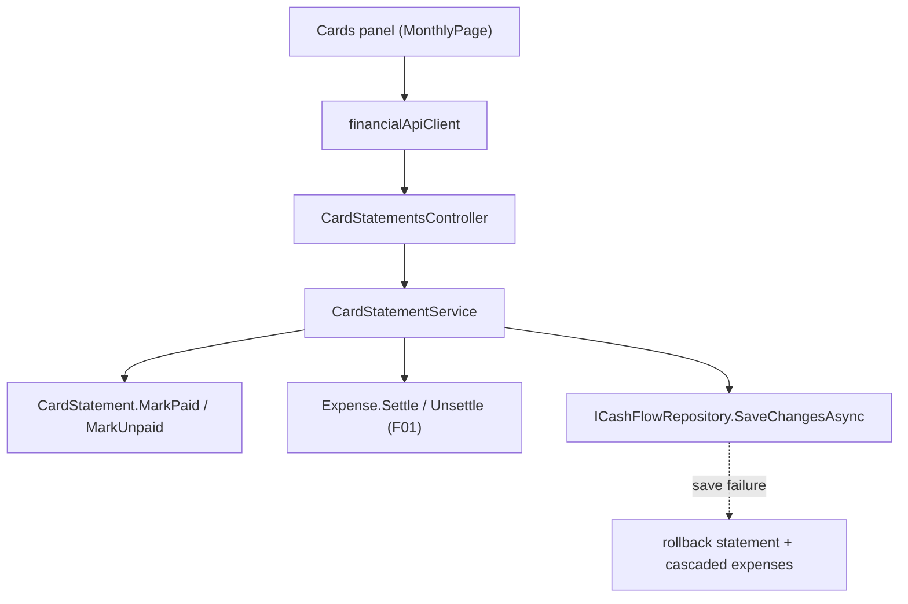

# F02. Credit Card Statement Settlement with Payment Source

## 1. Technical Overview

**What:** Make "mark statement paid" require a `PaymentSource` and cascade settlement onto the statement's charges — every `CreditCardCharge` expense for that card/month gets `Settle(bank, today)` — and add the missing "unmark statement paid" action that reverses the cascade via `Unsettle()`. The outstanding-total derivation changes to sum only `CreditCardCharge` expenses. The Cards panel gains the bank picker on Mark Paid and an Unmark Paid control (per this feature's PRD Experience; F05 keeps them and reworks the panels' totals and the expense form).

**Why:** `CardStatement.IsPaid` today records nothing about which bank paid or when, and expenses never change state on settlement. F01 provides the `Settle`/`Unsettle` transitions and the settled shape; F02 is the only producer/consumer of those transitions, making settlement explicit, auditable (bank + date on each expense), and reversible.

**Scope:**
- Included: `MarkStatementPaidAsync` gains a required payment source and the settle cascade; new `UnmarkStatementPaidAsync` with the reverse cascade; all-or-nothing rollback on save failure for both; outstanding total = sum of that card/month's `CreditCardCharge` expenses; API contract changes (`mark-paid` body, new `unmark-paid` endpoint); web client + Cards panel controls (bank select before Mark Paid, Unmark Paid with confirmation).
- Excluded: Banks panel and expense-form changes (F05); data backfill (F03) — until it runs, legacy both-set expenses compute `CreditCardSettled` and are excluded from outstanding totals, which is the accepted transitional state; any per-expense settlement action (PRD out of scope).

## 2. Architecture Impact

**Affected components:**
- `Financial.CashFlow.Application/Interfaces/ICardStatementService.cs`, `Services/CardStatementService.cs` — settle/unsettle cascades, outstanding-total rule
- `Financial.CashFlow.Application/DTOs/MarkStatementPaidDTO.cs` — new request DTO
- `Financial.Api/Controllers/CardStatementsController.cs` — `mark-paid` takes a body, new `unmark-paid` endpoint, `ArgumentException` → 400
- `Financial.Web/src/api/types.ts`, `financialApiClient.ts` — mark-paid request shape, unmark method
- `Financial.Web/src/hooks/useMonthly.ts`, `src/pages/MonthlyPage.tsx` — per-row bank selection state, `markStatementPaid(id, bank)`, `unmarkStatementPaid(id)` with confirm



## 3. Technical Decisions

| Decision | Chosen Approach | Alternative Considered | Trade-off |
|----------|-----------------|-------------------------|-----------|
| Cascade location | `CardStatementService` orchestrates: flips the statement, calls `Expense.Settle`/`Unsettle` on each affected expense, saves once; on save failure reverts every mutated entity before rethrowing (extends the existing `MarkPaid`/`MarkUnpaid` rollback pattern) | A domain service owning the cascade | The repository is an in-memory aggregate with a single full-document save, so one save covers the whole cascade atomically-enough; a domain service would add a layer this codebase doesn't use elsewhere. |
| "Settled by this statement" on unmark | All `CreditCardSettled` expenses for that card/month | Track which expense ids each settlement touched | F01 makes the settled shape producible only via the cascade, so card/month membership fully identifies them; an id list would be stored state the PRD explicitly excludes (no settlement history). Legacy pre-F03 both-set records also revert, which is the desired cleanup. |
| Settlement date | `DateOnly.FromDateTime(DateTime.Today)` taken once per cascade in the service | Injected clock abstraction | No clock abstraction exists in the codebase; introducing one for a personal app violates the no-over-engineering rule. Tests assert the settled date equals today's date at assertion time. |
| Outstanding total | Sum of the card/month's `CreditCardCharge` expenses (`PaymentStatus` filter); the `IsPaid → 0` short-circuit is removed | Keep the `IsPaid` short-circuit | Under the state model, settling zeroes the sum naturally (charges become settled); a charge added after settlement correctly shows as outstanding again. Matches PRD F02/F05 wording. Pre-F03 legacy both-set expenses are excluded (compute settled) — transitional until F03. |
| Mark-paid contract | `POST .../mark-paid` gains a JSON body `{ "paymentSource": "..." }`, parsed via `PaymentSourceParser`; missing/blank/unknown → `ArgumentException` → 400 before any state change | Query-string parameter | Body matches every other write endpoint's convention; parser reuse keeps one enum-parsing path. Breaking API change is acceptable — the web app in this repo is the only client and is updated in the same feature. |
| Idempotent no-ops | Mark-paid on an already-paid statement returns its DTO unchanged (no cascade, no save) even if the body's bank differs from the original settlement; unmark on an already-unpaid statement likewise | Rejecting repeats as 409 | PRD mandates no-op-with-confirmation semantics; the returned DTO is the confirmation. |
| Cards panel controls | Each unpaid row gets a bank `<select>` (the 3 `PAYMENT_SOURCES`, empty default) next to Mark Paid, disabled until a bank is chosen; each paid row gets Unmark Paid guarded by `window.confirm` (multi-expense revert), matching the existing delete-confirmation convention | Defer all UI to F05 | The PRD puts this control UX in F02's own Experience section; without it the only client can't call the new contract. F05 consumes and keeps these controls. |

## 4. Component Overview

**Backend:**

| File Path | New/Modified | Purpose | Key Responsibilities |
|-----------|--------------|---------|-----------------------|
| `Financial.CashFlow.Application/DTOs/MarkStatementPaidDTO.cs` | New | Mark-paid request | `PaymentSource` (`string?`) — validated present + parseable in the service |
| `Financial.CashFlow.Application/Interfaces/ICardStatementService.cs` | Modified | Contract | `MarkStatementPaidAsync(Guid id, MarkStatementPaidDTO request)`; new `UnmarkStatementPaidAsync(Guid id)` |
| `Financial.CashFlow.Application/Services/CardStatementService.cs` | Modified | Cascades + totals | Validate bank before touching state; settle cascade (each card/month `CreditCardCharge` → `Settle(bank, today)`); unsettle cascade (each card/month `CreditCardSettled` → `Unsettle()`); single save with full rollback of statement + expenses on failure; `ToDto` outstanding = Σ `CreditCardCharge` for card/month |
| `Financial.Api/Controllers/CardStatementsController.cs` | Modified | HTTP surface | `mark-paid` accepts body, catches `ArgumentException` → 400 (alongside existing 404); new `POST {id:guid}/unmark-paid` → 200 / 404 |

**Frontend:**

| File Path | New/Modified | Purpose | Key Responsibilities |
|-----------|--------------|---------|-----------------------|
| `Financial.Web/src/api/types.ts` | Modified | Contracts | `MarkCardStatementPaidDto { paymentSource: string }` |
| `Financial.Web/src/api/financialApiClient.ts` | Modified | Client | `markCardStatementPaid(id, request)` posts the body; new `unmarkCardStatementPaid(id)` |
| `Financial.Web/src/hooks/useMonthly.ts` | Modified | State | Per-statement selected-bank state (`markPaidSource` map or single pending selection keyed by statement id); `markStatementPaid(id, bank)`; `unmarkStatementPaid(id)` with `window.confirm`; both re-fetch month data on success (existing `RETRY` pattern) |
| `Financial.Web/src/pages/MonthlyPage.tsx` | Modified | Cards panel | Unpaid row: bank `<select>` + Mark Paid disabled until selected; paid row: Unmark Paid button |

## 5. API Contracts

**`POST /api/v1/financial/card-statements/{id}/mark-paid`** (changed)

Request body:
```json
{ "paymentSource": "Barclays" }
```

| Field | Type | Required | Validation |
|-------|------|----------|------------|
| `paymentSource` | `string` | Yes | one of `Barclays`/`Trading212`/`Chase` |

- **200**: `CardStatementDTO` (`isPaid: true`, `outstandingTotal: 0` once charges settle). Already-paid → same 200, no changes (bank in body ignored).
- **400**: missing/blank/unknown `paymentSource` — rejected before any expense or statement changes.
- **404**: unknown statement id.
- Side effect: every `CreditCardCharge` expense for that card/year/month becomes `CreditCardSettled` with that bank and today's date; expense reads then show `paymentSource`, `settledAt`, `paymentStatus: "CreditCardSettled"`.

**`POST /api/v1/financial/card-statements/{id}/unmark-paid`** (new)

- No body. **200**: `CardStatementDTO` (`isPaid: false`, outstanding reflecting reverted charges). Already-unpaid → same 200 no-op. **404**: unknown id.
- Side effect: every `CreditCardSettled` expense for that card/year/month reverts to `CreditCardCharge` (`paymentSource`/`settledAt` null). No settled expenses → statement still flips to unpaid.

Failure atomicity (both endpoints): a save failure leaves the statement flag and every expense exactly as before the request.

## 6. Data Model

No shape changes — F01's `Expense` fields (`PaymentSource`, `SettledAt`) and `CardStatement` are reused as-is. This feature only changes when those fields transition.

## 7. Testing Strategy

| Test File | Test Type | Target | Coverage |
|-----------|-----------|--------|----------|
| `Tests/Financial.CashFlow.Application.Tests/Services/CardStatementServiceTests.cs` | Unit | `CardStatementService` | Mark-paid: missing/blank/unknown bank throws `ArgumentException` with no state change; valid bank settles every `CreditCardCharge` for card/month (bank + today's `SettledAt`, status `CreditCardSettled`) and leaves other cards/months untouched; already-paid → no-op DTO, no save call; save failure reverts statement and every cascaded expense; statement with no charges settles nothing but flips. Unmark: reverts every settled expense (fields null, status `CreditCardCharge`); already-unpaid → no-op; no settled expenses → still flips to unpaid; save failure reverts statement + expenses. Outstanding: sums only `CreditCardCharge` (settled and immediate excluded); charge added after settlement counts again |
| `Tests/Financial.Api.Tests/CardStatementsEndpointsTests.cs` | Integration | endpoints | mark-paid without body/bank → 400; with bank → 200 and the month's expenses now read settled (`paymentStatus`, `settledAt`, `paymentSource`); unmark-paid → 200 and expenses read as charges again; unmark unknown id → 404; repeat mark/unmark → 200 no-ops |
| `Financial.Web/src/hooks/useMonthly.test.ts` | Unit (vitest) | hook | `markStatementPaid(id, bank)` posts the body and re-fetches; `unmarkStatementPaid` asks for confirmation, posts, re-fetches; cancel skips the call; API error surfaces via existing error state |
| `Financial.Web/src/pages/__tests__/MonthlyPage.test.tsx` | Unit (vitest) | Cards panel | Unpaid row shows bank select + disabled Mark Paid until a bank is chosen; choosing a bank and clicking calls the client with `{ paymentSource }`; paid row shows Unmark Paid; clicking it (confirm accepted) calls unmark |

**Acceptance tests (PRD Section 9, F02):**
- Mark paid without `PaymentSource` rejected before any expense changes → service + endpoint tests
- Mark paid with `PaymentSource` settles every charge with bank + today's date → service + endpoint tests
- Unmark clears `PaymentSource`/`SettledAt` on every settled expense → service + endpoint tests
- Save failure partway leaves statement + cascade unchanged → service tests (throwing stub repository)
- Repeat mark/unmark are no-ops with confirmation, not errors → service + endpoint tests

**Cross-Feature Integration criteria touching F02 (PRD Section 9):**
- "F02's cascades correctly read/write F01's fields and reject actions violating F01's rule" → the cascades use only `Expense.Settle`/`Unsettle`, which enforce F01's invariant; covered by the service tests asserting resulting shapes and by `ExpenseTests` transition guards
- Panel-refresh and F05-related boxes remain for F05
