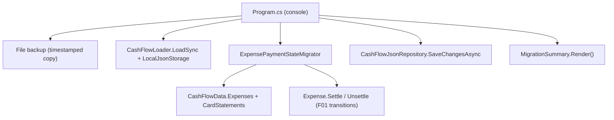

# F03. Legacy Data Migration

## 1. Technical Overview

**What:** A one-time console tool that reclassifies every `Expense` in the live `data-cashflow.json` into F01's payment-state model: expenses with no card tag are left alone; card-tagged expenses whose statement is paid become `CreditCardSettled` (keeping their stored bank, defaulting `SettledAt` to the statement month's last day); card-tagged expenses whose statement is unpaid (or missing) become `CreditCardCharge` (bank cleared). The tool backs up the data file before writing and prints a per-state summary.

**Why:** Every record stored before F01 carries the old conflated shape (card-tagged expenses also have a bank tag), which violates F01's invariant and — until reclassified — is excluded from F02's outstanding totals and double-counted by the Banks panel. A file-level backfill (not a re-import) preserves expenses entered directly in the app since go-live.

**Scope:**
- Included: new console project `Integrations/CashFlowPaymentStateMigration` mirroring the spreadsheet importer's structure; a pure, testable `ExpensePaymentStateMigrator` operating on `CashFlowData`; a timestamped file backup before any write; a run summary with per-state counts and a manual-review list for card-tagged expenses lacking a matching statement; a new test project registered in `Financial.slnx`.
- Excluded: any API/UI surface; importer changes (F04); automatic or scheduled execution — this is a manual, one-time run (re-runnable safely).

## 2. Architecture Impact

**Affected components:**
- `Integrations/CashFlowPaymentStateMigration/CashFlowPaymentStateMigration.csproj` — new console project (references CashFlow Domain/Infrastructure + Shared Infrastructure)
- `Integrations/CashFlowPaymentStateMigration/Program.cs` — CLI entry point: resolve path, backup, load, migrate, save, print summary
- `Integrations/CashFlowPaymentStateMigration/ExpensePaymentStateMigrator.cs` — the 3 classification rules over `CashFlowData`, returning a `MigrationSummary`
- `Integrations/CashFlowPaymentStateMigration/MigrationSummary.cs` — per-state counts + review list + `Render()`
- `Tests/Financial.CashFlowPaymentStateMigration.Tests/` — new xUnit project
- `Financial.slnx` — registers both new projects

## 3. Technical Decisions

| Decision | Chosen Approach | Alternative Considered | Trade-off |
|----------|-----------------|-------------------------|-----------|
| Tool location | Separate console project under `Integrations/`, exactly mirroring `CashFlowSpreadsheetImport` (Program.cs + logic classes + sibling test project) | A `--migrate-payment-state` flag on the existing import tool | The importer rebuilds data from the spreadsheet; the migrator must never touch the spreadsheet. Separate tools keep one responsibility each and the existing precedent makes the layout obvious. |
| Mutation mechanism | Only F01's public entity transitions: rule "paid statement, `SettledAt` null" runs `Unsettle()` then `Settle(storedBank, lastDayOfMonth)`; rule "unpaid/missing statement" runs `Unsettle()`; everything else is untouched | Reflection or a resolver-style private-setter write | Going through `Settle`/`Unsettle` makes it impossible for the migration to produce a shape violating F01's invariant (the PRD's cross-feature criterion), at zero extra code. |
| Idempotency vs. real settlement dates | A card-tagged expense whose statement is paid and whose `SettledAt` is **already set** is left untouched (counted as already-settled) | Always re-default `SettledAt` to the month's last day | Re-running after F02 has recorded real settlement dates must not overwrite them with the artificial month-end default; skipping when `SettledAt` is present keeps runs idempotent *and* preserves genuine dates. |
| Card-tagged, bank already null | Already `CreditCardCharge` — left untouched regardless of statement state (counted as already-charge); no bank exists to infer a settlement from | Flag as error | This is exactly the shape a second run (or a post-F01 app entry) produces; treating it as already-migrated is what makes the run idempotent. |
| Missing statement record | Defensive: treated as unpaid → `CreditCardCharge`, and the expense (id, date, description, card) is listed in the summary for manual review | Failing the run | PRD prescribes this handling; `CardStatementService` lazily creates statements so the case should not occur, but the file is hand-editable. |
| Backup discipline | `Program.cs` copies the data file to `<name>.backup-payment-state-<yyyyMMdd-HHmmss>.json` beside it before loading; backup failure aborts the run before any write | Reuse `LocalJsonStorage` (no backup support) | Matches the ad-hoc backup naming already present in `/data`; the backup exists even if the migration then fails partway (PRD AC). Backup creation is a small static helper (`MigrationBackup.Create`) so it is unit-testable with temp files. |

## 4. Component Overview

**Backend (all new):**

| File Path | Purpose | Key Responsibilities |
|-----------|---------|-----------------------|
| `Integrations/CashFlowPaymentStateMigration/CashFlowPaymentStateMigration.csproj` | Console project | `net10.0` exe; RootNamespace `Financial.CashFlow.Infrastructure.Integrations.CashFlowPaymentStateMigration`; references CashFlow Domain, CashFlow Infrastructure, Shared Infrastructure |
| `.../Program.cs` | Entry point | Args: `[dataPath]` (default = the importer's relative `data/data-cashflow.json` resolution); abort with error if file missing; `MigrationBackup.Create`; `CashFlowLoader.LoadSync`; run migrator; `CashFlowJsonRepository.SaveChangesAsync`; print `MigrationSummary.Render()`; exit 0/1 |
| `.../MigrationBackup.cs` | Backup helper | Static `Create(dataPath)` → copies to timestamped sibling, returns backup path |
| `.../ExpensePaymentStateMigrator.cs` | Classification rules | Static `Migrate(CashFlowData data)` → `MigrationSummary`; statement lookup by (card, year, month); applies the decisions in Section 3 via `Settle`/`Unsettle` only; never touches `CardTag` or non-payment fields |
| `.../MigrationSummary.cs` | Run report | Counts: immediate (untouched), settled (newly + already), charges (newly cleared + already), missing-statement review list; `Render()` string |
| `Tests/Financial.CashFlowPaymentStateMigration.Tests/Financial.CashFlowPaymentStateMigration.Tests.csproj` | Test project | Same package set as the importer tests; references the console project |
| `Tests/.../ExpensePaymentStateMigratorTests.cs`, `MigrationBackupTests.cs` | Unit tests | See Section 7 |
| `Financial.slnx` | Solution | Registers console + test projects in the existing Integrations/Tests folders |

## 5. API Contracts

None — console tool only. Invocation: `dotnet run --project Integrations/CashFlowPaymentStateMigration [path\to\data-cashflow.json]`.

## 6. Data Model

No shape change. Only `PaymentSource` and `SettledAt` values on existing expense records are modified (per Section 3); `CardTag`, ids, dates, descriptions, values, categories, and every other collection in `data-cashflow.json` are byte-for-byte preserved except for serializer formatting. The backup file `data-cashflow.backup-payment-state-<timestamp>.json` is created beside the data file.

## 7. Testing Strategy

| Test File | Test Type | Target | Coverage |
|-----------|-----------|--------|----------|
| `Tests/Financial.CashFlowPaymentStateMigration.Tests/ExpensePaymentStateMigratorTests.cs` | Unit | Migrator | No-card expense untouched (fields + count); card + paid statement + bank → settled with month-end `SettledAt`, bank kept; card + paid statement + `SettledAt` already set → untouched (real date preserved); card + unpaid statement → bank and `SettledAt` cleared to charge; card + no matching statement → charge + listed in review list; card + bank already null → untouched, counted as charge; second run over first run's output changes nothing (idempotency, asserted field-by-field); `CardTag` never modified; summary counts match each scenario |
| `Tests/Financial.CashFlowPaymentStateMigration.Tests/MigrationBackupTests.cs` | Unit | Backup helper | Creates a timestamped copy with identical content beside the source; distinct name per call; throws when source missing |

**Acceptance tests (PRD Section 9, F03):**
- No-`CardTag` expenses unchanged → migrator tests
- Card + `IsPaid == true` keeps bank, `SettledAt` = month's last day → migrator tests
- Card + `IsPaid == false` clears bank → migrator tests
- Second run idempotent → migrator tests
- Backup exists independent of run outcome → backup helper test + Program order (backup before load/write); the failure-path half is by construction (backup is the first side effect)
- No status field written; only `PaymentSource`/`SettledAt` change; `CardTag` untouched → migrator tests + F01's serializer (status is a computed property, never serialized — covered by existing `CashFlowSerializerAdapterTests`)

**Cross-Feature Integration criteria touching F03 (PRD Section 9):**
- "F03's backfill writes expenses into F01's shape with zero violations" → structurally guaranteed (only `Settle`/`Unsettle` are used); asserted via resulting `PaymentStatus` in every migrator test
- "The computed payment status is derived identically everywhere" → the migrator has no derivation of its own; it reads `Expense.PaymentStatus`
