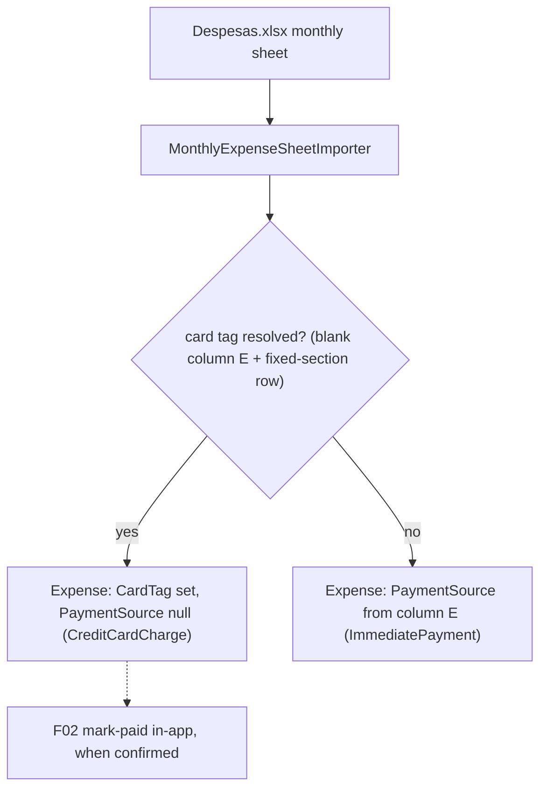

# F04. Historical Import Update

## 1. Technical Overview

**What:** Lock in the importer's payment-state rule: a row that resolves a `CreditCard` tag (the fixed-row-section heuristic, active only when its column E is blank) imports as a `CreditCardCharge` — card tag set, `PaymentSource = null`; every other row keeps resolving `PaymentSource` from column E exactly as before (blank → Barclays, "T" → Trading212, "C" → Chase). No row can import with both fields set. Settlement of imported months is applied afterward in-app via F02, never guessed by the importer.

**Why:** F01's wave already applied the minimal code change to `MonthlyExpenseSheetImporter` (a resolved card tag forces a null bank) because the new entity invariant would otherwise have thrown mid-wave. F04 is where the PRD houses this behavior, so this feature verifies it against the PRD's acceptance criteria with explicit importer-level tests, and updates the importer's documentation comment (which still describes the pre-P12 conflated shape via its F10 reference).

**Scope:**
- Included: importer doc-comment update; explicit AC tests — card-section rows import with null `PaymentSource` regardless of column E's content for the row (blank → card tag by position + null bank; non-blank T/C → no card tag, bank from the tag, unchanged precedence per the cashflow context: column E never identifies a card, an explicit tag means the row was paid directly); a whole-sheet assertion that no imported expense ever carries both fields.
- Excluded: any change to the precedence rule itself, to `MonthsWithFixedCardSections`, or to the section row map — the source spreadsheet is unchanged; the F03 migration (already shipped); UI (F05).

## 2. Architecture Impact

**Affected components:**
- `Integrations/CashFlowSpreadsheetImport/SheetImporters/MonthlyExpenseSheetImporter.cs` — doc comment only (logic landed with F01)
- `Tests/Financial.CashFlowSpreadsheetImport.Tests/SheetImporters/MonthlyExpenseSheetImporterTests.cs` — AC-level tests

## 3. Technical Decisions

| Decision | Chosen Approach | Alternative Considered | Trade-off |
|----------|-----------------|-------------------------|-----------|
| Column-E precedence | Unchanged: an explicit "T"/"C" in a card-section row still suppresses the card tag and resolves that bank | Let the fixed-row section override column E | The cashflow context is explicit that column E never identifies a card and blank/T/C is the only transaction-level payment detail; an explicit tag inside a card section means the row was actually paid directly from that bank. The PRD's "regardless of column-E value" governs the resolved-card case (no defaulted Barclays leaking in), which is what the code does. |
| Where the logic lives | Already in `MonthlyExpenseSheetImporter` since F01 (accommodation); F04 adds the AC-level tests and corrects the stale doc comment | Re-implement/move the rule | The rule is one expression; duplicating or relocating it would add nothing. The PRD's per-feature traceability is preserved through the tests added here. |
| "No both-fields row" guarantee | Asserted by a sheet-level test and enforced structurally — `Expense.Create` throws on the both-set shape, so a violating importer build cannot pass any import test | Post-import scan in the importer | The F01 invariant already makes the state unrepresentable; a runtime scan would be dead code. |

## 4. Component Overview

**Backend:**

| File Path | New/Modified | Purpose | Key Responsibilities |
|-----------|--------------|---------|-----------------------|
| `.../SheetImporters/MonthlyExpenseSheetImporter.cs` | Modified (comment) | Document the payment-state output shape | Doc comment states card rows import as unsettled charges with no bank, settlement applied in-app via F02 |
| `Tests/.../MonthlyExpenseSheetImporterTests.cs` | Modified | AC coverage | Card-section row with blank column E → card tag + null `PaymentSource`; card-section row with "T"/"C" → no card tag + that bank (precedence unchanged); non-section months unchanged; mixed sheet → zero expenses with both fields set |

## 5. API Contracts

None — console import tool only.

## 6. Data Model

No change; the importer emits F01's expense shape (`PaymentSource` null on card-tagged rows, `SettledAt` never set by import).

## 7. Testing Strategy

| Test File | Test Type | Target | Coverage |
|-----------|-----------|--------|----------|
| `Tests/Financial.CashFlowSpreadsheetImport.Tests/SheetImporters/MonthlyExpenseSheetImporterTests.cs` | Unit | Importer | (Existing, from F01) card-section rows → null bank; (new) explicit T/C in a card-section row still yields bank + no card; (new) whole-sheet mixed fixture — card rows, T/C rows, blank rows — imports with zero both-fields expenses and every row computing to `ImmediatePayment` or `CreditCardCharge` only |

**Acceptance tests (PRD Section 9, F04):**
- Row resolving a card tag → `CardTag` set + `PaymentSource = null` regardless of column E → existing F01 theory (card rows) + new precedence test documenting the non-blank case
- Row with no resolved card tag → `PaymentSource` from column E exactly as before → existing resolution tests + new precedence test
- No row imported with both fields set → new mixed-sheet test (+ structural guarantee via F01's invariant)

**Cross-Feature Integration criteria touching F04 (PRD Section 9):**
- "F04's updated importer produces expenses in the F01 shape with zero card-tagged rows carrying a non-null `PaymentSource`" → the mixed-sheet test asserts exactly this
