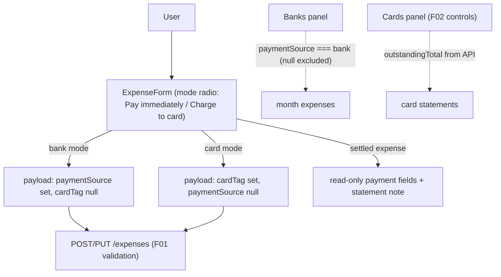

# F05. Expense Form & Panels UX Update

## 1. Technical Overview

**What:** Rework the Monthly expense create/edit form into two mutually exclusive modes — "Pay immediately" (bank picker only) and "Charge to card" (card picker only) — with mode switching clearing the irrelevant field, and a read-only payment display (with an explanatory note) when editing a `CreditCardSettled` expense. Add the Banks-panel and Cards-panel acceptance tests that pin the panel totals to the payment-state model.

**Why:** The form still renders both pickers side by side, so the UI can produce the both-set combination the server now rejects, and a settled expense's payment fields look editable when they aren't. The panels' computations are already correct after F01/F02 (bank totals key off `paymentSource`, which is null exactly for unsettled charges; outstanding totals sum only charges; the Cards panel controls shipped with F02) — F05 makes that behavior contractual with tests.

**Scope:**
- Included: form mode state in `useMonthly` (create + edit), mode-driven payloads (bank mode → `cardTag: null`; card mode → `paymentSource: null`, card required), settled-expense read-only handling, `MonthlyPage` form/UI changes, panel AC tests, removal of the now-redundant F01 transitional payload helper.
- Excluded: backend changes (none needed — F01/F02 contracts are final); Cards panel controls and totals (shipped in F02, kept as-is); WPF (the Monthly view is web-only).

## 2. Architecture Impact

**Affected components:**
- `Financial.Web/src/hooks/useMonthly.ts` — mode fields/actions, payload logic, card-required validation, settled-edit handling
- `Financial.Web/src/pages/MonthlyPage.tsx` — mode radio control, conditional pickers, settled read-only display + note
- `Financial.Web/src/hooks/useMonthly.test.ts`, `src/pages/__tests__/MonthlyPage.test.tsx` — mode/panel tests

## 3. Technical Decisions

| Decision | Chosen Approach | Alternative Considered | Trade-off |
|----------|-----------------|-------------------------|-----------|
| Mode representation | Explicit `'bank' \| 'card'` state per form (create and edit), rendered as two radio buttons; switching dispatches one action that sets the mode and clears the other field | Infer mode from which field is filled | An explicit mode is what makes the pickers mutually exclusive by construction (PRD AC: no UI path to a rejected combination); inference breaks on the blank-card default. |
| Edit-mode derivation | `SHOW_EDIT_FORM` derives the mode from the expense's server-computed `paymentStatus` (`CreditCardCharge` → card, otherwise bank); `CreditCardSettled` puts the form in a read-only payment display instead of either mode | Re-derive from field presence client-side | Uses the single server-side derivation (PRD cross-feature criterion) instead of a second client-side rule. |
| Settled expense editing | Date/description/value/category stay editable; payment fields render as plain text with the note "Settled via its card statement — unmark the statement paid to change"; save sends the unchanged `paymentSource`/`cardTag` (the F01 entity requires them unchanged and preserves `SettledAt`) | Block editing settled expenses entirely | The PRD only freezes the payment fields; blocking the rest would regress F01's `UpdateDetails` capability. |
| Card-required validation | Card mode with no card selected is rejected client-side ("Card is required") before the API call; bank mode always has a bank (existing Barclays default) | Let the server's both-null rejection surface | The server message ("payment source or a card tag") is phrased for the API shape, not the mode UI; a mode-aware message is clearer. Server validation remains the backstop. |
| Banks panel computation | Unchanged: filter `expense.paymentSource === bank` — under the state model this equals immediate-plus-settled-by-bank and excludes charges (null bank) by construction; F05 adds the AC test making it contractual | Re-filter via `paymentStatus` | The existing filter is already exactly the PRD formula with fewer moving parts; a status-based re-derivation would duplicate what `paymentSource`'s nullability already encodes. |
| Transitional helper removal | `toPaymentSourcePayload` (F01's bridge for the old two-picker form) is removed; payloads are built explicitly per mode | Keep routing through it | The helper's card-overrides-bank rule exists only because both pickers used to be visible; with modes, it is dead indirection. |

## 4. Component Overview

**Frontend:**

| File Path | New/Modified | Purpose | Key Responsibilities |
|-----------|--------------|---------|-----------------------|
| `Financial.Web/src/hooks/useMonthly.ts` | Modified | Form mode state | `createPaymentMode`/`editPaymentMode` (`'bank' \| 'card'`); `SET_CREATE_MODE`/`SET_EDIT_MODE` actions clearing the irrelevant field; `SHOW_EDIT_FORM` derives mode + `editIsSettled` from `paymentStatus`; `submitCreate`/`saveEdit` build mode-shaped payloads; card-required check; settled edit sends unchanged payment fields |
| `Financial.Web/src/pages/MonthlyPage.tsx` | Modified | Form UI | Mode radio group; bank select only in bank mode; card select (no blank option, required) only in card mode; settled: read-only payment text + note; Banks/Cards panels untouched |
| `Financial.Web/src/hooks/useMonthly.test.ts` | Modified | Hook tests | Mode switching clears the other field; payload shapes per mode; card-required error; settled edit payload unchanged; bank-totals AC (immediate + settled counted per bank, charges excluded) |
| `Financial.Web/src/pages/__tests__/MonthlyPage.test.tsx` | Modified | UI tests | Only one picker visible per mode; mode switch swaps pickers; settled expense shows read-only note; create-in-card-mode submits `paymentSource: null` |

## 5. API Contracts

None changed — the form consumes F01's expense endpoints and F02's statement endpoints exactly as already shipped.

## 6. Data Model

No change.

## 7. Testing Strategy

| Test File | Test Type | Target | Coverage |
|-----------|-----------|--------|----------|
| `src/hooks/useMonthly.test.ts` | Unit (vitest) | Hook | Default create mode is bank and sends `{ paymentSource, cardTag: null }`; card mode sends `{ paymentSource: null, cardTag }`; switching to bank clears the card and vice versa; card mode without a card → validation error, no API call; editing a charge opens card mode; editing a settled expense flags read-only and saves with unchanged payment fields; bank totals count immediate + settled per bank and exclude charges (AC formula) |
| `src/pages/__tests__/MonthlyPage.test.tsx` | Unit (vitest) | Form + panels | Bank mode shows only the bank picker; card mode shows only the card picker; radio switch swaps them; settled expense's edit panel shows the read-only note and no payment pickers; submitting a card-mode expense calls the client with `paymentSource: null`; Banks panel renders the per-bank totals from the hook |

**Acceptance tests (PRD Section 9, F05):**
- "Pay immediately" mode shows only the bank picker, saves as `ImmediatePayment` → page + hook tests (payload shape; status is server-computed from that shape per F01)
- "Charge to card" mode shows only the card picker, saves as `CreditCardCharge` → page + hook tests
- Settled expense's payment fields read-only with no direct edit path → page + hook tests
- Cards panel outstanding = sum of that card's charges → shipped and tested in F02 (`CardStatementServiceTests`, endpoint tests); UI reads `outstandingTotal` from the API unchanged
- Banks panel total = immediate + settled-by-bank, excluding charges → hook bank-totals AC test
- Mark Paid requires bank selection; paid statement shows Unmark Paid → shipped and tested in F02 (`MonthlyPage` tests)

**Cross-Feature Integration criteria touching F05 (PRD Section 9):**
- Panels reflect F02 cascade changes immediately after each action → existing F02 tests (mark/unmark re-fetch month data); bank-totals test covers the settled-expense contribution
- Form enforces F01's rule with no UI path to a rejected combination → mode tests (mutual exclusivity + card-required + settled read-only)
- Payment status derived identically everywhere → form uses server `paymentStatus` only; asserted in edit-mode derivation tests
