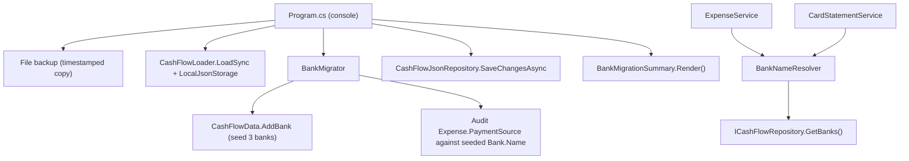

# F01. Bank Entity & Payment-Source Migration

## 1. Technical Overview

**What:** Replace the fixed `PaymentSource` enum (`Barclays`, `Trading212`, `Chase`) with a real `Bank` entity carrying a `Name` and a `RoundUpEnabled` flag, seeded with the 3 tracked banks. `Expense`'s bank reference is retyped from the old enum to a plain `string?` validated at runtime against the live `Bank` list instead of a compile-time enum. A new one-time, idempotent, backed-up console migration seeds the 3 banks into the live data file and verifies every existing expense's bank tag resolves against them, flagging anything that doesn't for manual review. Card statement settlement keeps its exact current behavior, now validating and settling against the `Bank` list instead of the enum.

**Why:** Nothing today can say "this bank rounds up card payments and this one doesn't" — `PaymentSource` is a bare enum with zero attributes. Later features in this PRD (F02's round-up eligibility check, F03's bank picker, F04's balance/round-up totals) all need to read a `RoundUpEnabled` flag per bank, which requires bank identity to be a real, attributed concept rather than a fixed enum member.

**Scope:**
- Included: `Bank` domain entity; `CashFlowData.Banks` collection; retyping `Expense`'s bank field from `PaymentSource?` to `string?`; removing the `PaymentSource` enum and its parser; a new `BankNameResolver` validating a bank name against the live `Bank` list; updates to `ExpenseService` and `CardStatementService` to validate/settle against `Bank` instead of the enum; a new console migration project (`Integrations/CashFlowBankMigration`) seeding the 3 banks and auditing existing expenses; updating `MonthlyExpenseSheetImporter` (the historical spreadsheet importer) to emit bank names instead of enum values; registering the new console + test projects in `Financial.slnx`.
- Excluded: any UI/API-visible change (the expense form's bank picker and the mark-paid picker keep reading/writing the exact same `string?` DTO fields they do today — F03 is a later feature); a Bank management screen (out of scope per PRD); any change to `CreditCard` or `InvestmentAccount`; round-up amount itself (F02).

## 2. Architecture Impact

**Affected components:**
- `Financial.CashFlow.Domain/Entities/Bank.cs` — new entity (`Name`, `RoundUpEnabled`)
- `Financial.CashFlow.Domain/Entities/Expense.cs` — `PaymentSource? PaymentSource` (enum) → `string? PaymentSource` (bank name)
- `Financial.CashFlow.Domain/Entities/CashFlowData.cs` — new `Banks` collection + `AddBank`
- `Financial.CashFlow.Domain/Enums/PaymentSource.cs` — deleted
- `Financial.CashFlow.Application/Interfaces/ICashFlowRepository.cs` — `GetBanks()` added
- `Financial.CashFlow.Application/Validation/BankNameResolver.cs` — new, replaces `PaymentSourceParser.cs` (deleted)
- `Financial.CashFlow.Application/Services/ExpenseService.cs` — validates bank name against live `Bank` list
- `Financial.CashFlow.Application/Services/CardStatementService.cs` — settles against `Bank` list instead of the enum
- `Financial.CashFlow.Infrastructure/Persistence/CashFlowTypeInfoResolver.cs` — `Bank` added to `ManagedTypes`
- `Financial.CashFlow.Infrastructure/Repositories/CashFlowJsonRepository.cs` — implements `GetBanks()`
- `Integrations/CashFlowBankMigration/` — new console project (seed + audit)
- `Integrations/CashFlowSpreadsheetImport/SheetImporters/MonthlyExpenseSheetImporter.cs` — emits bank name strings
- `Tests/Financial.CashFlowBankMigration.Tests/` — new xUnit project
- `Financial.slnx` — registers both new projects



## 3. Technical Decisions

| Decision | Chosen Approach | Alternative Considered | Trade-off |
|----------|-----------------|-------------------------|-----------|
| `Bank` identity shape | `string Name` + `bool RoundUpEnabled`, **no surrogate `Guid Id`** | `Guid Id` matching every other CashFlow entity (`Expense`, `CardStatement`, ...) | `Bank` is referenced everywhere by name (mirroring how `CardTag`/`Card` already match by enum value, not by a foreign-key id) and is never deleted/renamed (no management screen). This matches the Investment domain's `Broker` entity, which is also name-identified with no `Id`, for the same "small, permanent, name-referenced reference list" shape. Avoids inventing a foreign-key convention that exists nowhere else in this JSON-persisted domain. |
| `Expense`'s bank reference | Retype `PaymentSource? PaymentSource` (enum) to `string? PaymentSource`, **keep the property name and JSON/DTO shape unchanged**, validate at the Application layer against the live `Bank.Name` list | Rename to `BankName`/`BankId` (`Guid`) | A rename changes the JSON key or value shape for every existing expense record, which then requires rewriting every record during migration (and risks data loss if the rewrite has a bug). Keeping the exact wire shape means the migration only has to *add* the 3 banks — every existing `"PaymentSource": "Barclays"` value already matches a seeded bank's `Name` with zero mutation needed. This is a deliberate trade of naming purity for migration safety, consistent with the project's "no over-engineering" directive. The DTOs (`ExpenseDTO`, `ExpenseCreateDTO`, `ExpenseUpdateDTO`, `MarkStatementPaidDTO`) are untouched by this decision — they were already `string?`. |
| Migration mechanism | Reuse the exact typed-model pattern from P12-F03 (`CashFlowLoader.LoadSync` → mutate `CashFlowData` → `CashFlowJsonRepository.SaveChangesAsync`) | Raw `JsonNode` manipulation of the file, bypassing the typed model | Because the previous decision keeps the `Expense` JSON shape unchanged, there is no schema-breaking rename for the typed loader to stumble over — the only new JSON is an additive `Banks` array, which `CashFlowData`'s default-initialized empty list handles transparently on an old file. The simpler, already-proven typed-model pattern is safe to reuse as-is. |
| Idempotency | Seeding checks each of the 3 known `(Name, RoundUpEnabled)` pairs against `CashFlowData.Banks` by case-insensitive `Name` before adding; the per-expense pass is a **read-only audit** (count resolved vs. flagged), not a mutation, since no expense value changes | Track a separate "migrated" flag per expense | No field ever needs to change for an expense whose bank name already matches a seeded bank, so there's nothing to guard with a flag; the seeding idempotency alone (skip if already present) is sufficient, and a second run over already-migrated data seeds nothing new and flags nothing new. |
| Bank-name resolution | New `BankNameResolver.TryResolve(string? name, IReadOnlyCollection<Bank> banks, out Bank? bank)` — case-insensitive match on `Name`, called by `ExpenseService`/`CardStatementService` with `_repository.GetBanks()` | Keep `PaymentSourceParser`-style static `Enum.TryParse` | Bank names are now runtime data (seeded via migration, not compiled into the assembly), so resolution must consult the repository instead of a static `enum` — this is the direct replacement for `PaymentSourceParser`, following its `EnumParser`-style `TryParse(...)` shape but resolving against the live list instead of `Enum.TryParse`. |
| Backup discipline | Self-contained `MigrationBackup.cs` inside `Integrations/CashFlowBankMigration/`, copied from the P12-F03 pattern with a `bank-migration` timestamp segment, rather than extracting a shared helper | Extract a shared `Financial.Shared` backup utility used by both migration tools | Each one-off migration console tool in this codebase is already fully self-contained (P12-F03 did not extract a shared helper either); a 35-line duplicated file is cheaper than introducing a new shared Infrastructure dependency between two tools that only ever run once each. |

## 4. Component Overview

**Backend:**

| File Path | New/Modified | Purpose | Key Responsibilities |
|-----------|--------------|---------|-----------------------|
| `Financial.CashFlow.Domain/Entities/Bank.cs` | New | Bank identity | Private ctor + `Create(name, roundUpEnabled)` factory; `Name`, `RoundUpEnabled`, both private-set (immutable after creation — no update method, matching "no Bank management screen") |
| `Financial.CashFlow.Domain/Entities/Expense.cs` | Modified | Bank reference retype | `PaymentSource? PaymentSource` (enum) → `string? PaymentSource`; `PaymentStatus` computed property, `Create`, `UpdateDetails`, `Settle(string paymentSource, DateOnly settledAt)`, `Unsettle()`, `ValidatePaymentShape` all updated to the `string?` type; no behavioral change to the invariant itself (exactly one of bank-name/`CardTag` non-null) |
| `Financial.CashFlow.Domain/Entities/CashFlowData.cs` | Modified | Bank collection | `_banks`/`Banks` (`IReadOnlyCollection<Bank>`) following the existing private-list-plus-readonly-property pattern; `AddBank(Bank bank)`; no `RemoveBank` (banks are permanent) |
| `Financial.CashFlow.Domain/Enums/PaymentSource.cs` | Deleted | — | Replaced by `Bank` |
| `Financial.CashFlow.Application/Interfaces/ICashFlowRepository.cs` | Modified | Repository contract | `IEnumerable<Bank> GetBanks();` added (read-only — no `AddBank`/`DeleteBank`, matching "no Bank management screen"; the migration tool adds banks directly to `CashFlowData` before saving, the same way it always operated) |
| `Financial.CashFlow.Application/Validation/BankNameResolver.cs` | New | Bank name lookup | Static `TryResolve(string? name, IReadOnlyCollection<Bank> banks, out Bank? bank)`, case-insensitive match on `Name`; replaces `PaymentSourceParser` |
| `Financial.CashFlow.Application/Validation/PaymentSourceParser.cs` | Deleted | — | Replaced by `BankNameResolver` |
| `Financial.CashFlow.Application/Services/ExpenseService.cs` | Modified | Expense validation | `ValidateFields` becomes an instance method (needs `_repository.GetBanks()`); resolves `request.PaymentSource` via `BankNameResolver`, throwing `ArgumentException` on an unresolved name (same message shape as today, naming "bank" instead of "payment source"); `ToDto` passes the bank name straight through (still a `string?`, no lookup needed on the way out) |
| `Financial.CashFlow.Application/Services/CardStatementService.cs` | Modified | Settlement validation | `MarkStatementPaidAsync` resolves `request.PaymentSource` via `BankNameResolver` against `_repository.GetBanks()` before calling `charge.Settle(bank.Name, settledAt)`; `UnmarkStatementPaidAsync`'s rollback path is unaffected (it replays the expense's own already-stored `PaymentSource` string, no new resolution needed) |
| `Financial.CashFlow.Infrastructure/Persistence/CashFlowTypeInfoResolver.cs` | Modified | Serializer wiring | `typeof(Bank)` added to `ManagedTypes` so its private setters/ctor deserialize correctly |
| `Financial.CashFlow.Infrastructure/Repositories/CashFlowJsonRepository.cs` | Modified | Repository impl | `GetBanks() => _data.Banks;` |
| `Integrations/CashFlowBankMigration/CashFlowBankMigration.csproj` | New | Console project | Mirrors `CashFlowPaymentStateMigration.csproj` exactly: `net10.0` exe, references CashFlow Domain, CashFlow Infrastructure, Shared Infrastructure |
| `Integrations/CashFlowBankMigration/Program.cs` | New | Entry point | Args: `[dataPath]` (same default-resolution pattern); abort if missing; `MigrationBackup.Create`; `CashFlowLoader.LoadSync`; `BankMigrator.Migrate`; `CashFlowJsonRepository.SaveChangesAsync`; print `BankMigrationSummary.Render()`; exit 0/1 |
| `Integrations/CashFlowBankMigration/MigrationBackup.cs` | New | Backup helper | Static `Create(dataPath)`, copied from P12-F03's helper with a `bank-migration` timestamp segment |
| `Integrations/CashFlowBankMigration/BankMigrator.cs` | New | Seed + audit | Static `Migrate(CashFlowData data) : BankMigrationSummary`; seeds the 3 known `(Name, RoundUpEnabled)` pairs (`Barclays`/`false`, `Trading212`/`true`, `Chase`/`true`) idempotently by case-insensitive name check; then audits every expense's `PaymentSource` against the seeded names, counting resolved vs. flagging unresolved (non-null value that matches no seeded bank) for manual review; expenses with a null `PaymentSource` (credit-card charges) are counted as not-applicable and left untouched |
| `Integrations/CashFlowBankMigration/BankMigrationSummary.cs` | New | Run report | Counts: banks seeded / already present, expenses resolved / not-applicable / already-migrated-shape, a manual-review list (id, date, description, raw value) for unresolved tags; `Render()` string |
| `Integrations/CashFlowSpreadsheetImport/SheetImporters/MonthlyExpenseSheetImporter.cs` | Modified | Historical import | `ResolvePaymentSource` returns `string` (`"Trading212"`, `"Chase"`, `"Barclays"`) instead of the `PaymentSource` enum; `Expense.Create` call site updated to the new `string?` parameter type; behavior (tag-to-bank mapping) unchanged |
| `Tests/Financial.CashFlowBankMigration.Tests/Financial.CashFlowBankMigration.Tests.csproj` | New | Test project | Same package set as `Financial.CashFlowPaymentStateMigration.Tests`; references the console project |
| `Tests/Financial.CashFlowBankMigration.Tests/BankMigratorTests.cs`, `MigrationBackupTests.cs` | New | Unit tests | See Section 7 |
| `Financial.slnx` | Modified | Solution | Registers `Integrations/CashFlowBankMigration` and `Tests/Financial.CashFlowBankMigration.Tests` |

## 5. API Contracts

None — no HTTP contract changes. `ExpenseDTO`, `ExpenseCreateDTO`, `ExpenseUpdateDTO`, and `MarkStatementPaidDTO` all already expose `PaymentSource` as `string?`; their JSON shape is unchanged by this feature (per Section 3's key decision). The bank name each now carries is validated against the live `Bank` list rather than a fixed enum, but the request/response contracts themselves are byte-for-byte identical to what P12 shipped.

Migration tool invocation (unchanged shape from P12-F03): `dotnet run --project Integrations/CashFlowBankMigration [path\to\data-cashflow.json]`.

## 6. Data Model

`data-cashflow.json` gains one new top-level array, `Banks`, holding the 3 seeded rows:

```json
{
  "Banks": [
    { "Name": "Barclays", "RoundUpEnabled": false },
    { "Name": "Trading212", "RoundUpEnabled": true },
    { "Name": "Chase", "RoundUpEnabled": true }
  ]
}
```

No other top-level collection's shape changes. Every existing `Expense` record's `PaymentSource` field keeps its exact current key name and string value (e.g. `"PaymentSource": "Barclays"` or `"PaymentSource": null`) — the migration performs no per-record rewrite, only an audit pass (Section 3). The backup file `data-cashflow.backup-bank-migration-<timestamp>.json` is created beside the data file before any write.

## 7. Testing Strategy

| Test File | Test Type | Target | Coverage |
|-----------|-----------|--------|----------|
| `Tests/Financial.CashFlow.Domain.Tests/Entities/BankTests.cs` | Unit | `Bank` | `Create` sets `Name`/`RoundUpEnabled`; equal names produce distinct instances (no uniqueness enforcement at the entity level — that's the migrator's job) |
| `Tests/Financial.CashFlow.Domain.Tests/Entities/ExpenseTests.cs` | Unit | `Expense` | Existing suite updated to `string?` bank values (e.g. `"Barclays"` instead of `PaymentSource.Barclays`); invariant tests (`Create_WithBothPaymentSourceAndCardTag_Throws`, `Create_WithNeitherPaymentSourceNorCardTag_Throws`, `Settle`/`Unsettle`/`UpdateDetails`-on-settled behavior) unchanged in intent, only the value type changes |
| `Tests/Financial.CashFlow.Domain.Tests/Entities/CashFlowDataTests.cs` | Unit | `CashFlowData` | `AddBank` appends to `Banks`; `Banks` starts empty on `Create()` |
| `Tests/Financial.CashFlow.Application.Tests/Validation/BankNameResolverTests.cs` | Unit | `BankNameResolver` | Resolves an exact-case name; resolves case-insensitively; returns `false`/`null` for an unseeded name; returns `false` for null/empty input |
| `Tests/Financial.CashFlow.Application.Tests/Services/ExpenseServiceTests.cs` | Unit | `ExpenseService` | Existing suite updated: valid bank name resolves and saves; unrecognized bank name throws `ArgumentException`; credit-card-tagged expense (no bank name) still validates as before; `ToDto` round-trips the bank name string unchanged |
| `Tests/Financial.CashFlow.Application.Tests/Services/CardStatementServiceTests.cs` | Unit | `CardStatementService` | Existing suite updated: mark-paid with a valid bank name settles every outstanding charge; mark-paid with an unrecognized bank name throws and leaves state untouched; unmark-paid rollback behavior unchanged (byte-for-byte, per PRD AC) |
| `Tests/Financial.CashFlow.Infrastructure.Tests/Persistence/CashFlowSerializerAdapterTests.cs` | Unit | Serializer | `Bank` round-trips through `CashFlowTypeInfoResolver`'s private-setter wiring (serialize + deserialize a `CashFlowData` containing banks, assert field equality) |
| `Tests/Financial.CashFlowBankMigration.Tests/BankMigratorTests.cs` | Unit | `BankMigrator` | Seeds all 3 banks with correct `RoundUpEnabled` values on an empty `CashFlowData`; second run seeds nothing new (idempotent); expense with a matching bank name counted as resolved, value untouched; expense with `CardTag` set (no bank name) counted as not-applicable, untouched; expense with an unresolvable bank name flagged for manual review, value untouched; already-seeded banks (partial prior run) are detected and skipped individually |
| `Tests/Financial.CashFlowBankMigration.Tests/MigrationBackupTests.cs` | Unit | Backup helper | Creates a timestamped copy with identical content beside the source; distinct name per call; throws when source missing |
| Historical import: `Integrations/CashFlowSpreadsheetImport` test project (existing, path TBD by implementer if not already present) | Unit | `MonthlyExpenseSheetImporter` | `ResolvePaymentSource` returns the same tag-to-bank-name mapping as before, now as `string` instead of enum |

**Acceptance tests (PRD Section 9, F01):**
- 3 seeded banks carry correct `RoundUpEnabled` values immediately after migration → `BankMigratorTests`
- Every expense's bank tag correctly resolves to the matching `Bank` after migration → `BankMigratorTests` (resolved-count assertions) + `BankNameResolverTests`
- Second run is idempotent → `BankMigratorTests`
- Backup exists independent of run outcome → `MigrationBackupTests` + `Program.cs` ordering (backup is the first side effect, by construction)
- Card statement settlement (mark paid / unmark paid) continues to function exactly as before, now referencing a bank → `CardStatementServiceTests`

**Cross-Feature Integration criteria touching F01 (PRD Section 9):**
- "F02's round-up suggestion and eligibility check correctly read each bank's `RoundUpEnabled` flag as defined by F01" → guaranteed by `ICashFlowRepository.GetBanks()` exposing the full `Bank` (including `RoundUpEnabled`) to any consumer, asserted here only insofar as `BankNameResolver`/`GetBanks()` round-trip the flag correctly (`BankNameResolverTests`, `CashFlowDataTests`)
- "F03's bank picker... correctly reflect the bank list... from F01" and "F04's balance and round-up total calculations correctly group expenses by the bank identity defined by F01" → both depend on `GetBanks()` and `Expense.PaymentSource` being stable, correctly-typed contracts, covered here by `CashFlowJsonRepository` and `ExpenseService`/`CardStatementService` test coverage; the consuming behavior itself is verified in F02/F03/F04's own specs
