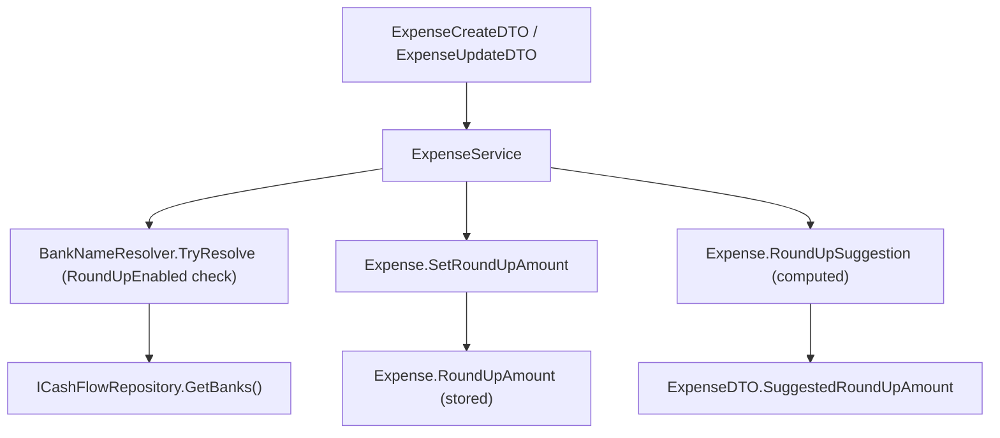

# F02. Expense Round-Up Capture

## 1. Technical Overview

**What:** `Expense` gains an optional stored round-up amount (`decimal? RoundUpAmount`) and a computed suggestion (`decimal RoundUpSuggestion`, the difference to the next whole £1). A round-up amount is settable only on an `ImmediatePayment` expense (bank-paid, not a credit-card charge), restricted to £0.00–£0.99, and — critically — is never recalculated when the expense's `Value` is edited afterward; only an explicit new value in the request changes it. `ExpenseService` additionally validates, when a non-null amount is supplied, that the expense's resolved bank has `RoundUpEnabled = true` (via F01's `BankNameResolver`/`ICashFlowRepository.GetBanks()`), and exposes a `SuggestedRoundUpAmount` in the read DTO whenever the expense is eligible and no amount has been saved yet.

**Why:** The suggestion and the saved amount need to travel together everywhere an expense is read or written (F03's form, F04's balance totals), so both are added to the existing `Expense`/`ExpenseDTO`/create-update DTO surface rather than as a separate concept — consistent with how `PaymentStatus` is already a derived, always-present field alongside the stored payment fields.

**Scope:**
- Included: `Expense.RoundUpAmount` (stored) and `Expense.RoundUpSuggestion` (computed, pure math over `Value`); a domain-level eligibility guard (`ImmediatePayment`-only) and range check (£0.00–£0.99); `ExpenseService` eligibility check against the live `Bank` list; `RoundUpAmount`/`SuggestedRoundUpAmount` on the DTOs; full-replace update semantics identical to every other expense field (whatever the request carries — including `null` — becomes the new stored value).
- Excluded: any UI (F03); balance/round-up total calculations (F04); credit-card charge/settled expenses (round-up never applies, per PRD Out of Scope); a Bank management screen (F01's scope, already shipped).

## 2. Architecture Impact

**Affected components:**
- `Financial.CashFlow.Domain/Entities/Expense.cs` — `RoundUpAmount` field, `RoundUpSuggestion` computed property, `SetRoundUpAmount(decimal?)` method
- `Financial.CashFlow.Application/DTOs/ExpenseDTO.cs` — `RoundUpAmount`, `SuggestedRoundUpAmount`
- `Financial.CashFlow.Application/DTOs/ExpenseCreateDTO.cs`, `ExpenseUpdateDTO.cs` — `RoundUpAmount` (request input)
- `Financial.CashFlow.Application/Services/ExpenseService.cs` — bank round-up-eligibility check, suggestion computation in `ToDto`



## 3. Technical Decisions

| Decision | Chosen Approach | Alternative Considered | Trade-off |
|----------|-----------------|-------------------------|-----------|
| Where eligibility is enforced | Split across layers: `Expense.SetRoundUpAmount` rejects any non-null amount unless `PaymentStatus == ImmediatePayment` (pure, no external data needed); `ExpenseService` separately rejects a non-null amount when the resolved bank's `RoundUpEnabled` is `false` (needs the live `Bank` list, which only Application can reach via the repository) | Push both checks into Application, keeping `Expense` naive | `Expense` already knows its own payment shape (it derives `PaymentStatus` from its own fields), so the shape check belongs with the entity per Clean Architecture (Domain owns its own invariants); only the cross-entity `RoundUpEnabled` lookup needs Application/repository access. |
| Setting `null` is always allowed, unconditionally | `SetRoundUpAmount(null)` short-circuits before any eligibility/range check and simply clears the field | Still validating eligibility even when clearing | Clearing removes data — it can never violate an invariant, regardless of the expense's current shape (e.g., clearing after switching an expense from bank-paid to card-charged must succeed, not throw). The AC "it can be cleared back to 'not yet decided'" needs this to work unconditionally. |
| Update semantics | Full-replace, exactly like every other `ExpenseUpdateDTO` field: `ExpenseService.UpdateExpenseAsync` always calls `expense.SetRoundUpAmount(request.RoundUpAmount)` once after `UpdateDetails`, regardless of whether the value looks unchanged | A dedicated `PATCH`-style "only touch round-up if provided" endpoint | The PRD requires that editing `Value` never recalculates a saved `RoundUpAmount` — that guarantee lives entirely in the client (F03) always resending the *current* stored amount, never a freshly recomputed suggestion, exactly mirroring how `Date`/`Description`/`Category` are already resent unchanged on every edit. No new endpoint or partial-update machinery is needed. |
| Suggestion computation ownership | `Expense.RoundUpSuggestion` is a plain computed property (`Math.Ceiling(Value) - Value`), always present with no eligibility gating of its own — mirrors the existing `PaymentStatus` computed-property pattern (harmless to compute even when not applicable) | Compute the suggestion inline in `ExpenseService` only | Keeping the arithmetic on the entity (pure function of `Value`) is testable in isolation exactly like `PaymentStatus`, and matches this codebase's established convention of computed properties serializing harmlessly alongside stored fields (see F01/P12-F03 precedent: `PaymentStatus` already round-trips into `data-cashflow.json` even though it's derived). |
| Suggestion exposure gating | `ExpenseService.ToDto` sets `ExpenseDTO.SuggestedRoundUpAmount` to `expense.RoundUpSuggestion` only when `RoundUpAmount is null && PaymentStatus == ImmediatePayment && ` the resolved bank's `RoundUpEnabled == true`; otherwise `null` | Always expose the raw suggestion, let the frontend decide whether to show it | The PRD's eligibility rule ("no suggestion... for a non-round-up bank or credit-card-tagged expenses") is a business rule, not a display concern — it belongs in the Application layer, which is the only layer that can resolve the bank's `RoundUpEnabled` flag. |
| Bank resolution reuse | Reuse F01's `BankNameResolver.TryResolve` against `_repository.GetBanks()` — the exact same call `ExpenseService.ValidateFields` already makes to validate `PaymentSource` | A dedicated round-up-specific bank lookup | No new abstraction needed; the resolver is already a pure, stateless, reusable lookup. |

## 4. Component Overview

**Backend:**

| File Path | New/Modified | Purpose | Key Responsibilities |
|-----------|--------------|---------|-----------------------|
| `Financial.CashFlow.Domain/Entities/Expense.cs` | Modified | Round-up storage + invariant | `RoundUpAmount` (`decimal?`, private set); `RoundUpSuggestion` (`decimal`, computed `Math.Ceiling(Value) - Value`); `SetRoundUpAmount(decimal? amount)`: `null` always clears; non-null requires `PaymentStatus == ImmediatePayment` (else throws) and `0m <= amount <= 0.99m` (else throws) |
| `Financial.CashFlow.Application/DTOs/ExpenseDTO.cs` | Modified | Read model | `decimal? RoundUpAmount` (stored value); `decimal? SuggestedRoundUpAmount` (eligibility-gated, null when not applicable or already saved) |
| `Financial.CashFlow.Application/DTOs/ExpenseCreateDTO.cs` | Modified | Create request | `decimal? RoundUpAmount` (optional, defaults to "not yet decided") |
| `Financial.CashFlow.Application/DTOs/ExpenseUpdateDTO.cs` | Modified | Update request | `decimal? RoundUpAmount` (full-replace, same as every other field) |
| `Financial.CashFlow.Application/Services/ExpenseService.cs` | Modified | Business rules | `AddExpenseAsync`/`UpdateExpenseAsync` call a new private `ValidateRoundUpEligibility(decimal? amount, string? paymentSource)` (resolves the bank via `BankNameResolver` + `_repository.GetBanks()`, throws `ArgumentException` naming the bank when `RoundUpEnabled` is `false`) before calling `expense.SetRoundUpAmount(amount)`; `ToDto` computes `SuggestedRoundUpAmount` per the gating rule in Section 3 |

## 5. API Contracts

**Endpoint: Create Expense** (existing, extended)
- **Method:** POST
- **Path:** `/api/v1/financial/expenses`

**Request (added field):**

| Field | Type | Required | Validation | Description |
|-------|------|----------|------------|--------------|
| `roundUpAmount` | `decimal?` | No | `0.00`–`0.99` inclusive; only settable when `paymentSource` resolves to a `RoundUpEnabled` bank and `cardTag` is absent | Round-up amount to save immediately; omit/`null` to leave "not yet decided" |

**Request Example:**
```json
{
  "date": "2026-07-15",
  "description": "Weekly groceries",
  "value": 9.40,
  "category": "Mercado",
  "paymentSource": "Trading212",
  "cardTag": null,
  "roundUpAmount": 0.60
}
```

**Response (added fields):**

| Field | Type | Description |
|-------|------|--------------|
| `roundUpAmount` | `decimal?` | Currently saved round-up amount, or `null` if not yet decided |
| `suggestedRoundUpAmount` | `decimal?` | `ceil(value) - value`, present only when eligible and `roundUpAmount` is `null` |

**Response Example:**
```json
{
  "id": "550e8400-e29b-41d4-a716-446655440000",
  "date": "2026-07-15",
  "description": "Weekly groceries",
  "value": 9.40,
  "category": "Mercado",
  "paymentSource": "Trading212",
  "cardTag": null,
  "settledAt": null,
  "paymentStatus": "ImmediatePayment",
  "roundUpAmount": 0.60,
  "suggestedRoundUpAmount": null
}
```

**Endpoint: Update Expense** (existing, extended) — same `roundUpAmount` field added to the request body, full-replace semantics (see Section 3).

**Error Codes (added):**

| Code | HTTP Status | Description |
|------|-------------|--------------|
| N/A (existing `ArgumentException` → 400 pattern) | 400 | Round-up amount on a credit-card-tagged expense: "Round-up only applies to an expense paid directly from a bank, not a credit-card charge." |
| N/A | 400 | Round-up amount on a non-round-up bank: "Bank '{name}' does not support round-up." |
| N/A | 400 | Round-up amount outside £0.00–£0.99: "Round-up amount must be between £0.00 and £0.99." |

## 6. Data Model

`Expense` records in `data-cashflow.json` gain one new field, `RoundUpAmount` (nullable decimal), defaulting to absent/`null` on every pre-existing record (no migration needed — matches PRD's "Historical round-up backfill" Out-of-Scope item). The computed `RoundUpSuggestion` is **not** persisted as a new top-level concept exposed via the API contract, but — mirroring the existing `PaymentStatus` computed property — it does serialize onto the `Expense` JSON object as a harmless derived field, ignored on deserialization (no setter, same mechanism as `PaymentStatus`).

```json
{
  "Id": "...",
  "Date": "2026-07-15",
  "Description": "Weekly groceries",
  "Value": 9.40,
  "Category": "Mercado",
  "PaymentSource": "Trading212",
  "CardTag": null,
  "SettledAt": null,
  "RoundUpAmount": 0.60,
  "PaymentStatus": "ImmediatePayment",
  "RoundUpSuggestion": 0.60
}
```

## 7. Testing Strategy

| Test File | Test Type | Target | Coverage |
|-----------|-----------|--------|----------|
| `Tests/Financial.CashFlow.Domain.Tests/Entities/ExpenseTests.cs` | Unit | `Expense` | `RoundUpSuggestion` computes `ceil(value) - value` for various values (including an already-whole £ value → `0.00`); `SetRoundUpAmount` on an `ImmediatePayment` expense within range succeeds; on a `CreditCardCharge`/`CreditCardSettled` expense throws; outside £0.00–£0.99 throws (both bounds, above and below); exactly `0.00` and exactly `0.99` succeed; `SetRoundUpAmount(null)` always succeeds regardless of shape, including clearing a previously-set amount; `UpdateDetails` never touches `RoundUpAmount` |
| `Tests/Financial.CashFlow.Application.Tests/Services/ExpenseServiceTests.cs` | Unit | `ExpenseService` | `AddExpenseAsync`/`UpdateExpenseAsync` with a valid `RoundUpAmount` against a `RoundUpEnabled` bank saves it; against a non-round-up bank (e.g. Barclays) throws naming the bank; on a credit-card-tagged request throws; outside range throws; `ToDto` returns `SuggestedRoundUpAmount = 0.60` for a £9.40 expense on a round-up-enabled bank with no saved amount; returns `null` suggestion once an amount is saved; returns `null` suggestion for a non-round-up bank; returns `null` suggestion for a credit-card charge; editing only `Value` (resending the same `RoundUpAmount`) leaves it unchanged; explicitly submitting a new `RoundUpAmount` on update changes it; submitting `null` on update clears a previously-saved amount |
| `Tests/Financial.Api.Tests/ExpenseEndpointsTests.cs` | Integration | Expense endpoints | POST with a valid round-up amount against a round-up-enabled bank returns 200 with `roundUpAmount` set; POST against Barclays (round-up disabled) with a round-up amount returns 400; POST with a round-up amount and a `cardTag` returns 400; GET-by-month response includes `suggestedRoundUpAmount` for an eligible, unsaved expense |

**Acceptance tests (PRD Section 9, F02):**
- £9.40 on a `RoundUpEnabled` bank suggests £0.60 → `ExpenseServiceTests` + `ExpenseEndpointsTests`
- Round-up on a credit-card-tagged expense rejected → `ExpenseTests` (`SetRoundUpAmount` shape guard) + `ExpenseServiceTests`/`ExpenseEndpointsTests`
- Round-up on a `RoundUpEnabled = false` bank rejected → `ExpenseServiceTests`/`ExpenseEndpointsTests`
- Outside £0.00–£0.99 rejected → `ExpenseTests` + `ExpenseServiceTests`
- Exactly £0.00 can be saved → `ExpenseTests` + `ExpenseServiceTests`
- Editing `Value` after saving leaves `RoundUpAmount` unchanged → `ExpenseServiceTests`
- A saved amount can be directly edited later → `ExpenseServiceTests`

**Cross-Feature Integration criteria touching F02 (PRD Section 9):**
- "F02's round-up suggestion and eligibility check correctly read each bank's `RoundUpEnabled` flag as defined by F01" → `ExpenseServiceTests` (suggestion/rejection tests directly exercise `BankNameResolver` + `ICashFlowRepository.GetBanks()` from F01)
