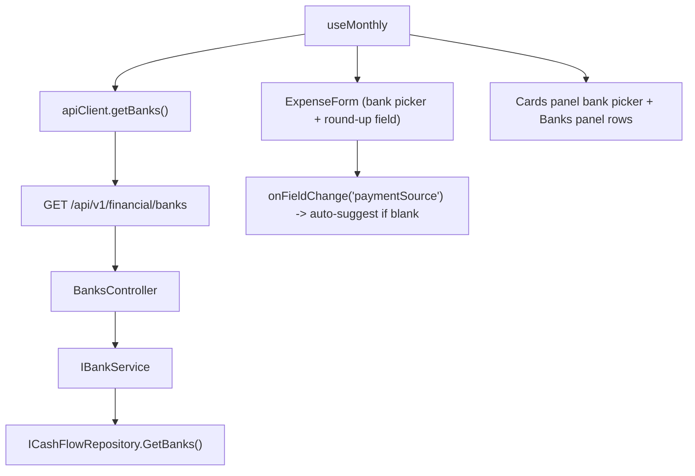

# F03. Expense Form Bank Picker & Round-Up UX

## 1. Technical Overview

**What:** The expense form's bank picker and the card-statement "mark paid" bank picker stop reading from the frontend's hardcoded `PAYMENT_SOURCES` constant and instead read from a new `GET /api/v1/financial/banks` endpoint (backed by F01's `Bank` entity via a new thin `IBankService`). When the user picks a `RoundUpEnabled` bank in "pay immediately" mode, a round-up amount field appears, pre-filled with a client-computed suggestion (`ceil(value) − value`) the moment the bank is picked — never overwriting a value the user has already typed. Editing an existing expense pre-fills the field from the expense's own saved `roundUpAmount` (never a freshly recomputed suggestion), and saving always resends whatever is currently in the field, so a `Value`-only edit leaves it untouched.

**Why:** F01 already moved bank identity into a real `Bank` entity (`Name`, `RoundUpEnabled`), but nothing on the backend exposes that list over HTTP yet, and the frontend has no `roundUpAmount`/`suggestedRoundUpAmount` fields at all despite the backend DTOs (`ExpenseDTO`, `ExpenseCreateDTO`, `ExpenseUpdateDTO`) shipping them in F02. F03 closes both gaps together, since the round-up field's visibility rule depends directly on the fetched bank list's `RoundUpEnabled` flag.

**Scope:**
- Included: `GET /banks` endpoint (`BanksController` → new `IBankService`/`BankService` → `ICashFlowRepository.GetBanks()`); `BankDTO`; frontend `BankDto` type, `getBanks` API client method, `banks` state in `useMonthly`, replacing every `PAYMENT_SOURCES` usage (expense form bank picker, mark-paid bank picker, Banks-panel row list) with the fetched list; `roundUpAmount`/`suggestedRoundUpAmount` added to `ExpenseDto`, `roundUpAmount` added to `CreateExpenseDto`/`UpdateExpenseDto`; the round-up input field, its visibility rule, its create-time auto-suggestion, and its edit-time saved-value pre-fill.
- Excluded: any change to the Banks panel's *balance/total calculation* (still `sum(Value)`, unchanged — F04's scope); a bank management screen (out of scope per PRD); categories/card-tag pickers (remain hardcoded, untouched); the round-up *validation/eligibility* business rules themselves (already enforced server-side by F02 — this feature only surfaces them in the UI and mirrors basic client-side range/mode checks for immediate feedback, exactly like the existing `value` non-zero check).

## 2. Architecture Impact

**Affected components:**
- `Financial.CashFlow.Application/DTOs/BankDTO.cs` — new (`Name`, `RoundUpEnabled`)
- `Financial.CashFlow.Application/Interfaces/IBankService.cs` — new
- `Financial.CashFlow.Application/Services/BankService.cs` — new
- `Financial.CashFlow.Application/DependencyInjection/CashFlowApplicationServiceCollectionExtensions.cs` — registers `IBankService`
- `Financial.Api/Controllers/BanksController.cs` — new (`GET /banks`)
- `Financial.Web/src/api/types.ts` — `BankDto`; `roundUpAmount`/`suggestedRoundUpAmount` on `ExpenseDto`; `roundUpAmount` on `CreateExpenseDto`/`UpdateExpenseDto`
- `Financial.Web/src/api/financialApiClient.ts` — `getBanks`
- `Financial.Web/src/hooks/useMonthly.ts` — `banks` state (replacing the `PAYMENT_SOURCES` export), round-up form fields, bank-pick-triggered suggestion, full-replace submit wiring
- `Financial.Web/src/pages/MonthlyPage.tsx` — round-up input field, bank pickers sourced from `banks`



## 3. Technical Decisions

| Decision | Chosen Approach | Alternative Considered | Trade-off |
|----------|-----------------|-------------------------|-----------|
| Bank list access pattern | New thin `IBankService`/`BankService` wrapping `ICashFlowRepository.GetBanks()`, mirroring every other list-returning service (`IMensaisService`, `ICardStatementService`, ...) | `BanksController` calling `ICashFlowRepository` directly | Every existing list endpoint in this codebase goes through a service, never straight from a controller to the repository — matching that convention keeps the Presentation layer free of business/data-access logic per this project's layering rules. |
| Fetching banks in `useMonthly` | Add `apiClient.getBanks()` to the existing `Promise.all` in the mount effect, alongside `getExpensesByMonth`/`getCategoryTotalsByMonth`/`getCardStatementsByMonth`; store as `state.banks: BankDto[]` | A separate one-time fetch on mount, independent of the month-based refetch | Banks never change per month, but re-fetching them alongside the existing month fetch is one extra parallel network call with no added complexity, and keeps a single `isLoading`/`error` state covering the whole page rather than a second loading flag. |
| Replacing the `PAYMENT_SOURCES` export | Remove the constant entirely; add `banks: BankDto[]` to `MonthlyData`; every current call site (expense-form bank picker, mark-paid bank picker, `bankTotals` names) reads from the hook's returned `banks` instead | Keep `PAYMENT_SOURCES` as a fallback/default and merge with fetched data | The PRD explicitly frames this as banks becoming backend-driven so "adding a new bank... doesn't require a form rewrite" (F01 user story) — keeping any hardcoded fallback defeats that goal. |
| Create-time suggestion trigger | Compute the suggestion (`Math.ceil(value) - value`, mirroring backend `Expense.RoundUpSuggestion`) once, at the moment `paymentSource` changes to a `RoundUpEnabled` bank while in "pay immediately" mode — and only if `createRoundUpAmount` is currently blank (never overwrite what the user already typed) | Recompute on every `Value` keystroke while a round-up-enabled bank is selected | The form's natural field order (Date → Description → Category → Value → Payment section) means `Value` is already entered by the time the user reaches the bank picker, so triggering on bank selection captures the real value. Recomputing on every `Value` edit afterward would silently overwrite a suggestion the user may have already accepted or edited — inconsistent with the backend's "never recalculated once saved" philosophy extended sensibly to the create form. |
| Edit-time pre-fill | `SHOW_EDIT_FORM` sets `editRoundUpAmount` straight from `expense.roundUpAmount` (nullable), never from `expense.suggestedRoundUpAmount` | Show the suggestion if `roundUpAmount` is null | AC requires the edit field to show "its currently saved round-up amount... not a freshly recomputed suggestion" — even when there is no saved amount yet, showing nothing (blank) is the correct "not yet decided" state, not a suggestion. |
| Full-replace submit semantics | `submitCreate`/`saveEdit` always send `roundUpAmount: (mode === 'bank' && selectedBank?.roundUpEnabled && amount.trim() !== '') ? Number(amount) : null` | Only send the field when the user has explicitly interacted with it | Mirrors the existing `paymentSource`/`cardTag` mode-based nulling already in both functions; guarantees a stale value left over from a previously-selected round-up-enabled bank is never sent once the user switches to an ineligible bank or card mode, without needing extra "has the user touched this" tracking. |
| Round-up field visibility | `paymentMode === 'bank' && banks.find(b => b.name === paymentSource)?.roundUpEnabled === true` | A separate `roundUpEnabled` flag threaded through form state | Deriving it directly from the already-available `banks` list and the selected `paymentSource` needs no additional state to keep in sync. |
| Client-side range check | Mirror the backend's £0.00–£0.99 bounds with the same lightweight inline check pattern already used for `value` (`isFinite`/zero check in `submitCreate`/`saveEdit`) | Skip client validation, rely entirely on the server's 400 response | Consistent with this codebase's existing light-client/authoritative-server validation split; avoids a round-trip for the single most common mistake (typing outside range). |

## 4. Component Overview

**Backend:**

| File Path | New/Modified | Purpose | Key Responsibilities |
|-----------|--------------|---------|-----------------------|
| `Financial.CashFlow.Application/DTOs/BankDTO.cs` | New | Read model | `required string Name`, `required bool RoundUpEnabled` |
| `Financial.CashFlow.Application/Interfaces/IBankService.cs` | New | Service contract | `IReadOnlyList<BankDTO> GetBanks();` |
| `Financial.CashFlow.Application/Services/BankService.cs` | New | Service impl | Constructor-injects `ICashFlowRepository`; `GetBanks()` maps `_repository.GetBanks()` to `BankDTO` |
| `Financial.CashFlow.Application/DependencyInjection/CashFlowApplicationServiceCollectionExtensions.cs` | Modified | DI | `services.AddSingleton<IBankService, BankService>();` |
| `Financial.Api/Controllers/BanksController.cs` | New | Endpoint | `[Route("banks")]`, constructor-injects `IBankService`, `[HttpGet]` → `Ok(_bankService.GetBanks())`, no body/params |

**Frontend:**

| File Path | New/Modified | Purpose | Key Responsibilities |
|-----------|--------------|---------|-----------------------|
| `Financial.Web/src/api/types.ts` | Modified | Types | `BankDto { name: string; roundUpEnabled: boolean }`; `ExpenseDto` gains `roundUpAmount: number \| null`, `suggestedRoundUpAmount: number \| null`; `CreateExpenseDto`/`UpdateExpenseDto` gain `roundUpAmount: number \| null` |
| `Financial.Web/src/api/financialApiClient.ts` | Modified | API client | `FinancialApiClient.getBanks: () => Promise<BankDto[]>`; impl `getBanks: () => request<BankDto[]>('/banks')` |
| `Financial.Web/src/hooks/useMonthly.ts` | Modified | State/logic | Removes the `PAYMENT_SOURCES` export; adds `banks: BankDto[]` to state (fetched in the mount effect's `Promise.all`) and to `MonthlyData`; adds `createRoundUpAmount`/`editRoundUpAmount` to `CreateFormField`/`EditField`/state/`MonthlyData`; `SET_CREATE_FIELD`/`SET_EDIT_FIELD` special-case the payment-source field to auto-suggest (Section 3); `bankTotals` iterates `state.banks` instead of `PAYMENT_SOURCES`; `BLANK_CREATE_FORM.createPaymentSource` starts `''` (no bank known yet); `SET_CREATE_MODE`/`SET_EDIT_MODE` default the payment source to `state.banks[0]?.name ?? ''` instead of the literal `'Barclays'`; `submitCreate`/`saveEdit` compute and send `roundUpAmount` per Section 3's full-replace rule, plus the client-side range check |
| `Financial.Web/src/pages/MonthlyPage.tsx` | Modified | UI | Bank `<select>` (expense form) and mark-paid bank `<select>` (Cards panel) both render from `banks` instead of `PAYMENT_SOURCES`; new round-up `<input type="number" step="0.01">` field, shown per Section 3's visibility rule, wired through the existing `onFieldChange`/`CREATE_FIELD_BY_FORM_FIELD`/`EDIT_FIELD_BY_FORM_FIELD` plumbing (`roundUpAmount` added to `ExpenseFormField` and both maps) |

## 5. API Contracts

**Endpoint: List Banks**
- **Method:** GET
- **Path:** `/api/v1/financial/banks`
- **Authentication:** None (matches every other endpoint in this app)

**Request:** none.

**Response (Success — 200):**

| Field | Type | Description |
|-------|------|--------------|
| `[].name` | `string` | Bank name |
| `[].roundUpEnabled` | `boolean` | Whether this bank rounds up card payments |

**Response Example:**
```json
[
  { "name": "Barclays", "roundUpEnabled": false },
  { "name": "Trading212", "roundUpEnabled": true },
  { "name": "Chase", "roundUpEnabled": true }
]
```

**Existing endpoints (extended, no route/method change):** `POST /expenses`, `PUT /expenses/{id}` request bodies gain `roundUpAmount: number | null`; their response body and `GET /expenses/month/{year}/{month}` responses gain `roundUpAmount`/`suggestedRoundUpAmount` — these were already shipped server-side in F02 (`ExpenseDTO`/`ExpenseCreateDTO`/`ExpenseUpdateDTO`), F03 only adds them to the frontend's TypeScript types and wires the form to use them.

## 6. Data Model

No new persisted data — `Bank` and `Expense.RoundUpAmount` already exist from F01/F02. This feature only adds a read endpoint over existing data and frontend types mirroring the existing backend DTO shapes.

## 7. Testing Strategy

| Test File | Test Type | Target | Coverage |
|-----------|-----------|--------|----------|
| `Tests/Financial.CashFlow.Application.Tests/Services/BankServiceTests.cs` | Unit | `BankService` | `GetBanks()` maps every repository bank to a `BankDTO` with matching `Name`/`RoundUpEnabled`; empty repository returns an empty list |
| `Tests/Financial.Api.Tests/BanksEndpointsTests.cs` | Integration | `BanksController` | `GET /api/v1/financial/banks` returns 200 with the 3 seeded banks and their correct `roundUpEnabled` values (using the same `ApiTestFactory` bank-seeding fixture already in place from F01) |
| `Financial.Web/src/hooks/useMonthly.test.ts` | Unit | `useMonthly` | `banks` populates from `getBanks`; `bankTotals` uses the fetched bank names, not a hardcoded list; `createPaymentSource` defaults to the first fetched bank once loaded; picking a round-up-enabled bank while `createRoundUpAmount` is blank fills it with the computed suggestion; picking one while it already has a value leaves it untouched; switching to a non-round-up bank or card mode sends `roundUpAmount: null` on submit; `showEditForm` pre-fills `editRoundUpAmount` from `expense.roundUpAmount`, not `suggestedRoundUpAmount`; `saveEdit` resends the current `editRoundUpAmount` unchanged when only `Value` was edited |
| `Financial.Web/src/pages/__tests__/MonthlyPage.test.tsx` | Component | `MonthlyPage`/`ExpenseForm` | Bank picker and mark-paid picker render options from the mocked `getBanks` response instead of a fixed list; round-up field appears only for a round-up-enabled bank in bank mode; hidden for a non-round-up bank and for card mode; typing a round-up amount and saving passes it through to `createExpense`/`updateExpense` |

**Acceptance tests (PRD Section 9, F03):**
- Bank picker lists banks from F01 rather than a fixed set → `useMonthly.test.ts` + `MonthlyPage.test.tsx`
- Selecting a `RoundUpEnabled` bank in "pay immediately" mode shows a pre-filled round-up field → `MonthlyPage.test.tsx`
- Selecting a non-round-up bank, or "charge to card" mode, hides the field entirely → `MonthlyPage.test.tsx`
- Editing an existing expense shows its saved amount, not a recomputed suggestion → `useMonthly.test.ts`
- Editing the round-up amount and saving persists the new value without altering `Value` → `useMonthly.test.ts`

**Cross-Feature Integration criteria touching F03 (PRD Section 9):**
- "F03's bank picker and round-up field correctly reflect the bank list and `RoundUpEnabled` flags from F01, and correctly read and write the round-up amount contract defined by F02" → covered end-to-end by `BanksEndpointsTests` (F01 data) + `useMonthly.test.ts`/`MonthlyPage.test.tsx` (F02 contract fields)
