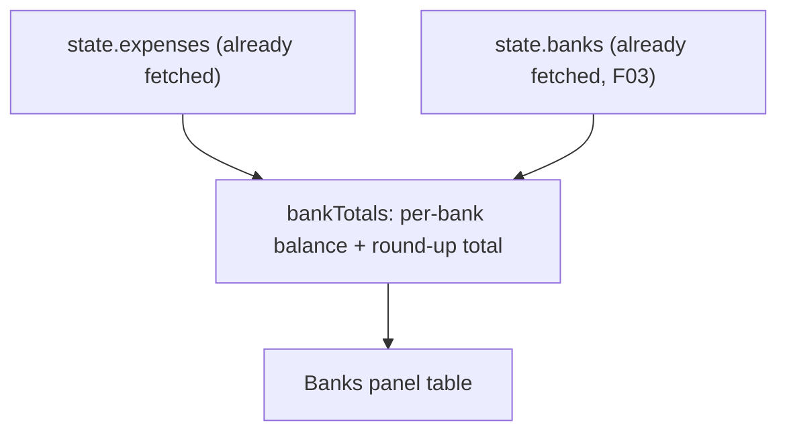

# F04. Bank Balance & Round-Up Totals

## 1. Technical Overview

**What:** The Banks panel's per-bank figure changes from `sum(Expense.Value)` to `sum(Expense.Value) − sum(Expense.RoundUpAmount)` (the adjusted balance), and gains a second figure, `sum(Expense.RoundUpAmount)` (the round-up total), displayed alongside it. Both update immediately after any expense is saved, exactly like every other panel figure — no new fetch is needed since the underlying data (`Value`, `RoundUpAmount`, `PaymentSource`) is already present on every fetched `ExpenseDto`.

**Why:** `bankTotals` is already computed client-side in `useMonthly` from the month's already-fetched expense list (unlike `categoryTotals`, which is a backend-computed endpoint) — F01/F02/F03 already deliver everything this computation needs (the bank list, and each expense's value and round-up amount), so this is a pure aggregation change with no new data to fetch and no backend endpoint to add.

**Scope:**
- Included: `BankTotal`'s shape and the `bankTotals` reducer computation in `useMonthly`; the Banks panel table gaining a Round-Up Total column; the existing "Total" footer row extended to both figures.
- Excluded: any backend change (no new endpoint — all figures are computed client-side from data already shipped by F01/F02/F03); the expense form itself (F03, already shipped); a bank management screen (out of scope per PRD).

## 2. Architecture Impact

**Affected components:**
- `Financial.Web/src/hooks/useMonthly.ts` — `BankTotal` interface, `bankTotals` computation, `bankTotalsSum`
- `Financial.Web/src/pages/MonthlyPage.tsx` — Banks panel table (new column, updated footer)

## 3. Technical Decisions

| Decision | Chosen Approach | Alternative Considered | Trade-off |
|----------|-----------------|-------------------------|-----------|
| Where the aggregation lives | Client-side in `useMonthly`'s `bankTotals` computation, same as today | A new backend "bank balances" endpoint, mirroring `getCategoryTotalsByMonth` | `bankTotals` is already computed client-side from the month's fetched expenses (an existing, if inconsistent-with-`categoryTotals`, precedent) and every field the formula needs (`value`, `roundUpAmount`, `paymentSource`) is already on `ExpenseDto`. Introducing a backend endpoint here would be new surface area for a computation the client can already do correctly with data it already has — over-engineering for this personal-scale app. |
| `BankTotal` shape | Replace the single `totalValue` field with `balance` (adjusted) and `roundUpTotal`, both computed in the same `.map` pass over `state.banks` | Keep `totalValue` and add only a new `roundUpTotal` field alongside it | The PRD explicitly redefines what the panel's primary figure *means* (`sum(Value) − sum(RoundUpAmount)`, not raw `sum(Value)`) — keeping the old field name with a changed meaning risks confusion for anyone reading the code later; renaming to `balance` makes the semantic change explicit. |
| Missing `RoundUpAmount` handling | Treat `expense.roundUpAmount ?? 0` in the reduction, so an expense with no recorded round-up contributes its full value to the balance and nothing to the round-up total | Filter such expenses out of the round-up sum separately | A single `reduce` computing both running totals per bank in one pass is simplest; nullish-coalescing to `0` is the natural "no round-up recorded" case and requires no special-casing. |
| Barclays' round-up total | No special-casing needed — it falls out naturally: no expense on a non-`RoundUpEnabled` bank can ever carry a `RoundUpAmount` (enforced server-side since F02), so its computed round-up total is always `0` | Explicitly zero it out for banks where `roundUpEnabled` is `false` | The invariant is already guaranteed upstream (F02's `Expense.SetRoundUpAmount` rejects a round-up amount on a non-round-up bank), so no defensive client-side override is needed — trusting the already-enforced invariant avoids redundant logic. |

## 4. Component Overview

**Frontend:**

| File Path | New/Modified | Purpose | Key Responsibilities |
|-----------|--------------|---------|-----------------------|
| `Financial.Web/src/hooks/useMonthly.ts` | Modified | State/logic | `BankTotal` becomes `{ bank: string; balance: number; roundUpTotal: number }`; `bankTotals` reduces each bank's expenses once into `{ balance: sum(value) - sum(roundUpAmount ?? 0), roundUpTotal: sum(roundUpAmount ?? 0) }`; `bankTotalsSum` sums `balance` (unchanged name/purpose, now reflecting the adjusted figure); new `roundUpTotalsSum` summing `roundUpTotal` across banks, added to `MonthlyData` |
| `Financial.Web/src/pages/MonthlyPage.tsx` | Modified | UI | Banks panel table gains a "Round-Up" column (`b.roundUpTotal`) alongside the existing "Balance" column (`b.balance`, renamed from "Total"); footer row shows both sums |

## 5. API Contracts

None — no backend change. All data was already available via the existing `GET /expenses/month/{year}/{month}` response (`value`, `roundUpAmount`, `paymentSource` per expense, shipped in F02/F03) and `GET /banks` (shipped in F03).

## 6. Data Model

None — no persisted shape change.

## 7. Testing Strategy

| Test File | Test Type | Target | Coverage |
|-----------|-----------|--------|----------|
| `Financial.Web/src/hooks/useMonthly.test.ts` | Unit | `useMonthly` | `bankTotals` computes `balance = sum(value) - sum(roundUpAmount)` per bank; a bank with no round-up amounts on any of its expenses has `roundUpTotal` of `0` and `balance` equal to the raw value sum; a bank with a mix of round-up and non-round-up expenses sums correctly; `bankTotalsSum`/`roundUpTotalsSum` sum across all banks; a settled/charge expense (no bank, `paymentSource` null) is excluded from every bank's figures, matching existing behavior |
| `Financial.Web/src/pages/__tests__/MonthlyPage.test.tsx` | Component | `MonthlyPage` | Banks panel renders a Round-Up column alongside Balance for each bank; Barclays (non-round-up) always shows £0.00 round-up regardless of its expenses; the footer shows both sums; the Banks panel reflects the new figures immediately after saving an expense with a round-up amount (reusing the existing retry/refetch flow) |

**Acceptance tests (PRD Section 9, F04):**
- A bank's balance equals `sum(Value) − sum(RoundUpAmount)` → `useMonthly.test.ts`
- A bank's round-up total equals `sum(RoundUpAmount)`, shown separately from its balance → `useMonthly.test.ts` + `MonthlyPage.test.tsx`
- Barclays always shows a round-up total of £0.00 → `useMonthly.test.ts` + `MonthlyPage.test.tsx`
- The Banks panel's balance and round-up total both update immediately after an expense is saved → `MonthlyPage.test.tsx` (reuses the existing post-save refetch already covered by prior tests)

**Cross-Feature Integration criteria touching F04 (PRD Section 9):**
- "F04's balance and round-up total calculations correctly group expenses by the bank identity defined by F01 and correctly sum the round-up amounts defined by F02" → `useMonthly.test.ts` (grouping by `state.banks` from F01/F03, summing `expense.roundUpAmount` from F02)
