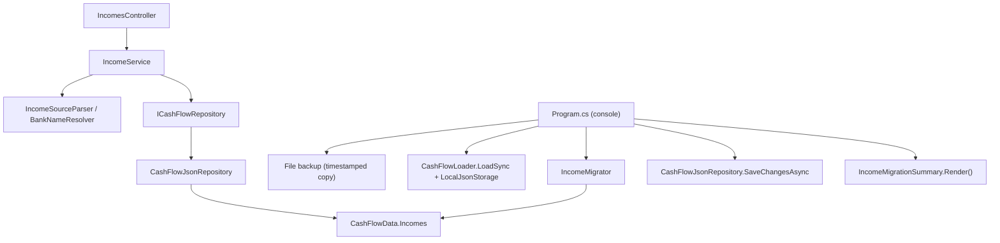

# F01. Income Entity and Migration

## 1. Technical Overview

**What:** Introduce a new `Income` entity (`Date`, `IncomeSource`, `GrossValue`, `NetValue`, `Bank`) to the CashFlow domain, together with the full create/edit/delete/query contract (Application services, DTOs, and API endpoints) that F04's UI, F03's tithe calculation, F05's Incoming card, F06's bank balance, and F07's Yearly Summary will all consume. A new `IncomeSource` enum (`Gleison`, `Ariana`, `Lottery`, `DividendoJuros`) is added, distinct from the expense `Category` enum. A one-time, idempotent, backup-first console migration adds the new, initially-empty `Income` collection to the live data file, following the exact pattern established by P12's `CashFlowPaymentStateMigration` and P13's `CashFlowBankMigration`.

**Why:** `Income` is a brand-new concept with no prior representation anywhere in the codebase (unlike P13's `Bank`, which replaced an existing `PaymentSource` enum). Every other feature in this PRD reads or writes `Income` data — F03 sums it for the tithe base, F04 is the form that creates/edits/deletes it, F05 displays it grouped by source, F06 folds it into the bank balance, F07 aggregates it across a year. Establishing the entity, persistence, and the full CRUD contract in one feature (rather than splitting the contract across F01 and F04) mirrors how `Expense` already ships as a complete CRUD surface from its own foundational feature — F04 then only has to build a form and list UI against an API that already exists, exactly as later Expense-form work in this project builds against the pre-existing `ExpensesController`.

**Scope:**
- Included: `Income` domain entity; `IncomeSource` enum; `CashFlowData.Incomes` collection with add/remove; `ICashFlowRepository` additions (`GetIncomes`, `AddIncome`, `DeleteIncome`); `IIncomeService`/`IncomeService` (add, update, delete, get-by-month); `IncomeDTO`/`IncomeCreateDTO`/`IncomeUpdateDTO`; `IncomeSourceParser` validation helper; `IncomesController` (POST, PUT, DELETE, GET by month); serializer wiring for the new entity; a new console migration project (`Integrations/CashFlowIncomeMigration`) that backs up the data file and confirms the `Incomes` collection is present; solution file registration for the new console + test projects.
- Excluded: any frontend UI (F04); the tithe calculation (F03); the Incoming card (F05); bank balance changes (F06); the Yearly Summary table (F07); historical income backfill (out of scope per PRD).

## 2. Architecture Impact

**Affected components:**
- `Financial.CashFlow.Domain/Entities/Income.cs` — new entity
- `Financial.CashFlow.Domain/Enums/IncomeSource.cs` — new enum
- `Financial.CashFlow.Domain/Entities/CashFlowData.cs` — new `Incomes` collection + `AddIncome`/`RemoveIncome`
- `Financial.CashFlow.Application/Interfaces/ICashFlowRepository.cs` — `GetIncomes()`, `AddIncome(Income)`, `DeleteIncome(Guid)` added
- `Financial.CashFlow.Application/Interfaces/IIncomeService.cs` — new
- `Financial.CashFlow.Application/Services/IncomeService.cs` — new
- `Financial.CashFlow.Application/DTOs/IncomeDTO.cs`, `IncomeCreateDTO.cs`, `IncomeUpdateDTO.cs` — new
- `Financial.CashFlow.Application/Validation/IncomeSourceParser.cs` — new
- `Financial.CashFlow.Application/DependencyInjection/CashFlowApplicationServiceCollectionExtensions.cs` — registers `IIncomeService`
- `Financial.CashFlow.Infrastructure/Persistence/CashFlowTypeInfoResolver.cs` — `Income` added to `ManagedTypes`
- `Financial.CashFlow.Infrastructure/Repositories/CashFlowJsonRepository.cs` — implements the 3 new repository members
- `Financial.Api/Controllers/IncomesController.cs` — new
- `Integrations/CashFlowIncomeMigration/` — new console project (backup + confirm)
- `Tests/Financial.CashFlowIncomeMigration.Tests/` — new xUnit project
- `Financial.slnx` — registers both new projects



## 3. Technical Decisions

| Decision | Chosen Approach | Alternative Considered | Trade-off |
|----------|-----------------|-------------------------|-----------|
| F01 delivers the full CRUD contract, not just the entity | `IncomeService`, `IncomesController`, and all 3 DTOs are built in F01, alongside the domain entity and migration | Scope F01 to domain + migration only (mirroring P13-F01's `Bank`, which added no service/controller) | The PRD states F04 "Consumes: F01: income entry create/edit/delete contract" — unlike `Bank` (permanent, no management UI, no CRUD ever), `Income` is user-editable from day one via F04. Building the contract now means F04 is a pure UI feature layered on a stable, independently-testable API, matching how `Expense`'s CRUD already predates every UI feature that touches it in this codebase. This is the single largest scope judgment call in this spec — flagged here for review. |
| Income's bank reference shape | `string Bank` (bank name), validated at the Application layer via the existing `BankNameResolver` against the live `Bank` list — same pattern as `Expense.PaymentSource` | A `Guid`/foreign-key reference to `Bank` | `Bank` has no surrogate `Id` (per P13-F01) — it is identified by name everywhere in this codebase. Reusing `BankNameResolver` avoids introducing a second bank-referencing convention. |
| `IncomeSource` representation on the wire | `string` in DTOs, parsed via a new `IncomeSourceParser` (mirrors `CategoryParser`) | Reuse the existing `Category` enum with an `Income`-only subset | The PRD explicitly calls `IncomeSource` "a new enum distinct from the expense `Category` enum" — this is a direct PRD requirement, not an open decision. |
| Value validation location | `GrossValue >= NetValue` (when `GrossValue` is provided) and `NetValue >= 0` enforced as a domain invariant inside `Income.Create`/`UpdateDetails`; bank-name resolution and source-enum parsing done in `IncomeService` (Application layer), mirroring `ExpenseService.ValidateFields` | Push all validation into the Application layer, keeping the entity a pure data holder | `Expense` already validates its own cross-field shape invariant internally (`ValidatePaymentShape`) while `ExpenseService` handles lookups needing repository access (bank/category resolution). The same split is the smallest change that keeps the entity self-consistent without duplicating repository-dependent logic into the domain layer. |
| Migration content | `IncomeMigrator.Migrate(data)` performs no seeding (there is no fixed data to seed, unlike `Bank`'s 3 known rows) — it only confirms the `Incomes` collection exists and reports its current count; the tool still follows the full backup-first, load-mutate-save, summary-printing shape of `CashFlowBankMigration`/`CashFlowPaymentStateMigration` | Skip the migration tool entirely, since `CashFlowData.Incomes` already default-initializes to an empty list and a normal save would add the JSON key automatically | The PRD explicitly requires "a migration that adds the `Income` collection to back up the data file first" as an F01 user story and Section 9 acceptance criterion — the backup-first guarantee and the idempotent, auditable run are the point, not the data mutation itself. Keeping the tool trivial (no seed rows) is the correct proportionate implementation, not a reason to omit it. |

## 4. Component Overview

**Backend:**

| File Path | New/Modified | Purpose | Key Responsibilities |
|-----------|--------------|---------|-----------------------|
| `Financial.CashFlow.Domain/Entities/Income.cs` | New | Income entry identity | Private ctor + `Create(date, incomeSource, grossValue, netValue, bank)` factory; `UpdateDetails(...)`; `Id`, `Date`, `IncomeSource`, `GrossValue` (nullable), `NetValue`, `Bank`, all private-set; validates `GrossValue >= NetValue` (when provided) and `NetValue >= 0` |
| `Financial.CashFlow.Domain/Enums/IncomeSource.cs` | New | Source classification | `Gleison`, `Ariana`, `Lottery`, `DividendoJuros` |
| `Financial.CashFlow.Domain/Entities/CashFlowData.cs` | Modified | Income collection | `_incomes`/`Incomes` (`IReadOnlyCollection<Income>`) following the existing private-list-plus-readonly-property pattern; `AddIncome(Income)`; `RemoveIncome(Guid id)` |
| `Financial.CashFlow.Application/Interfaces/ICashFlowRepository.cs` | Modified | Repository contract | `IEnumerable<Income> GetIncomes(); void AddIncome(Income income); void DeleteIncome(Guid id);` added |
| `Financial.CashFlow.Application/Interfaces/IIncomeService.cs` | New | Service contract | `AddIncomeAsync`, `UpdateIncomeAsync`, `DeleteIncomeAsync`, `GetIncomesByMonth(int year, int month)` |
| `Financial.CashFlow.Application/Services/IncomeService.cs` | New | Income CRUD | Validates fields (`NetValue >= 0` domain-checked; `IncomeSource` via `IncomeSourceParser`; `Bank` via `BankNameResolver` against `_repository.GetBanks()`); throws `ArgumentException` on invalid input, `KeyNotFoundException` on update/delete of a missing id; `ToDto` maps entity to `IncomeDTO` |
| `Financial.CashFlow.Application/DTOs/IncomeDTO.cs` | New | Read model | `Id`, `Date`, `IncomeSource` (string), `GrossValue` (nullable), `NetValue`, `Bank` |
| `Financial.CashFlow.Application/DTOs/IncomeCreateDTO.cs` | New | Create request | `Date`, `IncomeSource` (string), `GrossValue` (nullable), `NetValue`, `Bank` |
| `Financial.CashFlow.Application/DTOs/IncomeUpdateDTO.cs` | New | Update request | Same shape as create; id comes from the route |
| `Financial.CashFlow.Application/Validation/IncomeSourceParser.cs` | New | Enum resolution | Static `TryParse(string? value, out IncomeSource incomeSource)`, delegating to the existing `EnumParser.TryParseEnum`, mirroring `CategoryParser` |
| `Financial.CashFlow.Application/DependencyInjection/CashFlowApplicationServiceCollectionExtensions.cs` | Modified | DI registration | `services.AddSingleton<IIncomeService, IncomeService>();` added |
| `Financial.CashFlow.Infrastructure/Persistence/CashFlowTypeInfoResolver.cs` | Modified | Serializer wiring | `typeof(Income)` added to `ManagedTypes` |
| `Financial.CashFlow.Infrastructure/Repositories/CashFlowJsonRepository.cs` | Modified | Repository impl | `GetIncomes() => _data.Incomes;`, `AddIncome`, `DeleteIncome` delegating to `CashFlowData` |
| `Financial.Api/Controllers/IncomesController.cs` | New | HTTP surface | `POST /incomes`, `PUT /incomes/{id}`, `DELETE /incomes/{id}`, `GET /incomes/month/{year}/{month}` — mirrors `ExpensesController`'s status codes and `Problem()` error shape exactly |
| `Integrations/CashFlowIncomeMigration/CashFlowIncomeMigration.csproj` | New | Console project | Mirrors `CashFlowBankMigration.csproj`: `net10.0` exe, references CashFlow Domain, CashFlow Infrastructure, Shared Infrastructure |
| `Integrations/CashFlowIncomeMigration/Program.cs` | New | Entry point | Args: `[dataPath]` (same default-resolution pattern as `CashFlowBankMigration`); abort if missing; `MigrationBackup.Create`; `CashFlowLoader.LoadSync`; `IncomeMigrator.Migrate`; `CashFlowJsonRepository.SaveChangesAsync`; print `IncomeMigrationSummary.Render()`; exit 0/1 |
| `Integrations/CashFlowIncomeMigration/MigrationBackup.cs` | New | Backup helper | Copied from `CashFlowBankMigration`'s helper with an `income-migration` timestamp segment |
| `Integrations/CashFlowIncomeMigration/IncomeMigrator.cs` | New | Confirm collection | Static `Migrate(CashFlowData data) : IncomeMigrationSummary`; performs no mutation beyond ensuring `data.Incomes` is accessible (it always is, via `CashFlowData`'s default-initialized empty list); records the current income count for the summary |
| `Integrations/CashFlowIncomeMigration/IncomeMigrationSummary.cs` | New | Run report | `IncomeCount` at run time; `Render()` string confirming the collection is present |
| `Tests/Financial.CashFlowIncomeMigration.Tests/Financial.CashFlowIncomeMigration.Tests.csproj` | New | Test project | Same package set as `Financial.CashFlowBankMigration.Tests`; references the console project |
| `Tests/Financial.CashFlowIncomeMigration.Tests/IncomeMigratorTests.cs`, `MigrationBackupTests.cs` | New | Unit tests | See Section 7 |
| `Financial.slnx` | Modified | Solution | Registers `Integrations/CashFlowIncomeMigration` and `Tests/Financial.CashFlowIncomeMigration.Tests` |

## 5. API Contracts

**Endpoint: Add Income**
- **Method:** POST
- **Path:** `/incomes`
- **Authentication:** None (matches every other endpoint in this single-user app)

**Request:**

| Field | Type | Required | Validation | Description |
|-------|------|----------|------------|--------------|
| `date` | `date` | Yes | — | Income date |
| `incomeSource` | `string` | Yes | one of `Gleison`, `Ariana`, `Lottery`, `DividendoJuros` | Source classification |
| `grossValue` | `decimal` | No | must be `>= netValue` when provided | Gross pay, meaningful only for `Gleison`/`Ariana` |
| `netValue` | `decimal` | Yes | `>= 0` | Net amount received |
| `bank` | `string` | Yes | must resolve against the live `Bank` list | Destination bank name |

**Request Example:**
```json
{
  "date": "2026-07-25",
  "incomeSource": "Gleison",
  "grossValue": 3200.00,
  "netValue": 2450.00,
  "bank": "Barclays"
}
```

**Response (Success - 200):**

| Field | Type | Description |
|-------|------|--------------|
| `id` | `uuid` | Generated identifier |
| `date` | `date` | Income date |
| `incomeSource` | `string` | Source classification |
| `grossValue` | `decimal?` | Gross pay, if provided |
| `netValue` | `decimal` | Net amount received |
| `bank` | `string` | Destination bank name |

**Response Example:**
```json
{
  "id": "7c1b1e2a-1234-4a11-9abc-0f1e2d3c4b5a",
  "date": "2026-07-25",
  "incomeSource": "Gleison",
  "grossValue": 3200.00,
  "netValue": 2450.00,
  "bank": "Barclays"
}
```

**Error Codes:**

| Code | HTTP Status | Description |
|------|-------------|--------------|
| — | 400 | Invalid income source, bank not recognized, `grossValue < netValue`, or negative `netValue` (via `Problem()` with the exception message) |

**Endpoint: Update Income**
- **Method:** PUT
- **Path:** `/incomes/{id}`
- Same request/response shape as Add, plus a 404 (`Problem()`) when `id` does not resolve to an existing income entry.

**Endpoint: Delete Income**
- **Method:** DELETE
- **Path:** `/incomes/{id}`
- **Response (Success - 200):** empty body. **Error:** 404 (`Problem()`) when `id` does not resolve.

**Endpoint: Get Incomes by Month**
- **Method:** GET
- **Path:** `/incomes/month/{year}/{month}`
- **Response (Success - 200):** `IncomeDTO[]` — every income entry dated within that year/month, same shape as the Add response.

## 6. Data Model

`data-cashflow.json` gains one new top-level array, `Incomes`, empty immediately after migration:

```json
{
  "Incomes": []
}
```

Each entry created afterward through the API takes this shape:

```json
{
  "Id": "7c1b1e2a-1234-4a11-9abc-0f1e2d3c4b5a",
  "Date": "2026-07-25",
  "IncomeSource": "Gleison",
  "GrossValue": 3200.00,
  "NetValue": 2450.00,
  "Bank": "Barclays"
}
```

No other top-level collection's shape changes. The backup file `data-cashflow.backup-income-migration-<timestamp>.json` is created beside the data file before any write.

## 7. Testing Strategy

| Test File | Test Type | Target | Coverage |
|-----------|-----------|--------|----------|
| `Tests/Financial.CashFlow.Domain.Tests/Entities/IncomeTests.cs` | Unit | `Income` | `Create` sets all fields; rejects `grossValue < netValue`; rejects negative `netValue`; accepts a null `grossValue`; `UpdateDetails` re-validates and updates all fields |
| `Tests/Financial.CashFlow.Domain.Tests/Entities/CashFlowDataTests.cs` | Unit | `CashFlowData` | `AddIncome` appends to `Incomes`; `Incomes` starts empty on `Create()`; `RemoveIncome` removes by id and no-ops on an unknown id |
| `Tests/Financial.CashFlow.Application.Tests/Validation/IncomeSourceParserTests.cs` | Unit | `IncomeSourceParser` | Parses each of the 4 valid values (case-insensitive); returns `false` for an unrecognized or null/empty value |
| `Tests/Financial.CashFlow.Application.Tests/Services/IncomeServiceTests.cs` | Unit | `IncomeService` | Valid create/update/delete round-trip; unrecognized `incomeSource` throws `ArgumentException`; unrecognized `bank` throws `ArgumentException`; `grossValue < netValue` throws; negative `netValue` throws; update/delete of an unknown id throws `KeyNotFoundException`; `GetIncomesByMonth` filters by year and month and returns entries for any number of same-source entries in the month |
| `Tests/Financial.CashFlow.Infrastructure.Tests/Persistence/CashFlowSerializerAdapterTests.cs` | Unit | Serializer | `Income` round-trips through `CashFlowTypeInfoResolver`'s private-setter wiring |
| `Tests/Financial.Api.Tests/IncomesEndpointsTests.cs` | Integration | `IncomesController` | POST creates and returns 200; POST with invalid fields returns 400; PUT updates and returns 200; PUT on unknown id returns 404; DELETE removes and returns 200; DELETE on unknown id returns 404; GET by month returns only that month's entries |
| `Tests/Financial.CashFlowIncomeMigration.Tests/IncomeMigratorTests.cs` | Unit | `IncomeMigrator` | Reports an empty `Incomes` collection on a fresh `CashFlowData`; reports the correct count when incomes already exist; second run against already-migrated data produces the same result (idempotent) |
| `Tests/Financial.CashFlowIncomeMigration.Tests/MigrationBackupTests.cs` | Unit | Backup helper | Creates a timestamped copy with identical content beside the source; distinct name per call; throws when source missing |

**Acceptance tests (PRD Section 9, F01):**
- An `Income` entry can be created with `Date`, `IncomeSource`, `NetValue`, and `Bank`; `GrossValue` optional → `IncomeTests`, `IncomeServiceTests`, `IncomesEndpointsTests`
- Multiple `Income` entries can exist for the same month and `IncomeSource` with no upper limit → `IncomeServiceTests.GetIncomesByMonth`
- Creating an entry with `GrossValue < NetValue` is rejected → `IncomeTests`, `IncomeServiceTests`
- The migration adds an empty `Income` collection and takes a backup before writing → `IncomeMigratorTests`, `MigrationBackupTests`, `Program.cs` ordering (backup is the first side effect, by construction)
- Running the migration a second time is idempotent → `IncomeMigratorTests`

**Cross-Feature Integration criteria touching F01 (PRD Section 9):**
- "F03's tithe calculation correctly reads the net income totals produced by F01" — guaranteed by `ICashFlowRepository.GetIncomes()` exposing every `Income.NetValue`, verified here only insofar as `IncomeService`/`GetIncomes()` round-trip `NetValue` correctly; the consuming calculation is verified in F03's own spec
- "F04's create/edit/delete actions correctly read and write through F01's `Income` entity contract" — the entire Section 5 API contract and `IncomeServiceTests` suite is the direct guarantee this criterion depends on
- "F07 correctly aggregates F01's income data across all 12 months" — depends on `GetIncomes()` exposing `GrossValue`/`NetValue`/`IncomeSource` correctly across an arbitrary date range, covered here by `IncomeServiceTests` and `CashFlowDataTests`; the yearly aggregation itself is verified in F07's own spec
