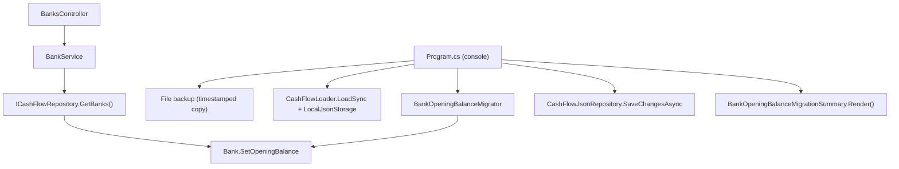

# F02. Bank Opening Balance

## 1. Technical Overview

**What:** Add `OpeningBalance` (decimal, defaults to £0.00) and `OpeningBalanceDate` (date) to the existing `Bank` entity, both editable after creation. A one-time, backup-first, idempotent console migration sets the default `OpeningBalanceDate` (the migration run date) on the 3 banks already seeded by P13-F01, since a missing JSON key alone would leave the date at `DateOnly.MinValue`, not "today". A new API endpoint lets the developer correct each bank's opening balance and effective date at any time, as the PRD's Banks-panel edit affordance requires.

**Why:** F06's real bank balance formula (`OpeningBalance + Σ(Income.NetValue) − Σ(Expense.Value − Expense.RoundUpAmount)` from `OpeningBalanceDate` forward) needs a concrete starting point per bank; without it, every bank's running balance would implicitly start from £0.00 on the epoch date, which is wrong for the 3 banks that already hold real money today. This feature only adds the two fields and their edit contract — F06 is the feature that actually consumes them in a balance calculation.

**Scope:**
- Included: `Bank.OpeningBalance`/`Bank.OpeningBalanceDate` fields with a `SetOpeningBalance(decimal, DateOnly)` mutator enforcing the non-negative invariant; `BankDTO` exposes both fields; a new `IBankService.UpdateOpeningBalanceAsync` + `BankOpeningBalanceUpdateDTO` + `PUT /banks/{name}/opening-balance` endpoint; a new console migration project (`Integrations/CashFlowBankOpeningBalanceMigration`) that sets the default `OpeningBalanceDate` on already-seeded banks.
- Excluded: any bank-management screen (creating/renaming/removing a bank remains out of scope, per PRD); the actual balance calculation that reads these fields (F06); the Banks-panel UI edit affordance itself (frontend work is out of scope for this backend-only PRD's F02, matching how F01 shipped its API without a UI and F04 will build the Income form separately — there is no frontend feature for F02 in this PRD's Section 6, so this spec covers the API contract the (not-yet-specified) UI would call).

## 2. Architecture Impact

**Affected components:**
- `Financial.CashFlow.Domain/Entities/Bank.cs` — `OpeningBalance`, `OpeningBalanceDate` fields + `SetOpeningBalance` mutator
- `Financial.CashFlow.Application/DTOs/BankDTO.cs` — 2 fields added
- `Financial.CashFlow.Application/DTOs/BankOpeningBalanceUpdateDTO.cs` — new
- `Financial.CashFlow.Application/Interfaces/IBankService.cs` — `UpdateOpeningBalanceAsync` added
- `Financial.CashFlow.Application/Services/BankService.cs` — implements the update, resolves bank by name, throws on unknown name or negative balance
- `Financial.Api/Controllers/BanksController.cs` — `PUT /banks/{name}/opening-balance`
- `Integrations/CashFlowBankOpeningBalanceMigration/` — new console project (default-and-audit)
- `Tests/Financial.CashFlowBankOpeningBalanceMigration.Tests/` — new xUnit project
- `Financial.slnx` — registers both new projects



## 3. Technical Decisions

| Decision | Chosen Approach | Alternative Considered | Trade-off |
|----------|-----------------|-------------------------|-----------|
| Where the mutator lives | `Bank.SetOpeningBalance(decimal, DateOnly)` on the entity, enforcing "not negative" as a domain invariant (mirrors `Income`'s own value validation) | Validate only in `BankService`, keep `Bank` a pure data holder | `Bank.Create` already validates its own invariant (blank name); keeping the new invariant on the entity means it can never be violated regardless of caller, consistent with how this domain already treats entities as the source of truth for their own shape |
| Idempotency sentinel for the migration | A bank whose `OpeningBalanceDate == default(DateOnly)` (`0001-01-01`, i.e. never migrated) gets the run date set once; already-migrated banks (any non-default date, including a date the developer manually corrected) are left untouched | Track a separate `Migrated` flag per bank | No extra field is needed: `DateOnly.MinValue` cannot occur from real-world data entry (no one's bank balance is dated year 1), so it's a safe, self-documenting "unset" sentinel — same spirit as P13-F01 treating an existing matching bank name as its own idempotency check |
| Update endpoint keying | `PUT /banks/{name}/opening-balance`, keyed by the existing name-as-identity convention (`Bank` has no surrogate `Id`, confirmed in P13-F01) | Add a `Guid Id` to `Bank` now to key the endpoint conventionally | Introducing an `Id` now would be a bigger, unrelated change to an entity every other feature already references by name; the name-keyed route matches how `BankNameResolver` already works throughout the codebase |
| Frontend scope | This spec covers only the backend contract (`PUT` endpoint); no PRD Section 6 feature in P14 names a Banks-panel edit UI as a numbered feature, so building it now would be scope not requested by any tracked acceptance criterion | Build the edit affordance described in F02's "Experience" prose now, since it's mentioned there | The PRD's Section 9 acceptance criteria for F02 only test that the fields exist, default correctly, are editable via the app's data layer, and reject negative values — nothing in Section 9 requires a specific UI control. Documented here as the largest scope judgment call in this spec, flagged for review; a UI affordance can be added in a later pass if the developer wants one before F06 ships, since F06's spec will need the Banks panel anyway to display the new running balance |

## 4. Component Overview

**Backend:**

| File Path | New/Modified | Purpose | Key Responsibilities |
|-----------|--------------|---------|-----------------------|
| `Financial.CashFlow.Domain/Entities/Bank.cs` | Modified | Opening balance fields | `OpeningBalance` (decimal, private-set, defaults to `0m`), `OpeningBalanceDate` (`DateOnly`, private-set); `SetOpeningBalance(decimal openingBalance, DateOnly openingBalanceDate)` throws `ArgumentException` when `openingBalance < 0` |
| `Financial.CashFlow.Application/DTOs/BankDTO.cs` | Modified | Read model | `OpeningBalance` (decimal), `OpeningBalanceDate` (DateOnly) added |
| `Financial.CashFlow.Application/DTOs/BankOpeningBalanceUpdateDTO.cs` | New | Update request | `OpeningBalance` (decimal), `OpeningBalanceDate` (DateOnly) |
| `Financial.CashFlow.Application/Interfaces/IBankService.cs` | Modified | Service contract | `Task<BankDTO> UpdateOpeningBalanceAsync(string name, BankOpeningBalanceUpdateDTO request)` added |
| `Financial.CashFlow.Application/Services/BankService.cs` | Modified | Bank update | Resolves the bank via `BankNameResolver` against `_repository.GetBanks()`; throws `KeyNotFoundException` for an unknown name; calls `bank.SetOpeningBalance(...)` (which throws `ArgumentException` on a negative value); saves; `ToDto` extended with the 2 new fields |
| `Financial.Api/Controllers/BanksController.cs` | Modified | HTTP surface | `PUT /banks/{name}/opening-balance` — mirrors `ExpensesController`'s `Problem()` error shape; 404 on unknown name, 400 on negative balance |
| `Integrations/CashFlowBankOpeningBalanceMigration/CashFlowBankOpeningBalanceMigration.csproj` | New | Console project | Mirrors `CashFlowBankMigration.csproj`: `net10.0` exe, references CashFlow Domain, CashFlow Infrastructure, Shared Infrastructure |
| `Integrations/CashFlowBankOpeningBalanceMigration/Program.cs` | New | Entry point | Args: `[dataPath]` (same default-resolution pattern); abort if missing; `MigrationBackup.Create`; `CashFlowLoader.LoadSync`; `BankOpeningBalanceMigrator.Migrate`; `CashFlowJsonRepository.SaveChangesAsync`; print summary; exit 0/1 |
| `Integrations/CashFlowBankOpeningBalanceMigration/MigrationBackup.cs` | New | Backup helper | Copied from `CashFlowBankMigration`'s helper with a `bank-opening-balance-migration` timestamp segment |
| `Integrations/CashFlowBankOpeningBalanceMigration/BankOpeningBalanceMigrator.cs` | New | Default-and-audit | Static `Migrate(CashFlowData data, DateOnly runDate) : BankOpeningBalanceMigrationSummary`; for each bank with `OpeningBalanceDate == default`, calls `SetOpeningBalance(0m, runDate)` and counts it as defaulted; banks already carrying a non-default date are counted as already-set and left untouched |
| `Integrations/CashFlowBankOpeningBalanceMigration/BankOpeningBalanceMigrationSummary.cs` | New | Run report | Counts: banks defaulted / already set; `Render()` string |
| `Tests/Financial.CashFlowBankOpeningBalanceMigration.Tests/Financial.CashFlowBankOpeningBalanceMigration.Tests.csproj` | New | Test project | Same package set as `Financial.CashFlowBankMigration.Tests`; references the console project |
| `Tests/Financial.CashFlowBankOpeningBalanceMigration.Tests/BankOpeningBalanceMigratorTests.cs`, `MigrationBackupTests.cs` | New | Unit tests | See Section 7 |
| `Financial.slnx` | Modified | Solution | Registers `Integrations/CashFlowBankOpeningBalanceMigration` and `Tests/Financial.CashFlowBankOpeningBalanceMigration.Tests` |

## 5. API Contracts

**Endpoint: Update Bank Opening Balance**
- **Method:** PUT
- **Path:** `/banks/{name}/opening-balance`
- **Authentication:** None (matches every other endpoint in this single-user app)

**Request:**

| Field | Type | Required | Validation | Description |
|-------|------|----------|------------|--------------|
| `openingBalance` | `decimal` | Yes | `>= 0` | Real-world balance as of the effective date |
| `openingBalanceDate` | `date` | Yes | — | The date `openingBalance` is accurate as of |

**Request Example:**
```json
{
  "openingBalance": 1250.75,
  "openingBalanceDate": "2026-07-01"
}
```

**Response (Success - 200):**

| Field | Type | Description |
|-------|------|--------------|
| `name` | `string` | Bank name |
| `roundUpEnabled` | `bool` | Whether this bank rounds up card payments |
| `openingBalance` | `decimal` | Updated opening balance |
| `openingBalanceDate` | `date` | Updated effective date |

**Response Example:**
```json
{
  "name": "Barclays",
  "roundUpEnabled": false,
  "openingBalance": 1250.75,
  "openingBalanceDate": "2026-07-01"
}
```

**Error Codes:**

| Code | HTTP Status | Description |
|------|-------------|--------------|
| — | 400 | `openingBalance` is negative (via `Problem()` with the exception message) |
| — | 404 | `name` does not resolve to a tracked bank |

**Endpoint: Get Banks** (existing, extended)
- **Method:** GET
- **Path:** `/banks`
- **Response:** unchanged shape, now includes `openingBalance` and `openingBalanceDate` per bank.

## 6. Data Model

Each `Bank` record in `data-cashflow.json`'s `Banks` array gains two fields:

```json
{
  "Banks": [
    { "Name": "Barclays", "RoundUpEnabled": false, "OpeningBalance": 0.00, "OpeningBalanceDate": "2026-07-24" },
    { "Name": "Trading212", "RoundUpEnabled": true, "OpeningBalance": 0.00, "OpeningBalanceDate": "2026-07-24" },
    { "Name": "Chase", "RoundUpEnabled": true, "OpeningBalance": 0.00, "OpeningBalanceDate": "2026-07-24" }
  ]
}
```

`OpeningBalanceDate` above is the migration run date; the developer is expected to correct both fields per bank afterward via the new `PUT` endpoint, per the PRD. The backup file `data-cashflow.backup-bank-opening-balance-migration-<timestamp>.json` is created beside the data file before any write.

## 7. Testing Strategy

| Test File | Test Type | Target | Coverage |
|-----------|-----------|--------|----------|
| `Tests/Financial.CashFlow.Domain.Tests/Entities/BankTests.cs` | Unit | `Bank` | `Create` still defaults `OpeningBalance` to `0m` and `OpeningBalanceDate` to `default(DateOnly)`; `SetOpeningBalance` updates both fields; `SetOpeningBalance` with a negative value throws and leaves prior values untouched |
| `Tests/Financial.CashFlow.Application.Tests/Services/BankServiceTests.cs` | Unit | `BankService` | `UpdateOpeningBalanceAsync` with a valid request updates and saves; unknown bank name throws `KeyNotFoundException`; negative `OpeningBalance` throws `ArgumentException`; `GetBanks` round-trips the 2 new fields |
| `Tests/Financial.CashFlow.Infrastructure.Tests/Persistence/CashFlowSerializerAdapterTests.cs` | Unit | Serializer | `Bank` round-trip test extended to assert `OpeningBalance`/`OpeningBalanceDate` survive serialize/deserialize |
| `Tests/Financial.Api.Tests/BanksEndpointsTests.cs` | Integration | `BanksController` | `PUT` updates and returns 200 with the new fields; `PUT` with a negative balance returns 400; `PUT` on an unknown bank name returns 404; `GET` reflects an update immediately after |
| `Tests/Financial.CashFlowBankOpeningBalanceMigration.Tests/BankOpeningBalanceMigratorTests.cs` | Unit | `BankOpeningBalanceMigrator` | Defaults every bank whose date is unset to `(0m, runDate)`; leaves a bank with a non-default date untouched; second run is idempotent (0 newly defaulted) |
| `Tests/Financial.CashFlowBankOpeningBalanceMigration.Tests/MigrationBackupTests.cs` | Unit | Backup helper | Creates a timestamped copy with identical content beside the source; distinct name per call; throws when source missing |

**Acceptance tests (PRD Section 9, F02):**
- Each existing bank has `OpeningBalance`/`OpeningBalanceDate` populated with defaults immediately after migration → `BankOpeningBalanceMigratorTests`
- Fields can be edited after migration and are reflected in the next balance calculation → `BankServiceTests`, `BanksEndpointsTests` (F06's balance calculation itself is out of scope here; this spec verifies the edit is persisted and readable)
- Setting `OpeningBalance` negative is rejected with a validation message → `BankTests`, `BankServiceTests`, `BanksEndpointsTests`
- The migration takes a backup before writing → `MigrationBackupTests`, `Program.cs` ordering (backup is the first side effect, by construction)

**Cross-Feature Integration criteria touching F02 (PRD Section 9):**
- "F06 correctly combines F01's income data with F02's opening balance and date to produce each bank's balance" — guaranteed by `BankDTO`/`ICashFlowRepository.GetBanks()` exposing the correctly-typed, correctly-persisted `OpeningBalance`/`OpeningBalanceDate` to any consumer; covered here by `BankServiceTests` and the serializer round-trip test, with F06's own calculation verified in F06's spec
