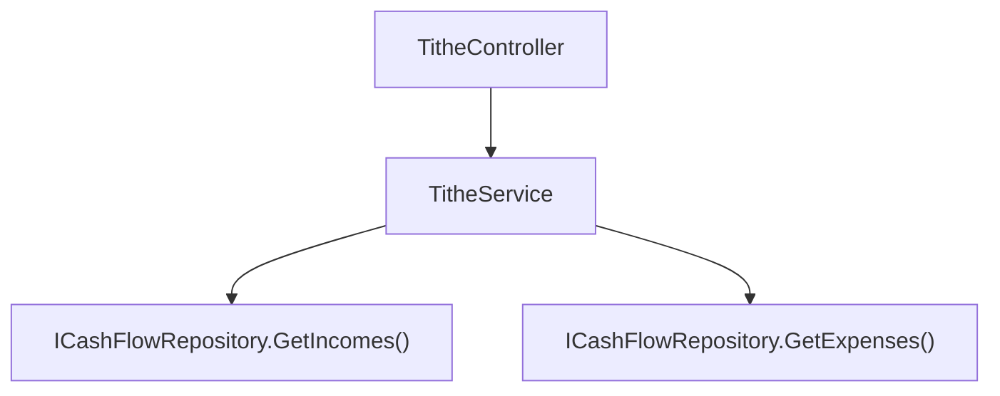

# F03. Tithe Calculation

## 1. Technical Overview

**What:** A new, on-demand calculation — not a stored value — that computes a month's tithe (10% of that month's total `Income.NetValue`) and tithe balance (the calculated tithe minus that month's `Category.Dizimo`-tagged `Expense.Value`), exposed through a new read-only endpoint.

**Why:** F05's Incoming card needs a ready-to-display tithe figure, and the PRD is explicit that the tithe is "computed on demand — not stored — whenever the selected month, its income, or its expenses change." A stored value would need active invalidation every time an `Income` or `Dizimo` `Expense` entry changes; computing it fresh on every read is the correct, minimal way to guarantee it's always current, and mirrors how `ExpenseService.GetCategoryTotalsByMonth` already computes category totals on demand rather than maintaining running totals.

**Scope:**
- Included: `ITitheService`/`TitheService` computing the tithe base, calculated tithe, and tithe balance for a given year/month by reading `ICashFlowRepository.GetIncomes()` and `GetExpenses()`; `TitheSummaryDTO`; a new `GET /tithe/month/{year}/{month}` endpoint, following the same read-only, no-auth, `Ok()`-wrapped shape as `ExpensesController.GetCategoryTotalsByMonth`.
- Excluded: any UI (F05 owns the Incoming card that displays this); persisting the tithe or tithe balance anywhere; a configurable tithe percentage (fixed 10%, per PRD Out-of-Scope).

## 2. Architecture Impact

**Affected components:**
- `Financial.CashFlow.Application/DTOs/TitheSummaryDTO.cs` — new
- `Financial.CashFlow.Application/Interfaces/ITitheService.cs` — new
- `Financial.CashFlow.Application/Services/TitheService.cs` — new
- `Financial.CashFlow.Application/DependencyInjection/CashFlowApplicationServiceCollectionExtensions.cs` — registers `ITitheService`
- `Financial.Api/Controllers/TitheController.cs` — new



## 3. Technical Decisions

| Decision | Chosen Approach | Alternative Considered | Trade-off |
|----------|-----------------|-------------------------|-----------|
| Where the calculation lives | A new, dedicated `TitheService` reading both `GetIncomes()` and `GetExpenses()`, rather than extending `IncomeService` or `ExpenseService` | Add a `GetTitheSummary` method onto `IncomeService` (it already owns income queries) | The tithe calculation genuinely spans two aggregates (`Income` for the base, `Expense` for the offset) and belongs to neither one's single responsibility; a dedicated service keeps `IncomeService`/`ExpenseService` focused on their own entity's CRUD and avoids a cross-entity dependency that would otherwise live awkwardly inside either |
| Rounding | The 10% multiplication (`titheBase * 0.10m`) uses `decimal` arithmetic with no explicit rounding step — `decimal`'s native precision (28-29 significant digits) means the PRD's "to the penny" acceptance criterion is satisfied without a `Math.Round` call, and any storage/display formatting stays a JSON-serialization/UI concern rather than a business rule | Explicitly round to 2 decimal places in the service | Rounding in the service would silently discard precision the domain doesn't ask for; `decimal` multiplication of penny-precision inputs by `0.10m` never produces a value needing more than 2-3 decimal digits in practice for GBP amounts, and the PRD names no rounding rule to encode. Kept as the simplest correct behavior for this single-user tool. |
| DTO shape | `TitheSummaryDTO` carries only `CalculatedTithe` and `TitheBalance` — no `TitheBase`/income-total field | Also expose the tithe base (sum of net income) for transparency | The PRD's F05 Capabilities and F03 Provides block name exactly these two figures ("the calculated tithe and the tithe balance"); the income total itself is already available from F01's `GetIncomesByMonth` endpoint, so duplicating it here would be redundant, not additive |

## 4. Component Overview

**Backend:**

| File Path | New/Modified | Purpose | Key Responsibilities |
|-----------|--------------|---------|-----------------------|
| `Financial.CashFlow.Application/DTOs/TitheSummaryDTO.cs` | New | Read model | `CalculatedTithe` (decimal), `TitheBalance` (decimal) |
| `Financial.CashFlow.Application/Interfaces/ITitheService.cs` | New | Service contract | `TitheSummaryDTO GetTitheSummary(int year, int month)` |
| `Financial.CashFlow.Application/Services/TitheService.cs` | New | Calculation | Sums `Income.NetValue` for the month → tithe base; `CalculatedTithe = titheBase * 0.10m`; sums `Expense.Value` for the month's `Category.Dizimo` expenses; `TitheBalance = CalculatedTithe - dizimoTotal`, no clamping (can be negative) |
| `Financial.CashFlow.Application/DependencyInjection/CashFlowApplicationServiceCollectionExtensions.cs` | Modified | DI registration | `services.AddSingleton<ITitheService, TitheService>();` added |
| `Financial.Api/Controllers/TitheController.cs` | New | HTTP surface | `GET /tithe/month/{year}/{month}` — mirrors `ExpensesController`'s read-only `Ok()` shape; no error path (a month with no data simply returns zeros) |

## 5. API Contracts

**Endpoint: Get Tithe Summary by Month**
- **Method:** GET
- **Path:** `/tithe/month/{year}/{month}`
- **Authentication:** None (matches every other endpoint in this single-user app)

**Response (Success - 200):**

| Field | Type | Description |
|-------|------|--------------|
| `calculatedTithe` | `decimal` | 10% of the month's total `Income.NetValue` |
| `titheBalance` | `decimal` | `calculatedTithe` minus the month's `Dizimo`-category `Expense.Value` total; may be negative |

**Response Example:**
```json
{
  "calculatedTithe": 350.00,
  "titheBalance": -25.50
}
```

**Error Codes:** none — a month with no income or Dizimo expenses returns `{ "calculatedTithe": 0, "titheBalance": 0 }`.

## 6. Data Model

None. This feature reads existing `Income` and `Expense` records and stores nothing new.

## 7. Testing Strategy

| Test File | Test Type | Target | Coverage |
|-----------|-----------|--------|----------|
| `Tests/Financial.CashFlow.Application.Tests/Services/TitheServiceTests.cs` | Unit | `TitheService` | Calculated tithe equals 10% of summed `NetValue` for the month, across multiple `IncomeSource`s; tithe balance equals calculated tithe minus summed `Dizimo` expense values for the month; tithe balance is negative without error when Dizimo expenses exceed the calculated tithe; income/expenses outside the selected month are excluded; income with no matching `Dizimo` expenses yields a tithe balance equal to the full calculated tithe; a month with neither income nor Dizimo expenses returns zeros |
| `Tests/Financial.Api.Tests/TitheEndpointsTests.cs` | Integration | `TitheController` | `GET` returns the calculated tithe and tithe balance matching a manually seeded fixture; `GET` for a month with no data returns zeros |

**Acceptance tests (PRD Section 9, F03):**
- Calculated tithe equals 10% of summed month `NetValue`, matching a manual reference to the penny → `TitheServiceTests`
- Tithe balance equals calculated tithe minus that month's Dizimo expenses, matching a manual reference to the penny → `TitheServiceTests`
- A negative tithe balance displays without error → `TitheServiceTests`, `TitheEndpointsTests`

**Cross-Feature Integration criteria touching F03 (PRD Section 9):**
- "F03's tithe calculation correctly reads the net income totals produced by F01 for the selected month" — verified directly here: `TitheServiceTests` seeds `Income` entries (F01's entity) across multiple sources and asserts the resulting tithe base/calculated tithe, exercising the exact contract F01 provides
- "F05 correctly displays... the tithe/tithe balance from F03" — depends on F05, verified in F05's own spec once F05 consumes this endpoint
