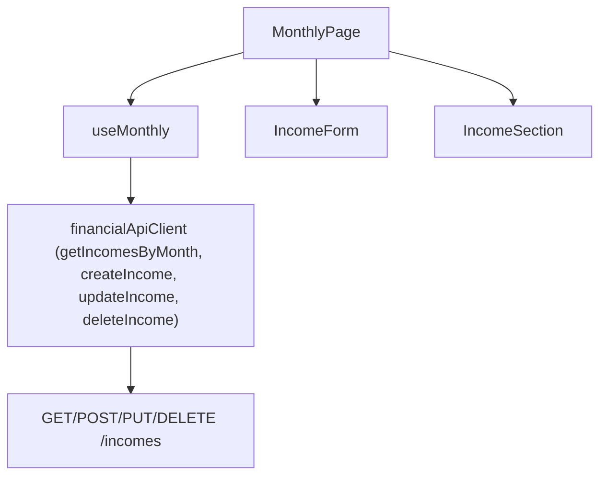

# F04. Monthly Income Capture UI

## 1. Technical Overview

**What:** Add an income entry form and list to the Monthly page (`Financial.Web`), structurally mirroring the existing Expense form/list: a date picker, an `IncomeSource` dropdown, a gross value field (shown only for `Gleison`/`Ariana`), a net value field, and a bank picker — plus inline edit/delete on the list below. Consumes F01's `Income` CRUD API (`POST`/`PUT`/`DELETE /incomes`, `GET /incomes/month/{year}/{month}`), already live.

**Why:** F01 shipped the full backend contract specifically so F04 could be a pure UI feature layered on a stable, already-tested API — this spec is that UI. The Monthly page's existing `useMonthly` hook already owns all of this page's state in one `useReducer`, and every other page/tab in this codebase follows the same one-hook-per-page convention (`useMensais`, `useControleMae`, `useReserva`), so Income state extends that same hook rather than introducing a second, parallel state owner for the same page.

**Scope:**
- Included: `IncomeDto`/`CreateIncomeDto`/`UpdateIncomeDto` types; 4 new `financialApiClient` methods; Income create/edit form fields and handlers added to `useMonthly`; a new `IncomeSection` presentational component (list + New/Edit/Delete), mirroring `ExpensesSection`; the income form embedded in `MonthlyPage.tsx` alongside the existing `ExpenseForm`, sharing the same `.monthly-page__form-panel` slot (only one form is visible at a time, exactly like today).
- Excluded: the "Incoming" summary card and tithe display (F05); any bank-balance change (F06); the Annual Summary income rows (F07).

## 2. Architecture Impact

**Affected components:**
- `Financial.Web/src/api/types.ts` — `IncomeDto`, `CreateIncomeDto`, `UpdateIncomeDto` added
- `Financial.Web/src/api/financialApiClient.ts` — `getIncomesByMonth`, `createIncome`, `updateIncome`, `deleteIncome` added to the interface and implementation
- `Financial.Web/src/hooks/useMonthly.ts` — income slice added to `MonthlyState`/`MonthlyAction`/`reducer`, fetched alongside expenses/banks, create/edit/delete handlers added
- `Financial.Web/src/components/IncomeSection.tsx` — new, mirrors `ExpensesSection.tsx`
- `Financial.Web/src/components/IncomeSection.css` — new, mirrors `ExpensesSection.css`
- `Financial.Web/src/pages/MonthlyPage.tsx` — new `IncomeForm` component (mirrors `ExpenseForm`) and `<IncomeSection>` rendered alongside `<ExpensesSection>`

## 3. Technical Decisions

| Decision | Chosen Approach | Alternative Considered | Trade-off |
|----------|-----------------|-------------------------|-----------|
| State ownership | Extend `useMonthly`'s single reducer with an income slice (`incomes`, `createIncome*`/`editIncome*` fields, mirroring the expense fields 1:1) | A separate `useIncomes` hook | Every other multi-entity page in this codebase (`useMensais`, `useControleMae`) uses one reducer per page, and Income lives on the same Monthly page the expense reducer already owns; the bank list (`state.banks`) is already fetched once and shared with the expense form, so the income form can reuse it directly without a second fetch or a second state owner |
| Form co-location | A second `IncomeForm` component defined in `MonthlyPage.tsx` next to `ExpenseForm`, rendered into the same `.monthly-page__form-panel` slot, mutually exclusive with the expense form (only one create/edit form open at a time — a new `activeForm: 'expense' \| 'income' \| null` field replaces the current implicit `isCreateFormOpen`/`editingId` exclusivity) | Two independently-toggleable forms open at once | The page has one form panel today; supporting two simultaneously open forms is UI complexity the PRD never asks for, and the "New Expense"/"New Income" buttons already imply "replace whichever form is open" the same way "New Expense" already replaces an in-progress edit today |
| Bank picker reuse | Income's bank `<select>` reuses `state.banks` (already fetched by `useMonthly` for the expense form) — no new fetch | Fetch banks again scoped to income | `GetBanks()` returns the same global bank list regardless of caller; fetching it twice would be redundant network traffic for data that never differs between the two forms |
| Validation | Mirrors `submitCreate`/`saveEdit`'s hand-written checks: date required, income source required (must be one of the 4 known values), net value must be a non-negative number, bank required, and when `GrossValue` is provided it must be `>= NetValue` — all checked client-side before the request, with the server's own validation as the backstop (same defense-in-depth already used for expenses) | Rely on server validation only, skip client-side checks | The existing expense form validates client-side first for fast feedback without a round trip; Income's error-handling requirements (PRD F04) are a strict subset of what the expense form already demonstrates, so the same approach applies unchanged |

## 4. Component Overview

**Frontend:**

| File Path | New/Modified | Purpose | Key Responsibilities |
|-----------|--------------|---------|-----------------------|
| `Financial.Web/src/api/types.ts` | Modified | DTOs | `IncomeDto { id, date, incomeSource, grossValue: number \| null, netValue, bank }`; `CreateIncomeDto`/`UpdateIncomeDto` (same shape minus `id`) |
| `Financial.Web/src/api/financialApiClient.ts` | Modified | HTTP methods | `getIncomesByMonth(year, month)` → `GET /incomes/month/${year}/${month}`; `createIncome(request)` → `POST /incomes`; `updateIncome(id, request)` → `PUT /incomes/${id}`; `deleteIncome(id)` → `DELETE /incomes/${id}` — inserted next to the existing Expense/Bank methods |
| `Financial.Web/src/hooks/useMonthly.ts` | Modified | State + handlers | `incomes: IncomeDto[]` fetched in the existing `Promise.all` alongside expenses/banks; `activeForm: 'expense' \| 'income' \| null` replaces `isCreateFormOpen` as the single source of truth for which form (if any) is open, for which entity, and in create vs. edit mode; `createIncome*`/`editIncome*` fields mirroring the expense fields; `submitCreateIncome`, `saveEditIncome`, `deleteIncome`, `showCreateIncomeForm`, `showEditIncomeForm` following the exact shape of their expense counterparts |
| `Financial.Web/src/components/IncomeSection.tsx` | New | List UI | `IncomeRow` (edit/delete buttons, formatted date/source/gross/net/bank cells) + `IncomeSection` (header with "New Income" button + `data-table`), props-driven exactly like `ExpensesSection` |
| `Financial.Web/src/components/IncomeSection.css` | New | Styling | Mirrors `ExpensesSection.css` class-for-class (`income-section`, `income-section__header`, `income-section__new-btn`, `income-section__table-wrapper`, `income-section__table`), same `flex:1`/`min-height:0` pattern, same `#007acc`/`#005fa3` button colors |
| `Financial.Web/src/pages/MonthlyPage.tsx` | Modified | Form + composition | New `IncomeForm` component (date, `IncomeSource` `<select>` with the 4 known values, conditionally-rendered gross value field, net value field, bank `<select>` reusing `banks`); rendered in the shared form-panel slot when `activeForm === 'income'`; `<IncomeSection>` rendered in `.monthly-page__content` alongside `<ExpensesSection>` |

## 5. UX Flows

- **Add:** click "New Income" → form opens (replacing any other open form) with today's date defaulted, `Gleison` as the default source → fill fields → "Add Income" → on success the form closes and the list refetches (same `RETRY`-triggered refetch pattern as expenses).
- **Edit:** click the row's edit (✏) button → form opens pre-filled from that row's `IncomeDto` → "Save" → list refetches.
- **Delete:** click the row's delete button → `window.confirm('Delete this income entry?')` → on confirm, `deleteIncome(id)` → list refetches.
- **Gross value visibility:** the gross value field only renders when `incomeSource` is `Gleison` or `Ariana`; switching away from those sources clears any entered gross value (mirrors how switching `paymentMode` clears the now-irrelevant fields in the expense form today).

## 6. Error Handling

- Client-side, before submit (mirrors `submitCreate`): blank date → "Date is required"; missing/unrecognized income source → "Income source is required"; net value blank/not-a-number/negative → "Net value must be a non-negative number"; no bank selected → "Bank is required"; gross value provided and less than net value → "Gross value must be at least the net value".
- Server-side: any `400`/`404` from the API surfaces via the same `err instanceof Error ? err.message : '...'` fallback already used by every other mutation in `useMonthly`, rendered in the form panel exactly like `saveError`/`createError` today.

## 7. Testing Strategy

| Test File | Test Type | Target | Coverage |
|-----------|-----------|--------|----------|
| `Financial.Web/src/components/__tests__/IncomeSection.test.tsx` | Component | `IncomeSection` | Renders a row per `IncomeDto` with formatted date/source/gross/net/bank; "New Income" button calls `onNewIncome`; edit button calls `onEdit` with the row's DTO; delete button calls `onDelete` with the row's id; gross value cell shows `—` when `grossValue` is `null` |
| `Financial.Web/src/pages/__tests__/MonthlyPage.test.tsx` | Page (extended) | `MonthlyPage` + `useMonthly` | Income list displayed after `getIncomesByMonthMock` resolves; "New Income" opens the income form (and closes/replaces any open expense form); submitting a valid income form calls `createIncome` with the expected payload and the gross-value field hides for `Lottery`/`DividendoJuros`; submitting with no bank selected shows the "Bank is required" error and does not call the API; editing an existing income row pre-fills the form and `updateIncome` is called with the edited values; deleting (after confirming `window.confirm`) calls `deleteIncome` and the row disappears after refetch |

**Acceptance tests (PRD Section 9, F04):**
- Entry added via the form with all required fields appears in the month's list immediately after saving → `MonthlyPage.test.tsx`
- Gross value field shown only for `Gleison`/`Ariana` → `MonthlyPage.test.tsx`
- Existing entry can be edited, reflected in the list and dependent totals → `MonthlyPage.test.tsx` (dependent totals are F05/F06's own display, out of scope here; this spec verifies the edit round-trips through the API and list)
- Existing entry can be deleted, removed from the list immediately → `MonthlyPage.test.tsx`
- No bank / negative net value / gross less than net value rejected with a validation message → `MonthlyPage.test.tsx`

**Cross-Feature Integration criteria touching F04 (PRD Section 9):**
- "F04's create/edit/delete actions correctly read and write through F01's `Income` entity contract" — verified end-to-end here: every `MonthlyPage.test.tsx` mutation test asserts the exact `CreateIncomeDto`/`UpdateIncomeDto` shape sent to the (mocked) API client, matching F01's DTOs field-for-field
