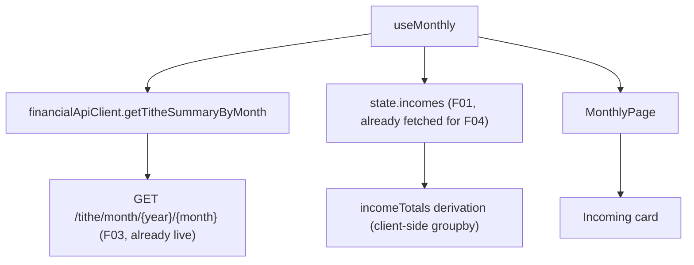

# F05. Monthly Incoming and Tithe Display

## 1. Technical Overview

**What:** A new "Incoming" card on the Monthly page, alongside the existing Category Totals, Cards, and Banks cards: one row per `IncomeSource` present that month showing its summed `NetValue` (Gleison/Ariana rows also show summed `GrossValue`), plus the month's calculated tithe and tithe balance from F03.

**Why:** F01 and F03 are both fully-shipped backend contracts with no UI of their own yet — F01's income data is already being fetched by `useMonthly` for the income form/list (F04), and F03's tithe endpoint exists but nothing on the frontend calls it. This feature is the last piece that makes both visible together on the page the developer already checks after every entry, the same "immediately visible" pattern every other panel on this page already follows.

**Scope:**
- Included: `TitheSummaryDto` + `getTitheSummaryByMonth` API client method (F03's backend contract has existed since its own feature; only the frontend call was missing); `useMonthly` fetches it alongside the rest of the month's data; a client-side `incomeTotals` derivation grouping the already-fetched `incomes` by `IncomeSource`; a new "Incoming" card in `MonthlyPage`'s grids row.
- Excluded: any backend change (F01 and F03's contracts are already complete and unmodified by this feature); the Income entry form/list itself (F04, already shipped).

## 2. Architecture Impact

**Affected components:**
- `Financial.Web/src/api/types.ts` — `TitheSummaryDto`
- `Financial.Web/src/api/financialApiClient.ts` — `getTitheSummaryByMonth`
- `Financial.Web/src/hooks/useMonthly.ts` — fetches `titheSummary`; derives `incomeTotals` from the already-fetched `incomes`
- `Financial.Web/src/pages/MonthlyPage.tsx` — new "Incoming" card

## 3. Technical Decisions

| Decision | Chosen Approach | Alternative Considered | Trade-off |
|----------|-----------------|-------------------------|-----------|
| Where `incomeTotals` is computed | Client-side, grouping the `incomes` array `useMonthly` already fetches for the income form/list (F04) | A new backend endpoint (e.g. `GET /incomes/month/{year}/{month}/totals`, mirroring `GetCategoryTotalsByMonth`) | The data needed (that month's `Income` rows) is already on the client in full — F04 already fetches every field this card needs. A grouping reduction over an array already in memory is a client-side concern; adding a backend endpoint here would duplicate `GetExpensesByMonth`+`GetCategoryTotalsByMonth`'s existing "raw list vs. pre-aggregated" split for no reason, since nothing here needs data beyond what's already fetched |
| Which sources get a row | Only `IncomeSource` values with at least one entry that month (derived by grouping, not by enumerating all 4 enum values) | Always render all 4 sources, zero-filled when absent | Mirrors exactly how the existing Category Totals card behaves — it lists only categories with expense data that month, not the full `Category` enum. `IncomeSource` is a smaller, similarly-shaped enum; treating it the same way keeps the two "totals" cards on this page consistent with each other |
| Gross value display | A source's row shows a Gross column figure only if at least one of its entries that month has a non-null `GrossValue`; otherwise the cell reads "—" (matching `IncomeSection`'s existing null-gross placeholder) | Hard-code "show Gross only for Gleison/Ariana" | The domain already enforces that only `Gleison`/`Ariana` entries carry a `GrossValue` (F04's form only shows the field for those two sources) — deriving "has gross" from the data itself is equivalent in practice and avoids a second, redundant source-name check that could drift out of sync with the domain rule |
| Tithe display | `Calculated Tithe` and `Tithe Balance` shown in the card's footer summary line (mirrors the Banks card's `Bank Balance: X · Round-Up: Y` footer pattern), not as table rows | Add "Tithe" and "Tithe Balance" as extra rows in the same table as the income sources | The PRD's F05 Capabilities describe the tithe/tithe balance as accompanying the per-source rows, "clearly labeled" — not as rows sharing the same Source/Gross/Net columns (which don't make sense for a single derived figure). The footer-summary pattern already used by every other card on this page is the natural fit |

## 4. Component Overview

**Frontend:**

| File Path | New/Modified | Purpose | Key Responsibilities |
|-----------|--------------|---------|-----------------------|
| `Financial.Web/src/api/types.ts` | Modified | DTO | `TitheSummaryDto { calculatedTithe: number, titheBalance: number }` |
| `Financial.Web/src/api/financialApiClient.ts` | Modified | HTTP method | `getTitheSummaryByMonth(year, month)` → `GET /tithe/month/${year}/${month}` |
| `Financial.Web/src/hooks/useMonthly.ts` | Modified | State + derivation | `titheSummary: TitheSummaryDto \| null` fetched in the existing `Promise.all`; `incomeTotals: IncomeTotal[]` (`{ source, netValue, grossValue: number \| null }`) derived from `state.incomes` by grouping on `incomeSource`, summing `netValue` always and `grossValue` only when at least one entry in the group has a non-null value; `totalIncoming` = sum of `incomeTotals[].netValue` |
| `Financial.Web/src/pages/MonthlyPage.tsx` | Modified | New card | "Incoming" `<section>` added to `.monthly-page__grids-row` alongside Category Totals/Cards/Banks; table columns Source/Gross/Net, one row per `incomeTotals` entry; footer line "Total Incoming: X · Calculated Tithe: Y · Tithe Balance: Z" |

## 5. UX Flow

- The Incoming card is populated from the same month-scoped fetch every other panel on the page already uses; adding, editing, or deleting an income entry (F04) or any expense (including a `Dizimo`-category one) triggers the existing `RETRY`-driven refetch, which re-pulls both `incomes` and `titheSummary` together — no new refresh mechanism needed, since both already live inside the one `Promise.all` this hook already re-runs on every mutation.

## 6. API Contracts

No new backend endpoints. This feature is the frontend's first caller of F03's existing `GET /tithe/month/{year}/{month}` (documented in F03's own spec) and reuses F01's existing `GET /incomes/month/{year}/{month}` (already called by `useMonthly` for F04).

## 7. Data Model

None. No new storage.

## 8. Testing Strategy

| Test File | Test Type | Target | Coverage |
|-----------|-----------|--------|----------|
| `Financial.Web/src/hooks/useMonthly.test.ts` | Hook | `useMonthly` | `titheSummary` reflects the fetched tithe data; `incomeTotals` groups multiple entries of the same source into one row, summing `netValue`; a source with no `GrossValue` on any entry shows `grossValue: null`; a source with at least one `GrossValue` sums only the non-null ones; `totalIncoming` equals the sum across all sources; a source with no income that month produces no row |
| `Financial.Web/src/pages/__tests__/MonthlyPage.test.tsx` | Page | `MonthlyPage` | Incoming card shows one row per source present that month with the correct summed net (and gross, where applicable) values; the footer shows the calculated tithe and tithe balance from the mocked tithe endpoint; adding a new income entry causes the card to reflect the updated totals after refetch |

**Acceptance tests (PRD Section 9, F05):**
- One row per `IncomeSource` with the correct summed value → `useMonthly.test.ts`, `MonthlyPage.test.tsx`
- Calculated tithe and tithe balance shown → `MonthlyPage.test.tsx`
- Card updates immediately after an income entry or Dizimo expense change → guaranteed by the existing shared `RETRY`-triggered refetch already covered by F04's mutation tests; `MonthlyPage.test.tsx` adds one direct assertion for the income-add case

**Cross-Feature Integration criteria touching F05 (PRD Section 9):**
- "F05 correctly displays the income totals from F01 and the tithe/tithe balance from F03 for the selected month" — verified directly here: `MonthlyPage.test.tsx` mocks both `getIncomesByMonth` (F01) and `getTitheSummaryByMonth` (F03) and asserts the card renders both correctly combined
