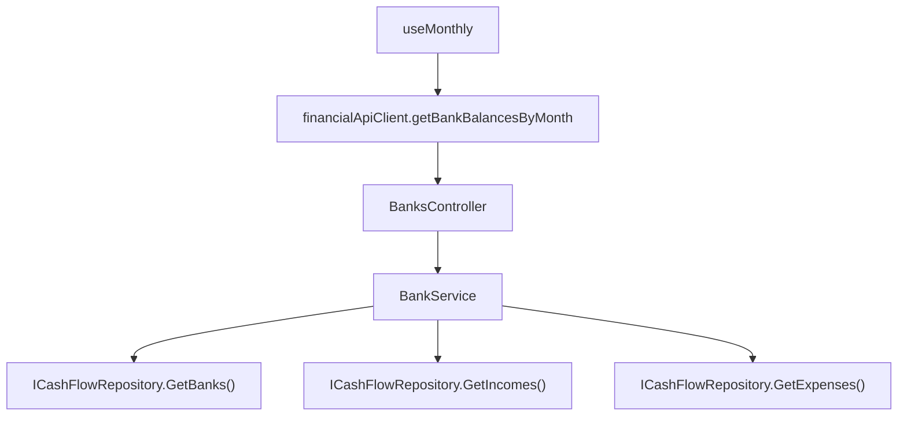

# F06. Real Bank Balance

## 1. Technical Overview

**What:** Replace the Banks panel's "Balance" figure — currently `sum(Expense.Value) − sum(Expense.RoundUpAmount)` for the selected month only, computed client-side from that month's already-fetched expenses — with a real, running balance: `OpeningBalance + Σ(Income.NetValue) − Σ(Expense.Value − Expense.RoundUpAmount)`, both sums spanning every income/expense dated from the bank's `OpeningBalanceDate` through the end of the selected month. The "Balance" label becomes "Bank Balance".

**Why:** The current figure is computed entirely from the one month of `Expense` data the Monthly page already has loaded, which is exactly why it under-counts reality (P13's known limitation this PRD exists to fix). A true running balance needs every income/expense entry back to the bank's opening date — data the Monthly page never fetches today (it only ever loads the selected month) — so this calculation cannot stay a client-side reduction over already-loaded data; it must move to the backend, which can query the full `Income`/`Expense` history unconstrained by what one page happens to have in memory.

**Scope:**
- Included: a new `IBankService.GetBankBalancesByMonth(year, month)` method and `BankBalanceDTO`, computing each bank's running balance server-side; a new `GET /banks/month/{year}/{month}/balances` endpoint; the frontend's Banks grid switches its "Balance" column from the client-side month-only reduction to this new endpoint's figures, and relabels the column and summary line to "Bank Balance".
- Excluded: the "Round-Up" column, which stays exactly as it is today (a month-scoped sum of that month's `RoundUpAmount` values, per P13-F04 — the PRD does not ask this feature to change what Round-Up means, only Balance); any change to how income/expenses are entered.

## 2. Architecture Impact

**Affected components:**
- `Financial.CashFlow.Application/DTOs/BankBalanceDTO.cs` — new
- `Financial.CashFlow.Application/Interfaces/IBankService.cs` — `GetBankBalancesByMonth` added
- `Financial.CashFlow.Application/Services/BankService.cs` — implements the calculation
- `Financial.Api/Controllers/BanksController.cs` — `GET /banks/month/{year}/{month}/balances`
- `Financial.Web/src/api/types.ts` — `BankBalanceDto`
- `Financial.Web/src/api/financialApiClient.ts` — `getBankBalancesByMonth`
- `Financial.Web/src/hooks/useMonthly.ts` — fetches bank balances alongside the other month-scoped data; `bankTotals` sources `balance` from the fetched figure instead of reducing `state.expenses`
- `Financial.Web/src/pages/MonthlyPage.tsx` — "Balance" column header and summary label renamed to "Bank Balance"



## 3. Technical Decisions

| Decision | Chosen Approach | Alternative Considered | Trade-off |
|----------|-----------------|-------------------------|-----------|
| Where the calculation lives | Extend the existing `BankService` (already owns `Bank`-related reads and the F02 opening-balance update) with `GetBankBalancesByMonth`, rather than a new service | A dedicated `BankBalanceService` | The calculation reads `Bank` (for `OpeningBalance`/`OpeningBalanceDate`), `Income`, and `Expense` to produce a per-bank figure — conceptually still "a view of Bank data," and `BankService` already aggregates across `ICashFlowRepository` the same way `TitheService` does for a different pair of entities; adding one more read method to an existing 2-method service is proportionate, a new service class for one method is not |
| Date range | `bank.OpeningBalanceDate` through the last day of the selected month (inclusive both ends) — computed once per bank as `DateOnly` bounds, then both `Income` and `Expense` are filtered against the same bounds | Filter only by year/month equality like every other "by month" query | The PRD is explicit that the balance must span "from `OpeningBalanceDate` forward," i.e. every month since opening, not just the selected one — a plain year/month filter would reproduce the exact bug this feature fixes |
| Response shape | `BankBalanceDTO { Bank: string, Balance: decimal }`, one row per bank for the requested month, returned as a flat array (mirrors `CategoryTotalDTO`'s shape) | Extend `BankDTO` itself with a `Balance` field | `BankDTO` (from `GET /banks`) is month-independent config data (name, round-up flag, opening balance/date) reused by every bank picker in the app; folding a month-scoped figure into it would make that endpoint's meaning ambiguous (whose month?). A separate, explicitly month-scoped endpoint keeps `GET /banks` a stable reference list, matching how `GET /expenses/month/{year}/{month}/category-totals` already sits alongside the month-independent `GET /banks` |
| Frontend integration | `useMonthly` fetches `getBankBalancesByMonth` in the same `Promise.all` as the rest of the month's data; `bankTotals` keeps computing `roundUpTotal` client-side from `state.expenses` (unchanged, month-scoped) but sources `balance` by matching the fetched `BankBalanceDto[]` by bank name | Compute the whole `bankTotals` row (balance and round-up) server-side | Round-Up is deliberately staying a different, already-correct month-scoped figure per PRD scope; mixing a month-scoped and a running figure into one server response would blur that distinction, whereas keeping Round-Up's existing client-side computation untouched minimizes the diff to exactly what changed |

## 4. Component Overview

**Backend:**

| File Path | New/Modified | Purpose | Key Responsibilities |
|-----------|--------------|---------|-----------------------|
| `Financial.CashFlow.Application/DTOs/BankBalanceDTO.cs` | New | Read model | `Bank` (string), `Balance` (decimal) |
| `Financial.CashFlow.Application/Interfaces/IBankService.cs` | Modified | Service contract | `IReadOnlyList<BankBalanceDTO> GetBankBalancesByMonth(int year, int month)` added |
| `Financial.CashFlow.Application/Services/BankService.cs` | Modified | Balance calculation | For each `Bank`: sums `Income.NetValue` where `Income.Bank == bank.Name` and `Date` is within `[bank.OpeningBalanceDate, endOfMonth]`; sums `Expense.Value - (Expense.RoundUpAmount ?? 0)` where `Expense.PaymentSource == bank.Name` and `Date` is within the same range; `Balance = bank.OpeningBalance + incomeTotal - expenseTotal` |
| `Financial.Api/Controllers/BanksController.cs` | Modified | HTTP surface | `GET /banks/month/{year}/{month}/balances` — mirrors `ExpensesController.GetCategoryTotalsByMonth`'s read-only `Ok()` shape |

**Frontend:**

| File Path | New/Modified | Purpose | Key Responsibilities |
|-----------|--------------|---------|-----------------------|
| `Financial.Web/src/api/types.ts` | Modified | DTO | `BankBalanceDto { bank: string, balance: number }` |
| `Financial.Web/src/api/financialApiClient.ts` | Modified | HTTP method | `getBankBalancesByMonth(year, month)` → `GET /banks/month/${year}/${month}/balances` |
| `Financial.Web/src/hooks/useMonthly.ts` | Modified | State + derived data | `bankBalances: BankBalanceDto[]` fetched in the existing `Promise.all`; `bankTotals` derivation changed from `valueSum - roundUpTotal` to looking up the matching `bankBalances` entry by name (defaulting to `0` if a bank has no fetched balance) for `balance`, while `roundUpTotal` keeps its existing month-scoped client-side computation |
| `Financial.Web/src/pages/MonthlyPage.tsx` | Modified | Label | Banks grid `<th>` "Balance" → "Bank Balance"; summary line "Balance:" → "Bank Balance:" |

## 5. API Contracts

**Endpoint: Get Bank Balances by Month**
- **Method:** GET
- **Path:** `/banks/month/{year}/{month}/balances`
- **Authentication:** None (matches every other endpoint in this single-user app)

**Response (Success - 200):**

| Field | Type | Description |
|-------|------|--------------|
| `bank` | `string` | Bank name |
| `balance` | `decimal` | Running balance through the end of the requested month |

**Response Example:**
```json
[
  { "bank": "Barclays", "balance": 1875.32 },
  { "bank": "Trading212", "balance": 420.10 },
  { "bank": "Chase", "balance": -50.00 }
]
```

**Error Codes:** none — a bank with no activity in range simply returns its `OpeningBalance` unchanged.

## 6. Data Model

None. This feature reads existing `Bank`, `Income`, and `Expense` records and stores nothing new.

## 7. Testing Strategy

| Test File | Test Type | Target | Coverage |
|-----------|-----------|--------|----------|
| `Tests/Financial.CashFlow.Application.Tests/Services/BankServiceTests.cs` | Unit | `BankService` | Balance equals `OpeningBalance + income − expenses (net of round-up)` for a bank with both income and expenses within range; income/expenses dated before `OpeningBalanceDate` are excluded; income/expenses dated after the selected month are excluded; a bank with no activity returns exactly its `OpeningBalance`; income/expenses tagged to a different bank don't affect this bank's total; a settled credit-card expense (whose `PaymentSource` is the settling bank) counts toward that bank the same as any other expense |
| `Tests/Financial.Api.Tests/BanksEndpointsTests.cs` | Integration | `BanksController` | `GET .../balances` returns figures matching seeded income/expense/opening-balance fixtures for all 3 banks |
| `Financial.Web/src/hooks/useMonthly.test.ts` | Hook | `useMonthly` | `bankTotals[].balance` reflects the fetched `bankBalances` data (not a client-side sum of the month's expenses); `roundUpTotal` still derives from `state.expenses` unchanged |
| `Financial.Web/src/pages/__tests__/MonthlyPage.test.tsx` | Page | `MonthlyPage` | Banks grid header reads "Bank Balance"; the summary line reads "Bank Balance:"; the displayed figure comes from the mocked `getBankBalancesByMonth` response, not from summing the mocked expenses |

**Acceptance tests (PRD Section 9, F06):**
- Balance formula matches a manual reference to the penny → `BankServiceTests`
- Activity before `OpeningBalanceDate` excluded → `BankServiceTests`
- Label reads "Bank Balance" → `MonthlyPage.test.tsx`
- Balance updates immediately after an income entry or expense is saved → guaranteed by the existing `RETRY`-triggered full month refetch already used for every other mutation in `useMonthly` (unchanged pattern, now also re-fetching `bankBalances`)

**Cross-Feature Integration criteria touching F06 (PRD Section 9):**
- "F06 correctly combines F01's income data with F02's opening balance and date to produce each bank's balance" — verified directly here: `BankServiceTests` seeds `Income` (F01) and a bank's `OpeningBalance`/`OpeningBalanceDate` (F02) and asserts the combined running balance
