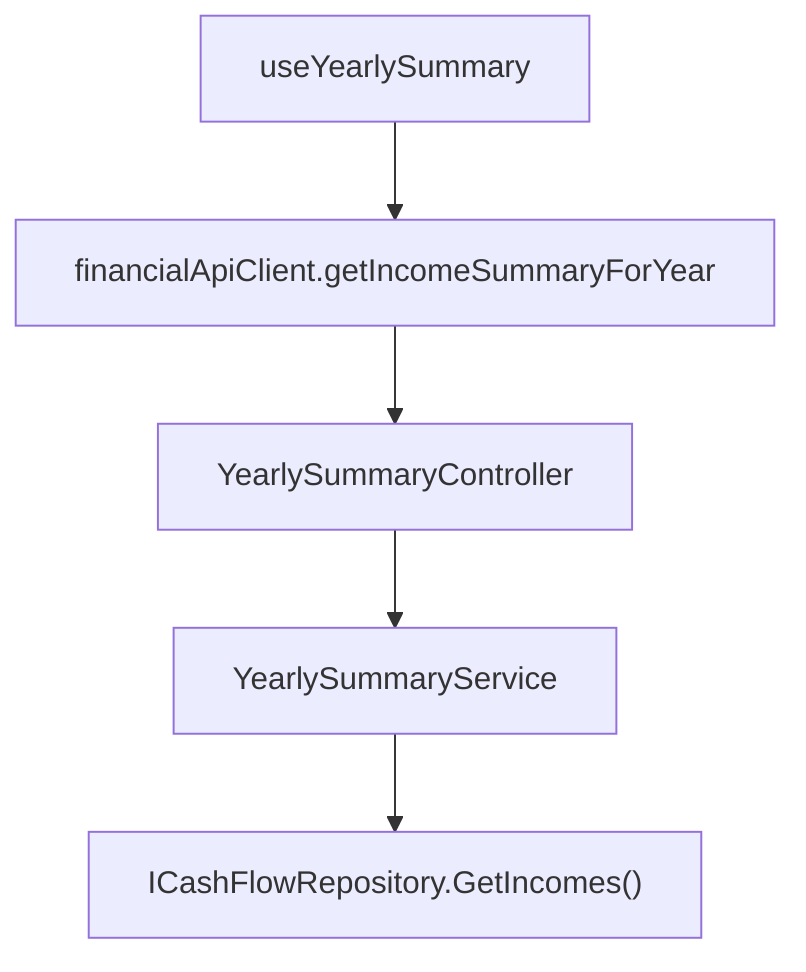

# F07. Yearly Summary Income Rows

## 1. Technical Overview

**What:** A new Income Summary table on the Yearly Summary page, laid out like the existing Category Totals table (12 monthly columns + a yearly total), with 4 fixed metric rows — Salary (gross), Salary after taxes (net), Tax difference (gross minus net), and Dividendo/Juros — plus a section-header row and an intentionally blank row, replicating the retired spreadsheet's income block layout (rows 1-6, with row 5 always blank).

**Why:** F01 made `Income` a real, queryable entity; this feature is the last piece that surfaces it across a full year the same way `Category Totals` already does for expenses, so the developer can review income the same way they review everything else in this app — per month, per year, at a glance.

**Scope:**
- Included: `IYearlySummaryService.GetIncomeSummaryForYear(year)` and `IncomeYearlySummaryDTO`; `GET /yearly-summary/{year}/income-summary`; a new Income Summary table on `YearlySummaryPage`, fetched alongside the existing Category Totals and Investment Diffs data.
- Excluded: Lottery, the calculated tithe, and the tithe balance — none appear in the Yearly Summary, per PRD Out-of-Scope; any change to the Monthly page's own Incoming card (F05).

## 2. Architecture Impact

**Affected components:**
- `Financial.CashFlow.Application/DTOs/IncomeYearlySummaryDTO.cs` — new
- `Financial.CashFlow.Application/Interfaces/IYearlySummaryService.cs` — `GetIncomeSummaryForYear` added
- `Financial.CashFlow.Application/Services/YearlySummaryService.cs` — implements the calculation
- `Financial.Api/Controllers/YearlySummaryController.cs` — `GET /yearly-summary/{year}/income-summary`
- `Financial.Web/src/api/types.ts` — `IncomeYearlySummaryDto`
- `Financial.Web/src/api/financialApiClient.ts` — `getIncomeSummaryForYear`
- `Financial.Web/src/hooks/useYearlySummary.ts` — fetches the new data alongside the existing two
- `Financial.Web/src/pages/YearlySummaryPage.tsx` — new Income Summary table



## 3. Technical Decisions

| Decision | Chosen Approach | Alternative Considered | Trade-off |
|----------|-----------------|-------------------------|-----------|
| DTO shape | `IncomeYearlySummaryDTO` with 4 named row pairs (`SalaryMonthly`/`SalaryYearlyTotal`, `SalaryAfterTaxesMonthly`/`...YearlyTotal`, `TaxDifferenceMonthly`/`...YearlyTotal`, `DividendoJurosMonthly`/`...YearlyTotal`) rather than a generic list of rows | Reuse `CategoryYearlyTotalDTO`'s generic `{ Category, MonthlyTotals, YearlyTotal }` shape, one entry per row | `CategoryYearlyTotalDTO` works generically because it loops over every `Category` enum value uniformly; this feature's 4 rows have fixed, distinct semantics (two are raw sums, one is a derived difference, one skips two income sources entirely) that don't reduce to one generic loop, so 4 explicit named fields is more direct than forcing a generic shape that would need an artificial "row kind" discriminator |
| Row 1 (header) and Row 5 (blank) | Rendered directly in the frontend table markup, not modeled in the DTO — the backend has no reason to represent "a label with no data" or "nothing" as data | Add placeholder fields for rows 1 and 5 to the DTO for structural completeness | These two rows carry no computed value; putting them in the DTO would mean the backend ships fields that are always constants or always empty, purely to satisfy a frontend layout detail. The table structure (which rows exist, in which order) is presentation, not business logic — the backend's job ends at "here are the 4 real numbers," matching how `InvestmentDiffsYearlyDTO` doesn't encode the Net Position row's bold styling either |
| Salary aggregation | `IncomeSource.Gleison` and `IncomeSource.Ariana` entries are summed together into the same monthly bucket (both `GrossValue` for row 2 and `NetValue` for row 3) — matching the PRD's literal "sum of GrossValue for that month's Gleison and Ariana entries" | Two separate Salary rows, one per source | The PRD Capabilities explicitly describe a single combined Salary row summing both sources, mirroring the retired spreadsheet's single J2 "Salario" cell that already combined both incomes; splitting them would be a scope addition the PRD doesn't ask for |
| Missing `GrossValue` | Treated as `0m` when summing row 2 (an income entry with no `GrossValue` — e.g. a `Lottery`/`DividendoJuros` entry, or theoretically a `Gleison`/`Ariana` entry saved without one) contributes nothing to Salary | Skip such entries entirely | Since row 2 only sums `Gleison`/`Ariana` entries in the first place, and F04's validation makes `GrossValue` effectively expected (though not required) for those two sources, treating a missing value as `0` is the simplest correct behavior and avoids a null-reference distinction the PRD doesn't call for |

## 4. Component Overview

**Backend:**

| File Path | New/Modified | Purpose | Key Responsibilities |
|-----------|--------------|---------|-----------------------|
| `Financial.CashFlow.Application/DTOs/IncomeYearlySummaryDTO.cs` | New | Read model | `SalaryMonthly`/`SalaryYearlyTotal` (row 2), `SalaryAfterTaxesMonthly`/`SalaryAfterTaxesYearlyTotal` (row 3), `TaxDifferenceMonthly`/`TaxDifferenceYearlyTotal` (row 4), `DividendoJurosMonthly`/`DividendoJurosYearlyTotal` (row 6) — each `Monthly` field a 12-element `decimal[]` |
| `Financial.CashFlow.Application/Interfaces/IYearlySummaryService.cs` | Modified | Service contract | `IncomeYearlySummaryDTO GetIncomeSummaryForYear(int year)` added |
| `Financial.CashFlow.Application/Services/YearlySummaryService.cs` | Modified | Calculation | Filters `Income` entries to the requested year; for `Gleison`/`Ariana` entries, accumulates `GrossValue ?? 0` into `SalaryMonthly[month]` and `NetValue` into `SalaryAfterTaxesMonthly[month]`; for `DividendoJuros` entries, accumulates `NetValue` into `DividendoJurosMonthly[month]`; `Lottery` entries contribute to none of the 4 rows; `TaxDifferenceMonthly[month] = SalaryMonthly[month] - SalaryAfterTaxesMonthly[month]`; each yearly total is the sum of its 12 monthly values |
| `Financial.Api/Controllers/YearlySummaryController.cs` | Modified | HTTP surface | `GET /yearly-summary/{year}/income-summary` — mirrors the existing 2 endpoints' `Ok()` shape |

**Frontend:**

| File Path | New/Modified | Purpose | Key Responsibilities |
|-----------|--------------|---------|-----------------------|
| `Financial.Web/src/api/types.ts` | Modified | DTO | `IncomeYearlySummaryDto` mirroring the 8 backend fields (camelCase) |
| `Financial.Web/src/api/financialApiClient.ts` | Modified | HTTP method | `getIncomeSummaryForYear(year)` → `GET /yearly-summary/${year}/income-summary` |
| `Financial.Web/src/hooks/useYearlySummary.ts` | Modified | State + fetch | `incomeSummary: IncomeYearlySummaryDto \| null` fetched in the existing `Promise.all` alongside `categoryTotals`/`investmentDiffs` |
| `Financial.Web/src/pages/YearlySummaryPage.tsx` | Modified | New table | "Income Summary" section, same column layout (`MONTH_LABELS` + Yearly Total) as Category Totals; table body: row 1 a full-width "Income" label row; row 2 "Salary"; row 3 "Salary after taxes"; row 4 "Tax difference"; row 5 a full-width empty row; row 6 "Dividendo/Juros" |

## 5. API Contracts

**Endpoint: Get Income Summary for Year**
- **Method:** GET
- **Path:** `/yearly-summary/{year}/income-summary`
- **Authentication:** None (matches every other endpoint in this single-user app)

**Response (Success - 200):**

| Field | Type | Description |
|-------|------|--------------|
| `salaryMonthly` | `decimal[12]` | Row 2: Gleison + Ariana gross values, per month |
| `salaryYearlyTotal` | `decimal` | Sum of `salaryMonthly` |
| `salaryAfterTaxesMonthly` | `decimal[12]` | Row 3: Gleison + Ariana net values, per month |
| `salaryAfterTaxesYearlyTotal` | `decimal` | Sum of `salaryAfterTaxesMonthly` |
| `taxDifferenceMonthly` | `decimal[12]` | Row 4: `salaryMonthly[i] - salaryAfterTaxesMonthly[i]` |
| `taxDifferenceYearlyTotal` | `decimal` | Sum of `taxDifferenceMonthly` |
| `dividendoJurosMonthly` | `decimal[12]` | Row 6: DividendoJuros net values, per month |
| `dividendoJurosYearlyTotal` | `decimal` | Sum of `dividendoJurosMonthly` |

**Response Example (abridged to 3 months):**
```json
{
  "salaryMonthly": [2450.00, 0, 0],
  "salaryYearlyTotal": 2450.00,
  "salaryAfterTaxesMonthly": [2450.00, 0, 0],
  "salaryAfterTaxesYearlyTotal": 2450.00,
  "taxDifferenceMonthly": [0, 0, 0],
  "taxDifferenceYearlyTotal": 0,
  "dividendoJurosMonthly": [15.50, 0, 0],
  "dividendoJurosYearlyTotal": 15.50
}
```

**Error Codes:** none — a year with no income data returns all zeros.

## 6. Data Model

None. This feature reads existing `Income` records and stores nothing new.

## 7. Testing Strategy

| Test File | Test Type | Target | Coverage |
|-----------|-----------|--------|----------|
| `Tests/Financial.CashFlow.Application.Tests/Services/YearlySummaryServiceTests.cs` | Unit | `YearlySummaryService` | Salary row sums Gleison + Ariana gross values per month; Salary-after-taxes row sums their net values per month; Tax difference row equals gross minus net per month; Dividendo/Juros row sums only `DividendoJuros` net values; `Lottery` entries contribute to no row; an income with a null `GrossValue` contributes `0` to Salary; entries outside the requested year are excluded; yearly totals equal the sum of their 12 monthly values; a year with no income returns all zeros |
| `Tests/Financial.Api.Tests/YearlySummaryEndpointsTests.cs` | Integration | `YearlySummaryController` | `GET .../income-summary` returns figures matching a seeded fixture across multiple sources and months |
| `Financial.Web/src/hooks/useYearlySummary.test.ts` | Hook | `useYearlySummary` | `incomeSummary` reflects the fetched data |
| `Financial.Web/src/pages/__tests__/YearlySummaryPage.test.tsx` | Page | `YearlySummaryPage` | Income Summary table renders with the "Income" header row, Salary/Salary-after-taxes/Tax-difference/Dividendo-Juros rows showing the fetched figures, a blank row 5, and no Lottery/tithe/tithe-balance row or label anywhere on the page |

**Acceptance tests (PRD Section 9, F07):**
- Salary row = sum of Gleison + Ariana gross values per month → `YearlySummaryServiceTests`
- Salary after taxes row = sum of their net values per month → `YearlySummaryServiceTests`
- Tax difference row = row 2 minus row 3 per month → `YearlySummaryServiceTests`
- Dividendo/Juros row = sum of that month's DividendoJuros net values → `YearlySummaryServiceTests`
- Row 5 renders with no numeric value → `YearlySummaryPage.test.tsx`
- Lottery, tithe, and tithe balance do not appear anywhere in the Yearly Summary → `YearlySummaryPage.test.tsx`

**Cross-Feature Integration criteria touching F07 (PRD Section 9):**
- "F07 correctly aggregates F01's income data across all 12 months of the selected year into the Yearly Summary's Income Summary table" — verified directly here: `YearlySummaryServiceTests` seeds `Income` entries (F01's entity) across multiple sources/months and asserts every row of the aggregation
