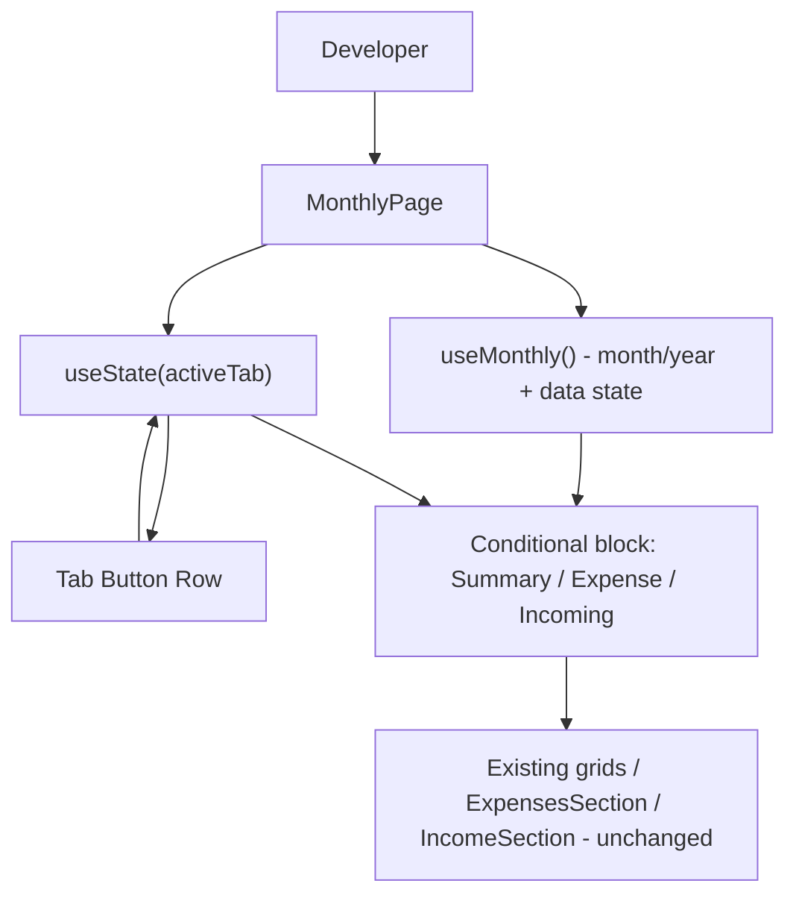

## 1. Technical Overview

**What:** Add a local three-tab shell (Summary, Expense, Incoming) to `MonthlyPage.tsx`, with the existing month/year picker relocated above the tab row so it applies to all three tabs. The existing content — the 4 total grids, the Expense form/list, and the Incoming form/list — is relocated as-is into its matching tab's conditional block, with no visual regrouping or component extraction yet (that work belongs to F02/F03/F04).

**Why:** The codebase has no tab library and no prior in-page multi-tab pattern besides `DetailPanel.tsx` (`src/components/DetailPanel.tsx`), which already solves exactly this shape of problem — a `TabId` union, a `TABS` array, `useState` for the active tab, a button row, and conditional rendering — with matching CSS (`DetailPanel.css:72-97`). Reusing that pattern keeps the codebase's tab-switching mechanism consistent across pages instead of introducing a second, different implementation. Month/year state already lives entirely inside `useMonthly()` and is owned by `MonthlyPage.tsx` today, so no state needs to be lifted — it already sits at the right level to be shared across tabs once the tab row is added below it.

**Scope:**
- Included: `MonthlyTabId` type and `TABS` definition, `activeTab` state, tab button row, tab bar CSS, relocating the 3 existing content blocks (grids row, expense form+list, income form+list) behind tab guards, and updated/added tests for the tab mechanism itself.
- Excluded: splitting the 4 grids into 2 groups (F02), extracting `ExpenseForm`/`ExpensesSection` into their own tab component (F03), extracting `IncomeForm`/`IncomeSection` into their own tab component (F04). These features build on top of the tab guards this feature introduces, without changing the tab mechanism itself.

## 2. Architecture Impact

**Affected components:**
- `Financial.Web/src/pages/MonthlyPage.tsx` — gains tab state/types, the tab button row, and conditional guards around its 3 existing content blocks
- `Financial.Web/src/pages/MonthlyPage.css` — gains the tab bar's visual styling
- `Financial.Web/src/pages/__tests__/MonthlyPage.test.tsx` — gains tab-mechanism tests; existing expense/income interaction tests gain a tab-click step

## 3. Technical Decisions

| Decision | Chosen Approach | Alternative Considered | Trade-off |
|----------|----------------|----------------------|-----------|
| Active-tab state ownership | Local `useState<MonthlyTabId>` inside `MonthlyPage.tsx`, mirroring `DetailPanel.tsx`'s `activeTab` pattern | URL search param (`?tab=expense`) for deep-linking | PRD Section 7 explicitly excludes deep-linking/persistence of the active tab; local state is simpler and matches the one existing precedent in this codebase |
| F01 content scope | Relocate the 3 existing content blocks into their tab guard as-is (no grouping/extraction yet) | Ship F01 with empty/placeholder tab bodies and defer all content moves to F02-F04 | Keeps the app fully functional immediately after F01 merges (confirmed with the user); F02-F04 diffs stay focused only on the specific transformation they own, with no rework of code F01 already moved |

## 4. Component Overview

**Frontend:**

| File Path | New/Modified | Purpose | Key Responsibilities |
|-----------|--------------|---------|---------------------|
| `Financial.Web/src/pages/MonthlyPage.tsx` | Modified | Hosts the month/year picker, tab bar, and per-tab content guards | Define `MonthlyTabId`/`TABS`; own `activeTab` state defaulting to `'summary'`; render the tab button row; wrap each of the 3 existing content blocks in an `activeTab === '...'` guard; no change to `useMonthly()` usage or to the wrapped JSX itself |
| `Financial.Web/src/pages/MonthlyPage.css` | Modified | Tab bar visual styling | Add `.monthly-page__tabs`, `.monthly-page__tab`, `.monthly-page__tab--active`, matching the look already established by `.detail-panel__tabs`/`__tab`/`__tab--active` in `DetailPanel.css:72-97` |
| `Financial.Web/src/pages/__tests__/MonthlyPage.test.tsx` | Modified | Cover the tab mechanism; keep existing coverage passing under the new structure | Add tests for default tab, tab switching, active-tab visual state, and period/tab-state independence; add a tab-click step before every existing test that queries `ExpensesSection`/`IncomeSection` content |

## 5. API Contracts

Not applicable — this feature makes no backend or API changes.

## 6. Data Model

Not applicable — this feature makes no data model or persistence changes.

## 7. Testing Strategy

**Test File Structure:**

| Test File | Test Type | Target | Coverage Goal |
|-----------|-----------|--------|---------------|
| `Financial.Web/src/pages/__tests__/MonthlyPage.test.tsx` | Component | `MonthlyPage` tab shell | All 6 F01 acceptance criteria and the tab-related Cross-Feature Integration criteria covered |

**Test functions:**

| Test Function | Description | Assertions |
|---------------|-------------|------------|
| `it('defaults to the Summary tab on load')` | Verifies F01 AC1 | Category Totals/Cards/Banks/Incoming grids are visible on initial render; expense/income list content is not rendered |
| `it('marks Summary as the active tab button by default')` | Verifies F01 AC1 | Summary tab button carries the active CSS class; Expense/Incoming buttons do not |
| `it('shows only the Expense tabs content after clicking Expense')` | Verifies F01 AC2 | After clicking "Expense", the 4 Summary grids are gone, `ExpensesSection` content is visible, `IncomeSection` content is not |
| `it('shows only the Incoming tabs content after clicking Incoming')` | Verifies F01 AC2 | After clicking "Incoming", the 4 Summary grids and `ExpensesSection` content are gone, `IncomeSection` content is visible |
| `it('does not change the month/year picker value when switching tabs')` | Verifies F01 AC4 and the F01→F02/F03/F04 Cross-Feature Integration criterion on shared period state | Month input value identical before and after a tab click |
| `it('does not refetch data when switching tabs')` | Verifies F01 AC4 and the F01→F02/F03/F04 Cross-Feature Integration criterion on avoiding redundant refetch | Mocked API client call counts are unchanged across a tab switch |
| `it('keeps the active tab unchanged when the month/year value changes')` | Verifies F01 AC5 | While Expense is active, changing the month input keeps Expense's content visible (does not revert to Summary) |
| `it('shows the error/retry state regardless of the active tab')` | Verifies F01 AC6 | With the mocked API client rejecting, the error message and retry button render whether Summary, Expense, or Incoming was last active |
| Existing expense interaction tests (create/edit/delete, mark/unmark paid, round-up field) | Modified | Add `fireEvent.click(screen.getByText('Expense'))` (or `'Summary'`/`'Cards'` context as applicable) before the existing interaction steps; all prior assertions unchanged |
| Existing income interaction tests (create/edit/delete) | Modified | Add `fireEvent.click(screen.getByText('Incoming'))` before the existing interaction steps; all prior assertions unchanged |
