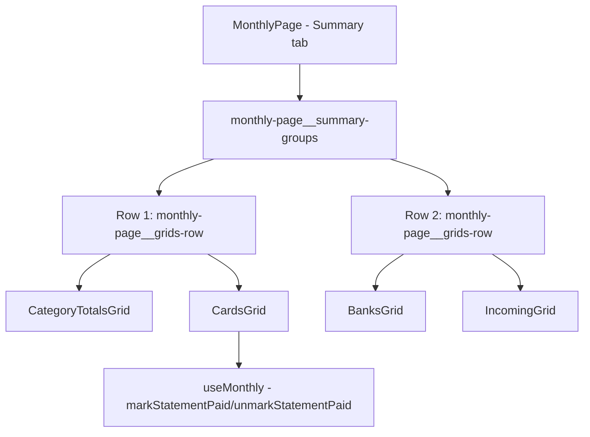

## 1. Technical Overview

**What:** Extract the 4 grids currently inlined in `MonthlyPage.tsx`'s Summary tab block (Category Totals, Cards, Banks, Incoming) into their own presentational components under `src/components/`, and rearrange them into two visually separated rows: Row 1 (Category Totals, Cards), Row 2 (Banks, Incoming). No grid's data, columns, or interactive behavior changes.

**Why:** F01 relocated the 4 grids into the Summary tab guard as-is, deliberately deferring this exact transformation. `ExpensesSection.tsx`/`IncomeSection.tsx` already establish this codebase's convention for a self-contained UI section owning its own file — the same pattern applies cleanly here, since each grid already has an independent responsibility (its own data, its own footer total, and in the Cards grid's case, its own Mark/Unmark Paid interaction). Extracting shrinks `MonthlyPage.tsx` (729 lines after F01) toward a coordinator role and gives each grid a clear, testable prop boundary, consistent with this project's Clean Code mandate without introducing any abstraction the codebase doesn't already use elsewhere.

**Scope:**
- Included: 4 new grid components, their extraction from `MonthlyPage.tsx`, the two-row grouping layout, and component-level tests for each new grid.
- Excluded: any change to grid data, calculations, or the Cards grid's Mark/Unmark Paid business logic (all untouched, just relocated); the Expense and Incoming tabs' own content (F03/F04).

## 2. Architecture Impact

**Affected components:**
- `Financial.Web/src/components/CategoryTotalsGrid.tsx` (new)
- `Financial.Web/src/components/CardsGrid.tsx` (new)
- `Financial.Web/src/components/BanksGrid.tsx` (new)
- `Financial.Web/src/components/IncomingGrid.tsx` (new)
- `Financial.Web/src/pages/MonthlyPage.tsx` — Summary tab block now renders the 4 new components inside 2 grouped rows instead of inline JSX
- `Financial.Web/src/pages/MonthlyPage.css` — new `.monthly-page__summary-groups` wrapper; existing `.monthly-page__grids-row`/`.monthly-page__section--grid` rules reused unchanged, one per row
- New test files: `CategoryTotalsGrid.test.tsx`, `CardsGrid.test.tsx`, `BanksGrid.test.tsx`, `IncomingGrid.test.tsx` under `src/components/__tests__/`
- `Financial.Web/src/pages/__tests__/MonthlyPage.test.tsx` — assertions updated to check the 2-row grouping structure

## 3. Technical Decisions

| Decision | Chosen Approach | Alternative Considered | Trade-off |
|----------|----------------|----------------------|-----------|
| Grid componentization | Extract each of the 4 grids into its own file under `src/components/`, mirroring `ExpensesSection.tsx`/`IncomeSection.tsx` | Keep grids inline in `MonthlyPage.tsx`, just wrap in 2 row `
`s | Confirmed with the user; extraction keeps `MonthlyPage.tsx` from growing further and gives each grid an independently testable prop boundary, at the cost of 4 new files instead of a pure layout tweak |
| Row grouping implementation | A single `.monthly-page__summary-groups` flex-column wrapper containing two `.monthly-page__grids-row` rows (existing class, unchanged), each with its 2 grids | A CSS grid with `grid-template-areas` for the 2x2 layout | Reuses the existing flex-row class as-is (already handles the wrap/`min-width` behavior for narrow viewports); no new layout system introduced for a 2-row split |

## 4. Component Overview

**Frontend:**

| File Path | New/Modified | Purpose | Key Responsibilities |
|-----------|--------------|---------|---------------------|
| `Financial.Web/src/components/CategoryTotalsGrid.tsx` | New | Renders the Category Totals grid | Accepts `categoryTotals`, `categoryTotalsSum`; renders the existing table/footer markup verbatim |
| `Financial.Web/src/components/CardsGrid.tsx` | New | Renders the Cards grid with Mark/Unmark Paid | Accepts `cardStatements`, `banks`, `adjustmentTotal`, `markPaidSources`, `setMarkPaidSource`, `markStatementPaid`, `unmarkStatementPaid`; renders the existing table/footer/action markup verbatim |
| `Financial.Web/src/components/BanksGrid.tsx` | New | Renders the Banks grid | Accepts `bankTotals`, `bankTotalsSum`, `roundUpTotalsSum`; renders the existing table/footer markup verbatim |
| `Financial.Web/src/components/IncomingGrid.tsx` | New | Renders the Incoming totals grid | Accepts `incomeTotals`, `totalIncoming`, `titheSummary`; renders the existing table/footer markup verbatim |
| `Financial.Web/src/pages/MonthlyPage.tsx` | Modified | Summary tab now composes the 4 grid components into 2 grouped rows | Replace inline grid JSX with `<CategoryTotalsGrid>`/`<CardsGrid>`/`<BanksGrid>`/`<IncomingGrid>`, forwarding the same values/handlers already destructured from `useMonthly()`; no change to any other tab |
| `Financial.Web/src/pages/MonthlyPage.css` | Modified | Two-row Summary layout | Add `.monthly-page__summary-groups` (flex column, gap matching the existing section spacing); no change to `.monthly-page__grids-row`/`.monthly-page__section--grid` |

## 5. API Contracts

Not applicable — this feature makes no backend or API changes.

## 6. Data Model

Not applicable — this feature makes no data model or persistence changes.

## 7. Testing Strategy

**Test File Structure:**

| Test File | Test Type | Target | Coverage Goal |
|-----------|-----------|--------|---------------|
| `Financial.Web/src/components/__tests__/CategoryTotalsGrid.test.tsx` | Component | `CategoryTotalsGrid` | Renders rows and footer total from props |
| `Financial.Web/src/components/__tests__/CardsGrid.test.tsx` | Component | `CardsGrid` | Renders rows, footer total, and Mark/Unmark Paid interactions |
| `Financial.Web/src/components/__tests__/BanksGrid.test.tsx` | Component | `BanksGrid` | Renders rows and footer totals from props |
| `Financial.Web/src/components/__tests__/IncomingGrid.test.tsx` | Component | `IncomingGrid` | Renders rows, footer total, and optional tithe summary |
| `Financial.Web/src/pages/__tests__/MonthlyPage.test.tsx` | Component/Integration | `MonthlyPage` Summary tab grouping | F02 acceptance criteria and Cross-Feature Integration coverage |

**Test functions:**

| Test Function | Description | Assertions |
|---------------|-------------|------------|
| `it('renders a row per category with the footer total')` (`CategoryTotalsGrid`) | Basic render | Category rows and formatted total appear |
| `it('renders a row per card with status and mark/unmark paid controls')` (`CardsGrid`) | Basic render + interaction | Card rows, adjustment total, and Mark Paid/Unmark Paid behavior (moved verbatim from the existing `MonthlyPage.test.tsx` Cards assertions) |
| `it('renders a row per bank with balance and round-up columns')` (`BanksGrid`) | Basic render | Bank rows and the two footer totals |
| `it('renders a row per income source, with tithe summary when provided')` (`IncomingGrid`) | Basic render | Source rows, total incoming, and conditional tithe/tithe-balance text |
| `it('renders Category Totals and Cards in the first row, Banks and Incoming in the second')` (`MonthlyPage`) | Verifies F02 AC2 | DOM order/structure check: first `.monthly-page__grids-row` contains Category Totals + Cards headings, second contains Banks + Incoming headings |
| `it('shows no heading or label between the two Summary rows')` (`MonthlyPage`) | Verifies F02 AC3 | No extra heading/text node exists between the two grouped rows beyond the grids' own `<h2>`s |
| `it('keeps Mark Paid/Unmark Paid working after the Summary regrouping')` (`MonthlyPage`) | Verifies F02 AC5-AC6 and the F01→F02 Cross-Feature Integration criterion (grids still re-scope correctly when month/year changes while Summary is active) | Existing Mark Paid/Unmark Paid flow assertions, run against the regrouped Summary tab |
