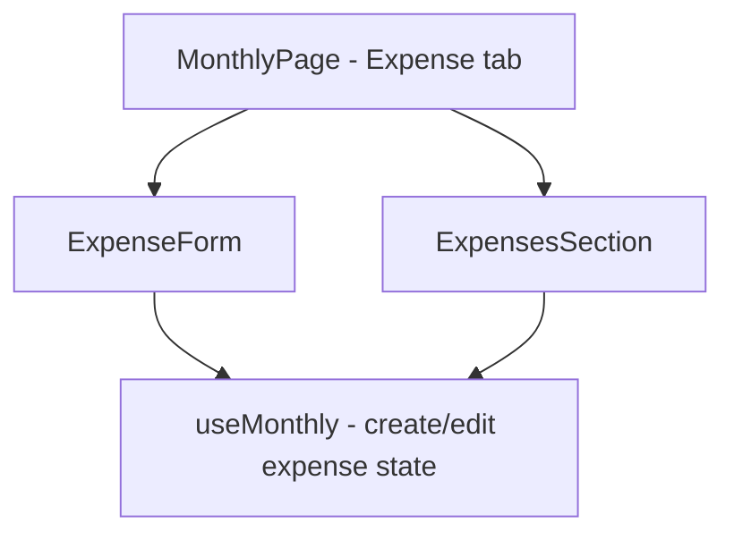

## 1. Technical Overview

**What:** Extract the `ExpenseForm` local function (currently defined inline in `MonthlyPage.tsx`) into its own component under `src/components/`, with no change to its props, markup, or behavior. `MonthlyPage.tsx` continues composing `<ExpenseForm>` + `<ExpensesSection>` directly inside the Expense tab guard.

**Why:** F01 already relocated the full expense list and create/edit form into the Expense tab guard and already implements every behavior this feature's PRD entry describes — tab-scoped form visibility, discarding an open form on tab switch (via `handleTabClick`'s `cancelEdit`/`cancelCreateForm` calls), and unchanged create/edit/delete/validation flows. This feature's only remaining work is code organization: continuing the extraction pattern F02 established for the 4 Summary grids, applied here to the last piece of UI still inlined in `MonthlyPage.tsx` for the Expense tab.

**Scope:**
- Included: extracting `ExpenseForm` into its own file; re-verifying (not re-implementing) F03's acceptance criteria against the current codebase.
- Excluded: any change to `ExpensesSection.tsx`, `useMonthly.ts`, validation rules, or the tab-switch-discards-form mechanism (all already correct, from F01). No `MonthlyExpenseTab.tsx` wrapper — confirmed with the user, `MonthlyPage.tsx` keeps composing the two pieces directly.

## 2. Architecture Impact

**Affected components:**
- `Financial.Web/src/components/ExpenseForm.tsx` (new) — the extracted form component
- `Financial.Web/src/pages/MonthlyPage.tsx` — removes the local `ExpenseForm` function and its field-mapping constants (`CREATE_FIELD_BY_FORM_FIELD`, `EDIT_FIELD_BY_FORM_FIELD`, `CATEGORIES`, `CARDS`), importing the new component instead
- `Financial.Web/src/components/__tests__/ExpenseForm.test.tsx` (new)

## 3. Technical Decisions

| Decision | Chosen Approach | Alternative Considered | Trade-off |
|----------|----------------|----------------------|-----------|
| Extraction boundary | Extract only `ExpenseForm` into its own file; `MonthlyPage.tsx` keeps composing `<ExpenseForm>` + `<ExpensesSection>` directly | Also wrap both into a `MonthlyExpenseTab.tsx` coordinator component | Confirmed with the user; matches F02's grid-extraction precedent (one component per extracted unit) without adding an extra prop-passthrough layer that isn't yet justified by size or reuse |

## 4. Component Overview

**Frontend:**

| File Path | New/Modified | Purpose | Key Responsibilities |
|-----------|--------------|---------|---------------------|
| `Financial.Web/src/components/ExpenseForm.tsx` | New | Renders the create/edit expense form | Same props as the current local function (`isEditing`, `date`, `description`, `value`, `category`, `paymentSource`, `cardTag`, `roundUpAmount`, `paymentMode`, `banks`, `isSettled`, `isSaving`, `saveError`, `onFieldChange`, `onModeChange`, `onSave`, `onCancel`); owns the `CATEGORIES`/`CARDS` option lists and the settled-vs-editable field layout, moved verbatim |
| `Financial.Web/src/pages/MonthlyPage.tsx` | Modified | Expense tab composition | Import `ExpenseForm` from `components/`; remove the local function definition and its field-mapping constants; the `EXPENSE_FIELD_BY_FORM_FIELD`-style mapping constants move alongside the component since they're only used by its `onFieldChange` wiring |

## 5. API Contracts

Not applicable — this feature makes no backend or API changes.

## 6. Data Model

Not applicable — this feature makes no data model or persistence changes.

## 7. Testing Strategy

**Test File Structure:**

| Test File | Test Type | Target | Coverage Goal |
|-----------|-----------|--------|---------------|
| `Financial.Web/src/components/__tests__/ExpenseForm.test.tsx` | Component | `ExpenseForm` | Renders correctly in create/edit/settled/bank-mode/card-mode states |
| `Financial.Web/src/pages/__tests__/MonthlyPage.test.tsx` | Component/Integration | `MonthlyPage` Expense tab (existing suite) | F03 acceptance criteria re-verified unchanged after extraction |

**Test functions:**

| Test Function | Description | Assertions |
|---------------|-------------|------------|
| `it('renders the create form with empty fields by default')` (`ExpenseForm`) | Basic render | Date/description/value/category fields present and empty |
| `it('shows the settlement note and hides payment fields when settled')` (`ExpenseForm`) | Settled-expense branch | Settlement note visible, payment mode radios and pickers absent |
| `it('shows the bank picker in bank mode and the card picker in card mode')` (`ExpenseForm`) | Mode toggle | Correct picker shown per `paymentMode` |
| `it('shows the round-up field only for a round-up-enabled bank in bank mode')` (`ExpenseForm`) | Round-up conditional | Round-up input appears/disappears per bank selection |
| Existing `MonthlyPage.test.tsx` Expense-tab tests (New/Edit/Delete, settled note, bank/card mode, round-up, tab-switch-discards-form) | Re-run unchanged | All pass against the extracted component, confirming no behavior regressed |
