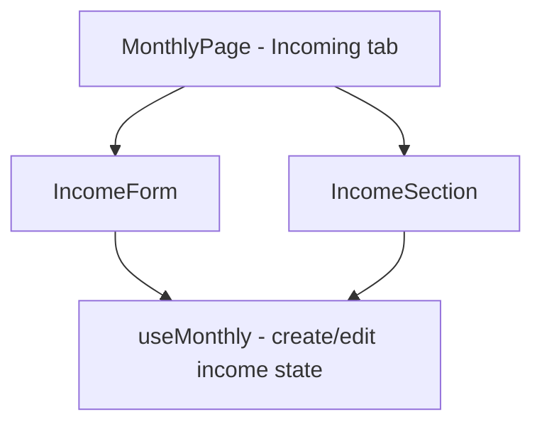

## 1. Technical Overview

**What:** Extract the `IncomeForm` local function (currently defined inline in `MonthlyPage.tsx`) into its own component under `src/components/`, with no change to its props, markup, or behavior. `MonthlyPage.tsx` continues composing `<IncomeForm>` + `<IncomeSection>` directly inside the Incoming tab guard.

**Why:** F01 already relocated the full income list and create/edit form into the Incoming tab guard and already implements every behavior this feature's PRD entry describes — tab-scoped form visibility, discarding an open form on tab switch (via `handleTabClick`'s `cancelEditIncome`/`cancelCreateIncomeForm` calls), and unchanged create/edit/delete/validation flows. This feature's only remaining work is code organization, mirroring F03's `ExpenseForm` extraction for the last piece of UI still inlined in `MonthlyPage.tsx`.

**Scope:**
- Included: extracting `IncomeForm` into its own file; re-verifying (not re-implementing) F04's acceptance criteria against the current codebase.
- Excluded: any change to `IncomeSection.tsx`, `useMonthly.ts`, validation rules, or the tab-switch-discards-form mechanism (all already correct, from F01). No `MonthlyIncomingTab.tsx` wrapper, matching F03's precedent — `MonthlyPage.tsx` keeps composing the two pieces directly.

## 2. Architecture Impact

**Affected components:**
- `Financial.Web/src/components/IncomeForm.tsx` (new) — the extracted form component
- `Financial.Web/src/pages/MonthlyPage.tsx` — removes the local `IncomeForm` function and its field-mapping constants (`CREATE_INCOME_FIELD_BY_FORM_FIELD`, `EDIT_INCOME_FIELD_BY_FORM_FIELD`, `INCOME_SOURCES`), importing the new component instead
- `Financial.Web/src/components/__tests__/IncomeForm.test.tsx` (new)

## 3. Technical Decisions

| Decision | Chosen Approach | Alternative Considered | Trade-off |
|----------|----------------|----------------------|-----------|
| Extraction boundary | Extract only `IncomeForm` into its own file; `MonthlyPage.tsx` keeps composing `<IncomeForm>` + `<IncomeSection>` directly | Also wrap both into a `MonthlyIncomingTab.tsx` coordinator component | Matches the precedent already established by F03's `ExpenseForm` extraction — same decision, applied symmetrically, no new pattern introduced |

## 4. Component Overview

**Frontend:**

| File Path | New/Modified | Purpose | Key Responsibilities |
|-----------|--------------|---------|---------------------|
| `Financial.Web/src/components/IncomeForm.tsx` | New | Renders the create/edit income form | Same props as the current local function (`isEditing`, `date`, `incomeSource`, `grossValue`, `netValue`, `bank`, `banks`, `isSaving`, `saveError`, `onFieldChange`, `onSave`, `onCancel`); owns the `INCOME_SOURCES` option list and the conditional gross-value field, moved verbatim |
| `Financial.Web/src/pages/MonthlyPage.tsx` | Modified | Incoming tab composition | Import `IncomeForm` from `components/`; remove the local function definition and its field-mapping constants |

## 5. API Contracts

Not applicable — this feature makes no backend or API changes.

## 6. Data Model

Not applicable — this feature makes no data model or persistence changes.

## 7. Testing Strategy

**Test File Structure:**

| Test File | Test Type | Target | Coverage Goal |
|-----------|-----------|--------|---------------|
| `Financial.Web/src/components/__tests__/IncomeForm.test.tsx` | Component | `IncomeForm` | Renders correctly in create/edit and gross-value-conditional states |
| `Financial.Web/src/pages/__tests__/MonthlyPage.test.tsx` | Component/Integration | `MonthlyPage` Incoming tab (existing suite) | F04 acceptance criteria re-verified unchanged after extraction |

**Test functions:**

| Test Function | Description | Assertions |
|---------------|-------------|------------|
| `it('renders the create form with empty fields by default')` (`IncomeForm`) | Basic render | Date/source/net-value fields present and empty |
| `it('shows the gross value field only for sources that require it')` (`IncomeForm`) | Conditional field | Gross value field present for Gleison/Ariana, absent for Lottery/DividendoJuros |
| `it('calls onSave and onCancel')` (`IncomeForm`) | Interaction | Save/Cancel buttons invoke their handlers |
| Existing `MonthlyPage.test.tsx` Incoming-tab tests (New/Edit/Delete, gross-value toggle, validation error, tab-switch-discards-form) | Re-run unchanged | All pass against the extracted component, confirming no behavior regressed |
