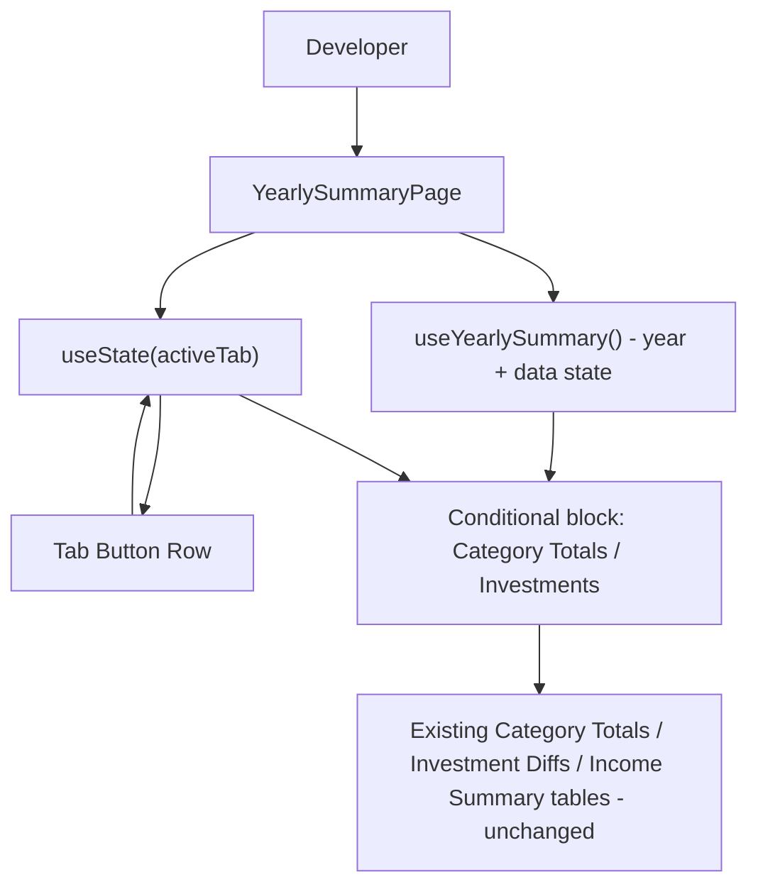

## 1. Technical Overview

**What:** Add a local two-tab shell (Category Totals, Investments) to `YearlySummaryPage.tsx`, with the existing year picker relocated above the tab row so it applies to both tabs. The existing content — the Category Totals table, the Investment Diffs table, and the Income Summary table — is relocated as-is into a matching tab's conditional block (Category Totals + Income Summary under the "Category Totals" tab, Investment Diffs under the "Investments" tab), with no visual regrouping, merging, or column changes yet (that work belongs to F02/F03).

**Why:** `MonthlyPage.tsx` already solved this exact shape of problem one PRD ago (P15-F01): a local `TabId` union, a `TABS` array, `useState` for the active tab, a button row, and conditional rendering, with matching CSS (`MonthlyPage.css:24-45`, classes `.monthly-page__tabs`/`__tab`/`__tab--active`). Reusing that now-twice-precedented pattern keeps tab-switching mechanics consistent across every page in the app instead of introducing a variant. Year state already lives entirely inside `useYearlySummary()` and is owned by `YearlySummaryPage.tsx` today, so no state needs to be lifted — it already sits at the right level to be shared across tabs once the tab row is added below it.

**Scope:**
- Included: `YearlySummaryTabId` type and `TABS` definition, `activeTab` state, tab button row, tab bar CSS, relocating the 3 existing content blocks (Category Totals section, Investment Diffs section, Income Summary section) behind tab guards, and updated/added tests for the tab mechanism itself.
- Excluded: merging Income Summary rows into the Category Totals table and adding Resultado (R-D-Inv)/Total despesas/Average columns (F02); reshaping the Investments table to show full 12-month balances per account plus a Total row, Month Result row, and the three summary figures (F03). These features build on top of the tab guards this feature introduces, without changing the tab mechanism itself.

## 2. Architecture Impact

**Affected components:**
- `Financial.Web/src/pages/YearlySummaryPage.tsx` — gains tab state/types, the tab button row, and conditional guards around its 3 existing content blocks
- `Financial.Web/src/pages/YearlySummaryPage.css` — gains the tab bar's visual styling
- `Financial.Web/src/pages/__tests__/YearlySummaryPage.test.tsx` — gains tab-mechanism tests; the existing Investment Diffs test gains a tab-click step (Category Totals and Income Summary stay visible under the default tab, so those two existing tests need no click step)

## 3. Technical Decisions

| Decision | Chosen Approach | Alternative Considered | Trade-off |
|----------|----------------|----------------------|-----------|
| Active-tab state ownership | Local `useState<YearlySummaryTabId>` inside `YearlySummaryPage.tsx`, mirroring `MonthlyPage.tsx`'s `activeTab` pattern | URL search param (`?tab=investments`) for deep-linking | PRD Section 7 explicitly excludes deep-linking/persistence of the active tab; local state is simpler and matches the established precedent in this codebase |
| F01 content scope | Relocate the 3 existing content blocks into their tab guard as-is (no merging/reshaping yet) | Ship F01 with empty/placeholder tab bodies and defer all content moves to F02/F03 | Keeps the app fully functional immediately after F01 merges, matching the approach already confirmed and used for P15-F01; F02/F03 diffs stay focused only on the specific transformation they own, with no rework of code F01 already moved |
| Category Totals tab's initial content | Both the existing "Category Totals" section and the existing "Income Summary" section render under the Category Totals tab, stacked in their current order, unmerged | Put Income Summary under its own third tab temporarily | The PRD's final shape has Income Summary's rows folded into the Category Totals table (F02); grouping them under the same tab now, even before the merge, avoids a spurious third tab that would disappear again next PR |

## 4. Component Overview

**Frontend:**

| File Path | New/Modified | Purpose | Key Responsibilities |
|-----------|--------------|---------|---------------------|
| `Financial.Web/src/pages/YearlySummaryPage.tsx` | Modified | Hosts the year picker, tab bar, and per-tab content guards | Define `YearlySummaryTabId`/`TABS`; own `activeTab` state defaulting to `'categoryTotals'`; render the tab button row below the year picker; wrap the Category Totals + Income Summary sections in an `activeTab === 'categoryTotals'` guard and the Investment Diffs section in an `activeTab === 'investments'` guard; no change to `useYearlySummary()` usage or to the wrapped JSX itself |
| `Financial.Web/src/pages/YearlySummaryPage.css` | Modified | Tab bar visual styling | Add `.yearly-summary-page__tabs`, `.yearly-summary-page__tab`, `.yearly-summary-page__tab--active`, matching the look already established by `.monthly-page__tabs`/`__tab`/`__tab--active` in `MonthlyPage.css:24-45` |
| `Financial.Web/src/pages/__tests__/YearlySummaryPage.test.tsx` | Modified | Cover the tab mechanism; keep existing coverage passing under the new structure | Add tests for default tab, tab switching, active-tab visual state, and year/tab-state independence; add a tab-click step before the existing Investment Diffs test |

## 5. API Contracts

Not applicable — this feature makes no backend or API changes. All three existing endpoints (`expense-categories`, `investment-diffs`, `income-summary`) are consumed exactly as today via `useYearlySummary()`.

## 6. Data Model

Not applicable — this feature makes no data model or persistence changes.

## 7. Testing Strategy

**Test File Structure:**

| Test File | Test Type | Target | Coverage Goal |
|-----------|-----------|--------|---------------|
| `Financial.Web/src/pages/__tests__/YearlySummaryPage.test.tsx` | Component | `YearlySummaryPage` tab shell | All 6 F01 acceptance criteria and the tab-related Cross-Feature Integration criteria covered |

**Test functions:**

| Test Function | Description | Assertions |
|---------------|-------------|------------|
| `it('defaults to the Category Totals tab on load')` | Verifies F01 AC1 | Category Totals table and Income Summary table are visible on initial render; Investment Diffs table is not rendered |
| `it('marks Category Totals as the active tab button by default')` | Verifies F01 AC1 | Category Totals tab button carries the active CSS class; Investments button does not |
| `it('shows only the Investments tab content after clicking Investments')` | Verifies F01 AC2 | After clicking "Investments", the Category Totals and Income Summary tables are gone, the Investment Diffs table is visible |
| `it('does not change the year picker value when switching tabs')` | Verifies F01 AC4 and the F01→F02/F03 Cross-Feature Integration criterion on shared year state | Year input value identical before and after a tab click |
| `it('does not refetch data when switching tabs')` | Verifies F01 AC4 and the F01→F02/F03 Cross-Feature Integration criterion on avoiding redundant refetch | Mocked API client call counts (`getCategoryTotalsForYear`, `getInvestmentDiffsForYear`, `getIncomeSummaryForYear`) are unchanged across a tab switch |
| `it('keeps the active tab unchanged when the year value changes')` | Verifies F01 AC5 | While Investments is active, changing the year input keeps Investments' content visible (does not revert to Category Totals) |
| `it('shows the error/retry state regardless of the active tab')` | Verifies F01 AC6 | With the mocked API client rejecting, the error message and retry button render whether Category Totals or Investments was last active |
| `it('renders the investment-diffs table with 11 monthly diff columns per account and the net position row')` (existing, modified) | Keeps existing F03-precursor coverage passing under the new structure | Add `fireEvent.click(screen.getByText('Investments'))` before the existing assertions; all prior assertions unchanged |
