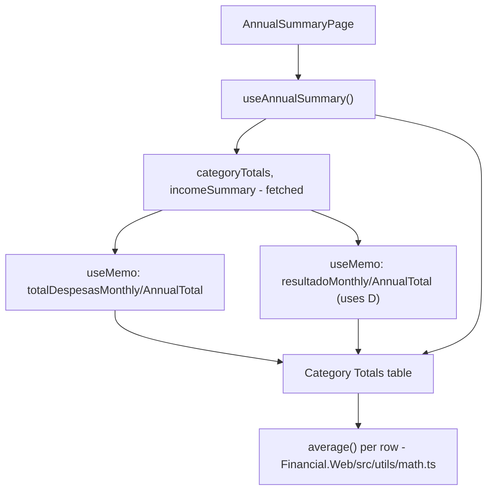

## 1. Technical Overview

**What:** Merge the Category Totals tab's two existing tables (Category Totals + Income Summary) into one combined table with a fixed row order — Salary, Salary After Taxes, Tax Difference, Dividendo/Juros, the 14 expense categories, Resultado (R-D-Inv), Total despesas — and add an Average column between the Dec column and the Annual Total column on every row. Two new derived rows (Total despesas, Resultado) are computed client-side from data the app already fetches; no API or backend change.

**Why:** The PRD's formulas are fully specified (Total despesas = sum of all 14 categories per month; Resultado = Salary After Taxes + Dividendo/Juros − Total despesas + Investimento per month), and this codebase already has a precedent for exactly this kind of client-side aggregation: `useMonthly.ts` computes `categoryTotalsSum`, `bankTotalsSum`, `roundUpTotalsSum`, and `totalIncoming` via `.reduce()` inside the hook rather than in a new backend service. Following that precedent keeps this a genuinely UI-only change (per PRD Section 7) and avoids introducing an Application-layer service for arithmetic that's already fully derivable from data the three existing endpoints return.

**Scope:**
- Included: `average()` utility, `totalDespesasMonthly`/`totalDespesasAnnualTotal`/`resultadoMonthly`/`resultadoAnnualTotal` derived values in `useAnnualSummary.ts`, the merged single-table UI under the Category Totals tab guard (introduced by F01), an Average column on every row, removal of the now-redundant standalone Income Summary section, and updated/added tests.
- Excluded: any change to the Investments tab (F03), any change to the three existing API endpoints or their DTOs, any change to the `Category`/`IncomeSource` enums.

## 2. Architecture Impact

**Affected components:**
- `Financial.Web/src/utils/math.ts` (new) — generic numeric helper, separate from `formatters.ts`'s string-formatting responsibility
- `Financial.Web/src/hooks/useAnnualSummary.ts` — gains memoized `totalDespesasMonthly`, `totalDespesasAnnualTotal`, `resultadoMonthly`, `resultadoAnnualTotal`, derived from the already-fetched `categoryTotals` and `incomeSummary`
- `Financial.Web/src/pages/AnnualSummaryPage.tsx` — Category Totals tab content restructured into one table; Income Summary's separate `<section>` is removed, its rows folded into the same table; every row gains an Average cell
- `Financial.Web/src/pages/AnnualSummaryPage.css` — generalizes the existing bordered-emphasis row style (currently named for "Net Position" only) so it also applies to the new Resultado and Total despesas rows
- `Financial.Web/src/hooks/useAnnualSummary.test.ts` — gains coverage for the two new derived value sets
- `Financial.Web/src/pages/__tests__/AnnualSummaryPage.test.tsx` — Category Totals tests updated for the merged table; new tests for Resultado, Total despesas, and the Average column

## 3. Technical Decisions

| Decision | Chosen Approach | Alternative Considered | Trade-off |
|----------|----------------|----------------------|-----------|
| Where Total despesas / Resultado are computed | Inside `useAnnualSummary.ts`, via `useMemo` over the already-fetched `categoryTotals`/`incomeSummary` | A new Application-layer `AnnualSummaryService` method returning the derived rows from the backend | PRD Section 7 explicitly scopes this as UI-only with no API changes; the codebase's own `useMonthly.ts` precedent already does equivalent client-side reduction for on-screen totals, so a new backend round-trip would be inconsistent with established practice here and unnecessary for a personal single-user tool |
| Average formula | `average(values) = sum(values) / values.length`, applied uniformly to every row's 12 monthly values | Reuse each row's existing `annualTotal / 12` | Using `values.length` instead of a hardcoded `12` avoids a magic number and keeps the helper correct if a row's monthly array shape ever changes; mathematically identical result for existing 12-month rows |
| New file for `average()` | `Financial.Web/src/utils/math.ts` (new file) | Add `average()` to the existing `formatters.ts` | `formatters.ts`'s current responsibility is string formatting (`Intl.NumberFormat`-based); `average()` is a numeric computation, not a formatter — keeping them apart follows the single-responsibility convention already visible in this file (each exported function has one narrow job) |
| Row-grouping visual separators | Reuse the existing empty spacer `<tr><td colSpan={...} /></tr>` row already used once (between Tax Difference and Dividendo/Juros) for the two additional separators (before the first category row, before Resultado) | Add a text label or heading between groups | PRD F02 Experience explicitly calls for "no text labels... visually distinguishable" via spacer rows, matching the one spacer already in the current markup |
| Emphasis styling for Resultado/Total despesas | Generalize the existing `.annual-summary-page__net-position-row` CSS class (top border + bold, currently used only by the Investment Diffs "Net Position" row) into a stack-agnostic `.annual-summary-page__emphasized-row` name, applied to 3 rows total (Net Position stays on the Investments tab, Resultado and Total despesas join on the Category Totals tab) | Add a second, separately-named class with identical rules | One shared class matches the "reuse existing patterns" principle and avoids duplicate CSS; renaming (not duplicating) keeps a single source of truth for this visual treatment |

## 4. Component Overview

**Frontend:**

| File Path | New/Modified | Purpose | Key Responsibilities |
|-----------|--------------|---------|---------------------|
| `Financial.Web/src/utils/math.ts` | New | Generic numeric helpers usable across pages | Export `average(values: number[]): number` |
| `Financial.Web/src/hooks/useAnnualSummary.ts` | Modified | Adds derived annual figures on top of the existing fetched data | `useMemo`-compute `totalDespesasMonthly: number[]` (sum of all `categoryTotals[i].monthlyTotals[m]` per month), `totalDespesasAnnualTotal: number` (sum of that array), `resultadoMonthly: number[]` (`incomeSummary.salaryAfterTaxesMonthly[m] + incomeSummary.dividendoJurosMonthly[m] - totalDespesasMonthly[m] + investimento.monthlyTotals[m]`, where `investimento` is the `categoryTotals` entry whose `category === 'Investimento'`), `resultadoAnnualTotal: number`; returns `[]`/`0` before `categoryTotals`/`incomeSummary` have loaded |
| `Financial.Web/src/pages/AnnualSummaryPage.tsx` | Modified | Renders the merged Category Totals table | Single `<table>` under the Category Totals tab guard with rows in order: Salary, Salary After Taxes, Tax Difference, spacer, Dividendo/Juros, spacer, 14 category rows, spacer, Resultado, Total despesas; every row renders an Average cell (`average(row's monthly array)`) between the Dec cell and the Annual Total cell; Resultado and Total despesas rows use the emphasized-row class |
| `Financial.Web/src/pages/AnnualSummaryPage.css` | Modified | Renames/generalizes the emphasis row class | `.annual-summary-page__net-position-row` → `.annual-summary-page__emphasized-row`, same declarations, referenced by both tabs' bold summary rows |
| `Financial.Web/src/hooks/useAnnualSummary.test.ts` | Modified | Covers the two new derived value sets | New test cases for `totalDespesasMonthly`/`totalDespesasAnnualTotal` and `resultadoMonthly`/`resultadoAnnualTotal` against a fixture with several categories including `Investimento` |
| `Financial.Web/src/pages/__tests__/AnnualSummaryPage.test.tsx` | Modified | Covers the merged table structure | Existing Category Totals / Income Summary tests updated to expect one combined table; new tests for row order, the Average column, Resultado, and Total despesas values |

## 5. API Contracts

Not applicable — no endpoint or DTO changes. `totalDespesasMonthly`, `resultadoMonthly`, and every row's Average are computed entirely client-side from the three existing endpoints' responses.

## 6. Data Model

Not applicable — no persistence or entity changes.

## 7. Testing Strategy

**Test File Structure:**

| Test File | Test Type | Target | Coverage Goal |
|-----------|-----------|--------|---------------|
| `Financial.Web/src/hooks/useAnnualSummary.test.ts` | Hook | Derived Total despesas / Resultado computation | Correct sums/formula across a multi-category fixture, including the Investimento add-back |
| `Financial.Web/src/pages/__tests__/AnnualSummaryPage.test.tsx` | Component | Merged Category Totals table | All 6 F02 acceptance criteria covered |

**Test functions:**

| Test Function | Description | Assertions |
|---------------|-------------|------------|
| `it('computes total despesas as the sum of all category monthly totals')` | Verifies F02 AC3 | `totalDespesasMonthly[m]` equals the sum of every fixture category's `monthlyTotals[m]`, for a fixture including `Investimento` and `Reserva` |
| `it('computes resultado as net income minus every category except Investimento')` | Verifies F02 AC4 | `resultadoMonthly[m]` equals `salaryAfterTaxesMonthly[m] + dividendoJurosMonthly[m] - totalDespesasMonthly[m] + investimento.monthlyTotals[m]` for the same fixture |
| `it('renders the combined table in the fixed row order')` | Verifies F02 AC1 | Row labels appear top-to-bottom in order: Salary, Salary after taxes, Tax difference, Dividendo/Juros, each fixture category, Resultado (R-D-Inv), Total despesas |
| `it('renders no standalone Income Summary section')` | Verifies F02 AC1/AC2 (merge) | `screen.queryByText('Income Summary')` is not present; Salary/Dividendo rows render inside the same `<table>` element as the category rows |
| `it('shows an Average column between the Dec and Annual Total columns for every row')` | Verifies F02 AC5 | Header row has `Average` immediately before `Annual Total`; a sampled row's Average cell equals the arithmetic mean of its 12 monthly cells |
| `it('renders Resultado and Total despesas with emphasized styling')` | Verifies F02 AC6 | Both rows carry the `annual-summary-page__emphasized-row` class |
| `it('does not affect the Investments tab content')` (Cross-Feature Integration, F01 → F02) | Verifies year/tab-sharing still holds after the table merge | Switching to Investments still shows the (unchanged) Investment Diffs table; switching back still shows Category Totals with no refetch |
