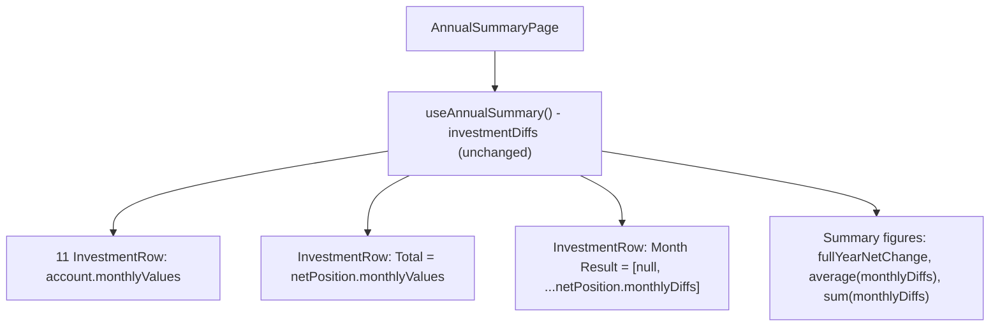

## 1. Technical Overview

**What:** Replace the Investments tab's diff-only account table with a table showing each account's full 12-month balance history, followed by a Total row (net position per month) and a Month Result row (month-over-month change of the Total row), plus three summary figures below the table: Year Progress, Average Month Result, and Sum of Month Results.

**Why:** Every number this feature needs already exists in `InvestmentDiffsAnnualDTO` — `InvestmentAccountAnnualDiffDTO.MonthlyValues` already carries all 12 months (today's UI only renders index 0), and `NetPositionAnnualDiffDTO` already has `MonthlyValues` (12), `MonthlyDiffs` (11), and `FullYearNetChange`. This is a pure UI reshape: no new API call, no new derived-value hook logic (unlike F02, this feature combines nothing across datasets — every figure is either already in `investmentDiffs` or a one-line reduction over its own `netPosition.monthlyDiffs`), consistent with PRD Section 7's "no API/DTO changes" scope.

**Scope:**
- Included: reshaped account rows (12 monthly balances instead of Jan + 11 diffs), the renamed Total row, the new Month Result row, the three summary figures, the `(-)` liability suffix (replacing the current `(liability)` text), and updated/added tests.
- Excluded: any change to the Category Totals tab (F02, already shipped), any change to the three existing API endpoints, DTOs, or the `InvestmentAccountClassification` liability rule.

## 2. Architecture Impact

**Affected components:**
- `Financial.Web/src/pages/AnnualSummaryPage.tsx` — Investments tab content replaced: new `InvestmentRow` component, reshaped table body, new summary-figures block
- `Financial.Web/src/pages/AnnualSummaryPage.css` — table header/columns adjust to 12 month columns (no Average/Annual Total columns on this tab); new styles for the summary-figures block
- `Financial.Web/src/pages/__tests__/AnnualSummaryPage.test.tsx` — all Investments-tab assertions updated for the new table shape; new tests for Month Result, Total, and the three summary figures

## 3. Technical Decisions

| Decision | Chosen Approach | Alternative Considered | Trade-off |
|----------|----------------|----------------------|-----------|
| Row rendering | A small local `InvestmentRow({ label, monthlyValues: (number \| null)[], emphasized })` component, reused for all 13 rows (11 accounts + Total + Month Result); `null` renders a blank cell (used for Month Result's January column) | Three separate hand-written `<tr>` blocks | Same row shape (label + 12 numeric cells) repeats 13 times; a single component avoids the duplication and keeps the "blank January cell" rule in one place, mirroring the F02 `AnnualSummaryRow` precedent |
| Average Month Result / Sum of Month Results computation | Computed inline in the page from `investmentDiffs.netPosition.monthlyDiffs` (`average()` from `Financial.Web/src/utils/math.ts`, plus a one-line `.reduce()` for the sum) | Add new fields to `useAnnualSummary.ts` (as F02 did for Resultado/Total despesas) | Unlike F02's Resultado/Total despesas, these two figures reduce over a single already-fetched array with no cross-dataset combination — a hook round-trip would add indirection for a one-line computation used in exactly one place |
| Liability marker | Change the existing `(liability)` suffix to `(-)`, matching the source spreadsheet's own notation for negative/liability accounts | Keep `(liability)` | PRD F03 Capabilities explicitly specifies the `(-)` suffix "matching the source spreadsheet's own notation" |
| Sanity-check figure | Render "Sum of Month Results" even though it is always mathematically equal to "Year Progress" (telescoping sum) | Compute only one and label it twice | PRD F03 Capabilities explicitly calls for both to be shown together as a built-in cross-check, not deduplicated |

## 4. Component Overview

**Frontend:**

| File Path | New/Modified | Purpose | Key Responsibilities |
|-----------|--------------|---------|---------------------|
| `Financial.Web/src/pages/AnnualSummaryPage.tsx` | Modified | Renders the reshaped Investments table and summary figures | New `InvestmentRow` component; table header shows `Account` + 12 month labels (no Average/Annual Total columns); body renders 11 account rows (`monthlyValues` = full array, `(-)` suffix when `isLiability`), then the Total row (`emphasized`, `monthlyValues = netPosition.monthlyValues`), then the Month Result row (`emphasized`, `monthlyValues = [null, ...netPosition.monthlyDiffs]`); a summary block below the table renders Year Progress (`netPosition.fullYearNetChange`), Average Month Result (`average(netPosition.monthlyDiffs)`), and Sum of Month Results (`netPosition.monthlyDiffs.reduce(...)`) |
| `Financial.Web/src/pages/AnnualSummaryPage.css` | Modified | Styles the summary-figures block | Add `.annual-summary-page__investment-totals` (flex row/wrap of labeled figures), reusing existing typography/spacing conventions from the page |
| `Financial.Web/src/pages/__tests__/AnnualSummaryPage.test.tsx` | Modified | Covers the reshaped Investments tab | Existing Investments-tab test rewritten for 12-month account rows, `(-)` suffix, Total row, Month Result row; new tests for the three summary figures and the Sum-of-Month-Results/Year-Progress equality |

## 5. API Contracts

Not applicable — no endpoint or DTO changes. Every rendered figure comes from the existing `investment-diffs` endpoint response, already fetched by `useAnnualSummary`.

## 6. Data Model

Not applicable — no persistence or entity changes.

## 7. Testing Strategy

**Test File Structure:**

| Test File | Test Type | Target | Coverage Goal |
|-----------|-----------|--------|---------------|
| `Financial.Web/src/pages/__tests__/AnnualSummaryPage.test.tsx` | Component | Reshaped Investments table | All 7 F03 acceptance criteria covered |

**Test functions:**

| Test Function | Description | Assertions |
|---------------|-------------|------------|
| `it('shows all 12 monthly balance values for each account')` | Verifies F03 AC1 | An account's row renders all 12 fixture values, not just January |
| `it('marks liability accounts with a (-) suffix and asset accounts without one')` | Verifies F03 AC2 | Liability account cell text ends with `(-)`; asset account cell text does not |
| `it('renders a Total row matching the net position monthly values')` | Verifies F03 AC3 | Total row's 12 cells equal `netPosition.monthlyValues` |
| `it('renders a Month Result row with a blank January cell and the net position diffs for Feb-Dec')` | Verifies F03 AC4 | Month Result row's January cell is empty; Feb-Dec cells equal `netPosition.monthlyDiffs` |
| `it('shows Year Progress equal to December minus January of the Total row')` | Verifies F03 AC5 | Year Progress figure equals `netPosition.fullYearNetChange` |
| `it('shows Average Month Result as the mean of the 11 Month Result values')` | Verifies F03 AC6 | Average Month Result figure equals the arithmetic mean of `netPosition.monthlyDiffs` |
| `it('shows Sum of Month Results equal to Year Progress')` | Verifies F03 AC7 | Sum of Month Results figure equals the sum of `netPosition.monthlyDiffs`, and that sum equals `fullYearNetChange` |
| `it('does not affect the Category Totals tab content')` (Cross-Feature Integration, F01 → F03) | Confirms the reshape doesn't regress F01/F02 | Switching to Category Totals still shows the merged table unaffected; switching back to Investments re-shows the reshaped table with no refetch |
