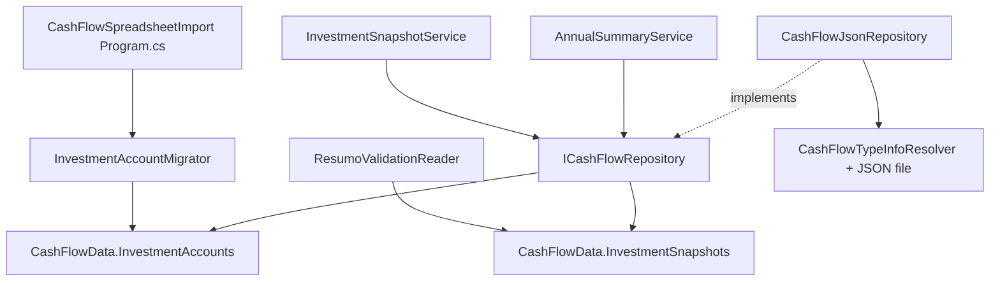

## 1. Technical Overview

**What:** Replace `Financial.CashFlow.Domain.Enums.InvestmentAccount` (a fixed 11-value enum) with a persisted `InvestmentAccount` entity, add an `InvestmentAccounts` collection to `CashFlowData`, and change `InvestmentSnapshot.Account` from an enum value to a string reference matching the new entity's `Name`. A new idempotent migrator seeds the registry with the 11 currently-active accounts, running automatically alongside the existing `BankMigrator`/`IncomeMigrator`/etc. in `CashFlowSpreadsheetImport`'s "always run" pipeline.

**Why:** The enum hardcodes "which investment accounts exist" as a single, unchanging, compile-time list, so every year in the app shows the same 11 accounts regardless of what actually existed that year, and `IsLiability` classification lives in a separate static rule keyed by the same enum. F02-F05 (later features in PRD P18) need a persisted, per-account active/disabled flag and a place to attach import-label aliases, which an enum cannot hold. This feature only introduces the data model and migration; it deliberately preserves today's observable behavior (all 11 accounts, every year) so it can ship and be verified independently before F02-F05 change what's displayed.

**Scope:**
- Included: new `InvestmentAccount` Domain entity; `CashFlowData.InvestmentAccounts` collection; `InvestmentSnapshot.Account` type change (enum → string); repository methods to read/add accounts; idempotent seeding migrator wired into the existing `CashFlowSpreadsheetImport` pipeline; every call site that referenced the enum updated to compile against the new entity, with identical runtime behavior; deletion of the now-redundant `InvestmentAccountClassification` static rule and the unused `InvestmentAccountParser`.
- Excluded (explicitly deferred to later PRD P18 features, per the PRD's dependency chain): dynamic alias resolution and the 8 historical accounts (F02); the full spreadsheet re-import (F03); year-scoped display filtering (F04); the January prior-year carryover (F05). No frontend changes — the API's `InvestmentSnapshotDTO.Account` and `InvestmentAccountAnnualDiffDTO.Account` were already typed as `string`, so the React app is unaffected.

## 2. Architecture Impact

**Affected components:**
- `Financial.CashFlow.Domain/Entities/InvestmentAccount.cs` (new)
- `Financial.CashFlow.Domain/Enums/InvestmentAccount.cs` (deleted)
- `Financial.CashFlow.Domain/Rules/InvestmentAccountClassification.cs` (deleted)
- `Financial.CashFlow.Domain/Entities/InvestmentSnapshot.cs` (modified: `Account` type)
- `Financial.CashFlow.Domain/Entities/CashFlowData.cs` (modified: new collection)
- `Financial.CashFlow.Application/Interfaces/ICashFlowRepository.cs` (modified: new methods)
- `Financial.CashFlow.Infrastructure/Repositories/CashFlowJsonRepository.cs` (modified)
- `Financial.CashFlow.Infrastructure/Persistence/CashFlowTypeInfoResolver.cs` (modified: register new type)
- `Financial.CashFlow.Application/Services/InvestmentSnapshotService.cs` (modified)
- `Financial.CashFlow.Application/Services/AnnualSummaryService.cs` (modified)
- `Financial.CashFlow.Application/Validation/InvestmentAccountParser.cs` (deleted — unused, referenced the removed enum)
- `Integrations/CashFlowSpreadsheetImport/Migrations/InvestmentAccounts/InvestmentAccountMigrator.cs` (new)
- `Integrations/CashFlowSpreadsheetImport/Migrations/InvestmentAccounts/InvestmentAccountMigrationSummary.cs` (new)
- `Integrations/CashFlowSpreadsheetImport/Program.cs` (modified: register the new migrator in the always-run block)
- `Integrations/CashFlowSpreadsheetImport/SheetImporters/ResumoValidationReader.cs` (modified: re-key alias dictionary from enum to string — compile fix only, no behavior change)

## 3. Technical Decisions

| Decision | Chosen Approach | Alternative Considered | Trade-off |
|----------|------------------|-------------------------|-----------|
| How `InvestmentSnapshot` references its account | `Account` becomes a plain `string` matching the registry entry's `Name` by value (no FK object, no Guid reference) | `InvestmentSnapshot.Account` holds a `Guid` foreign key to `InvestmentAccount.Id` | This codebase already has the identical shape of problem solved this way: `Bank` (master list, no `Id` at all) is referenced from `Expense.PaymentSource` (a plain `string` matched by name), audited by `BankMigrator`. A string match keeps `InvestmentSnapshot` unchanged in every field except type, needs no join logic in `InvestmentSnapshotService`/`AnnualSummaryService`, and — critically — needs **zero data migration**, because `JsonStringEnumConverter` already serializes every existing snapshot's `Account` as its exact enum member name (e.g. `"BlueRewardsSaver"`), which deserializes unchanged into a `string` property. A Guid FK would require rewriting every persisted snapshot and add a join the read paths don't otherwise need. |
| `InvestmentAccount.Name` value for the 11 seeded accounts | Exactly the existing enum member name (e.g. `"BlueRewardsSaver"`, `"PlatinumVisa8003"`) | A spaced, human-readable label (e.g. `"Blue Rewards Saver"`) | The frontend (`InvestmentSnapshotsPage.tsx`) already renders `snapshot.account` verbatim with no formatting step, so it already shows the PascalCase form today. Reusing the exact same string as `Name` means the migration touches zero existing `InvestmentSnapshot.Account` values and the UI is visually unchanged. Introducing a friendlier label is out of scope for this PRD and not requested by any objective; a display-label field can be added later without another data migration if ever needed. |
| Where `IsLiability` is amended for the 11 accounts | The exact current values from the deleted `InvestmentAccountClassification.LiabilityAccounts` set are used to seed each account's `IsLiability` flag, unmodified | Auditing/correcting the classification while migrating it | PRD P18 explicitly scopes correcting any pre-existing liability misclassification (e.g. `BA Amex`) as out of scope; this migration is a mechanical carry-over, not a data review. |
| Migration audit behavior when a persisted snapshot's `Account` string matches no seeded registry entry | Log and flag the snapshot for manual review (add an `UnresolvedSnapshots` list to the migration summary), continue running the rest of the pipeline, do not abort | Abort the whole `CashFlowSpreadsheetImport` run, per the PRD's F01 Error Handling wording ("aborts without partially migrating") | Because this design does zero rewriting of `InvestmentSnapshot.Account` values (see first decision), there is nothing to "partially migrate" — the migrator only ever adds new `InvestmentAccount` rows, it never touches existing snapshots. The closest real risk is a snapshot referencing a name the seed list doesn't know about; `BankMigrator.AuditExpenses` already established the pattern for exactly this shape of problem (flag-and-continue, not abort), and aborting the shared always-run pipeline over one unresolved historical row would also block the unrelated Bank/Income/PaymentState migrations that run in the same command. This is a refinement of the PRD's Error Handling section to match how the feature is actually implemented; it does not weaken the "no data silently dropped" intent — the flag is visible in the migration summary output every run until resolved. |
| Migrator location and invocation | New `Migrations/InvestmentAccounts/` folder under `Integrations/CashFlowSpreadsheetImport`, registered in `Program.cs`'s existing "always run, both modes" block (alongside `BankMigrator`, `BankOpeningBalanceMigrator`, `IncomeMigrator`, `ExpensePaymentStateMigrator`) | A new standalone migration console app (the pre-2026-07-25 pattern) | The project's own memory of this exact area records that the 4 previous standalone one-off migration tools were deliberately consolidated into this single pipeline on 2026-07-25 specifically because standalone tools silently wiped data the spreadsheet import doesn't own. Following the current, already-established pattern is strictly required here, not just preferred. |

## 4. Component Overview

**Backend — Domain (`Financial.CashFlow.Domain`):**

| File Path | New/Modified | Purpose | Key Responsibilities |
|-----------|--------------|---------|----------------------|
| `Entities/InvestmentAccount.cs` | New | Registry entry for one investment account | Holds `Id`, `Name`, `IsActive`, `IsLiability`; `Create` factory validates `Name` is non-empty, mirroring `Bank.Create`'s validation style |
| `Enums/InvestmentAccount.cs` | Deleted | — | Superseded by the entity above |
| `Rules/InvestmentAccountClassification.cs` | Deleted | — | `IsLiability` now lives on the entity itself |
| `Entities/InvestmentSnapshot.cs` | Modified | Monthly balance record for one account | `Account` property changes from `InvestmentAccount` (enum) to `string`; `Create`/`Update` signatures updated accordingly, no other field changes |
| `Entities/CashFlowData.cs` | Modified | Aggregate root for all CashFlow data | Adds a private `List<InvestmentAccount>` + public `InvestmentAccounts` read-only collection + `AddInvestmentAccount`, mirroring the existing `Banks`/`AddBank` pair exactly (no `Remove`, matching `Banks`) |

**Backend — Application (`Financial.CashFlow.Application`):**

| File Path | New/Modified | Purpose | Key Responsibilities |
|-----------|--------------|---------|----------------------|
| `Interfaces/ICashFlowRepository.cs` | Modified | Repository contract | Adds `GetInvestmentAccounts()` and `AddInvestmentAccount(InvestmentAccount account)`, mirroring the existing `GetBanks()`/no-add-for-banks... actually mirrors `GetIncomes()`/`AddIncome()` shape (read + add, no update/delete needed) |
| `Services/InvestmentSnapshotService.cs` | Modified | Snapshot read/update use case | `AllAccounts` static field (`Enum.GetValues<InvestmentAccount>()`) replaced by querying `_repository.GetInvestmentAccounts()` at call time; `ToDto` reads `IsLiability` from the matching `InvestmentAccount` entity (by `Name`) instead of `InvestmentAccountClassification.IsLiability(...)` |
| `Services/AnnualSummaryService.cs` | Modified | Annual investment diff computation | `Enum.GetValues<InvestmentAccount>()` replaced by `_repository.GetInvestmentAccounts()`; `Account = account.ToString()` becomes `Account = account.Name`; `IsLiability` read from the entity instead of the deleted static rule |
| `Validation/InvestmentAccountParser.cs` | Deleted | — | Dead code (no production call sites), referenced the removed enum |

**Backend — Infrastructure (`Financial.CashFlow.Infrastructure`):**

| File Path | New/Modified | Purpose | Key Responsibilities |
|-----------|--------------|---------|----------------------|
| `Repositories/CashFlowJsonRepository.cs` | Modified | `ICashFlowRepository` implementation | Adds `GetInvestmentAccounts()`/`AddInvestmentAccount()` delegating to `CashFlowData`, mirroring the existing `GetIncomes()`/`AddIncome()` pair |
| `Persistence/CashFlowTypeInfoResolver.cs` | Modified | JSON serialization metadata | Adds `typeof(InvestmentAccount)` to `ManagedTypes` so its private constructor and property setters are wired the same way every other entity already is — no other change needed since `JsonStringEnumConverter` no longer applies to this type (it's a plain class now) |

**Backend — Import pipeline (`Integrations/CashFlowSpreadsheetImport`):**

| File Path | New/Modified | Purpose | Key Responsibilities |
|-----------|--------------|---------|----------------------|
| `Migrations/InvestmentAccounts/InvestmentAccountMigrator.cs` | New | Idempotent registry seeding | Seeds the 11 known accounts (skipping any whose `Name` already exists in `data.InvestmentAccounts`); audits every `InvestmentSnapshot.Account` string against the seeded names, flagging unresolved ones — same two-phase shape as `BankMigrator.Migrate` (`SeedAccounts` + `AuditSnapshots`) |
| `Migrations/InvestmentAccounts/InvestmentAccountMigrationSummary.cs` | New | Migration run outcome | Counts seeded/already-present accounts, resolved/unresolved snapshot audits; `Render()` produces console output in the same style as `BankMigrationSummary.Render()` |
| `Program.cs` | Modified | Pipeline entry point | Adds `var investmentAccountSummary = InvestmentAccountMigrator.Migrate(data);` to the "always run, both modes" block and prints `investmentAccountSummary.Render()` alongside the other summaries |
| `SheetImporters/ResumoValidationReader.cs` | Modified | Resumo sheet row → snapshot resolution | `AccountLabelAliases` re-typed from `Dictionary<InvestmentAccount, string[]>` to `Dictionary<string, string[]>`, keyed by the same 11 name strings with identical alias arrays; `TryResolveAccount`'s `out` parameter becomes `string`; `InvestmentSnapshot.Create` call site updated for the new `Account` type. `InvestmentAccountClassification.IsLiability(account)` call replaced by a lookup against the same hardcoded 11-name liability set inlined here as a local constant, since the classification rule was deleted and dynamic registry-driven liability lookup is F02's scope, not F01's |

No frontend files are touched; `Financial.Web` already types `account` as `string` in `InvestmentSnapshotDto`/`InvestmentAccountAnnualDiffDto`.

## 5. API Contracts

No new or changed HTTP endpoints. `InvestmentSnapshotsController` and `AnnualSummaryController` are unmodified — both already exposed `Account` as `string` in their DTOs before this feature, so their JSON response shape is identical before and after.

## 6. Data Model

This is a JSON-file-backed domain (no relational database — `Financial.CashFlow.Infrastructure` persists one `CashFlowData` aggregate as a single JSON document via `IJsonStorage`), so this section documents the entity/JSON shape rather than SQL tables.

**Entity: `InvestmentAccount`** (`Financial.CashFlow.Domain.Entities`)

| Property | Type | Nullable | Default | Description |
|----------|------|----------|---------|-------------|
| `Id` | `Guid` | No | new GUID on `Create` | Stable internal identifier (present for consistency with other entities; not used as the reference key — see Technical Decisions) |
| `Name` | `string` | No | — | Canonical identifier, matches the account's existing enum-derived string exactly for the 11 seeded accounts (e.g. `"BlueRewardsSaver"`); required, validated non-empty in `Create` |
| `IsActive` | `bool` | No | — | `true` for all 11 accounts seeded by this feature |
| `IsLiability` | `bool` | No | — | Carried over unmodified from the deleted `InvestmentAccountClassification.LiabilityAccounts` set |

**Modified entity: `InvestmentSnapshot`**

| Property | Before | After |
|----------|--------|-------|
| `Account` | `InvestmentAccount` (enum) | `string` — matches an `InvestmentAccount.Name` by value |

All other `InvestmentSnapshot` properties (`Id`, `Year`, `Month`, `Value`) are unchanged.

**JSON shape change:** None observable. Before this feature, `System.Text.Json`'s `JsonStringEnumConverter` already serialized `InvestmentSnapshot.Account` as a bare string (e.g. `"Account": "BlueRewardsSaver"` — confirmed in the live `data/data-cashflow.json`). After the type change to `string`, the exact same JSON round-trips through the exact same shape with the default (no-converter) string handling. The only new JSON is a `investmentAccounts` array (empty until the migrator runs, matching how `banks` started empty before `BankMigrator` first ran), each entry shaped `{ "id", "name", "isActive", "isLiability" }`.

**Cross-Database Notes:** Not applicable — no relational database is used anywhere in this solution.

## 7. Testing Strategy

**Test File Structure:**

| Test File | Test Type | Target | Coverage Goal |
|-----------|-----------|--------|----------------|
| `Tests/Financial.CashFlow.Domain.Tests/Entities/InvestmentAccountTests.cs` | Unit | `InvestmentAccount` entity | Create validation, factory behavior |
| `Tests/Financial.CashFlow.Domain.Tests/Entities/InvestmentSnapshotTests.cs` | Unit | `InvestmentSnapshot` entity | Updated: `Create`/`Update` exercised with a `string` account |
| `Tests/Financial.CashFlow.Domain.Tests/Entities/CashFlowDataTests.cs` | Unit | `CashFlowData` aggregate | Updated: add coverage for `AddInvestmentAccount`/`InvestmentAccounts`, mirroring existing `Banks` coverage |
| `Tests/Financial.CashFlow.Domain.Tests/Rules/InvestmentAccountClassificationTests.cs` | Unit | — | Deleted (class removed) |
| `Tests/Financial.CashFlow.Infrastructure.Tests/Repositories/CashFlowJsonRepositoryTests.cs` | Unit | `CashFlowJsonRepository` | Updated: add `GetInvestmentAccounts`/`AddInvestmentAccount` coverage, mirroring existing `Get/AddIncome` tests |
| `Tests/Financial.CashFlow.Infrastructure.Tests/Persistence/CashFlowSerializerAdapterTests.cs` | Unit | JSON round-trip | Updated: assert an `InvestmentAccount` round-trips through serialize/deserialize; assert an `InvestmentSnapshot` with a `string` `Account` round-trips unchanged |
| `Tests/Financial.CashFlow.Application.Tests/Services/InvestmentSnapshotServiceTests.cs` | Unit | `InvestmentSnapshotService` | Updated: seed `InvestmentAccount` entities via a repository test double instead of relying on the enum; assert `GetSnapshotsForMonthAsync` still returns exactly 11 rows and `IsLiability` still reflects the seeded entity's flag |
| `Tests/Financial.CashFlow.Application.Tests/Services/AnnualSummaryServiceTests.cs` | Unit | `AnnualSummaryService` | Updated: same account-seeding change; assert `GetInvestmentDiffsForYear` output is unchanged in shape and values for a year with the 11 known accounts |
| `Tests/Financial.CashFlow.Application.Tests/Validation/InvestmentAccountParserTests.cs` | Unit | — | Deleted (class removed) |
| `Tests/Financial.CashFlowSpreadsheetImport.Tests/Migrations/InvestmentAccounts/InvestmentAccountMigratorTests.cs` | Unit | `InvestmentAccountMigrator` | New, mirroring `BankMigratorTests.cs` structure exactly |
| `Tests/Financial.CashFlowSpreadsheetImport.Tests/SheetImporters/ResumoValidationReaderTests.cs` | Unit | `ResumoValidationReader` | Updated: assertions against `string` accounts instead of enum values; behavior otherwise unchanged |

**Key test functions:**

| Test Function | Description | Assertions |
|----------------|-------------|------------|
| `Create_WithValidName_AssignsAllFieldsAndANewId` (`InvestmentAccountTests`) | Valid creation | `Id` not empty, `Name`/`IsActive`/`IsLiability` set as passed |
| `Create_WithEmptyName_ThrowsArgumentException` (`InvestmentAccountTests`) | Validation failure | Throws, mirroring `Bank.Create`'s empty-name guard |
| `Migrate_OnEmptyData_SeedsAllElevenAccountsWithCorrectLiabilityFlags` (`InvestmentAccountMigratorTests`) | First run | `AccountsSeededCount == 11`; each of the 11 known names present with the exact `IsLiability` values carried from the old classification |
| `Migrate_CalledTwice_SeedsNothingNewOnSecondRun` (`InvestmentAccountMigratorTests`) | Idempotency | Second run's `AccountsSeededCount == 0`, `AccountsAlreadyPresentCount == 11`, `data.InvestmentAccounts` still has exactly 11 entries |
| `Migrate_WithSomeAccountsAlreadySeeded_OnlySeedsTheMissingOnes` (`InvestmentAccountMigratorTests`) | Partial seed | Mirrors `BankMigratorTests`' equivalent case |
| `Migrate_SnapshotWithUnresolvableAccountName_IsFlaggedForManualReviewAndLeftUntouched` (`InvestmentAccountMigratorTests`) | Audit | An `InvestmentSnapshot` whose `Account` matches no seeded name appears in `UnresolvedSnapshots`, and its `Account` value is unchanged |
| `GetSnapshotsForMonthAsync_WithElevenSeededAccounts_CreatesAllMissingZeroValueSnapshots` (`InvestmentSnapshotServiceTests`) | Regression | Same 11-row-per-month behavior as before the entity swap |
| `GetInvestmentDiffsForYear_WithElevenSeededAccounts_ReturnsSameShapeAndValuesAsBeforeMigration` (`AnnualSummaryServiceTests`) | Regression | `Account` strings, `IsLiability` flags, and diff math identical to pre-F01 behavior |

**Integration-level check:** After implementation, run the actual `dotnet run --project Integrations/CashFlowSpreadsheetImport` command against a copy of the existing `data-cashflow.json` (not the live file) and confirm the tool exits 0, the migration summary reports `AccountsSeededCount == 11`, `AccountsAlreadyPresentCount == 0` on the first run and the reverse on a second run, and every pre-existing `InvestmentSnapshot` entry in the output JSON has an unchanged `Account`/`Year`/`Month`/`Value`.
