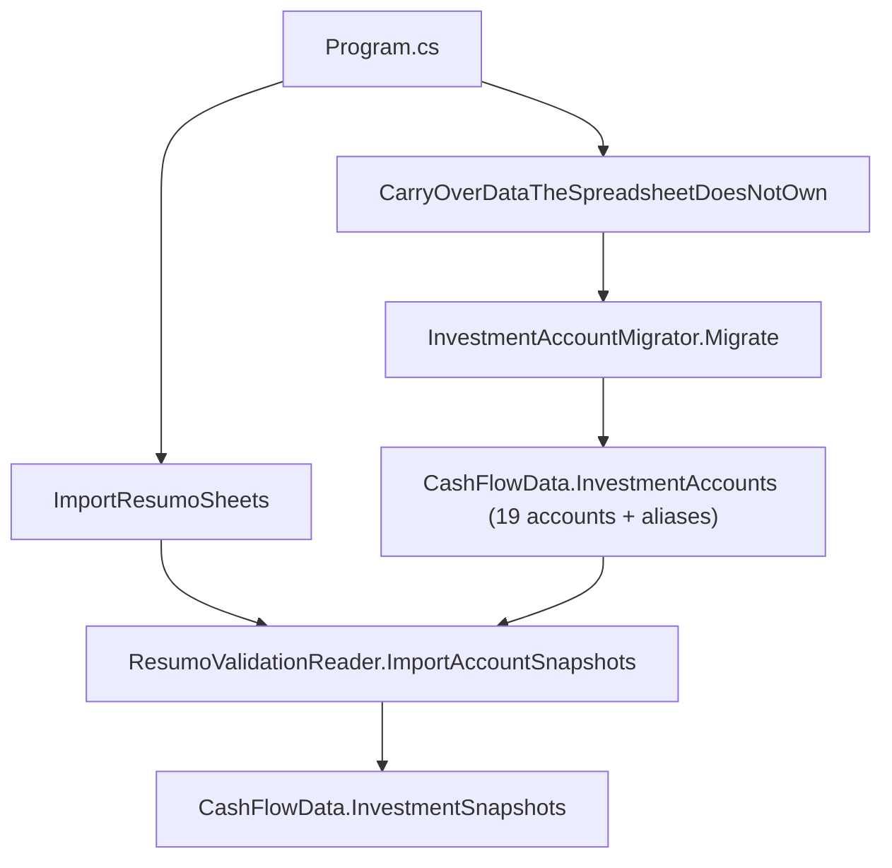

## 1. Technical Overview

**What:** Extend the `InvestmentAccount` entity (introduced in F01) with a persisted `Aliases` collection, seed the registry with the 8 confirmed historical/disabled accounts alongside the 11 active ones (each with their known spreadsheet label aliases), and rework `ResumoValidationReader` to resolve Resumo sheet rows dynamically against the registry's aliases instead of the static `AccountLabelAliases` dictionary left in place by F01.

**Why:** F01 deliberately kept `ResumoValidationReader`'s alias dictionary and liability set as static, hardcoded, enum-shaped structures — a like-for-like compile fix, not a behavior change — so F01 could ship and be verified independently. F02 is the feature that actually makes the registry the source of truth for import resolution, which is the prerequisite for F03 (full historical re-import) ever being able to recognize the 8 historical accounts at all.

**Scope:**
- Included: `InvestmentAccount.Aliases` (persisted, idempotently backfillable); seeding the 8 historical accounts (all `IsActive = false`, `IsLiability = false`) with their aliases; correcting the existing `BlueRewardsSaver` alias list (removing the incorrectly-merged `"Barclays Blue Rewards"`, which becomes its own historical account); adding `"Chip Cash ISA"` as a second alias on the already-active `ChipCashIsaGleison`; reworking `ResumoValidationReader.TryResolveAccount`/`ImportAccountSnapshots` to resolve against `CashFlowData.InvestmentAccounts` instead of the static dictionary; reordering `Program.cs` so the registry is fully seeded before `ImportResumoSheets` runs (see Technical Decisions — this is a genuine sequencing requirement the dynamic-resolution rework surfaces, not optional polish).
- Excluded (deferred to F03 per the PRD's dependency chain): actually re-importing 2017-2026 spreadsheet data for the newly-recognized historical accounts — F02 only makes them resolvable, F03 runs the import that populates their real values. Year-scoped display filtering (F04) and the January carryover (F05) are untouched.

## 2. Architecture Impact

**Affected components:**
- `Financial.CashFlow.Domain/Entities/InvestmentAccount.cs` (modified: adds `Aliases`, `AddAlias`)
- `Integrations/CashFlowSpreadsheetImport/Migrations/InvestmentAccounts/InvestmentAccountMigrator.cs` (modified: 19-account seed table with aliases, backfills aliases on already-present accounts)
- `Integrations/CashFlowSpreadsheetImport/SheetImporters/ResumoValidationReader.cs` (modified: resolves against the registry, not the static dictionary)
- `Integrations/CashFlowSpreadsheetImport/Program.cs` (modified: reorders carry-over + investment-account migration to run before `ImportResumoSheets`)

## 3. Technical Decisions

| Decision | Chosen Approach | Alternative Considered | Trade-off |
|----------|------------------|-------------------------|-----------|
| Where aliases live | Persisted `Aliases` collection directly on `InvestmentAccount` (mirrors `CashFlowData`'s own collection-property pattern: private `List<string>` + `IReadOnlyCollection<string>` property with private setter, reflection-wired by the existing `CashFlowTypeInfoResolver` with no changes needed there) | Keep aliases as a separate static dictionary in the importer, now keyed by `Name` instead of the old enum | The PRD's F02 Capabilities explicitly says "each registry entry carries one or more import label aliases" — aliases are account data, not importer configuration. Persisting them also means a future account (opened without a code change, if ever) could carry aliases without touching `ResumoValidationReader` at all. |
| Alias backfill for accounts seeded before F02 | `InvestmentAccountMigrator`'s seed loop calls `account.AddAlias(alias)` (idempotent, case-insensitive dedup) for every known alias on **every** run, whether the account was just created or already existed | Only add aliases at creation time, matching `BankMigrator`'s "skip if already present" shape exactly | The 11 accounts already exist in any environment that ran F01's migration before F02 ships (their JSON has no `Aliases` field, which deserializes to an empty collection). If aliases were only set at creation, those 11 accounts would silently keep 0 aliases forever and become unimportable. Backfilling on every run, regardless of creation state, is what actually satisfies "migration is safe to re-run anytime" for a field added after the entity already existed in production data. |
| Removing `"Barclays Blue Rewards"` from `BlueRewardsSaver`'s aliases | Done as part of this feature's seed-table rewrite; the string moves to the new `BarclaysBlueRewards` account's alias list | Leave it as a second alias on both accounts | The PRD confirms these are two distinct accounts that coexisted as separate spreadsheet rows 2019-2022; leaving the alias on both would make `TryResolveAccount` ambiguous (or silently always resolve to whichever account is enumerated first) for any Resumo row labeled "Barclays Blue Rewards". |
| Sequencing `ImportResumoSheets` after registry seeding | `Program.cs` is reordered so `CarryOverDataTheSpreadsheetDoesNotOwn` and `InvestmentAccountMigrator.Migrate` both run immediately after `data` is established (before the sheet-import branch), instead of the "always run at the bottom" placement F01 used | Keep the migrator at the bottom (F01's placement) and have `ResumoValidationReader` fall back to a smaller hardcoded set for the first run | Once resolution is dynamic, `ImportResumoSheets` needs `data.InvestmentAccounts` populated with all 19 names and aliases *before* it runs, or the very first import after F02 ships would resolve 0 accounts. F01's placement (migrations run last, after imports) was correct for F01 because the importer didn't consume the registry yet. A fallback hardcoded set would reintroduce exactly the duplication-of-truth problem this whole PRD is fixing. Moving `CarryOverDataTheSpreadsheetDoesNotOwn` earlier alongside it is safe: it doesn't depend on anything the sheet imports compute, it only copies data the spreadsheet doesn't own from the previous run's file into the new one. |
| Historical accounts' `IsLiability` | All 8 seeded as `false` | Infer from spreadsheet `(-)` markers | None of the 8 confirmed historical account labels (`Everyday Saver`, `Instant ISA Issue 1`, `Ariana ISA`, `Barclays Blue Rewards`, `Help to Buy ISA GGS`, `Help to Buy ISA AACS`, `Chip Easy access`, `Chip Easy access Ariana`) ever appeared with a `(-)` suffix in any inspected Resumo sheet (2017-2024), confirmed during the PRD's spreadsheet inspection — this is a direct fact, not an inference. |
| `InvestmentAccountMigrator.Migrate` called twice per full run | `Program.cs` calls it once early (seed/backfill only, before `ImportResumoSheets`; that call's snapshot-audit portion is discarded since no snapshots exist in `data` yet) and once again in the "always run" block after `ImportResumoSheets` (this second call's summary is the one printed/reported) | Split `Migrate` into separate `SeedAccounts`/`AuditSnapshots` public methods, called once each at the right point | Discovered mid-implementation: `Migrate` bundles seeding (needed before import) and snapshot auditing (only meaningful after import) in one call, and moving the single call earlier silently zeroed out the audit (verified: a first attempt at this reported "0 resolved" against the real 560+ snapshots). Calling the same idempotent method twice is simpler than splitting its public API, costs one harmless no-op reseed pass, and was verified end-to-end (two full runs against a copy of the live data file converge to identical account and snapshot data). |

## 4. Component Overview

**Backend — Domain (`Financial.CashFlow.Domain`):**

| File Path | New/Modified | Purpose | Key Responsibilities |
|-----------|--------------|---------|----------------------|
| `Entities/InvestmentAccount.cs` | Modified | Registry entry | Adds `Aliases` (`IReadOnlyCollection<string>`, private-list-backed like `CashFlowData`'s collections) and `AddAlias(string alias)` (validates non-empty, case-insensitive dedup, no-op if already present) |

**Backend — Import pipeline (`Integrations/CashFlowSpreadsheetImport`):**

| File Path | New/Modified | Purpose | Key Responsibilities |
|-----------|--------------|---------|----------------------|
| `Migrations/InvestmentAccounts/InvestmentAccountMigrator.cs` | Modified | Registry seeding | `SeededAccounts` grows from 11 to 19 tuples, each now carrying its alias list; `SeedAccounts` creates missing accounts (unchanged logic) and additionally calls `AddAlias` for every known alias on every seeded-or-existing account, every run |
| `SheetImporters/ResumoValidationReader.cs` | Modified | Resumo row resolution | `AccountLabelAliases` dictionary and `LiabilityAccountNames` set are deleted; `TryResolveAccount` takes `IReadOnlyCollection<InvestmentAccount>` and matches normalized labels against each account's `Aliases`; `ImportAccountSnapshots` gains an `accounts` parameter and reads `IsLiability` from the matched entity instead of a static set |
| `Program.cs` | Modified | Pipeline entry point | `CarryOverDataTheSpreadsheetDoesNotOwn` and `InvestmentAccountMigrator.Migrate` move from their F01 positions to run immediately after `data` is established, before any sheet import; the bottom "always run" block no longer computes `investmentAccountSummary` (computed earlier) but still prints it |

No frontend files are touched — this feature has no API or UI surface.

## 5. API Contracts

None. No HTTP endpoint changes.

## 6. Data Model

**Modified entity: `InvestmentAccount`**

| Property | Before (F01) | After (F02) |
|----------|--------------|-------------|
| `Aliases` | *(did not exist)* | `IReadOnlyCollection<string>` — one or more spreadsheet label variants that resolve to this account |

`Id`, `Name`, `IsActive`, `IsLiability` are unchanged.

**JSON shape change:** Existing `InvestmentAccount` JSON objects (written by F01, before this field existed) gain an `"aliases": []` array on first deserialize-then-reserialize (missing JSON property deserializes to the entity's empty-list default). `InvestmentAccountMigrator`'s backfill (see Technical Decisions) then populates it on the very next migration run — this is expected and intentional, not a data-loss risk, since aliases are derived/re-derivable data, not user-entered.

**Seed table (`InvestmentAccountMigrator.SeededAccounts`), 19 entries:**

| Name | IsActive | IsLiability | Aliases |
|------|----------|-------------|---------|
| BlueRewardsSaver | true | false | Blue Rewards Saver |
| PlatinumVisa8003 | true | true | Platinum Visa 8003 |
| PlatinumVisa6007 | true | true | Platinum Visa 6007 |
| ChaseMaster4023 | true | true | Chase Master 4023 |
| BaAmex | true | true | BA Amex |
| PaypalCredit | true | true | Paypal credit |
| ChipCashIsaGleison | true | false | Chip Cash ISA Gleison, Chip Cash ISA |
| ChaseSave | true | false | Chase save |
| ChipCashIsaAriana | true | false | Chip Cash ISA Ariana |
| Trading212Invested | true | false | Trading 212 Invested |
| ReservasPessoais | true | true | Reservas pessoais |
| EverydaySaver | false | false | Everyday Saver |
| InstantIsaIssue1 | false | false | Instant ISA Issue 1, Instant ISE Issue 1 |
| ArianaIsa | false | false | Ariana ISA |
| BarclaysBlueRewards | false | false | Barclays Blue Rewards |
| HelpToBuyIsaGgs | false | false | Help to Buy ISA GGS |
| HelpToBuyIsaAacs | false | false | Help to Buy ISA AACS |
| ChipEasyAccess | false | false | Chip Easy access |
| ChipEasyAccessAriana | false | false | Chip Easy access Ariana |

**Cross-Database Notes:** Not applicable — no relational database is used anywhere in this solution.

## 7. Testing Strategy

**Test File Structure:**

| Test File | Test Type | Target | Coverage Goal |
|-----------|-----------|--------|----------------|
| `Tests/Financial.CashFlow.Domain.Tests/Entities/InvestmentAccountTests.cs` | Unit | `InvestmentAccount` entity | Updated: `AddAlias` behavior (adds, dedups case-insensitively, rejects empty) |
| `Tests/Financial.CashFlowSpreadsheetImport.Tests/Migrations/InvestmentAccounts/InvestmentAccountMigratorTests.cs` | Unit | `InvestmentAccountMigrator` | Updated: seeds 19 accounts (11 active + 8 disabled); asserts each seeded account's aliases; asserts an account seeded by a prior (aliasless) run gets its aliases backfilled without duplication on re-run |
| `Tests/Financial.CashFlowSpreadsheetImport.Tests/SheetImporters/ResumoValidationReaderTests.cs` | Unit | `ResumoValidationReader` | Updated: builds an `IReadOnlyCollection<InvestmentAccount>` fixture (via `InvestmentAccountMigrator.Migrate` on a fresh `CashFlowData`, exercising the real seed table) instead of relying on a static dictionary; existing sign-inversion/label-matching assertions preserved; new cases for a historical-account label (e.g. "Help to Buy ISA GGS" now resolves instead of being skipped) and for "Barclays Blue Rewards" resolving to its own account, not `BlueRewardsSaver` |

**Key test functions:**

| Test Function | Description | Assertions |
|----------------|-------------|------------|
| `AddAlias_NewAlias_AddsIt` (`InvestmentAccountTests`) | Adds a new alias | `Aliases` contains it |
| `AddAlias_DuplicateCaseInsensitive_DoesNotAddTwice` (`InvestmentAccountTests`) | Re-adding same alias, different casing | `Aliases` still has exactly one entry |
| `AddAlias_WithEmptyAlias_ThrowsArgumentException` (`InvestmentAccountTests`) | Validation | Throws |
| `Migrate_OnEmptyData_SeedsElevenActiveAndEightDisabledAccountsWithAliases` (`InvestmentAccountMigratorTests`) | First run, full seed table | 19 accounts total, 11 `IsActive`, each account's `Aliases` matches the seed table exactly |
| `Migrate_AccountSeededByPriorRunWithNoAliases_BackfillsAliasesWithoutDuplicating` (`InvestmentAccountMigratorTests`) | Simulates an F01-era account (no aliases) already present | After migrate, that account's `Aliases` matches the seed table; running migrate again doesn't duplicate them |
| `Migrate_BlueRewardsSaverAndBarclaysBlueRewards_HaveDistinctNonOverlappingAliases` (`InvestmentAccountMigratorTests`) | Regression for the alias-correction decision | Neither account's `Aliases` contains the other's label |
| `ImportAccountSnapshots_HistoricalAccountLabel_NowResolves` (`ResumoValidationReaderTests`) | "Help to Buy ISA GGS" row against the real seeded registry | Produces a snapshot with `Account == "HelpToBuyIsaGgs"`, where the pre-F02 test (`ImportAccountSnapshots_UnrecognizedHistoricalAccountLabel_IsNotWritten`) asserted it was skipped |
| `ImportAccountSnapshots_BarclaysBlueRewardsLabel_ResolvesToItsOwnAccountNotBlueRewardsSaver` (`ResumoValidationReaderTests`) | Regression for the alias correction | `Account == "BarclaysBlueRewards"`, not `"BlueRewardsSaver"` |
| `ImportAccountSnapshots_ChipCashIsaLabel_ResolvesToChipCashIsaGleison` (`ResumoValidationReaderTests`) | 2024-label alias | `Account == "ChipCashIsaGleison"` |
| `ImportAccountSnapshots_InstantIseIssue1Typo_ResolvesToInstantIsaIssue1` (`ResumoValidationReaderTests`) | 2017-typo alias | `Account == "InstantIsaIssue1"` |

**Integration-level check:** Re-run the same manual verification F01 used (import against a copy of the live data file, twice) and additionally confirm: (a) the migration summary reports 19 seeded on a truly fresh file, or 8 seeded / 11 already-present when run against a copy of the current production file (which already has the 11 F01 accounts); (b) a second run reports 0 seeded / 19 already present; (c) the import's overall unmatched-row count for at least one older year (e.g. Resumo2023) drops relative to before this feature, since previously-unmatched historical labels now resolve — full population of their values is still F03's job, but the row must now be recognized as matched rather than skipped.
