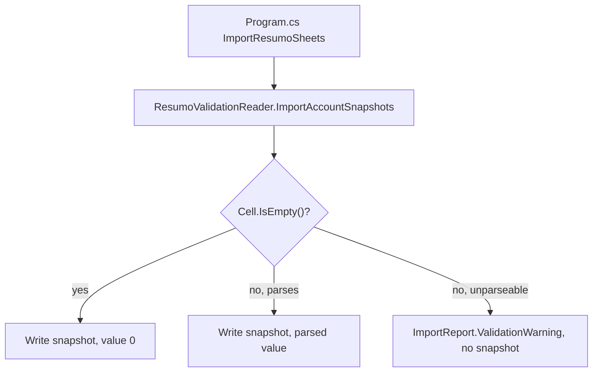

## 1. Technical Overview

**What:** Change `ResumoValidationReader.ImportAccountSnapshots` so a matched account-row writes an explicit `InvestmentSnapshot` for all 12 months of the year — value `0` for a genuinely blank cell — instead of silently skipping months with no value, and add a validation warning (no snapshot written) for the distinct case of a non-blank cell that fails to parse as a number.

**Why:** F02 made every historical account resolvable, so every full run of the existing `CashFlowSpreadsheetImport` command already re-processes all of Resumo2017-Resumo2026 and writes real values for the 8 newly-recognized accounts (confirmed: F02's manual verification saw snapshot count rise from 560 to 1003 on the very next run). What F02 did **not** change is that a blank month cell produces no snapshot at all — which means "this account had no snapshot for month M" is ambiguous between "the row wasn't matched this year" (account didn't exist) and "the row matched but this one cell was blank" (account existed, value just wasn't entered). F04 needs to tell these apart reliably by presence alone, per the PRD's Technical Decision that year-existence is derived purely from snapshot presence. Writing an explicit `0` for blank cells removes the ambiguity.

**Scope:**
- Included: the explicit-zero-write behavior change; distinguishing a genuinely blank cell from a non-blank cell that fails to parse (malformed), logging the latter as a validation warning without fabricating a value for it; verifying the effect end-to-end by running the import against a **copy** of the live data file (never the live file itself — matches how F01 and F02 were verified, and leaves the decision to run it against production to the user).
- Excluded: no new migration tool or command — the "one-time migration" the PRD describes is the existing `dotnet run --project Integrations/CashFlowSpreadsheetImport` command, which already covers the full 2017-2026 range on every full run (confirmed via `SheetNameParser.FirstInScopeYear`/`LastInScopeYear` = 2017/2026, already exercised by F01 and F02's verification). Year-scoped display filtering (F04) and the January carryover (F05) are untouched.

## 2. Architecture Impact

**Affected components:**
- `Integrations/CashFlowSpreadsheetImport/SheetImporters/ResumoValidationReader.cs` (modified: explicit-zero writing, malformed-cell warning, `ImportReport` parameter)
- `Integrations/CashFlowSpreadsheetImport/Program.cs` (modified: threads `report` into the `ImportAccountSnapshots` call)

## 3. Technical Decisions

| Decision | Chosen Approach | Alternative Considered | Trade-off |
|----------|------------------|-------------------------|-----------|
| Distinguishing "blank" from "malformed" | Check `IXLCell.IsEmpty()` directly at the call site before calling `NumericCellReader.TryRead`; empty → write 0, non-empty-but-unparseable → warn and skip | Treat every `TryRead() is null` result as blank (write 0 for both cases) | `NumericCellReader.TryRead` already collapses both "empty" and "unparseable text" into a `null` return (by design, for its original blank-tolerant use elsewhere in the importer). The PRD's F03 Error Handling explicitly wants malformed cells logged and skipped, not silently zeroed — silently writing 0 for a cell that actually contains garbled data would hide a real data-quality problem instead of surfacing it. |
| No new migration tool | Reuses the existing `CashFlowSpreadsheetImport` command; F03 is a behavior change to `ResumoValidationReader`, invoked exactly the same way it already is today | Add a dedicated one-off "backfill" console app, matching the pre-2026-07-25 pattern | Per the project's own memory of that consolidation, standalone one-off migration tools were deliberately retired in favor of one command that runs every migration step automatically and idempotently. `ImportResumoSheets` already iterates every in-scope year on every full run — there is nothing left to build a separate tool around. |
| Verification target | Run the import against a **copy** of the live `data-cashflow.json`, never the live file itself | Run it against the live file, since that's the actual deliverable a "full re-import" implies | Matches how F01 and F02 were verified in this same feature loop. Overwriting the user's real financial data file is a meaningful, hard-to-fully-undo action (even with the tool's automatic pre-write backup) that should be a decision the user makes deliberately when they're ready, not a side effect of an automated feature-implementation loop. The PR calls this out explicitly so the user can run it themselves. |
| Blank-vs-malformed classification order | Try `NumericCellReader.TryRead` first; only when it returns `null` re-check `cell.IsEmpty()` / `cell.GetString().Trim().Length == 0` to decide blank (write 0) vs genuinely malformed (warn, no snapshot) | Check `cell.IsEmpty()` first, before attempting to parse | Discovered against the real spreadsheet: `Resumo2017` row 19 ("Everyday Saver"), February column is a cell that `IXLCell.IsEmpty()` reports as non-empty (confirmed via manual verification) but whose string content is blank — almost certainly a formula that evaluated to `""`. Checking `IsEmpty()` first misclassified it as malformed and withheld a snapshot for that month; checking it only as a fallback after a failed parse correctly treats it as blank. Verified against a copy of the live file: 94 matched account-years, all now with exactly 12 snapshots, 0 incomplete. |

## 4. Component Overview

**Backend — Import pipeline (`Integrations/CashFlowSpreadsheetImport`):**

| File Path | New/Modified | Purpose | Key Responsibilities |
|-----------|--------------|---------|----------------------|
| `SheetImporters/ResumoValidationReader.cs` | Modified | Resumo row → snapshot resolution | `ImportAccountSnapshots` gains an `ImportReport report` parameter; for each of the 12 month columns of a matched row, an empty cell now produces an explicit `InvestmentSnapshot` with `Value = 0` (sign-inversion still applied, though `0 * ±1 = 0`), a non-empty cell that fails to parse produces a `report.ValidationWarning(...)` citing the sheet name, row, month, and account, and writes no snapshot for that month; a successfully parsed cell is unchanged |
| `Program.cs` | Modified | Pipeline entry point | The `ImportResumoSheets` → `ResumoValidationReader.ImportAccountSnapshots` call site passes the existing `report` object through (it already exists in scope for `ReadYearlyExpenseTotals`'s validation warnings, just wasn't threaded into this call before) |

No other files change — no new entities, no new migrator, no frontend/API surface.

## 5. API Contracts

None. No HTTP endpoint changes.

## 6. Data Model

No entity shape changes. The effect is purely on which `InvestmentSnapshot` rows get created during import: every matched account-year now has exactly 12 `InvestmentSnapshot` records (one per month) instead of only the months with a non-blank source cell — except for any month whose cell is malformed (non-blank, unparseable), which still produces no record, now accompanied by a logged warning.

**Cross-Database Notes:** Not applicable — no relational database is used anywhere in this solution.

## 7. Testing Strategy

**Test File Structure:**

| Test File | Test Type | Target | Coverage Goal |
|-----------|-----------|--------|----------------|
| `Tests/Financial.CashFlowSpreadsheetImport.Tests/SheetImporters/ResumoValidationReaderTests.cs` | Unit | `ResumoValidationReader` | Updated: blank-cell behavior changes from "skipped" to "explicit zero"; new case for a malformed (non-blank, unparseable) cell producing a warning and no snapshot for that month while other months on the same row still resolve |

**Key test functions:**

| Test Function | Description | Assertions |
|----------------|-------------|------------|
| `ImportAccountSnapshots_EmptyMonthCell_WritesExplicitZero` (replaces `ImportAccountSnapshots_EmptyMonthCell_IsSkippedForThatMonthOnly`) | A matched row with one filled month and 11 blank months | 12 snapshots total (not 1); the 11 blank months have `Value == 0`; the filled month has its real value |
| `ImportAccountSnapshots_MalformedMonthCell_LogsWarningAndWritesNoSnapshotForThatMonth` | A matched row with one cell containing unparseable text (e.g. `"n/a"`) and another month with a real value | The malformed month produces no snapshot (11 snapshots, not 12, for that row — 10 explicit zeros + 1 real value); `report` receives a validation warning naming the sheet, row/month, and account |
| `ImportAccountSnapshots_CanonicalLayout_CreatesOneSnapshotPerMonthPerAccount` (existing) | Regression: two filled months, rest blank | Still passes with updated snapshot count expectations (12 total, not 2) |

**Integration-level check:** Run the import against a copy of the live data file (as F01/F02 did) and confirm: (a) every matched account-year in the output has exactly 12 `InvestmentSnapshot` entries; (b) the total snapshot count increases relative to F02's post-merge state (more explicit zeros written for previously-blank months across all 19 accounts × up to 10 in-scope years); (c) running the command twice produces byte-identical snapshot data (idempotency, matching F01/F02's precedent); (d) spot-check that a known historical account/year combination with some genuinely blank months (from the spreadsheet inspection during PRD authoring) now has 12 records with zeros in the right places.
