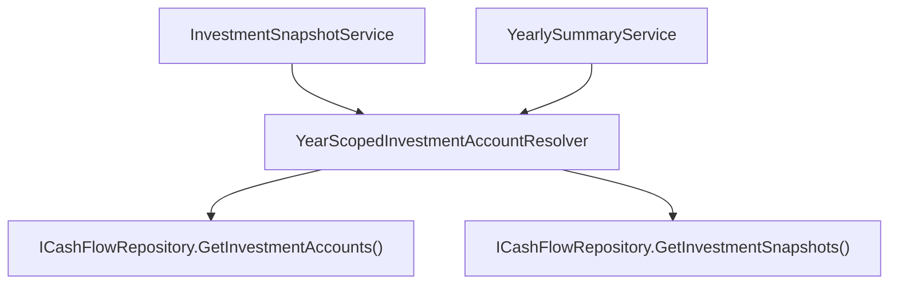

## 1. Technical Overview

**What:** Introduce a shared, pure business rule that resolves which `InvestmentAccount`s apply to a given year — for a past year, only accounts with at least one persisted `InvestmentSnapshot` that year; for the current, in-progress year, every `IsActive` account regardless of snapshot presence — and apply it in both `InvestmentSnapshotService.GetSnapshotsForMonthAsync` and `YearlySummaryService.GetInvestmentDiffsForYear`, which today unconditionally return all 19 registry accounts for every year.

**Why:** F01-F03 built the data (a persisted, disabled-capable registry; historical accounts recognized and populated with explicit per-month values for every year they existed). Nothing yet uses that data to change what's *displayed*. Today, both read paths call `_repository.GetInvestmentAccounts()` unfiltered, so every year — 2017 or 2026 — shows the same 19 accounts, which is the exact problem this whole PRD exists to fix. F04 is the feature that closes that gap.

**Scope:**
- Included: the year-scoping rule itself (as a pure, unit-testable Domain rule, not embedded logic in either service); applying it to both `InvestmentSnapshotService.GetSnapshotsForMonthAsync` (stops auto-creating zero-value rows for accounts that don't belong to the requested year) and `YearlySummaryService.GetInvestmentDiffsForYear` (stops returning a `InvestmentAccountYearlyDiffDTO` row, and stops including in `NetPosition`, for accounts that don't belong to the requested year).
- Excluded: no API contract changes (`InvestmentSnapshotDTO`/`InvestmentAccountYearlyDiffDTO` shapes are unchanged — fewer/different *rows*, not new *fields*); no frontend changes (`InvestmentSnapshotsPage.tsx`/`YearlySummaryPage.tsx` already render whatever the API returns, with no hardcoded account count anywhere in the codebase or its tests — confirmed by search); F05's January prior-year-December carryover is untouched.

## 2. Architecture Impact

**Affected components:**
- `Financial.CashFlow.Domain/Rules/YearScopedInvestmentAccountResolver.cs` (new)
- `Financial.CashFlow.Application/Services/InvestmentSnapshotService.cs` (modified)
- `Financial.CashFlow.Application/Services/YearlySummaryService.cs` (modified)

## 3. Technical Decisions

| Decision | Chosen Approach | Alternative Considered | Trade-off |
|----------|------------------|-------------------------|-----------|
| Where the year-scoping rule lives | A new static Domain rule, `Financial.CashFlow.Domain.Rules.YearScopedInvestmentAccountResolver`, taking accounts + snapshots + target year + current year as plain arguments and returning the applicable accounts | Duplicate the filtering inline in each of the two services | Both services need the identical rule; duplicating it risks the two call sites drifting apart (e.g., one gets a year-boundary fix, the other doesn't). A Domain rule mirrors this codebase's existing pattern for shared, snapshot-independent business logic (`InvestmentAccountClassification` occupied this same location before F01 folded its concern into the entity) and is trivially unit-testable without a repository double. |
| How "current year" reaches the rule | The rule is a pure function that takes `currentYear` as an explicit parameter; each service computes it via `DateTime.Now.Year` at the call site and passes it in | Have the rule call `DateTime.Now` itself | Keeps the rule deterministic and unit-testable for year-boundary cases (e.g., "is 2026 the current year or a past one") without needing to fake the system clock. `ControleMaeService` elsewhere in this codebase calls `DateTime.Now` directly inline for a simple future-date validation — that's fine for a one-line guard, but this rule's whole job is year-boundary logic, so it deserves to be exercised directly in tests rather than only indirectly through whichever year happens to be "today" when the test suite runs. |
| Existence source for a past year | An account belongs to year Y (Y < current year) if and only if `GetInvestmentSnapshots()` contains at least one snapshot with `Account == account.Name && Year == Y` (any month) | Track an explicit `FirstActiveYear`/`LastActiveYear` range on the account | This is exactly what the PRD's F04 Capabilities specify and what F03 was built to guarantee (every matched account-year gets all 12 months, including explicit zeros) — presence-based existence needs no additional stored state and can't drift out of sync with the actual imported data. |
| Filtering already-persisted snapshots that don't belong to the resolved year-scope | `InvestmentSnapshotService.GetSnapshotsForMonthAsync` filters its returned DTO list to only the resolved accounts, even though in practice `existingSnapshots` for a past year should already only contain scoped accounts (by construction, since scoping *is* presence) | Trust `existingSnapshots` as-is with no extra filter | Belt-and-suspenders for the one automated-loop-relevant edge case: a *disabled* account could theoretically still hold a snapshot for the *current* year if one was created before this feature shipped (e.g., during F01-F03 development/verification). The PRD's F04 AC is explicit that a disabled account must not appear in the current year's display "even though the same underlying store still holds their historical data" — filtering the return value, not just the auto-create loop, is what actually guarantees that for every code path, not just the happy path. |

## 4. Component Overview

**Backend — Domain (`Financial.CashFlow.Domain`):**

| File Path | New/Modified | Purpose | Key Responsibilities |
|-----------|--------------|---------|----------------------|
| `Rules/YearScopedInvestmentAccountResolver.cs` | New | Year-existence business rule | `ResolveForYear(accounts, snapshots, year, currentYear)`: for `year >= currentYear`, returns accounts where `IsActive`; for `year < currentYear`, returns accounts with at least one snapshot in that year |

**Backend — Application (`Financial.CashFlow.Application`):**

| File Path | New/Modified | Purpose | Key Responsibilities |
|-----------|--------------|---------|----------------------|
| `Services/InvestmentSnapshotService.cs` | Modified | Snapshot read/update use case | `GetSnapshotsForMonthAsync` resolves the year-scoped account list via the new rule before auto-creating missing zero-value snapshots, and filters its returned DTOs to that same scoped list |
| `Services/YearlySummaryService.cs` | Modified | Yearly investment diff computation | `GetInvestmentDiffsForYear` resolves the year-scoped account list via the new rule and builds `InvestmentAccountYearlyDiffDTO` rows (and the `NetPosition` sum) only over those accounts |

No Infrastructure, Presentation, or frontend files change.

## 5. API Contracts

No request/response shape changes to either existing endpoint (`GET /api/v1/financial/investment-snapshots/{year}/{month}`, `GET` yearly-summary investments). Both return the same DTO shapes as before — just a year-dependent subset of rows instead of always all 19.

## 6. Data Model

No entity or JSON shape changes. This feature is purely a read-path filtering change.

**Cross-Database Notes:** Not applicable — no relational database is used anywhere in this solution.

## 7. Testing Strategy

**Test File Structure:**

| Test File | Test Type | Target | Coverage Goal |
|-----------|-----------|--------|----------------|
| `Tests/Financial.CashFlow.Domain.Tests/Rules/YearScopedInvestmentAccountResolverTests.cs` | Unit | `YearScopedInvestmentAccountResolver` | New: current-year (active-only), past-year (presence-only), and boundary cases |
| `Tests/Financial.CashFlow.Application.Tests/Services/InvestmentSnapshotServiceTests.cs` | Unit | `InvestmentSnapshotService` | Updated: current-year requests still auto-create zero rows for active accounts only (not disabled ones); past-year requests only return/auto-create for accounts with existing snapshot presence that year |
| `Tests/Financial.CashFlow.Application.Tests/Services/YearlySummaryServiceTests.cs` | Unit | `YearlySummaryService` | Updated: `GetInvestmentDiffsForYear` for a past year returns only accounts present that year; for the current year returns only active accounts; `NetPosition` reflects only the scoped accounts |

**Key test functions:**

| Test Function | Description | Assertions |
|----------------|-------------|------------|
| `ResolveForYear_CurrentYear_ReturnsOnlyActiveAccounts` (`YearScopedInvestmentAccountResolverTests`) | `year == currentYear`, mix of active/disabled accounts, no snapshots needed | Result contains only `IsActive` accounts |
| `ResolveForYear_PastYear_ReturnsOnlyAccountsWithASnapshotThatYear` (`YearScopedInvestmentAccountResolverTests`) | `year < currentYear`, one account has a snapshot that year, another (even if active) does not | Result contains only the account with a snapshot that year |
| `ResolveForYear_PastYear_DisabledAccountWithSnapshotThatYear_StillIncluded` (`YearScopedInvestmentAccountResolverTests`) | Disabled account, but has a snapshot for the requested past year | Included — past-year existence is presence-based, independent of `IsActive` |
| `ResolveForYear_FutureYear_TreatedLikeCurrentYear` (`YearScopedInvestmentAccountResolverTests`) | `year > currentYear` | Same result as `year == currentYear` (active-only) |
| `GetSnapshotsForMonthAsync_CurrentYear_OnlyCreatesZeroRowsForActiveAccounts` (`InvestmentSnapshotServiceTests`) | Repository seeded with a mix of active/disabled accounts | Returned DTOs and newly-created snapshots cover only active accounts |
| `GetSnapshotsForMonthAsync_PastYearWithNoExistingData_ReturnsEmptyNotAllAccounts` (`InvestmentSnapshotServiceTests`) | Past year, no snapshots exist for it at all | Returns an empty list; no snapshots are fabricated for any account |
| `GetSnapshotsForMonthAsync_PastYearWithSomeAccountsPresent_ReturnsOnlyThose` (`InvestmentSnapshotServiceTests`) | Past year, snapshots exist for 2 of several seeded accounts | Returns exactly those 2 accounts' rows |
| `GetInvestmentDiffsForYear_PastYear_ReturnsOnlyAccountsPresentThatYear` (`YearlySummaryServiceTests`) | Past year, snapshots for a subset of accounts | `Accounts` contains only that subset |
| `GetInvestmentDiffsForYear_CurrentYear_ExcludesDisabledAccounts` (`YearlySummaryServiceTests`) | Current year, mix of active/disabled accounts, some with stray snapshots | `Accounts` contains only active ones |
| `GetInvestmentDiffsForYear_NetPositionSumsOnlyScopedAccounts` (`YearlySummaryServiceTests`) | Past year, one in-scope and one out-of-scope account with values | `NetPosition.MonthlyValues` reflects only the in-scope account |

**Integration-level check:** Since the live data file hasn't been migrated by F01-F03 yet (verification throughout this feature loop has deliberately only run against copies — see F01-F03 PR notes), there's no production data yet to exercise this against end-to-end. Verification here is unit-test-only; the PR notes should reiterate that the user needs to run the import once (per F03's notes) before any of F01-F04's behavior is observable in the running app.
