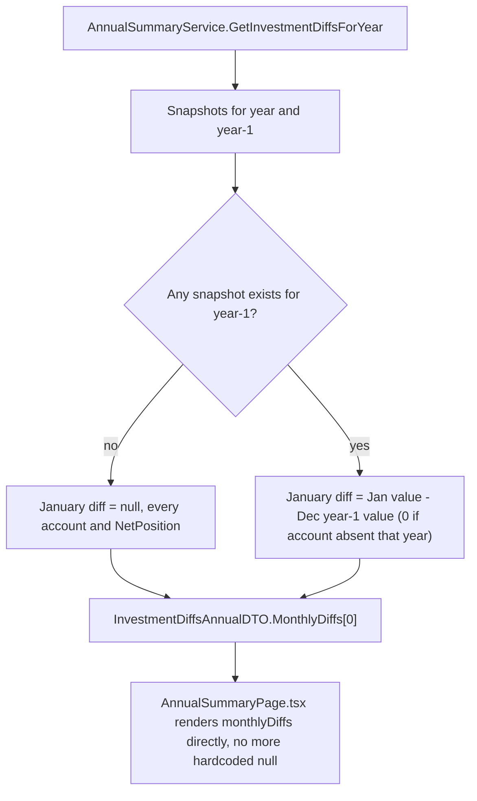

## 1. Technical Overview

**What:** Change `AnnualSummaryService.GetInvestmentDiffsForYear` so `MonthlyDiffs` becomes a full 12-entry array (index 0 = January) instead of the current 11-entry Feb-Dec-only array, with January computed as that month's value minus the prior year's December value (0 fallback per account if the account didn't exist in the prior year, `null` system-wide if no prior-year data exists at all). Update the frontend to stop hardcoding a blank January cell and instead render whatever the API returns.

**Why:** This explicitly supersedes the P16-F03 acceptance criterion that intentionally left January blank ("no prior month to diff against" — true only because the backend never looked at the prior *year*). With F01-F04 now making prior-year data reliably queryable and year-scoped, January can show a real month-over-month change like every other month, for every year except the very first one this app tracks anything for.

**Scope:**
- Included: backend `MonthlyDiffs` shape/computation change (`InvestmentAccountAnnualDiffDTO` and `NetPositionAnnualDiffDTO`, both DTOs used only by this one endpoint); the "no prior-year data at all" → blank rule (dynamically derived from snapshot presence, not a hardcoded earliest-year constant); the "account didn't exist in the prior year" → treat as 0 rule; frontend (`AnnualSummaryPage.tsx`, `api/types.ts`) updated to consume the new 12-entry shape instead of prepending its own `null`.
- Excluded: no change to `GetCategoryTotalsForYear` or `GetIncomeSummaryForYear` (different DTOs, unaffected); no change to the account year-scoping itself (F04, already correct); no change to `FullYearNetChange` (already Dec − Jan within the same year, unaffected by this).

## 2. Architecture Impact

**Affected components:**
- `Financial.CashFlow.Application/DTOs/InvestmentAccountAnnualDiffDTO.cs` (modified: `MonthlyDiffs` type)
- `Financial.CashFlow.Application/DTOs/NetPositionAnnualDiffDTO.cs` (modified: `MonthlyDiffs` type)
- `Financial.CashFlow.Application/Services/AnnualSummaryService.cs` (modified: `GetInvestmentDiffsForYear`, `ComputeDiffs`)
- `Financial.Web/src/api/types.ts` (modified: `monthlyDiffs` type on both DTOs)
- `Financial.Web/src/pages/AnnualSummaryPage.tsx` (modified: stop hardcoding `null` for January; filter `null` out of the Average/Sum-of-Month-Results calculations)



## 3. Technical Decisions

| Decision | Chosen Approach | Alternative Considered | Trade-off |
|----------|------------------|-------------------------|-----------|
| `MonthlyDiffs` array shape | Grows from 11 entries (Feb-Dec) to 12 entries (Jan-Dec), `decimal?[]` in C# / `(number \| null)[]` in TypeScript, index 0 = January | Add a separate `JanuaryDiff: decimal?` field alongside the existing 11-entry `MonthlyDiffs` | The frontend's existing `InvestmentRow` component already accepts `(number \| null)[]` and renders `null` as a blank cell — it was built for exactly this shape, just fed a client-side `[null, ...monthlyDiffs]` array. Making the API return the real 12-entry array directly is a strict simplification of the frontend (removes the hardcoded prepend) rather than an addition. |
| How "no prior year exists" (the earliest tracked year) is determined | Dynamically: `year - 1` has January blank if and only if `_repository.GetInvestmentSnapshots()` contains zero records with `Year == year - 1` (checked once per call, system-wide, not per-account) | Hardcode a constant earliest year (e.g. `2017`, matching `SheetNameParser.FirstInScopeYear` in the unrelated Infrastructure-layer import project) | Avoids a magic number duplicated across two disconnected layers (Application can't reference the Infrastructure-layer import project, and hardcoding a second copy of "2017" risks drifting out of sync). It also naturally generalizes if the earliest imported year ever changes, with no code change needed - consistent with F03/F04's "derive existence from snapshot presence" approach. |
| "Account opened partway through history" (per-account January baseline) | For each account, prior-December value = that account's December `year-1` snapshot value if one exists, else `0` — applied independently per account, only when *some* prior-year data exists system-wide | Treat any account missing its own prior-December snapshot as also making the whole year's January `null` | Matches the PRD's explicit distinction: system-wide "no prior year at all" (2017) stays blank, but a specific account simply not existing yet in an otherwise-populated prior year (e.g. Trading 212 Invested, first active 2026) should show its true opening-balance change, not a blank cell just because of a fellow account's absence. |
| `NetPosition`'s January diff | Computed as the sum of the (already-resolved) per-account January diffs for the accounts shown that year, each weighted by liability sign — not recomputed independently from a system-wide prior-year total | Recompute independently as (year's real January net position) − (year-1's true December net position, summed over *year-1's own* scoped accounts) | Preserves the invariant F04 established: the Total/Net Position row always equals the sum of the account rows actually shown. Recomputing independently could disagree with the visible account rows whenever the account roster differs between `year` and `year-1` (an account closed before `year` began would still be included in a "true year-1 total" but isn't a visible row for `year`), which would look like a bug to anyone manually cross-checking the numbers on screen. |
| Average Month Result / Sum of Month Results (frontend) | Keep them computed over Feb-Dec only (`monthlyDiffs.slice(1)`), excluding the new January value | Include January whenever it has a real value | Discovered mid-implementation: "Sum of Month Results" and "Year Progress" are currently mathematically identical by a telescoping-sum identity — `Σ(month[i] - month[i-1])` for `i = Feb..Dec` collapses to `Dec - Jan`, exactly `FullYearNetChange`. The existing test literally asserts this equality. Including January (which diffs against the *prior* year's December, not this year's January) would compute `Dec(year) - Dec(year-1)` instead and silently break that identity — a real behavior change nowhere requested by the PRD, which only asked for the "Month Result" *row* to show a real January value, not for these two derived summary figures to change meaning. |

## 4. Component Overview

**Backend — Application (`Financial.CashFlow.Application`):**

| File Path | New/Modified | Purpose | Key Responsibilities |
|-----------|--------------|---------|----------------------|
| `DTOs/InvestmentAccountAnnualDiffDTO.cs` | Modified | Per-account annual diff read model | `MonthlyDiffs` becomes `decimal?[]`, 12 entries, index 0 = January; doc comment updated |
| `DTOs/NetPositionAnnualDiffDTO.cs` | Modified | Aggregate net position read model | Same `MonthlyDiffs` shape change |
| `Services/AnnualSummaryService.cs` | Modified | Annual investment diff computation | `GetInvestmentDiffsForYear` looks up `year - 1`'s December-per-account values and whether any `year - 1` data exists at all; `ComputeDiffs` takes an explicit January value (already resolved by the caller) instead of always starting the diff loop at February |

**Frontend (`Financial.Web`):**

| File Path | New/Modified | Purpose | Key Responsibilities |
|-----------|--------------|---------|----------------------|
| `src/api/types.ts` | Modified | API response typing | `monthlyDiffs: number[]` → `monthlyDiffs: (number \| null)[]` on both `InvestmentAccountAnnualDiffDto` and `NetPositionAnnualDiffDto` |
| `src/pages/AnnualSummaryPage.tsx` | Modified | Annual Summary page | The "Month Result" `InvestmentRow` is fed `investmentDiffs.netPosition.monthlyDiffs` directly (no more `[null, ...]` prepend); "Average Month Result" and "Sum of Month Results" filter `null` out of `monthlyDiffs` before computing |

No Domain, Infrastructure, or Presentation-controller files change — this is a read-path computation and DTO shape change plus its direct frontend consumer.

## 5. API Contracts

**Endpoint:** `GET` annual-summary investments endpoint (unchanged path/method — see `AnnualSummaryController`)

**Response field change:**

| Field | Before | After |
|-------|--------|-------|
| `accounts[].monthlyDiffs` | `number[]`, 11 entries, index 0 = February − January | `(number \| null)[]`, 12 entries, index 0 = January (null only for the earliest tracked year) |
| `netPosition.monthlyDiffs` | `number[]`, 11 entries | `(number \| null)[]`, 12 entries, same rule |

All other fields (`monthlyValues`, `fullYearNetChange`, `account`, `isLiability`) are unchanged in shape and meaning.

**Response Example (a typical year with prior-year data):**
```json
{
  "netPosition": {
    "monthlyValues": [1000, 1050, 1100, 1150, 1200, 1250, 1300, 1350, 1400, 1450, 1500, 1550],
    "monthlyDiffs": [50, 50, 50, 50, 50, 50, 50, 50, 50, 50, 50, 50],
    "fullYearNetChange": 550
  }
}
```

**Response Example (the earliest tracked year, no prior-year data):**
```json
{
  "netPosition": {
    "monthlyValues": [1000, 1050, 1100, 1150, 1200, 1250, 1300, 1350, 1400, 1450, 1500, 1550],
    "monthlyDiffs": [null, 50, 50, 50, 50, 50, 50, 50, 50, 50, 50, 50],
    "fullYearNetChange": 550
  }
}
```

## 6. Data Model

No entity or persisted JSON shape changes — this feature only changes a computed read model. `InvestmentSnapshot`/`InvestmentAccount` are read, not written.

**Cross-Database Notes:** Not applicable — no relational database is used anywhere in this solution.

## 7. Testing Strategy

**Test File Structure:**

| Test File | Test Type | Target | Coverage Goal |
|-----------|-----------|--------|----------------|
| `Tests/Financial.CashFlow.Application.Tests/Services/AnnualSummaryServiceTests.cs` | Unit | `AnnualSummaryService` | Updated: `MonthlyDiffs` length/index expectations (12, not 11); new cases for January carryover with prior-year data, no prior-year data at all (null), and an account absent from the prior year (0 fallback) |
| `Financial.Web/src/pages/__tests__/AnnualSummaryPage.test.tsx` | Component | `AnnualSummaryPage` | Updated: the existing "blank January" test becomes a "real January value" test using 12-entry mock diffs; a new test covers a `null` January cell when the mock API returns `null` for it |

**Key test functions:**

| Test Function | Description | Assertions |
|----------------|-------------|------------|
| `GetInvestmentDiffsForYear_WithPriorYearData_JanuaryDiffEqualsJanuaryMinusPriorDecember` (C#) | Two consecutive years of data for one account | `Accounts[0].MonthlyDiffs[0] == January(year) - December(year-1)`; `MonthlyDiffs` has 12 entries |
| `GetInvestmentDiffsForYear_NoPriorYearDataAtAll_JanuaryDiffIsNullForEveryAccountAndNetPosition` (C#) | Only one year of data exists, nothing for `year - 1` | Every account's `MonthlyDiffs[0]` and `NetPosition.MonthlyDiffs[0]` are `null` |
| `GetInvestmentDiffsForYear_AccountAbsentFromPriorYear_JanuaryDiffTreatsPriorDecemberAsZero` (C#) | Prior year has data for a *different* account, none for this one | This account's `MonthlyDiffs[0] == MonthlyValues[0] - 0`, not `null` |
| `GetInvestmentDiffsForYear_NetPositionJanuaryDiffEqualsSumOfAccountJanuaryDiffs` (C#) | Mixed liability/non-liability accounts, prior-year data present | `NetPosition.MonthlyDiffs[0]` equals the liability-weighted sum of the accounts' `MonthlyDiffs[0]` |
| `GetInvestmentDiffsForYear_FebruaryThroughDecemberDiffs_UnchangedByThisFeature` (C#) | Regression | Indexes 1-11 still equal `month - previousMonth` |
| `renders a real January Month Result value when prior-year data exists` (TSX, replaces the old "blank January" test) | Mock API returns a 12-entry `monthlyDiffs` with a real January number | January cell shows that number, not blank |
| `renders a blank January Month Result cell when the API returns null for it` (TSX) | Mock API returns `null` at index 0 | January cell is blank; other months render normally |

**Integration-level check:** No live-data run needed beyond what F01-F04 already established (the live file still hasn't been migrated). Unit and component tests are the verification surface for this feature.
