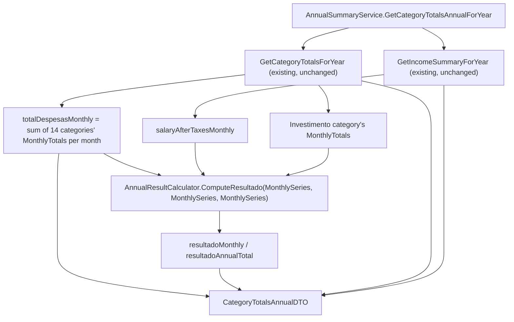

## 1. Technical Overview

**What:** New endpoint `GET /annual-summary/{year}/category-totals` that composes the existing `GetCategoryTotalsForYear` and `GetIncomeSummaryForYear` computations with two new computed figures — `totalDespesasMonthly`/`totalDespesasAnnualTotal` and `resultadoMonthly`/`resultadoAnnualTotal` — into one response DTO (`CategoryTotalsAnnualDTO`). `resultadoMonthly` is computed via F01's already-implemented `AnnualResultCalculator.ComputeResultado(MonthlySeries, MonthlySeries, MonthlySeries)` overload, which has no caller yet in the codebase.

**Why:** Relocates two real business rules (Total despesas, Resultado R-D-Inv) that today live client-side in `useAnnualSummary.ts` into the Application/Domain layers, and adopts the corrected Resultado formula (no Dividendo/Juros term) for the Category Totals tab, matching what Historic Summary Average has always computed — resolving the drift documented in the PRD's Problem section.

**Scope:**
- Included: new `CategoryTotalsAnnualDTO`; new `AnnualSummaryService.GetCategoryTotalsAnnualForYear(int year)` composing the existing `GetCategoryTotalsForYear`/`GetIncomeSummaryForYear` methods as internal steps; new controller action and route; unit tests for the new formulas (including a zero-data year and a non-zero Investimento/Dividendo-Juros case); an integration test for the new route.
- Excluded / deferred: removing the `expense-categories` and `income-summary` routes and their controller actions. **Decision (confirmed with user):** `useAnnualSummary.ts` fetches all annual-summary endpoints with a single `Promise.all`, so removing any one of the old routes before the frontend is migrated would break the entire Annual Summary page — including the already-shipped Historic Summary Average tab — and fail the CI browser smoke test on this feature's own PR. The old routes are therefore left fully intact and unchanged by F02; their removal (and the corresponding PRD F02 acceptance-criteria bullet "`expense-categories`/`income-summary` return 404") is deferred to F05, which migrates the frontend in the same PR that removes them. This mirrors the standard expand/contract migration pattern and keeps CI green on every PR. F03's `investment-annual-result` endpoint and `investment-diffs` removal are a separate feature, unaffected by this decision.

## 2. Architecture Impact

**Affected components:**

| File Path | New/Modified | Purpose |
|-----------|--------------|---------|
| `Financial.CashFlow.Application/DTOs/CategoryTotalsAnnualDTO.cs` | New | Combined response read model for the new endpoint |
| `Financial.CashFlow.Application/Interfaces/IAnnualSummaryService.cs` | Modified | Add `GetCategoryTotalsAnnualForYear(int year)` |
| `Financial.CashFlow.Application/Services/AnnualSummaryService.cs` | Modified | Add `GetCategoryTotalsAnnualForYear`, composing existing `GetCategoryTotalsForYear`/`GetIncomeSummaryForYear` and calling F01's `AnnualResultCalculator.ComputeResultado(MonthlySeries, MonthlySeries, MonthlySeries)` |
| `Financial.Api/Controllers/AnnualSummaryController.cs` | Modified | Add `GetCategoryTotals` action, `[HttpGet("{year:int}/category-totals")]` |
| `Tests/Financial.CashFlow.Application.Tests/Services/AnnualSummaryServiceTests.cs` | Modified | New tests for `GetCategoryTotalsAnnualForYear` |
| `Tests/Financial.Api.Tests/AnnualSummaryEndpointsTests.cs` | Modified | New integration test for `category-totals` |

No Domain-layer changes — `AnnualResultCalculator` and `MonthlySeries` already exist (F01, merged).



## 3. Technical Decisions

| Decision | Chosen Approach | Alternative Considered | Trade-off |
|----------|------------------|-------------------------|-----------|
| Old route removal timing | Deferred to F05; `expense-categories`/`income-summary` stay fully functional and unmodified in this feature | Remove routes now per PRD's literal F02 wording | Removing now breaks the whole Annual Summary page (Promise.all in `useAnnualSummary.ts`) until F05 lands, failing CI's browser smoke test on this PR. Confirmed with user; standard expand/contract migration pattern. |
| `GetCategoryTotalsForYear`/`GetIncomeSummaryForYear` visibility | Left exactly as-is: public on both `IAnnualSummaryService` and the concrete class | Make them `private` now that a combined method exists, per PRD's "internal (private) steps" wording | They must stay public on the interface anyway since the still-active `expense-categories`/`income-summary` controller actions call them through `IAnnualSummaryService`. Keeping them unchanged also means the ~15 existing direct-call unit tests for these two methods keep passing unmodified — zero risk, consistent with CLAUDE.md's no-over-engineering guidance for this personal project. |
| Locating the Investimento category row | `categoryTotals.FirstOrDefault(c => c.Category == nameof(Category.Investimento))`, falling back to an all-zero series if absent | Add an `IsInvestment` flag to `CategoryAnnualTotalDTO` | Matches the exact string-comparison idiom `AnnualSummaryService.AddCategoryTotal` already uses to find the Investimento row in the historic-average path (`CategoryAnnualTotalDTO.Category` is already a flattened string, not a domain `Category` value, at this point in the pipeline) — no new DTO field needed. |
| Building `totalDespesasMonthly` from the 14 per-category `CategoryAnnualTotalDTO.MonthlyTotals` arrays | Rebuild a `MonthlySeries` per category via `MonthlySeries.FromMonthlyValues(dto.MonthlyTotals)` and `Aggregate(MonthlySeries.Zero(), (acc, c) => acc.Add(c))` | Change `GetCategoryTotalsForYear` to also expose the underlying `MonthlySeries` objects instead of only `decimal[]` | Avoids touching a well-tested, unchanged existing method/DTO shape purely to serve this one new caller; the reconstruction is 14 cheap array wraps, negligible for a single-user app. |
| New DTO name and field names | `CategoryTotalsAnnualDTO` with `CategoryTotals`, `IncomeSummary`, `TotalDespesasMonthly`, `TotalDespesasAnnualTotal`, `ResultadoMonthly`, `ResultadoAnnualTotal` | — | Field names are prescribed verbatim by PRD F02 Capabilities/Section 9 AC (camelCase on the wire via existing JSON serialization conventions); `Annual` suffix matches the sibling `IncomeAnnualSummaryDTO`/`InvestmentDiffsAnnualDTO` naming convention already in `Financial.CashFlow.Application/DTOs/`. |

## 4. Component Overview

**Backend — Application (`Financial.CashFlow.Application`):**

| File Path | New/Modified | Purpose | Key Responsibilities |
|-----------|--------------|---------|----------------------|
| `DTOs/CategoryTotalsAnnualDTO.cs` | New | Combined Category Totals tab read model | `CategoryTotals: IReadOnlyList<CategoryAnnualTotalDTO>`, `IncomeSummary: IncomeAnnualSummaryDTO`, `TotalDespesasMonthly: decimal[]`, `TotalDespesasAnnualTotal: decimal`, `ResultadoMonthly: decimal[]`, `ResultadoAnnualTotal: decimal` — sealed, `required`-init, matching sibling DTO style |
| `Interfaces/IAnnualSummaryService.cs` | Modified | Service contract | Add `CategoryTotalsAnnualDTO GetCategoryTotalsAnnualForYear(int year)` |
| `Services/AnnualSummaryService.cs` | Modified | Annual summary computation | New public `GetCategoryTotalsAnnualForYear`: calls `GetCategoryTotalsForYear`/`GetIncomeSummaryForYear` internally, aggregates `totalDespesasMonthly` from the 14 category series, resolves the Investimento series, calls `AnnualResultCalculator.ComputeResultado(MonthlySeries, MonthlySeries, MonthlySeries)` for `resultadoMonthly`, sums both series for the two annual totals |

**Backend — Presentation (`Financial.Api`):**

| File Path | New/Modified | Purpose | Key Responsibilities |
|-----------|--------------|---------|----------------------|
| `Controllers/AnnualSummaryController.cs` | Modified | Thin pass-through controller | New `[HttpGet("{year:int}/category-totals")]` action `GetCategoryTotals(int year)` returning `Ok(_annualSummaryService.GetCategoryTotalsAnnualForYear(year))`; existing actions untouched |

No Domain or Infrastructure files change — `AnnualResultCalculator` and `MonthlySeries` (F01) are consumed, not modified.

## 5. API Contracts

**Endpoint:** `GET /api/v1/financial/annual-summary/{year}/category-totals`

**Response — `200 OK`:**

```json
{
  "categoryTotals": [
    { "category": "Ariana", "monthlyTotals": [0,0,0,0,0,0,0,0,0,0,0,0], "annualTotal": 0 },
    { "category": "Investimento", "monthlyTotals": [500,500,500,500,500,500,500,500,500,500,500,500], "annualTotal": 6000 }
  ],
  "incomeSummary": {
    "salaryMonthly": [3000,3000,3000,3000,3000,3000,3000,3000,3000,3000,3000,3000],
    "salaryAnnualTotal": 36000,
    "salaryAfterTaxesMonthly": [2500,2500,2500,2500,2500,2500,2500,2500,2500,2500,2500,2500],
    "salaryAfterTaxesAnnualTotal": 30000,
    "taxDifferenceMonthly": [500,500,500,500,500,500,500,500,500,500,500,500],
    "taxDifferenceAnnualTotal": 6000,
    "dividendoJurosMonthly": [100,100,100,100,100,100,100,100,100,100,100,100],
    "dividendoJurosAnnualTotal": 1200
  },
  "totalDespesasMonthly": [1200,1200,1200,1200,1200,1200,1200,1200,1200,1200,1200,1200],
  "totalDespesasAnnualTotal": 14400,
  "resultadoMonthly": [1800,1800,1800,1800,1800,1800,1800,1800,1800,1800,1800,1800],
  "resultadoAnnualTotal": 21600
}
```
`resultadoMonthly[m] = salaryAfterTaxesMonthly[m] - totalDespesasMonthly[m] + Investimento.monthlyTotals[m]` — note `dividendoJurosMonthly` deliberately does not appear in this formula (the corrected, no-Dividendo/Juros formula).

**Response — zero-data year:** all `categoryTotals[].monthlyTotals`/`annualTotal`, `incomeSummary` fields, `totalDespesasMonthly`/`totalDespesasAnnualTotal`, and `resultadoMonthly`/`resultadoAnnualTotal` are `0`-filled — no error, no missing fields (falls out for free from the existing zero-fill behavior of the two composed methods).

**Unchanged endpoints (not modified by this feature):** `GET .../expense-categories`, `GET .../income-summary`, `GET .../investment-diffs`, `GET .../historic-summary-averages` all continue to behave exactly as today.

## 6. Data Model

No entity or persisted JSON shape changes — this is a read-only computed response composed from already-persisted `Expense`/`Income` data via the existing repository methods.

**Cross-Database Notes:** Not applicable — no relational database is used anywhere in this solution.

## 7. Testing Strategy

**Test File Structure:**

| Test File | Test Type | Target | Coverage Goal |
|-----------|-----------|--------|----------------|
| `Tests/Financial.CashFlow.Application.Tests/Services/AnnualSummaryServiceTests.cs` | Unit | `AnnualSummaryService.GetCategoryTotalsAnnualForYear` | Total despesas sums all 14 categories per month; Resultado excludes Dividendo/Juros; zero-data year; nested `categoryTotals`/`incomeSummary` match the existing standalone methods' output byte-for-byte |
| `Tests/Financial.Api.Tests/AnnualSummaryEndpointsTests.cs` | Integration | `GET .../category-totals` | `200 OK`, response shape, zero-data year; existing `expense-categories`/`income-summary`/`investment-diffs`/`historic-summary-averages` tests continue to pass unmodified (regression check that this feature didn't touch them) |

**Key test functions:**

| Test Function | Description | Assertions |
|----------------|-------------|------------|
| `GetCategoryTotalsAnnualForYear_TotalDespesasMonthlyEqualsSumOfAllCategoriesPerMonth` | Expenses across multiple categories/months | `TotalDespesasMonthly[m]` equals the sum of all 14 `CategoryTotals[*].MonthlyTotals[m]` for every `m` |
| `GetCategoryTotalsAnnualForYear_ResultadoMonthlyExcludesDividendoJurosAndIncludesInvestimento` | Non-zero Investimento expenses and non-zero Dividendo/Juros income in the same year | `ResultadoMonthly[m] == SalaryAfterTaxesMonthly[m] - TotalDespesasMonthly[m] + Investimento.MonthlyTotals[m]`, confirmed to differ from a naively-including-DividendoJuros calculation |
| `GetCategoryTotalsAnnualForYear_AnnualTotalsEqualSumOfMonthlyValues` | Any populated year | `TotalDespesasAnnualTotal == TotalDespesasMonthly.Sum()`; `ResultadoAnnualTotal == ResultadoMonthly.Sum()` |
| `GetCategoryTotalsAnnualForYear_NoRecordedData_ReturnsAllZeroSeries` | Year with no expenses/income | Every field is zero-filled, no exception |
| `GetCategoryTotalsAnnualForYear_NestedCategoryTotalsAndIncomeSummaryMatchStandaloneMethods` | Regression | `result.CategoryTotals` equals `GetCategoryTotalsForYear(year)`; `result.IncomeSummary` equals `GetIncomeSummaryForYear(year)`, field-by-field |
| `GetCategoryTotals_ReturnsOkWithCombinedShape` (Api, integration) | Seeded expenses/income for a year | `200 OK`; deserialized body has non-null `categoryTotals`, `incomeSummary`, and correct `totalDespesasMonthly`/`resultadoMonthly` lengths (12) |
| `GetCategoryTotals_NoRecordedData_ReturnsAllZeroSeries` (Api, integration) | Year with no seeded data | `200 OK`; all numeric fields zero |

**Integration-level check:** No live-data run — this endpoint is additive only (old routes untouched), so the existing `expense-categories`/`income-summary` behavior the live app currently depends on is unaffected. Unit and integration tests are the full verification surface for this feature.
