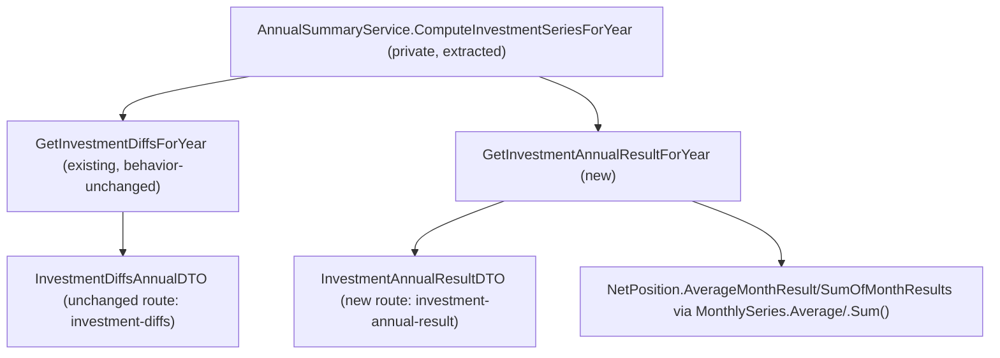

## 1. Technical Overview

**What:** New endpoint `GET /annual-summary/{year}/investment-annual-result` returning the same response shape currently returned by `investment-diffs` (`Accounts[]` + `NetPosition`), reusing the existing `InvestmentAccountAnnualDiffDTO`/`NetPositionAnnualDiffDTO` nested types under a new top-level `InvestmentAnnualResultDTO`. The shared account-resolution/diff-computation logic is extracted into a private helper so both the old `GetInvestmentDiffsForYear` and the new `GetInvestmentAnnualResultForYear` consume it without duplicating ~50 lines of account/diff logic. `NetPosition.AverageMonthResult`/`SumOfMonthResults` for the new method are computed via F01's `MonthlySeries.Average`/`.Sum()` (the one PRD-named gap — `DiffsFrom` is already used by the current implementation).

**Why:** Follows the same "build pieces, then merge" pattern as F02/Historic Summary Average, and closes the one remaining spot where investment annual figures are computed with inline LINQ instead of the shared F01 `MonthlySeries` building block.

**Scope:**
- Included: new `InvestmentAnnualResultDTO`; new `AnnualSummaryService.GetInvestmentAnnualResultForYear(int year)`; a private helper extracted from `GetInvestmentDiffsForYear` for the shared per-account/net-position series computation; new controller action/route; unit tests confirming the new endpoint's values are byte-identical to the existing `investment-diffs` output and that `AverageMonthResult`/diffs are produced via `MonthlySeries.Average`/`DiffsFrom`; integration test for the new route.
- Excluded / deferred (same decision as F02, see its spec.md): removing the `investment-diffs` route and its controller action, and renaming `InvestmentDiffsAnnualDTO` away. `useAnnualSummary.ts` still depends on `investment-diffs` via the same `Promise.all`, so it stays fully intact and unmodified until F05 migrates the frontend and removes it in the same PR. Per the PRD's own wording, only the *top-level* wrapper type is meant to be renamed (`InvestmentDiffsAnnualDTO` → `InvestmentAnnualResultDTO`); the nested `InvestmentAccountAnnualDiffDTO`/`NetPositionAnnualDiffDTO` types are explicitly "retained" — so this feature reuses them as-is under the new wrapper rather than introducing parallel nested types F05 would have to clean up.

## 2. Architecture Impact

**Affected components:**

| File Path | New/Modified | Purpose |
|-----------|--------------|---------|
| `Financial.CashFlow.Application/DTOs/InvestmentAnnualResultDTO.cs` | New | New top-level wrapper DTO, reusing the existing nested `InvestmentAccountAnnualDiffDTO`/`NetPositionAnnualDiffDTO` types |
| `Financial.CashFlow.Application/Interfaces/IAnnualSummaryService.cs` | Modified | Add `GetInvestmentAnnualResultForYear(int year)` |
| `Financial.CashFlow.Application/Services/AnnualSummaryService.cs` | Modified | Extract a private `ComputeInvestmentSeriesForYear` helper from `GetInvestmentDiffsForYear`'s body (account resolution, per-account/net-position `MonthlySeries`, `DiffsFrom`, `lastRelevantMonth`); `GetInvestmentDiffsForYear` now calls it and is otherwise behavior-unchanged; add `GetInvestmentAnnualResultForYear`, which also calls it and computes `AverageMonthResult`/`SumOfMonthResults` via `MonthlySeries.Average`/`.Sum()` |
| `Financial.Api/Controllers/AnnualSummaryController.cs` | Modified | Add `GetInvestmentAnnualResult` action, `[HttpGet("{year:int}/investment-annual-result")]` |
| `Tests/Financial.CashFlow.Application.Tests/Services/AnnualSummaryServiceTests.cs` | Modified | New tests for `GetInvestmentAnnualResultForYear` |
| `Tests/Financial.Api.Tests/AnnualSummaryEndpointsTests.cs` | Modified | New integration test for `investment-annual-result` |

No Domain-layer changes — `MonthlySeries` (F01) is consumed, not modified.



## 3. Technical Decisions

| Decision | Chosen Approach | Alternative Considered | Trade-off |
|----------|------------------|-------------------------|-----------|
| Old route/DTO removal timing | Deferred to F05, same decision as F02 (`investment-diffs` stays fully intact) | Remove now per PRD's literal F03 wording | Same reasoning as F02: `useAnnualSummary.ts`'s single `Promise.all` would break the whole Annual Summary page and the CI browser smoke test before F05 lands. |
| Avoiding duplicated account/diff logic between the old and new methods | Extract a private `ComputeInvestmentSeriesForYear(int year)` helper from `GetInvestmentDiffsForYear`'s existing body; both public methods call it | Write `GetInvestmentAnnualResultForYear` as a fully independent ~70-line method | `GetInvestmentDiffsForYear`'s account-resolution/diff logic is nontrivial (year-scoped resolver, prior-year December carryover, liability-weighted net position). Duplicating it risks the two endpoints silently drifting, which is exactly the anti-pattern this PRD exists to eliminate. Extracting it is a behavior-preserving refactor (same inputs, same intermediate values) — `GetInvestmentDiffsForYear`'s own output and existing tests are unaffected. |
| `AverageMonthResult`/`SumOfMonthResults` precision for the new method | Build a 12-element `MonthlySeries` from `netPositionDiffs` (nulls and out-of-range months zero-filled) and call `.Average(monthsElapsed, FullPrecisionDecimalPlaces)`/`.Sum()`, where `FullPrecisionDecimalPlaces = 28` (decimal's max) is a new named constant on `AnnualSummaryService`, documented in code as "no intentional rounding — matches `GetInvestmentDiffsForYear`'s unrounded LINQ `.Average()` exactly, unlike the 2-decimal-place income/category averages" | Reuse the existing `AverageDecimalPlaces = 2` constant | `GetInvestmentDiffsForYear`'s own tests (e.g. `..._AverageAndSumIncludeAllTwelveMonthsIncludingJanuary`) assert the *unrounded* value (`BeApproximately(650m / 12m, 0.0001m)`) — rounding to 2 places would fail F03's own "byte-identical to the pre-refactor `investment-diffs` output" AC. `Math.Round(x, 28)` is provably a no-op here: decimal division already caps at ≤28 significant fractional digits, so this satisfies the AC's "route through `MonthlySeries.Average`" requirement with zero behavior change. |
| `monthsElapsed` for the new `MonthlySeries.Average` call | Count of non-null diffs within `Take(lastRelevantMonth)` (mirrors the old method's `relevantDiffs.Count`) | A fixed 12 or `lastRelevantMonth` | Only January's diff can ever be `null` (no prior-year data at all); using its actual presence/absence as the divisor is what makes the result mathematically identical to the old method's `relevantDiffs.Average()`. |
| New DTO shape | `InvestmentAnnualResultDTO { Accounts: InvestmentAccountAnnualDiffDTO[], NetPosition: NetPositionAnnualDiffDTO }`, reusing the existing nested types verbatim | Introduce renamed nested types (`InvestmentAccountAnnualResultDTO`, `NetPositionAnnualResultDTO`) now | PRD explicitly says the nested types are "retained" (not renamed) even after the eventual full cutover — reusing them now means F05 only ever deletes the old top-level `InvestmentDiffsAnnualDTO` and route, with zero further type churn. |

## 4. Component Overview

**Backend — Application (`Financial.CashFlow.Application`):**

| File Path | New/Modified | Purpose | Key Responsibilities |
|-----------|--------------|---------|----------------------|
| `DTOs/InvestmentAnnualResultDTO.cs` | New | Combined Investments tab read model (new route) | `Accounts: InvestmentAccountAnnualDiffDTO[]`, `NetPosition: NetPositionAnnualDiffDTO` — sealed, `required`-init |
| `Interfaces/IAnnualSummaryService.cs` | Modified | Service contract | Add `InvestmentAnnualResultDTO GetInvestmentAnnualResultForYear(int year)` |
| `Services/AnnualSummaryService.cs` | Modified | Annual investment computation | Extract `ComputeInvestmentSeriesForYear` (year-scoped account resolution, per-account/net-position `MonthlySeries` + `DiffsFrom`, `lastRelevantMonth`) from `GetInvestmentDiffsForYear`'s body; new `GetInvestmentAnnualResultForYear` calls it and maps to the new DTO, computing `AverageMonthResult`/`SumOfMonthResults` via `MonthlySeries.Average(monthsElapsed, FullPrecisionDecimalPlaces)`/`.Sum()`; new `FullPrecisionDecimalPlaces = 28` constant |

**Backend — Presentation (`Financial.Api`):**

| File Path | New/Modified | Purpose | Key Responsibilities |
|-----------|--------------|---------|----------------------|
| `Controllers/AnnualSummaryController.cs` | Modified | Thin pass-through controller | New `[HttpGet("{year:int}/investment-annual-result")]` action `GetInvestmentAnnualResult(int year)` returning `Ok(_annualSummaryService.GetInvestmentAnnualResultForYear(year))`; existing actions untouched |

No Domain or Infrastructure files change.

## 5. API Contracts

**Endpoint:** `GET /api/v1/financial/annual-summary/{year}/investment-annual-result`

**Response — `200 OK`** (identical shape to today's `investment-diffs`):

```json
{
  "accounts": [
    { "account": "ChaseSave", "isLiability": false, "monthlyValues": [1000,1200,1100,0,0,0,0,0,0,0,0,0], "monthlyDiffs": [null,200,-100,-1100,0,0,0,0,0,0,0,0] }
  ],
  "netPosition": {
    "monthlyValues": [1000,1200,1100,0,0,0,0,0,0,0,0,0],
    "monthlyDiffs": [null,200,-100,-1100,0,0,0,0,0,0,0,0],
    "fullYearNetChange": -1000,
    "averageMonthResult": -250,
    "sumOfMonthResults": -1000
  }
}
```

**Response — no investment accounts/snapshots for the year:** `accounts: []`, `netPosition` all-zero (`monthlyValues`/`monthlyDiffs` all `0`, `fullYearNetChange`/`averageMonthResult`/`sumOfMonthResults` all `0`) — falls out for free from the shared helper's existing zero-fill behavior.

**Unchanged endpoints (not modified by this feature):** `GET .../expense-categories`, `GET .../income-summary`, `GET .../investment-diffs`, `GET .../historic-summary-averages`, `GET .../category-totals` all continue to behave exactly as today.

## 6. Data Model

No entity or persisted JSON shape changes — read-only computed response from existing `InvestmentAccount`/`InvestmentSnapshot` repository data.

**Cross-Database Notes:** Not applicable — no relational database is used anywhere in this solution.

## 7. Testing Strategy

**Test File Structure:**

| Test File | Test Type | Target | Coverage Goal |
|-----------|-----------|--------|----------------|
| `Tests/Financial.CashFlow.Application.Tests/Services/AnnualSummaryServiceTests.cs` | Unit | `AnnualSummaryService.GetInvestmentAnnualResultForYear` | Byte-identical parity with `GetInvestmentDiffsForYear` for the same seeded data (accounts, diffs, `AverageMonthResult`, `SumOfMonthResults`); no-data year returns empty accounts + all-zero net position |
| `Tests/Financial.Api.Tests/AnnualSummaryEndpointsTests.cs` | Integration | `GET .../investment-annual-result` | `200 OK`, response shape, values matching seeded snapshots; existing `investment-diffs` test continues to pass unmodified |

**Key test functions:**

| Test Function | Description | Assertions |
|----------------|-------------|------------|
| `GetInvestmentAnnualResultForYear_AccountsAndNetPositionMatchGetInvestmentDiffsForYearExactly` | Multi-account, multi-month seeded data including prior-year December carryover | `result.Accounts`/`result.NetPosition` equal (`BeEquivalentTo`) `service.GetInvestmentDiffsForYear(year).Accounts`/`.NetPosition` field-by-field, including `AverageMonthResult`'s unrounded value |
| `GetInvestmentAnnualResultForYear_AverageMonthResultUsesMonthlySeriesAverageNotNaiveRounding` | Data producing a non-terminating average (e.g. `650m` over 12 months, mirroring the existing `GetInvestmentDiffsForYear` test) | `result.NetPosition.AverageMonthResult` equals the exact unrounded `650m / 12m` value, not a 2-decimal-rounded figure |
| `GetInvestmentAnnualResultForYear_NoAccountsOrSnapshots_ReturnsEmptyAccountsAndAllZeroNetPosition` | Empty repository | `result.Accounts` is empty; every `NetPosition` field is `0` |
| `GetInvestmentAnnualResult_ReturnsOkMatchingSeededSnapshots` (Api, integration) | Seeded snapshots for one account across two months | `200 OK`; `accounts[0].monthlyValues`/`monthlyDiffs` match seeded values |
| `GetInvestmentAnnualResult_NoData_ReturnsEmptyAccountsArray` (Api, integration) | No seeded snapshots | `200 OK`; `accounts` is an empty array |

**Regression check:** Every existing `GetInvestmentDiffsForYear_*` test (in `AnnualSummaryServiceTests.cs`) and the existing `GetInvestmentDiffs_*` integration test must continue to pass unmodified — proof that extracting the shared helper did not change `investment-diffs`'s own behavior.
