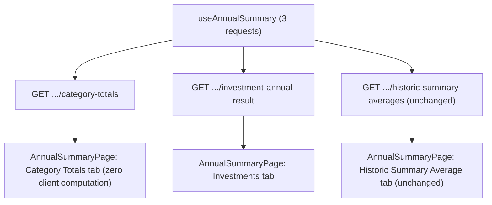

## 1. Technical Overview

**What:** Migrates `useAnnualSummary.ts`/`AnnualSummaryPage.tsx` to fetch `category-totals` and `investment-annual-result` (F02/F03) instead of `expense-categories`, `income-summary`, and `investment-diffs`, dropping the hook's client-side `useMemo` computation of Total despesas/Resultado entirely. In the same PR, removes the three now-fully-superseded old routes/controller actions and the one genuinely dead backend method+DTO (`GetInvestmentDiffsForYear`/`InvestmentDiffsAnnualDTO` — fully superseded by `GetInvestmentAnnualResultForYear`/`InvestmentAnnualResultDTO`, which already reuse the same nested types). This is the "contract" half of the expand/contract migration F02 and F03 started (their specs deferred exactly this cutover to this feature).

**Why:** Closes out P19: the frontend becomes a pure renderer of server-computed values, the page drops from 4 to 3 HTTP requests, and the Category Totals tab's Resultado figures finally match the corrected (no-Dividendo/Juros) formula everywhere.

**Scope:**
- Included: hook rewrite (3 requests, zero business logic); page.tsx updated for the renamed investments field; `types.ts`/`financialApiClient.ts` updated; removal of `expense-categories`/`income-summary`/`investment-diffs` routes+actions; removal of `GetInvestmentDiffsForYear`+`InvestmentDiffsAnnualDTO` (backend and frontend `InvestmentDiffsAnnualDto`); the `GetInvestmentDiffsForYear_*` unit test suite is **ported** (renamed, retargeted) to `GetInvestmentAnnualResultForYear` rather than deleted, since it's the only place several `ComputeInvestmentSeriesForYear` edge cases (year-scoping, liability sign, December carryover, current-year truncation) are exercised; existing hook/page tests updated to mock the two new endpoints; new 404 tests for the three removed routes.
- Excluded: `GetCategoryTotalsForYear`/`GetIncomeSummaryForYear` methods and their `CategoryAnnualTotalDTO`/`IncomeAnnualSummaryDTO` types are **not** deleted — they remain genuinely reused as `GetCategoryTotalsAnnualForYear`'s internal steps (unlike `GetInvestmentDiffsForYear`, which has no remaining caller once its route is gone). Only their controller actions/routes and their interface exposure are removed. No visual/layout change beyond the already-corrected Resultado values (F02) and the renamed `investmentDiffs` → `investmentAnnualResult` internal hook field (no visible effect).

## 2. Architecture Impact

**Affected components:**

| File Path | New/Modified | Purpose |
|-----------|--------------|---------|
| `Financial.Api/Controllers/AnnualSummaryController.cs` | Modified | Remove `GetExpenseCategoryTotals`, `GetIncomeSummary`, `GetInvestmentDiffs` actions/routes |
| `Financial.CashFlow.Application/Interfaces/IAnnualSummaryService.cs` | Modified | Remove `GetCategoryTotalsForYear`, `GetIncomeSummaryForYear`, `GetInvestmentDiffsForYear` (no longer called by any Presentation-layer consumer) |
| `Financial.CashFlow.Application/Services/AnnualSummaryService.cs` | Modified | `GetCategoryTotalsForYear`/`GetIncomeSummaryForYear` stay as public methods (still internally reused); `GetInvestmentDiffsForYear` deleted entirely (dead — superseded) |
| `Financial.CashFlow.Application/DTOs/InvestmentDiffsAnnualDTO.cs` | Deleted | Fully superseded by `InvestmentAnnualResultDTO`, which reuses the same nested types |
| `Tests/Financial.CashFlow.Application.Tests/Services/AnnualSummaryServiceTests.cs` | Modified | `GetInvestmentDiffsForYear_*` tests renamed/retargeted to `GetInvestmentAnnualResultForYear`; the 3 F03-added tests trimmed (2 now redundant with the ported suite) |
| `Tests/Financial.Api.Tests/AnnualSummaryEndpointsTests.cs` | Modified | Old `expense-categories`/`income-summary`/`investment-diffs` tests removed/retargeted; new 404 tests for the three removed routes |
| `Financial.Web/src/api/types.ts` | Modified | Add `CategoryTotalsAnnualDto`, `InvestmentAnnualResultDto`; remove `InvestmentDiffsAnnualDto` |
| `Financial.Web/src/api/financialApiClient.ts` | Modified | Replace `getCategoryTotalsForYear`/`getIncomeSummaryForYear`/`getInvestmentDiffsForYear` with `getCategoryTotalsAnnualForYear`/`getInvestmentAnnualResultForYear` |
| `Financial.Web/src/hooks/useAnnualSummary.ts` | Modified | 3 requests via `Promise.all`; drop the `useMemo` Total despesas/Resultado computation entirely; rename exposed `investmentDiffs` → `investmentAnnualResult` |
| `Financial.Web/src/hooks/useAnnualSummary.test.ts` | Modified | Mock the two new endpoints; drop the "computes total despesas"/"computes resultado" tests (no longer applicable — values now come straight from the mock) |
| `Financial.Web/src/pages/AnnualSummaryPage.tsx` | Modified | Rename `investmentDiffs` references to `investmentAnnualResult` (identifier-only change, no visible/layout change) |
| `Financial.Web/src/pages/__tests__/AnnualSummaryPage.test.tsx` | Modified | Mock the two new endpoints; Resultado expectations updated to the corrected (no-Dividendo/Juros) formula |

## 3. Technical Decisions

| Decision | Chosen Approach | Alternative Considered | Trade-off |
|----------|------------------|-------------------------|-----------|
| Asymmetric backend cleanup between the category and investment paths | Delete `GetInvestmentDiffsForYear`/`InvestmentDiffsAnnualDTO` entirely; keep `GetCategoryTotalsForYear`/`GetIncomeSummaryForYear`/their DTOs (just de-interfaced) | Treat both symmetrically (delete both, or keep both) | `GetCategoryTotalsAnnualForYear` genuinely calls `GetCategoryTotalsForYear`/`GetIncomeSummaryForYear` as internal steps (real reuse) — deleting them would mean re-deriving the same logic. `GetInvestmentAnnualResultForYear` does **not** call `GetInvestmentDiffsForYear` (F03 extracted the shared computation into `ComputeInvestmentSeriesForYear`, which both used); once its route is gone, `GetInvestmentDiffsForYear` has zero remaining callers and is straightforward duplication of `GetInvestmentAnnualResultForYear`. |
| Porting vs. deleting the `GetInvestmentDiffsForYear_*` test suite | Rename each test to target `GetInvestmentAnnualResultForYear`, keeping its scenario and assertions (same DTO shapes) | Delete them, relying only on the smaller F03-added test set | The ported suite is the only place several `ComputeInvestmentSeriesForYear` edge cases are exercised (2023 account roster, liability-sign net position, no-prior-year-data null, account-absent-from-prior-year zero-fallback). Losing that coverage when the method they tested is deleted would be a real regression in test coverage, which CLAUDE.md's Definition of Done explicitly disallows. |
| Renaming the hook's exposed `investmentDiffs` field to `investmentAnnualResult` | Rename now, since `AnnualSummaryPage.tsx` is already being touched in this feature | Keep the old field name to minimize diff size | The field now holds an `InvestmentAnnualResultDto`, not an `InvestmentDiffsAnnualDto` (both are now fetched from `investment-annual-result`) — keeping the stale name would misname the data for anyone reading the hook or page next. The rename is identifier-only, with no visible/behavioral effect, verified by the existing Investments-tab tests continuing to pass with only their mock setup changed. |
| Order of route removal vs. frontend migration within this one PR | Both land together in a single commit sequence (backend cleanup, then frontend migration, then full-suite verification) | Split into two PRs (backend cleanup first, frontend second) | Splitting would recreate exactly the CI-smoke-test breakage F02/F03 deferred to avoid — the frontend must never be left pointing at routes that no longer exist, even briefly on `main`. |

## 4. Component Overview

**Backend — Presentation (`Financial.Api`):**

| File Path | New/Modified | Purpose | Key Responsibilities |
|-----------|--------------|---------|----------------------|
| `Controllers/AnnualSummaryController.cs` | Modified | Thin pass-through controller | Remove `GetExpenseCategoryTotals`/`GetIncomeSummary`/`GetInvestmentDiffs`; `GetCategoryTotals`, `GetInvestmentAnnualResult`, `GetHistoricSummaryAverages` remain |

**Backend — Application (`Financial.CashFlow.Application`):**

| File Path | New/Modified | Purpose | Key Responsibilities |
|-----------|--------------|---------|----------------------|
| `Interfaces/IAnnualSummaryService.cs` | Modified | Service contract | Only `GetCategoryTotalsAnnualForYear`, `GetInvestmentAnnualResultForYear`, `GetHistoricSummaryAverageFromYear` remain |
| `Services/AnnualSummaryService.cs` | Modified | Annual summary computation | `GetInvestmentDiffsForYear` deleted; `GetCategoryTotalsForYear`/`GetIncomeSummaryForYear` unchanged, now unreferenced by the interface but still called internally |
| `DTOs/InvestmentDiffsAnnualDTO.cs` | Deleted | — | — |

**Frontend (`Financial.Web`):**

| File Path | New/Modified | Purpose | Key Responsibilities |
|-----------|--------------|---------|----------------------|
| `src/api/types.ts` | Modified | API response typing | Add `CategoryTotalsAnnualDto` (`categoryTotals`, `incomeSummary`, `totalDespesasMonthly`, `totalDespesasAnnualTotal`, `resultadoMonthly`, `resultadoAnnualTotal`), `InvestmentAnnualResultDto` (`accounts`, `netPosition`, reusing `InvestmentAccountAnnualDiffDto`/`NetPositionAnnualDiffDto`); remove `InvestmentDiffsAnnualDto` |
| `src/api/financialApiClient.ts` | Modified | HTTP client | `getCategoryTotalsAnnualForYear(year)` → `GET .../category-totals`; `getInvestmentAnnualResultForYear(year)` → `GET .../investment-annual-result`; `getCategoryTotalsForYear`/`getIncomeSummaryForYear`/`getInvestmentDiffsForYear` removed |
| `src/hooks/useAnnualSummary.ts` | Modified | Data-fetching hook | 3 concurrent requests; state fields (`categoryTotals`, `incomeSummary`, `totalDespesasMonthly`, `totalDespesasAnnualTotal`, `resultadoMonthly`, `resultadoAnnualTotal`) populated directly from the `category-totals` response — no `useMemo` computation; `investmentAnnualResult` populated from the new endpoint |
| `src/pages/AnnualSummaryPage.tsx` | Modified | Annual Summary page | Investments tab reads `investmentAnnualResult` instead of `investmentDiffs`; Category Totals tab unchanged (same field names as before) |

## 5. API Contracts

**Removed routes (now `404 Not Found`):**
- `GET /api/v1/financial/annual-summary/{year}/expense-categories`
- `GET /api/v1/financial/annual-summary/{year}/income-summary`
- `GET /api/v1/financial/annual-summary/{year}/investment-diffs`

**Unchanged routes:** `GET .../category-totals` (F02), `GET .../investment-annual-result` (F03), `GET .../historic-summary-averages` — no contract changes in this feature, only their frontend consumption.

**Frontend request count:** `useAnnualSummary`'s `Promise.all` now issues exactly 3 requests per year load (`category-totals`, `investment-annual-result`, `historic-summary-averages`), down from 4.

## 6. Data Model

No entity or persisted JSON shape changes.

## 7. Testing Strategy

**Test File Structure:**

| Test File | Test Type | Target | Coverage Goal |
|-----------|-----------|--------|----------------|
| `Tests/Financial.CashFlow.Application.Tests/Services/AnnualSummaryServiceTests.cs` | Unit | `AnnualSummaryService` | `GetInvestmentDiffsForYear_*` suite renamed/retargeted to `GetInvestmentAnnualResultForYear`; `GetCategoryTotalsForYear`/`GetIncomeSummaryForYear` tests unchanged (methods unchanged) |
| `Tests/Financial.Api.Tests/AnnualSummaryEndpointsTests.cs` | Integration | `AnnualSummaryController` | Old endpoint tests removed; 3 new tests confirming `404` for the removed routes; `category-totals`/`investment-annual-result`/`historic-summary-averages` tests unchanged |
| `Financial.Web/src/hooks/useAnnualSummary.test.ts` | Unit | `useAnnualSummary` | Mocks `getCategoryTotalsAnnualForYear`/`getInvestmentAnnualResultForYear`/`getHistoricSummaryAverageFromYear`; asserts exactly these 3 calls per year load; asserts state fields equal the mocked response's fields directly (no computation) |
| `Financial.Web/src/pages/__tests__/AnnualSummaryPage.test.tsx` | Component | `AnnualSummaryPage` | Same mocks as the hook test; Resultado/Total despesas assertions updated to the values the mock's `category-totals` response declares (corrected formula, no Dividendo/Juros) |

**Key test functions:**

| Test Function | Description | Assertions |
|----------------|-------------|------------|
| `GetExpenseCategoryTotals_RouteRemoved_Returns404` / `GetIncomeSummary_RouteRemoved_Returns404` / `GetInvestmentDiffs_RouteRemoved_Returns404` (Api) | Hit the three old routes | `404 Not Found` |
| `GetInvestmentAnnualResultForYear_2023_ReturnsExactlyTheNineAccountsConfirmedPresentThatYear` (renamed from the `GetInvestmentDiffsForYear` original) | Ported scenario, unchanged data | Same assertions, now against `GetInvestmentAnnualResultForYear` |
| `fetches category totals, investment annual result, and historic summary average for the current year on mount` (hook, renamed) | 3 mocks resolve | Exactly 3 client methods called with the current year; state fields equal the mocked payload's fields directly |
| `does not recompute total despesas or resultado client-side` (hook, new) | Mock `category-totals` response with arbitrary `totalDespesasMonthly`/`resultadoMonthly` values that would NOT match a client-side recomputation from `categoryTotals`/`incomeSummary` | Hook's returned `totalDespesasMonthly`/`resultadoMonthly` equal the mock's values exactly, proving no local recomputation occurs |
| `renders Resultado using the corrected (Dividendo/Juros-excluded) values returned by the API` (page, replaces the old "computes Resultado..." test) | Mock `category-totals` response's `resultadoMonthly`/`resultadoAnnualTotal` directly | Rendered Resultado row shows exactly the mocked values, not a recomputed one |
| Existing Investments-tab tests (renamed mock setup only) | Same scenarios, `getInvestmentAnnualResultForYear` mock instead of `getInvestmentDiffsForYear` | Unchanged assertions — proves the rename didn't alter rendering |

**Regression check:** the full backend (`dotnet test`) and frontend (`npm test`, `npm run lint`, `npm run build`) suites, plus the CI browser smoke test, must pass — this is the first PR in the P19 sequence where the smoke test exercises the fully-cut-over state (old routes gone, frontend on the new ones).
