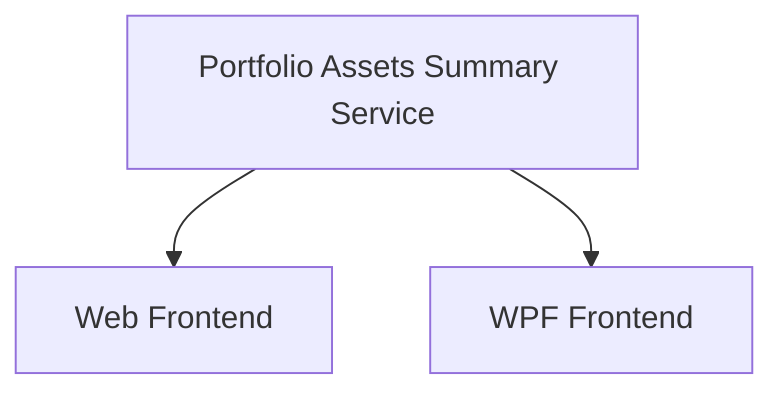

# Portfolio Summary — Per-Asset Breakdown

## 1. Executive Summary

The Portfolio Summary — Per-Asset Breakdown feature extends the existing Portfolio Navigator in both the WPF desktop application and the React web application. When a portfolio node is selected in the investment tree, the Summary tab is enhanced to display a table of all assets in that portfolio alongside their key performance metrics: date of first investment, current quantity held, total amount invested (net of sell proceeds), portfolio weight (each asset's share of total invested capital), total credits received (dividends and rents), current market value, profit/loss percentage, profit/loss percentage including credits, and XIRR (extended internal rate of return).

This builds on the aggregated totals already shown for portfolio selections (Total Bought, Total Sold, Total Credits from F04) by adding per-asset visibility into the portfolio composition. The feature replicates the "total" summary sheet the user currently maintains manually in a spreadsheet, bringing this overview directly into the application interface for both UIs.

The backend introduces a new Application-layer service and API endpoint that returns static per-asset data, including all historical cash flows required for XIRR computation. Live current prices are fetched automatically on portfolio selection using the same Google Finance scraping mechanism already used by the individual asset summary view (F03) and the bulk price fetch feature. Failed price fetches are handled gracefully per row — the affected asset shows a dash in Current Value, % Profit, % Profit w/ Credits, and XIRR while the rest of the table remains usable.

---

## 2. Problem and Opportunity

### The Problem

**Missing portfolio-level asset breakdown**
- When a portfolio is selected, the Summary tab shows only three aggregate totals (Total Bought, Total Sold, Total Credits); no breakdown of individual asset contributions is available
- Reviewing portfolio composition — which assets are largest positions, which are in profit or loss — requires switching to a separate spreadsheet maintained outside the application
- The WPF Summary tab currently renders asset-specific fields (ISIN, Country, Local Type, Asset Class, Quantity, Average Price, Current Value section) when a portfolio is selected; these fields are meaningless at portfolio level, occupying space that could show useful portfolio data

**No credit-inclusive performance metric**
- The existing % Profit column ignores dividends and rents received, understating total return for income-producing assets (real estate funds, dividend stocks)
- There is no single number that shows the true financial return including all income received

**No annualised return metric**
- Simple % Profit does not account for the time value of money or holding period; two assets with identical % Profit may have very different annualised returns depending on when they were purchased

### The Opportunity

Each problem maps to a concrete deliverable:
- Missing asset breakdown → F01: Portfolio Assets Summary Service and Endpoint computes per-asset static data server-side; F02 and F03 surface it in the respective UIs
- Spreadsheet dependency → F02 and F03 together eliminate the need for a manual "total tab" by showing First Investment Date, Quantity, Total Invested, % Portfolio, Total Credits, Current Value, % Profit, % Profit w/ Credits, and XIRR in the Summary tab
- No credit-inclusive metric → Total Credits and % Profit w/ Credits columns give a complete picture of total return including income received
- No annualised return → XIRR column provides a time-weighted annualised return using all historical buy/sell transactions and credit payments
- Misleading WPF fields → F03 introduces a portfolio-specific layout that hides asset-only fields when a portfolio node is selected

---

## 3. Target Audience

### Primary Users

**Personal Investor**
- Manages a multi-broker portfolio spanning UK (GBP) and Brazil (BRL) markets with assets across equities, real estate funds, ETFs, and fixed income
- Currently cross-references a manually maintained spreadsheet "total tab" to review portfolio composition — which positions are largest, whether each is in profit or loss, and what the annualised return is once dividends and rents are included
- Uses both the WPF desktop application and the React web application interchangeably and expects consistent information across both interfaces

---

## 4. Objectives

**Replace the spreadsheet summary sheet** with an in-app per-asset breakdown on the portfolio Summary tab
- Metric: Selecting any portfolio node in the investment tree shows the per-asset breakdown table with Asset Name, Total Invested, % Portfolio, Total Credits, and % Profit populated within 5 seconds of portfolio selection

**Remove misleading asset-specific fields** from the WPF portfolio-level Summary tab
- Metric: Selecting a Portfolio node in WPF shows no Quantity, Average Price, ISIN, Country, Local Type, or Asset Class fields; only the three aggregated totals and the per-asset breakdown table are visible in the Summary tab

**Provide automatic current value enrichment** without a manual refresh step
- Metric: Current Value, % Profit, % Profit w/ Credits, and XIRR columns populate automatically on portfolio selection for all assets whose price fetch succeeds; failed fetches display "—" without blocking data for other assets

**Provide credit-inclusive and annualised return metrics**
- Metric: % Profit w/ Credits and XIRR columns are visible for all assets in the per-asset table; XIRR displays a converged result for any asset that has at least one buy transaction and a valid current price

---

## 5. User Stories

### F01. Portfolio Assets Summary Service and Endpoint

- As the system, I want to compute per-asset summary data for a portfolio so that both frontends can display the breakdown without duplicating business logic
- As the system, I want to return assets sorted alphabetically by name so that the order matches the navigation tree
- As the system, I want to return the total credits received per asset so that frontends can display credit-inclusive performance metrics without fetching credits separately
- As the system, I want to return all historical cash flows per asset (buy/sell transaction amounts and credit payments with their dates) so that frontends can compute XIRR client-side after fetching the live price

### F02. Portfolio Summary Tab — Web Frontend

- As a user, I want to see a per-asset breakdown table when I select a portfolio so that I can review each position's size, cost, and performance in one place
- As a user, I want the three portfolio totals (Total Bought, Total Sold, Total Credits) to remain visible at the top of the tab so that I retain the aggregated view I already had
- As a user, I want Current Value, % Profit, % Profit w/ Credits, and XIRR to populate automatically on portfolio selection so that I do not have to click a Refresh button
- As a user, I want to see the total credits received per asset so that I know how much income each position has generated
- As a user, I want to see % Profit w/ Credits so that I can evaluate the true total return including dividends and rents, not just price appreciation
- As a user, I want to see XIRR per asset so that I can compare the annualised return of each position on an equal time-adjusted basis
- As a user, I want assets whose price cannot be fetched to show a dash in price-dependent columns instead of blocking the rest of the table so that I can still see data for all other assets
- As a user, I want % Profit and % Profit w/ Credits to be colour-coded green for gains and red for losses so that I can scan the table quickly

### F03. Portfolio Summary Tab — WPF

- As a user, I want the WPF Summary tab to show the per-asset breakdown table when a portfolio is selected so that the WPF and web experiences are consistent
- As a user, I want the WPF Summary tab to hide asset-specific fields (ISIN, Country, Quantity, etc.) when a portfolio is selected so that I see only relevant portfolio-level information
- As a user, I want current prices to load automatically in the WPF table on portfolio selection so that Current Value, % Profit, % Profit w/ Credits, and XIRR populate without manual interaction
- As a user, I want to see Total Credits, % Profit w/ Credits, and XIRR columns in the WPF table so that I have the same metrics available as in the web application
- As a user, I want failed price fetches to show "—" in the affected row without impacting the rest of the table so that I can still read all other rows

---

## 6. Functionalities

### F01. Portfolio Assets Summary Service and Endpoint

**Provides:**
- Portfolio asset summary items: per-asset records containing AssetName, Ticker, Exchange, FirstInvestmentDate (nullable), CurrentQuantity, TotalBought, TotalSold, TotalInvested, PortfolioWeight, TotalCredits, CashFlows (used by F02, F03)

**Capabilities:**
- Returns all assets in the specified portfolio regardless of active status (Quantity = 0 or > 0); this covers both active positions and fully sold assets that may exist in edge-case portfolios
- Assets are sorted alphabetically by AssetName, matching the navigation tree order
- `FirstInvestmentDate` is the date of the earliest Buy transaction for the asset; null when the asset has no Buy transactions
- `CurrentQuantity` is the net quantity held as tracked by the Asset entity (sum of Buy quantities minus sum of Sell quantities)
- `TotalBought` = sum of `TotalPrice` for all Buy transactions; `TotalSold` = sum of `TotalPrice` for all Sell transactions; `TotalInvested` = `TotalBought − TotalSold`
- `PortfolioWeight` = `TotalInvested / portfolioTotalInvested × 100`, where `portfolioTotalInvested` = sum of all assets' TotalInvested; returns 0 for all assets when the denominator is 0
- `TotalCredits` = sum of `Value` for all Credit records on the asset (includes both Dividend and Rent credit types); returns 0 when the asset has no credits
- `CashFlows` = ordered list of all historical cash flow events for the asset, used by frontends to compute XIRR: each Buy transaction produces one entry with `Amount = −TotalPrice` (negative; money out); each Sell transaction produces one entry with `Amount = +TotalPrice` (positive; money in); each Credit record produces one entry with `Amount = +Value` (positive; income received); entries are sorted ascending by Date
- Returns an empty list when the portfolio has no assets (valid response, not an error)
- Returns HTTP 400 when `brokerName` or `portfolioName` is null or whitespace
- Updated DTO `PortfolioAssetSummaryItemDTO` adds two new properties: `TotalCredits` (decimal) and `CashFlows` (`IReadOnlyList<AssetCashFlowDTO>`)
- New DTO `AssetCashFlowDTO` in the Application layer with properties: `Date` (DateTime) and `Amount` (decimal)

**Experience:**
- Endpoint responds within 200 ms (data is in-memory JSON repository; no external calls)
- Empty portfolio returns `[]` with HTTP 200
- HTTP 400 response includes standard problem details body

---

### F02. Portfolio Summary Tab — Web Frontend

**Consumes:**
- F01: portfolio asset summary items (AssetName, Ticker, Exchange, FirstInvestmentDate, CurrentQuantity, TotalBought, TotalSold, TotalInvested, PortfolioWeight, TotalCredits, CashFlows)

**Capabilities:**
- New `PortfolioSummaryTab` component is rendered in `DetailPanel.tsx` for Portfolio nodes; `AggregatedSummaryTab` is still rendered for Broker nodes without modification; `AssetSummaryTab` is still rendered for Asset nodes without modification
- `PortfolioSummaryTab` contains two sections: (1) the aggregated totals section reusing `useAggregatedSummary` hook unchanged, and (2) the per-asset table driven by a new `usePortfolioAssetSummary` hook
- `usePortfolioAssetSummary` calls `GET /summary/portfolio/{brokerName}/{portfolioName}/assets`, then fires one `GET /prices/current?exchange={exchange}&ticker={ticker}` request per asset in parallel
- Prices are fetched once automatically on portfolio selection; there is no Refresh button
- A failed price fetch for an individual asset (network error or scraper error) sets that row's Current Value, % Profit, % Profit w/ Credits, and XIRR to unavailable; other rows are unaffected
- `CurrentValue` = `CurrentPrice × CurrentQuantity` (client-side computation)
- `% Profit` = `(CurrentValue − TotalInvested) / TotalInvested × 100` (client-side); displays `"—"` when TotalInvested is 0 or CurrentValue is unavailable
- `% Profit w/ Credits` = `(CurrentValue + TotalCredits − TotalInvested) / TotalInvested × 100` (client-side); displays `"—"` when TotalInvested is 0 or CurrentValue is unavailable
- `XIRR` is computed client-side after the price fetch succeeds: the cash flow series is built from `CashFlows` (returned by F01) plus a terminal entry `{date: today, amount: +CurrentValue}`; the series is sorted ascending by date before computation; the Newton-Raphson method is applied with a maximum of 100 iterations and convergence tolerance of 1e-7; displays `"—"` when CurrentValue is unavailable, when the cash flow series has fewer than 2 entries, or when the algorithm does not converge
- `PortfolioWeight` displayed as a percentage with one decimal place (e.g. `23.4%`)
- `FirstInvestmentDate` displayed as a short date (e.g. `01/03/2021`); empty string when null
- `CurrentQuantity` formatted N8 to match existing transaction quantity display
- Monetary values (`TotalInvested`, `TotalCredits`, `CurrentValue`) formatted N2
- `% Profit` and `% Profit w/ Credits` formatted N2 with `%` suffix; positive values styled green, negative values styled red
- `XIRR` formatted N2 with `%` suffix (annualised rate, e.g. `12.34%`); positive values styled green, negative values styled red
- Table columns in fixed order: Asset Name | First Investment | Quantity | Total Invested | % Portfolio | Total Credits | Current Value | % Profit | % Profit w/ Credits | XIRR

**Experience:**
1. User selects a Portfolio node in the investment tree
2. `PortfolioSummaryTab` renders; the three totals section shows a loading indicator while `useAggregatedSummary` resolves; the table section shows a loading indicator while the F01 fetch resolves
3. Once static data arrives, the table rows render with Total Credits populated immediately; Current Value, % Profit, % Profit w/ Credits, and XIRR cells show a per-cell loading indicator (`...`) while parallel price fetches are in flight
4. As each price resolves, the corresponding row's Current Value, % Profit, % Profit w/ Credits, and XIRR compute and update in place; rows whose price fetch fails show `"—"` in those four cells
5. If the F01 fetch itself fails, the table area shows an `ErrorState` component with a Retry button; the three totals section above is unaffected and continues to display normally

**Error Handling:**
- F01 endpoint failure: table area shows `ErrorState` with Retry; the `useAggregatedSummary` totals section operates independently and is not affected
- Individual price fetch failure: affected row's Current Value, % Profit, % Profit w/ Credits, and XIRR display `"—"`; no error state or banner is shown for the row
- XIRR non-convergence: affected row's XIRR displays `"—"`; other columns in the row are unaffected

---

### F03. Portfolio Summary Tab — WPF

**Consumes:**
- F01: portfolio asset summary items (AssetName, Ticker, Exchange, FirstInvestmentDate, CurrentQuantity, TotalBought, TotalSold, TotalInvested, PortfolioWeight, TotalCredits, CashFlows)

**Capabilities:**
- When a Portfolio node is selected, the WPF Summary tab renders a portfolio-specific layout containing: (1) three colour-coded total labels (Total Bought in green, Total Sold in red, Total Credits in blue) and (2) a read-only DataGrid with one row per asset
- All fields currently shown in the WPF Summary tab that are only meaningful for assets (Quantity, Average Price, ISIN, Country, Local Type, Asset Class, Current Value section with Refresh button, Status) are hidden when a Portfolio node is selected; these fields remain visible and unchanged when an Asset node is selected
- The Credits tab behaviour is unchanged for all node types
- The Transactions tab behaviour is unchanged for all node types
- Row view model properties: AssetName, FirstInvestmentDate (DateTime?, displayed as short date or empty), CurrentQuantity (N8), TotalInvested (N2), PortfolioWeight (one decimal %, e.g. `23.4%`), TotalCredits (N2), CurrentValue (N2 or `"—"` when unavailable), ProfitPercent (N2 % or `"—"` when unavailable), ProfitWithCreditsPercent (N2 % or `"—"` when unavailable), Xirr (N2 % or `"—"` when unavailable or non-convergent), IsLoadingPrice (bool), PriceFetchFailed (bool)
- For each asset row, `IAssetPriceService` is called asynchronously; on success `CurrentValue = CurrentPrice × CurrentQuantity`, `ProfitPercent = (CurrentValue − TotalInvested) / TotalInvested × 100`, `ProfitWithCreditsPercent = (CurrentValue + TotalCredits − TotalInvested) / TotalInvested × 100`, and `Xirr` is computed using the Newton-Raphson method (max 100 iterations, tolerance 1e-7) applied to the asset's `CashFlows` list plus the terminal entry `(today, +CurrentValue)`; on failure or when TotalInvested is 0, the respective cell shows `"—"`
- `ProfitPercent` and `ProfitWithCreditsPercent` are coloured green when positive, red when negative, and default foreground when unavailable
- `Xirr` is coloured green when positive, red when negative, and default foreground when unavailable or non-convergent
- DataGrid columns in fixed order: Asset Name | First Investment | Quantity | Total Invested | % Portfolio | Total Credits | Current Value | % Profit | % Profit w/ Credits | XIRR
- DataGrid rows are read-only (no selection action, no double-click action)

**Experience:**
1. User selects a Portfolio node
2. WPF Summary tab switches to the portfolio layout: three colour-coded totals appear, DataGrid rows load synchronously from `IPortfolioAssetSummaryQueryService`; Total Credits is populated immediately for all rows
3. Each row's Current Value, % Profit, % Profit w/ Credits, and XIRR cells show a loading indicator (e.g. `...`) while `IAssetPriceService` fetches in background per asset
4. As each price resolves, the row's Current Value, % Profit, % Profit w/ Credits, and XIRR compute and update in place via property change notification; failed price fetches update the row to show `"—"` in those cells; XIRR non-convergence shows `"—"` in the XIRR cell only
5. When the user selects a different node (asset, broker, or clears selection), the portfolio summary state is cleared from the ViewModel

---

## 7. Out of Scope

**Broker-level per-asset breakdown**
- The per-asset table is shown only for Portfolio nodes; selecting a Broker node continues to show only the three aggregated totals (Total Bought, Total Sold, Total Credits) from F04 in both UIs

**Column sorting and filtering**
- The table uses a fixed alphabetical sort; column header sorting and row filtering are not included in this release

**Clicking an asset row to navigate**
- Row selection in the per-asset table produces no navigation and loads no detail panel; the table is purely read-only

**Currency conversion**
- No cross-currency conversion is applied; all amounts are displayed in the portfolio's native currency as stored in transactions

**Overall portfolio % Profit and XIRR**
- A total/footer row showing aggregate profit or XIRR across all assets in the portfolio is not included; only individual asset rows are shown

**WPF Broker-node Summary tab changes**
- The WPF Summary tab layout change (hiding asset-specific fields) applies only when a Portfolio node is selected; the Broker node layout in WPF is not changed by this feature

**Manual price refresh**
- There is no per-asset or per-table Refresh button; prices are fetched once automatically on portfolio selection

**Server-side XIRR computation**
- XIRR is computed entirely on the client (frontend) after fetching the live price; the backend does not expose an XIRR endpoint or accept a current-price parameter

---

## 8. Dependency Graph

| # | Feature | Priority | Dependencies |
|---|---------|----------|--------------|
| F01 | Portfolio Assets Summary Service and Endpoint | 1 | None |
| F02 | Portfolio Summary Tab — Web Frontend | 1 | F01 |
| F03 | Portfolio Summary Tab — WPF | 1 | F01 |

### Execution Waves
Features within the same wave can be built in parallel. A wave starts only after every feature in earlier waves is complete.

- **Wave 1**: F01
- **Wave 2**: F02, F03

### Priority levels
- **1** = Essential — product does not work without it
- **2** = Important — significant value addition
- **3** = Desirable — incremental improvement

---

## 9. Acceptance Criteria

### F01. Portfolio Assets Summary Service and Endpoint

- [x] `GET /api/v1/financial/summary/portfolio/{brokerName}/{portfolioName}/assets` returns HTTP 200 with a JSON array
- [x] Each item in the array contains `assetName`, `ticker`, `exchange`, `firstInvestmentDate` (nullable), `currentQuantity`, `totalBought`, `totalSold`, `totalInvested`, `portfolioWeight`, `totalCredits`, `cashFlows`
- [x] `totalInvested` equals `totalBought − totalSold` for each item
- [x] `portfolioWeight` values sum to 100 (within floating-point rounding tolerance) when at least one asset has a positive TotalInvested; all values are 0 when portfolioTotalInvested is 0
- [x] Assets are returned sorted alphabetically by `assetName`
- [x] `firstInvestmentDate` is the date of the earliest Buy transaction for that asset; null when the asset has no Buy transactions
- [x] `totalCredits` equals the sum of all credit `Value` fields for the asset; returns 0 when the asset has no credits
- [x] `cashFlows` contains one entry per Buy transaction with `amount = −totalPrice`, one entry per Sell transaction with `amount = +totalPrice`, and one entry per Credit with `amount = +value`; entries are sorted ascending by `date`
- [x] `cashFlows` is an empty array when the asset has no transactions and no credits
- [x] Endpoint returns HTTP 400 when `brokerName` or `portfolioName` is null or whitespace
- [x] Endpoint returns an empty array (`[]`) with HTTP 200 when the portfolio has no assets

### F02. Portfolio Summary Tab — Web Frontend

- [x] Selecting a Portfolio node renders `PortfolioSummaryTab` in the Summary tab
- [x] Selecting a Broker node still renders `AggregatedSummaryTab` without the per-asset table (regression check)
- [x] Selecting an Asset node still renders `AssetSummaryTab` (regression check)
- [x] Three totals (Total Bought in green, Total Sold in red, Total Credits in blue) appear at the top of the Portfolio Summary tab
- [x] Per-asset table appears below the totals with columns: Asset Name, First Investment, Quantity, Total Invested, % Portfolio, Total Credits, Current Value, % Profit, % Profit w/ Credits, XIRR
- [x] Total Credits column is populated immediately from the F01 response, before price fetches complete
- [x] Current Value, % Profit, % Profit w/ Credits, and XIRR populate automatically without a Refresh button
- [x] A failed price fetch for one asset shows `"—"` in that row's Current Value, % Profit, % Profit w/ Credits, and XIRR; other rows are unaffected
- [x] `% Profit` and `% Profit w/ Credits` are displayed in green when positive and red when negative
- [x] `XIRR` is displayed in green when positive and red when negative; shows `"—"` when price is unavailable or algorithm does not converge
- [x] When the F01 endpoint call fails, an error state with a Retry button is shown in the table area; the three totals section above continues to display normally
- [x] `CurrentValue = CurrentPrice × CurrentQuantity` verified with known test data
- [x] `% Profit = (CurrentValue − TotalInvested) / TotalInvested × 100` verified with known test data
- [x] `% Profit w/ Credits = (CurrentValue + TotalCredits − TotalInvested) / TotalInvested × 100` verified with known test data
- [x] `XIRR` computed using CashFlows from F01 plus terminal entry `(today, +CurrentValue)`, verified with known test data against an Excel XIRR reference value
- [x] `"—"` is shown in % Profit and % Profit w/ Credits when TotalInvested is 0
- [x] `"—"` is shown in XIRR when CashFlows array has fewer than 2 entries after appending the terminal entry

### F03. Portfolio Summary Tab — WPF

- [x] Selecting a Portfolio node in WPF shows the three colour-coded totals and the per-asset DataGrid in the Summary tab
- [x] Selecting a Portfolio node in WPF shows no Quantity, Average Price, ISIN, Country, Local Type, Asset Class, or Current section fields in the Summary tab
- [x] Selecting an Asset node in WPF still shows all asset-specific Summary tab fields (regression check)
- [x] DataGrid columns are: Asset Name, First Investment, Quantity, Total Invested, % Portfolio, Total Credits, Current Value, % Profit, % Profit w/ Credits, XIRR
- [x] Total Credits column is populated immediately from the Application service response, before price fetches complete
- [x] Current Value, % Profit, % Profit w/ Credits, and XIRR columns populate automatically as price fetches complete; no Refresh button is present
- [x] A failed price fetch shows `"—"` in that row's Current Value, % Profit, % Profit w/ Credits, and XIRR; other rows update normally
- [x] `% Profit` and `% Profit w/ Credits` are green when positive, red when negative, and default foreground when null
- [x] `XIRR` is green when positive, red when negative, and default foreground when null or non-convergent
- [x] DataGrid rows are read-only; no double-click or selection action occurs
- [x] Credits tab behaviour is unchanged when a Portfolio node is selected (regression check)
- [x] Transactions tab behaviour is unchanged when a Portfolio node is selected (regression check)

### Cross-Feature Integration

- [x] The `ticker` and `exchange` values returned by F01's endpoint are used without modification in F02's `GET /prices/current?exchange={exchange}&ticker={ticker}` calls, producing correct price lookups
- [x] The `ticker` and `exchange` values from F01's Application service are used without modification in F03's `IAssetPriceService` calls, producing correct price lookups
- [x] The `totalInvested` and `currentQuantity` values from F01's endpoint are used without transformation in F02's client-side computation of `CurrentValue`, `% Profit`, and `% Profit w/ Credits`
- [x] The `totalInvested`, `currentQuantity`, and `totalCredits` values from F01's Application service are used without transformation in F03's ViewModel computation of `CurrentValue`, `% Profit`, `% Profit w/ Credits`, and `Xirr`
- [x] The `cashFlows` array from F01's endpoint is used without transformation in F02's XIRR computation; appending the terminal entry `(today, +CurrentValue)` produces the complete cash flow series
- [x] The `CashFlows` list from F01's Application service is used without transformation in F03's XIRR computation; appending the terminal entry `(today, +CurrentValue)` produces the complete cash flow series
